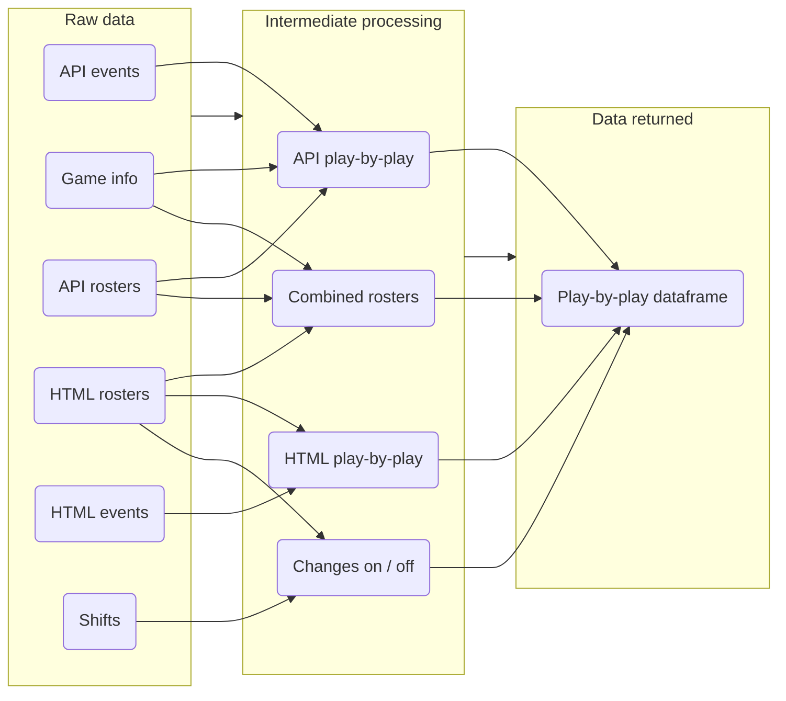

---

icon: material/hockey-sticks

---

# :material-hockey-sticks: **chicken_nhl**

Information about the `chicken_nhl` module.

For in-depth materials, please consult the **[:material-bookshelf: Reference](../../reference/reference.md)**

## :fontawesome-solid-user-large: **Usage**

The `chicken_nhl` module and relevant functions can be imported using the below snippet:

```py
from chickenstats.chicken_nhl import scrape_schedule, scrape_pbp
```

Almost all functions rely on game IDs, which can be found using the `scrape_schedule()` function:

```py
sched = scrape_schedule() # By default, returns the current season (2022)

game_ids = sched.game_id.head(10) # Returns the first ten game IDs
```

Game IDs can be given as a list, or other generator-like object:

```py
pbp = scrape_pbp(game_ids) # Game IDs are given as a Pandas Series
```

!!! info "Functions available to users"

    === "Main functions"

    	These should be your go-to functions and encompass the full functionality of the module.
    	They primarily return pandas DataFrames.

        1. `scrape_schedule()` returns the schedule for an entire season, a specific date, or a subset based on status (e.g., live or final)
        2. `scrape_standings()` returns the latest NHL, conference, divison, and wild card standings for a given season
        3. `scrape_pbp()` returns play-by-play data for a given game or games

    === "Input functions"

        These are typically used as inputs for the main functions. They can be used in various combinations for custom analyses.
        They return pandas DataFrames by default, but can return dictionaries using the nested keyword argument.

        1. `scrape_game_info()` returns the game information (e.g., date, venue, teams) for a given game or games
        2. `scrape_api_events()` returns events from the NHL API endpoint for a given game or games
        3. `scrape_html_events()` returns events from the NHL HTML endpoint for a given game or games
        4. `scrape_api_rosters()` returns roster data from the NHL API endpoint for a given game or games
        5. `scrape_html_rosters()` returns roster data from the NHL HTML endpoint for a given game or games
        6. `scrape_rosters()` returns combined roster data after scraping and processing data from both the NHL HTML and API endpoints
        7. `scrape_shifts()` returns shifts data from the NHL HTML endpoint
        8. `scrape_changes()`returns changes data after scraping and processing shifts data from the NHL HTML endpoint

## :classical_building: **Architecture**

Below is a visual representation of the `scrape_pbp()` function, depicting data sources & 
processing stages. 

<div class="center">

</div>

??? info
    With some exceptions for individual games, the `scrape_pbp()`
    function will return data for games occurring since the start of
    the 2010-2011 season. However, the `scrape_schedule()` & `scrape_standings()`
    functions will return data extending to the NHL's founding in 1917.


