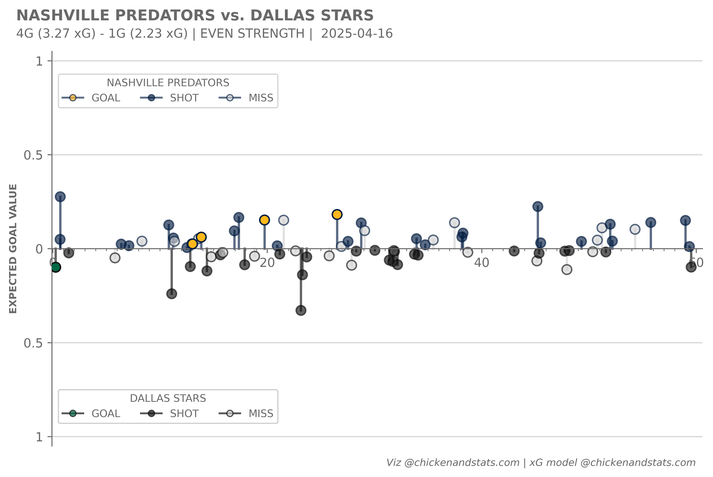

# :material-view-gallery: **Gallery**

See below for a collection of charts and graphics created using the `chickenstats` library

??? info
    Most of these examples can be recreated using the tutorial notebooks from the Examples section in the 
    [`chickenstats` GitHub repository](https://github.com/chickenandstats/chickenstats/tree/main/examples) or the 
    tutorials section of the [:material-school: User Guide](../guide.md)

---

-   **[All forwards' xGF & xGA](../tutorials/forward_lines.md)**

    ---

    

-   **[All teams' rolling xGF & xGA](../tutorials/rolling_xg.md)**

    ---

    

-   **[NSH forwards' xGF & xGA](../tutorials/forward_lines.md)**

    ---

    

-   **[Rolling xGF & xGA per 60](../tutorials/rolling_xg.md)**

    ---

    

-   **[Rolling xGF & xGA per 60 (dark)](../tutorials/rolling_xg.md)**

    ---

    

-   **[NSH time-on-ice network](../tutorials/network.md)**

    ---

    

-   **[NSH vs. WPG lollipop chart](../tutorials/lollipop.md)**

    ---

    

-   **[Juuse Saros cumulative GSaX](../tutorials/gsax.md)**

    ---

    

-   **[Top-6 goalies by GSaX](../tutorials/gsax.md)**

    ---

    

-   **[Top-6 goalies' performance after rest](../tutorials/gsax.md)**

    ---

    

-   **[4 Nations Forward Line Performance](../tutorials/four_nations.md)**

    ---

    

-   **[NSH forward lines' rink maps](../tutorials/shot_maps.md)**

    ---

    

