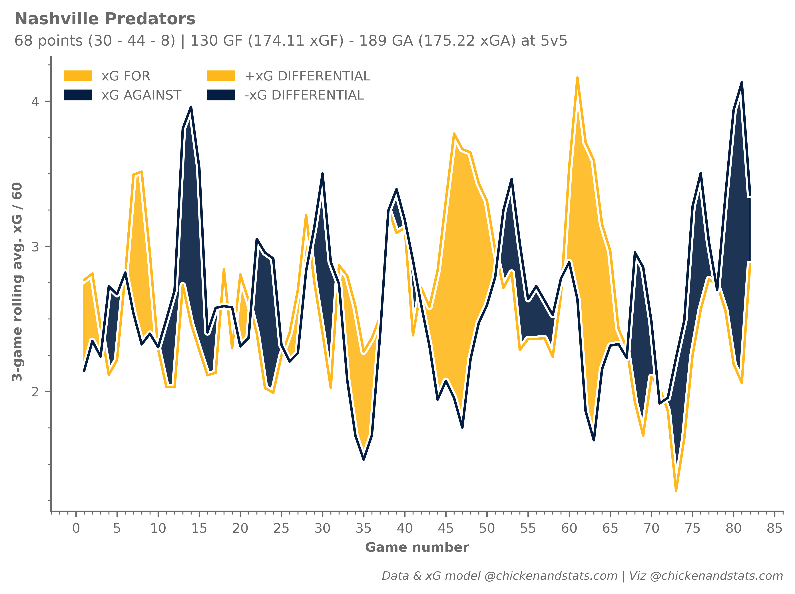

# :material-view-gallery: **Gallery**

See below for a collection charts and graphics created using the `chickenstats` library

---

-   **[All forwards' xGF & xGA](../tutorials/forward_lines.md)**

    ---

    { .on-glb }

-   **[All teams' rolling xGF & xGA](../tutorials/rolling_xg.md)**

    ---

    { .on-glb }

-   **[NSH forwards' xGF & xGA](../tutorials/forward_lines.md)**

    ---

    { .on-glb }

-   **[Rolling xGF & xGA per 60](../tutorials/rolling_xg.md)**

    ---

    { .on-glb }

-   **[Rolling xGF & xGA per 60 (dark)](../tutorials/rolling_xg.md)**

    ---

    { .on-glb }

-   **[NSH time-on-ice network](../tutorials/network.md)**

    ---

    { .on-glb }

-   **[NSH vs. WPG lollipop chart](../tutorials/lollipop.md)**

    ---

    { .on-glb }

-   **[Juuse Saros cumulative GSaX](../tutorials/gsax.md)**

    ---

    { .on-glb }

-   **[Top-6 goalies by GSaX](../tutorials/gsax.md)**

    ---

    { .on-glb }

-   **[NSH forward lines' rink maps](../tutorials/shot_maps.md)**

    ---

    { .on-glb }

