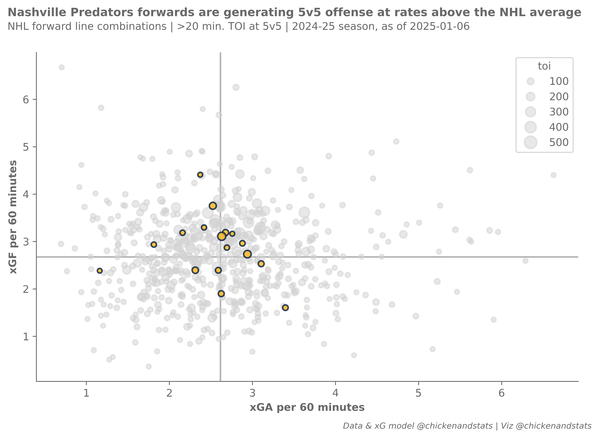
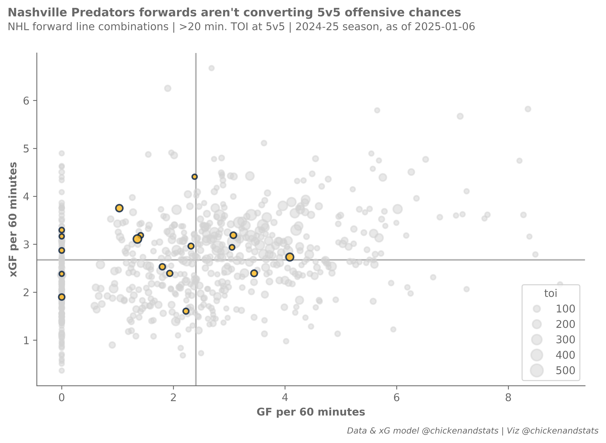
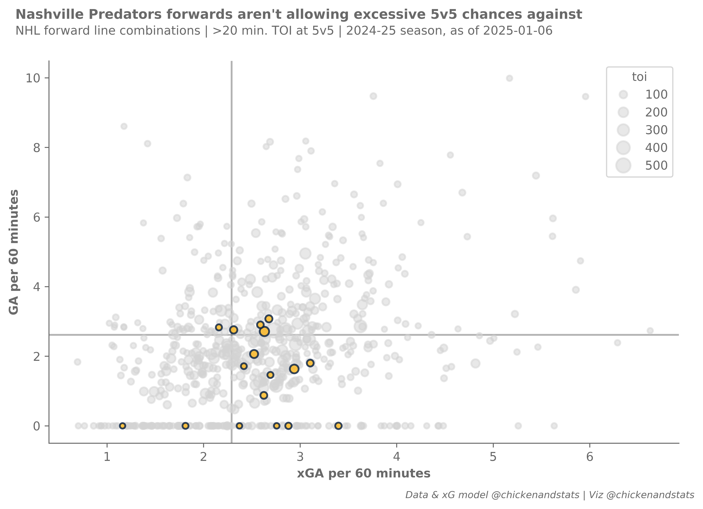

# **Forward line performance tutorial**

---

## **Intro**

Evaluate forward line performance, based on goals scored or allowed vs. expected.

Parts of this tutorial are optional and will be clearly marked as such. For help, or any questions,
please don't hesitate to reach out to [chicken@chickenandstats.com](mailto:chicken@chickenandstats.com) or
[@chickenandstats.com](https://bsky.app/profile/chickenandstats.com) on Blue Sky.


## **Housekeeping**

### Import dependencies

Import the dependencies we'll need for the guide


```python
import pandas as pd
import numpy as np

from chickenstats.chicken_nhl import Season, Scraper
from chickenstats.chicken_nhl.info import NHL_COLORS
import chickenstats.utilities

import matplotlib.pyplot as plt
import seaborn as sns

from pathlib import Path

import datetime as dt
```

### Pandas options

Sets different pandas options. This cell is optional


```python
pd.set_option("display.max_columns", None)
pd.set_option("display.max_rows", 100)
```

### Chickenstats matplotlib style

chickenstats.utilities includes a custom style package - this activates it. This cell is also optional


```python
plt.style.use("chickenstats")
```

---

## **Scrape data**

### Schedule, standings, and game IDs

Scrape the schedule and standings using the `Season` object. Then, create a list of game IDs to scrape


```python
season = Season(2024)
```


```python
schedule = season.schedule(disable_progress_bar=True)
```


```python
standings = season.standings
```


```python
game_ids = schedule.loc[schedule.game_state == "OFF"].game_id.tolist()
```

### Play-by-play

Scrape the play-by-play data for the chosen game ID. First instantiate the `Scraper` object,
then call the play_by_play attribute


```python
scraper = Scraper(game_ids, disable_progress_bar=True)
```


```python
pbp = scraper.play_by_play
```

### Stats

Aggregate statistics to season and game level


```python
scraper.prep_stats(level="season", disable_progress_bar=True)
stats = scraper.stats.reset_index(drop=True)
```


```python
scraper.prep_lines(level="season", disable_progress_bar=True)
lines = scraper.lines.reset_index(drop=True)
```


```python
scraper.prep_team_stats(level="game", disable_progress_bar=True)
team_stats = scraper.team_stats.reset_index(drop=True)
```

---

## **Single team scatter plots**

### Filter conditions

Select your team, strength state, and TOI minimum


```python
# Setting single team and other filter conditions
team = "NSH"
strength_state = "5v5"
toi_min = 20
```

### xGF and xGA

Plot xGF vs. xGA to analyze chances created and chances allowed,
highlighting the selected team


```python
# Setting filter conditions and filtering data
conds = np.logical_and(lines.strength_state == strength_state, lines.toi >= toi_min)
plot_lines = (
    lines.loc[conds]
    .sort_values(by="xgf_percent", ascending=False)
    .reset_index(drop=True)
)

# Setting overall figures
fig, ax = plt.subplots(dpi=650, figsize=(8, 5))

# Aesthetics, likes the tight layout and despining axes
fig.tight_layout()
sns.despine()

# Getting the averages and drawing the average lines
xga_mean = plot_lines.xga_p60.mean()
xgf_mean = plot_lines.xgf_p60.mean()

ax.axvline(x=xga_mean, zorder=-1, alpha=0.5)
ax.axhline(y=xgf_mean, zorder=-1, alpha=0.5)

# Setting the size norm so bubbles are consistent across figures
size_norm = (plot_lines.toi.min(), plot_lines.toi.max())

# Getting plot colors based on team
colors = NHL_COLORS[team]

# Filtering data and plotting the non-selected teams first
conds = plot_lines.team != team
plot_data = plot_lines.loc[conds]

# They all get gray colors
facecolor = colors["MISS"]
edgecolor = colors["MISS"]

# Plotting the non-selected teams' data
sns.scatterplot(
    data=plot_data,
    x="xga_p60",
    y="xgf_p60",
    size="toi",
    sizes=(20, 150),
    size_norm=size_norm,
    lw=1.5,
    facecolor=facecolor,
    edgecolor=edgecolor,
    alpha=0.5,
    legend=True,
)

# Filtering the data and plotting the selected team
conds = plot_lines.team == team
plot_data = plot_lines.loc[conds]

# Setting the colors
facecolor = colors["GOAL"]
edgecolor = colors["SHOT"]

# Plotting the selected teams' data
sns.scatterplot(
    data=plot_data,
    x="xga_p60",
    y="xgf_p60",
    size="toi",
    sizes=(20, 150),
    size_norm=size_norm,
    lw=1.5,
    facecolor=facecolor,
    edgecolor=edgecolor,
    alpha=0.8,
    legend=False,
)

# # Iterating through the dataframe to label the bubbles
# for row, line in plot_data.iterrows():
#     # Setting x and y positions that are slightly offset from the data they point to
#     x_position = line.xga_p60 + 0.25
#     y_position = line.xgf_p60 - 0.25

#     # Annotation options
#     arrow_props = {"arrowstyle": "simple", "linewidth": 0.25, "color": "tab:gray"}

#     # Plotting the annotation
#     ax.annotate(
#         text=f"{line.forwards}",
#         xy=(line.xga_p60, line.xgf_p60),
#         xytext=(x_position, y_position),
#         fontsize=6,
#         bbox={"facecolor": "white", "alpha": 0.5, "edgecolor": "white", "pad": 0},
#         arrowprops=arrow_props,
#     )

# Setting axis lables
ax.axes.set_xlabel("xGA per 60 minutes")
ax.axes.set_ylabel("xGF per 60 minutes")

# Setting figure suptitle and subtitle
fig_suptitle = "Nashville Predators forwards are generating 5v5 offense at rates above the NHL average"
fig.suptitle(
    fig_suptitle,
    x=0.01,
    y=1.08,
    fontsize=11,
    fontweight="bold",
    horizontalalignment="left",
)

todays_date = dt.datetime.now().strftime("%Y-%m-%d")
subtitle = f"NHL forward line combinations | >{toi_min} min. TOI at 5v5 | 2024-25 season, as of {todays_date}"
fig.text(s=subtitle, x=0.01, y=1.02, fontsize=10, horizontalalignment="left")

# Attribution
attribution = f"Data & xG model @chickenandstats | Viz @chickenandstats"
fig.text(
    s=attribution,
    x=0.99,
    y=-0.05,
    fontsize=8,
    horizontalalignment="right",
    style="italic",
)

# Save figure
savepath = Path(f"./charts/5v5_xgf_xga_{team}.png")
fig.savefig(savepath, transparent=False, bbox_inches="tight")
```


    

    


### xGF and GF

Plot xGF vs. GF to analyze chances created and converted,
highlighting the selected team


```python
# Setting filter conditions and filtering data
conds = np.logical_and(lines.strength_state == strength_state, lines.toi >= toi_min)
plot_lines = (
    lines.loc[conds]
    .sort_values(by="xgf_percent", ascending=False)
    .reset_index(drop=True)
)

# Setting overall figures
fig, ax = plt.subplots(dpi=650, figsize=(8, 5))

# Aesthetics, likes the tight tight layout and despining axes
fig.tight_layout()
sns.despine()

# Getting the averages and drawing the average lines
xgf_mean = plot_lines.xgf_p60.mean()
gf_mean = plot_lines.gf_p60.mean()

ax.axhline(y=xgf_mean, zorder=-1, alpha=0.5)
ax.axvline(x=gf_mean, zorder=-1, alpha=0.5)

# Setting the size norm so bubbles are consistent across figures
size_norm = (plot_lines.toi.min(), plot_lines.toi.max())

# Getting plot colors based on team
colors = NHL_COLORS[team]

# Filtering data and plotting the non-selected teams first
conds = plot_lines.team != team
plot_data = plot_lines.loc[conds]

# They all get gray colors
facecolor = colors["MISS"]
edgecolor = colors["MISS"]

# Plotting the non-selected teams' data
sns.scatterplot(
    data=plot_data,
    x="gf_p60",
    y="xgf_p60",
    size="toi",
    sizes=(20, 150),
    size_norm=size_norm,
    lw=1.5,
    facecolor=facecolor,
    edgecolor=edgecolor,
    alpha=0.5,
    legend=True,
)

# Filtering and plotting the selected teams' data
conds = plot_lines.team == team
plot_data = plot_lines.loc[conds]

# Setting the colors
facecolor = colors["GOAL"]
edgecolor = colors["SHOT"]

# Plotting the selected team's data
sns.scatterplot(
    data=plot_data,
    x="gf_p60",
    y="xgf_p60",
    size="toi",
    sizes=(20, 150),
    size_norm=size_norm,
    lw=1.5,
    facecolor=facecolor,
    edgecolor=edgecolor,
    alpha=0.8,
    legend=False,
)

# # Iterating through the dataframe for annotations
# for row, line in plot_data.iterrows():
#     # Offset x and y positions
#     if line.xga_p60 >= gf_mean:
#         x_position = line.gf_p60 + 0.5

#     else:
#         x_position = line.gf_p60 - 0.5

#     if line.xgf_p60 >= xgf_mean:
#         y_position = line.xgf_p60 + 0.5

#     else:
#         y_position = line.xgf_p60 - 0.5

#     # Custom positioning
#     if line.forwards == "MARK JANKOWSKI, LUKE EVANGELISTA, THOMAS NOVAK":
#         y_position = line.xgf_p60 - 0.5

#     if line.forwards == "FILIP FORSBERG, GUSTAV NYQUIST, RYAN O'REILLY":
#         y_position = line.xgf_p60 - 0.1
#         x_position = line.xgf_p60 + 0.5

#     if line.forwards == "MARK JANKOWSKI, COLE SMITH, MICHAEL MCCARRON":
#         y_position = line.xgf_p60 - 0.1

#     # Annotation box options
#     arrow_props = {"arrowstyle": "simple", "linewidth": 0.25, "color": "tab:gray"}

#     # Plotting the annotations
#     ax.annotate(
#         text=f"{line.forwards}",
#         xy=(line.gf_p60, line.xgf_p60),
#         xytext=(x_position, y_position),
#         fontsize=6,
#         bbox={"facecolor": "white", "alpha": 0.5, "edgecolor": "white", "pad": 0},
#         arrowprops=arrow_props,
#     )

# Setting x and y axes labels
ax.axes.set_xlabel("GF per 60 minutes")
ax.axes.set_ylabel("xGF per 60 minutes")

# Figure suptitle and subtitle
fig_suptitle = "Nashville Predators forwards aren't converting 5v5 offensive chances"
fig.suptitle(
    fig_suptitle,
    x=0.01,
    y=1.08,
    fontsize=11,
    fontweight="bold",
    horizontalalignment="left",
)

todays_date = dt.datetime.now().strftime("%Y-%m-%d")
subtitle = f"NHL forward line combinations | >{toi_min} min. TOI at 5v5 | 2024-25 season, as of {todays_date}"
fig.text(s=subtitle, x=0.01, y=1.02, fontsize=10, horizontalalignment="left")

# Figure attribution
attribution = f"Data & xG model @chickenandstats | Viz @chickenandstats"
fig.text(
    s=attribution,
    x=0.99,
    y=-0.05,
    fontsize=8,
    horizontalalignment="right",
    style="italic",
)

# Save figure
savepath = Path(f"./charts/5v5_xgf_gf_{team}.png")
fig.savefig(savepath, transparent=False, bbox_inches="tight")
```


    

    


### xGA and GA

Plot GA vs. xGA to analyze chances allowed and converted against,
highlighting the selected team


```python
# Setting filter conditions and filtering data
conds = np.logical_and(lines.strength_state == strength_state, lines.toi >= toi_min)
plot_lines = (
    lines.loc[conds]
    .sort_values(by="xgf_percent", ascending=False)
    .reset_index(drop=True)
)

# Setting overall figures
fig, ax = plt.subplots(dpi=650, figsize=(8, 5))

# Aesthetics, likes the tight tight layout and despining axes
fig.tight_layout()
sns.despine()

# Getting the averages and drawing the average lines
xga_mean = plot_lines.xga_p60.mean()
ga_mean = plot_lines.ga_p60.mean()

ax.axhline(y=xga_mean, zorder=-1, alpha=0.5)
ax.axvline(x=ga_mean, zorder=-1, alpha=0.5)

# Setting the size norm so bubbles are consistent across figures
size_norm = (plot_lines.toi.min(), plot_lines.toi.max())

# Getting plot colors based on team
colors = NHL_COLORS[team]

# Filtering data and plotting the non-selected teams first
conds = plot_lines.team != team
plot_data = plot_lines.loc[conds]

# They all get gray colors
facecolor = colors["MISS"]
edgecolor = colors["MISS"]

# Plotting the non-selected teams' data
sns.scatterplot(
    data=plot_data,
    x="xga_p60",
    y="ga_p60",
    size="toi",
    sizes=(20, 150),
    size_norm=size_norm,
    lw=1.5,
    facecolor=facecolor,
    edgecolor=edgecolor,
    alpha=0.5,
    legend=True,
)

# Filtering and plotting the non-selected team's data
conds = plot_lines.team == team
plot_data = plot_lines.loc[conds]

# Setting the colors
facecolor = colors["GOAL"]
edgecolor = colors["SHOT"]

# Plotting the selected team's data
sns.scatterplot(
    data=plot_data,
    x="xga_p60",
    y="ga_p60",
    size="toi",
    sizes=(20, 150),
    size_norm=size_norm,
    lw=1.5,
    facecolor=facecolor,
    edgecolor=edgecolor,
    alpha=0.8,
    legend=False,
)

# # Iterating through the dataframe for annotations
# for row, line in plot_data.iterrows():
#     # Offset x and y positions
#     if line.xga_p60 >= gf_mean:
#         x_position = line.xga_p60 + 0.25

#     else:
#         x_position = line.xga_p60 - 0.25

#     if line.xgf_p60 >= xgf_mean:
#         y_position = line.ga_p60 + 0.5

#     else:
#         y_position = line.ga_p60 - 0.5

#     # Custom positioning
#     if line.forwards == "COLTON SISSONS, JONATHAN MARCHESSAULT, STEVEN STAMKOS":
#         x_position = line.xga_p60 - 1.5

#     if line.forwards == "COLTON SISSONS, MARK JANKOWSKI, JONATHAN MARCHESSAULT":
#         y_position = line.ga_p60 - 0.1
#         x_position = line.xga_p60 + 0.5

#     if line.forwards == "FILIP FORSBERG, GUSTAV NYQUIST, RYAN O'REILLY":
#         y_position = line.ga_p60 - 0.5

#     # Annotation box options
#     arrow_props = {"arrowstyle": "simple", "linewidth": 0.25, "color": "tab:gray"}

#     # Plotting the annotations
#     ax.annotate(
#         text=f"{line.forwards}",
#         xy=(line.xga_p60, line.ga_p60),
#         xytext=(x_position, y_position),
#         fontsize=6,
#         bbox={"facecolor": "white", "alpha": 0.5, "edgecolor": "white", "pad": 0},
#         arrowprops=arrow_props,
#     )

# Setting the x and y axes labels
ax.axes.set_xlabel("xGA per 60 minutes")
ax.axes.set_ylabel("GA per 60 minutes")

# Figure suptitle and subtitle
fig_suptitle = (
    "Nashville Predators forwards aren't allowing excessive 5v5 chances against"
)
fig.suptitle(
    fig_suptitle,
    x=0.01,
    y=1.08,
    fontsize=11,
    fontweight="bold",
    horizontalalignment="left",
)

todays_date = dt.datetime.now().strftime("%Y-%m-%d")
subtitle = f"NHL forward line combinations | >{toi_min} min. TOI at 5v5 | 2024-25 season, as of {todays_date}"
fig.text(s=subtitle, x=0.01, y=1.02, fontsize=10, horizontalalignment="left")

# Attribution
attribution = f"Data & xG model @chickenandstats | Viz @chickenandstats"
fig.text(
    s=attribution,
    x=0.99,
    y=-0.05,
    fontsize=8,
    horizontalalignment="right",
    style="italic",
)

# Save figure
savepath = Path(f"./charts/5v5_ga_xga_{team}.png")
fig.savefig(savepath, transparent=False, bbox_inches="tight")
```


    

    


---

## **Whole NHL**

### xGF and xGA

Plot xGF vs. xGA to analyze chances created and chances allowed,
with subplots highlighting each individual NHL team


```python
# Setting filter conditions and filtering data
conds = np.logical_and(lines.strength_state == strength_state, lines.toi >= toi_min)
plot_lines = (
    lines.loc[conds]
    .sort_values(by="xgf_percent", ascending=False)
    .reset_index(drop=True)
)

# Setting overall figures
fig, axes = plt.subplots(nrows=8, ncols=4, dpi=650, figsize=(12, 18))

fig.tight_layout(pad=1.5)

axes = axes.reshape(-1)

# Getting the averages and drawing the average lines
xga_mean = plot_lines.xga_p60.mean()
xgf_mean = plot_lines.xgf_p60.mean()

# Setting the size norm so bubbles are consistent across figures
size_norm = (plot_lines.toi.min(), plot_lines.toi.max())

# Getting the teams and standings data to iterate through
teams = standings.team.unique().tolist()
team_names = dict(zip(standings.team, standings.team_name))

# Iterating through the standings data
for idx, row in standings.iterrows():
    # Setting the team
    team = row.team

    # Setting the axis
    ax = axes[idx]

    # Average lines
    ax.axvline(x=xga_mean, zorder=-1, alpha=0.5)
    ax.axhline(y=xgf_mean, zorder=-1, alpha=0.5)

    # Getting plot colors based on team
    colors = NHL_COLORS[team]

    # Filtering data and plotting the non-selected teams first
    conds = plot_lines.team != team
    plot_data = plot_lines.loc[conds]

    # They all get gray colors
    facecolor = colors["MISS"]
    edgecolor = "white"  # colors["MISS"]

    # Plotting the non-selected teams' data
    sns.scatterplot(
        data=plot_data,
        x="xga_p60",
        y="xgf_p60",
        size="toi",
        sizes=(20, 150),
        size_norm=size_norm,
        lw=1.5,
        facecolor=facecolor,
        edgecolor=edgecolor,
        alpha=0.5,
        legend=False,
        ax=ax,
    )

    # Filtering and plotting the selected team's data
    conds = plot_lines.team == team
    plot_data = plot_lines.loc[conds]

    # Setting the colors
    facecolor = colors["GOAL"]
    edgecolor = colors["SHOT"]

    # Plotting the selected team's data
    sns.scatterplot(
        data=plot_data,
        x="xga_p60",
        y="xgf_p60",
        size="toi",
        sizes=(20, 150),
        size_norm=size_norm,
        lw=1.5,
        facecolor=facecolor,
        edgecolor=edgecolor,
        alpha=0.8,
        legend=False,
        ax=ax,
    )

    # Setting x and y axes labels
    x_labels = [28, 29, 30, 31]

    if idx in x_labels:
        ax.axes.set_xlabel("xGA per 60 minutes", fontsize=8)
    else:
        ax.axes.set_xlabel("")

    y_labels = [0, 4, 8, 12, 16, 20, 24, 28]

    if idx in y_labels:
        ax.axes.set_ylabel("xGF per 60 minutes", fontsize=8)
    else:
        ax.axes.set_ylabel("")

    # Setting tick params font size
    ax.tick_params(axis="both", which="major", labelsize=8)

    # Setting the ax title
    ax_title = f"{row.team_name} | {row.points} points | {row.wins} - {row.losses} - {row.ot_losses}"
    ax.set_title(ax_title, fontsize=8, x=-0.085, y=1.03, horizontalalignment="left")

# Figure suptitle and subtitle
fig_suptitle = "Forward line combinations' chances created vs. chances allowed"
fig.suptitle(
    fig_suptitle,
    x=0.01,
    y=1.029,
    fontsize=11,
    fontweight="bold",
    horizontalalignment="left",
)

todays_date = dt.datetime.now().strftime("%Y-%m-%d")
subtitle = f"NHL forward line combinations | >{toi_min} min. TOI at 5v5 (size indicates TOI) | 2024-25 season, as of {todays_date}"
fig.text(s=subtitle, x=0.01, y=1.0115, fontsize=10, horizontalalignment="left")

# Attribution
attribution = f"Data & xG model @chickenandstats.com | Viz @chickenandstats.com"
fig.text(
    s=attribution,
    x=0.99,
    y=-0.01,
    fontsize=8,
    horizontalalignment="right",
    style="italic",
)

savepath = Path(f"./charts/5v5_xgf_xga_nhl.png")
fig.savefig(savepath, transparent=False, bbox_inches="tight")
```


    

    


### xGF and GF

Plot xGF vs. GF to analyze chances created and converted,
with subplots highlighting each individual NHL team


```python
# Setting filter conditions and filtering data
conds = np.logical_and(lines.strength_state == strength_state, lines.toi >= toi_min)
plot_lines = (
    lines.loc[conds]
    .sort_values(by="xgf_percent", ascending=False)
    .reset_index(drop=True)
)

# Setting overall figures
fig, axes = plt.subplots(nrows=8, ncols=4, dpi=650, figsize=(12, 18))

fig.tight_layout(pad=1.5)

axes = axes.reshape(-1)

# Getting the averages and drawing the average lines
gf_mean = plot_lines.gf_p60.mean()
xgf_mean = plot_lines.xgf_p60.mean()

size_norm = (plot_lines.toi.min(), plot_lines.toi.max())


teams = standings.team.unique().tolist()
team_names = dict(zip(standings.team, standings.team_name))

for idx, row in standings.iterrows():
    team = row.team

    ax = axes[idx]

    ax.axvline(x=gf_mean, zorder=-1, alpha=0.5)
    ax.axhline(y=xgf_mean, zorder=-1, alpha=0.5)

    # Getting plot colors based on team
    colors = NHL_COLORS[team]

    # Filtering data and plotting the non-selected teams first
    conds = plot_lines.team != team
    plot_data = plot_lines.loc[conds]

    # They all get gray colors
    facecolor = colors["MISS"]
    edgecolor = "white"  # colors["MISS"]

    # Plotting the non-selected teams' data
    sns.scatterplot(
        data=plot_data,
        x="gf_p60",
        y="xgf_p60",
        size="toi",
        sizes=(20, 150),
        size_norm=size_norm,
        lw=1.5,
        facecolor=facecolor,
        edgecolor=edgecolor,
        alpha=0.5,
        legend=False,
        ax=ax,
    )

    # Plotting the
    conds = plot_lines.team == team
    plot_data = plot_lines.loc[conds]

    facecolor = colors["GOAL"]
    edgecolor = colors["SHOT"]

    sns.scatterplot(
        data=plot_data,
        x="gf_p60",
        y="xgf_p60",
        size="toi",
        sizes=(20, 150),
        size_norm=size_norm,
        lw=1.5,
        facecolor=facecolor,
        edgecolor=edgecolor,
        alpha=0.8,
        legend=False,
        ax=ax,
    )

    x_labels = [28, 29, 30, 31]

    if idx in x_labels:
        ax.axes.set_xlabel("GF per 60 minutes", fontsize=8)
    else:
        ax.axes.set_xlabel("")

    y_labels = [0, 4, 8, 12, 16, 20, 24, 28]

    if idx in y_labels:
        ax.axes.set_ylabel("xGF per 60 minutes", fontsize=8)
    else:
        ax.axes.set_ylabel("")

    ax.tick_params(axis="both", which="major", labelsize=8)

    ax_title = f"{row.team_name} | {row.points} points | {row.wins} - {row.losses} - {row.ot_losses}"

    ax.set_title(ax_title, fontsize=8, x=-0.085, y=1.03, horizontalalignment="left")

fig_suptitle = "Forward line combinations' chances created vs. goals scored"
fig.suptitle(
    fig_suptitle,
    x=0.01,
    y=1.029,
    fontsize=11,
    fontweight="bold",
    horizontalalignment="left",
)

todays_date = dt.datetime.now().strftime("%Y-%m-%d")
subtitle = f"NHL forward line combinations | >{toi_min} min. TOI at 5v5 (size indicates TOI) | 2024-25 season, as of {todays_date}"
fig.text(s=subtitle, x=0.01, y=1.0115, fontsize=10, horizontalalignment="left")

attribution = f"Data & xG model @chickenandstats.com | Viz @chickenandstats.com"
fig.text(
    s=attribution,
    x=0.99,
    y=-0.01,
    fontsize=8,
    horizontalalignment="right",
    style="italic",
)

savepath = Path(f"./charts/5v5_xgf_gf_nhl.png")
fig.savefig(savepath, transparent=False, bbox_inches="tight")
```


    

    


### GA and xGA

Plot GA vs. xGA to analyze chances created and converted against,
with subplots highlighting each individual NHL team


```python
# Setting filter conditions and filtering data
conds = np.logical_and(lines.strength_state == strength_state, lines.toi >= toi_min)
plot_lines = (
    lines.loc[conds]
    .sort_values(by="xgf_percent", ascending=False)
    .reset_index(drop=True)
)

# Setting overall figures
fig, axes = plt.subplots(nrows=8, ncols=4, dpi=650, figsize=(12, 18))

fig.tight_layout(pad=1.5)

axes = axes.reshape(-1)

# Getting the averages and drawing the average lines
xga_mean = plot_lines.xga_p60.mean()
ga_mean = plot_lines.ga_p60.mean()

size_norm = (plot_lines.toi.min(), plot_lines.toi.max())


teams = standings.team.unique().tolist()
team_names = dict(zip(standings.team, standings.team_name))

for idx, row in standings.iterrows():
    team = row.team

    ax = axes[idx]

    ax.axvline(x=xga_mean, zorder=-1, alpha=0.5)
    ax.axhline(y=ga_mean, zorder=-1, alpha=0.5)

    # Getting plot colors based on team
    colors = NHL_COLORS[team]

    # Filtering data and plotting the non-selected teams first
    conds = plot_lines.team != team
    plot_data = plot_lines.loc[conds]

    # They all get gray colors
    facecolor = colors["MISS"]
    edgecolor = "white"  # colors["MISS"]

    # Plotting the non-selected teams' data
    sns.scatterplot(
        data=plot_data,
        x="xga_p60",
        y="ga_p60",
        size="toi",
        sizes=(20, 150),
        size_norm=size_norm,
        lw=1.5,
        facecolor=facecolor,
        edgecolor=edgecolor,
        alpha=0.5,
        legend=False,
        ax=ax,
    )

    # Plotting the
    conds = plot_lines.team == team
    plot_data = plot_lines.loc[conds]

    facecolor = colors["GOAL"]
    edgecolor = colors["SHOT"]

    sns.scatterplot(
        data=plot_data,
        x="xga_p60",
        y="ga_p60",
        size="toi",
        sizes=(20, 150),
        size_norm=size_norm,
        lw=1.5,
        facecolor=facecolor,
        edgecolor=edgecolor,
        alpha=0.8,
        legend=False,
        ax=ax,
    )

    x_labels = [28, 29, 30, 31]

    if idx in x_labels:
        ax.axes.set_xlabel("xGA per 60 minutes", fontsize=8)
    else:
        ax.axes.set_xlabel("")

    y_labels = [0, 4, 8, 12, 16, 20, 24, 28]

    if idx in y_labels:
        ax.axes.set_ylabel("GA per 60 minutes", fontsize=8)
    else:
        ax.axes.set_ylabel("")

    ax.tick_params(axis="both", which="major", labelsize=8)

    ax_title = f"{row.team_name} | {row.points} points | {row.wins} - {row.losses} - {row.ot_losses}"

    ax.set_title(ax_title, fontsize=8, x=-0.085, y=1.03, horizontalalignment="left")

fig_suptitle = "Forward line combinations' chances allowed vs. goals allowed"
fig.suptitle(
    fig_suptitle,
    x=0.01,
    y=1.029,
    fontsize=11,
    fontweight="bold",
    horizontalalignment="left",
)

todays_date = dt.datetime.now().strftime("%Y-%m-%d")
subtitle = f"NHL forward line combinations | >{toi_min} min. TOI at 5v5 (size indicates TOI) | 2024-25 season, as of {todays_date}"
fig.text(s=subtitle, x=0.01, y=1.0115, fontsize=10, horizontalalignment="left")

attribution = f"Data & xG model @chickenandstats.com | Viz @chickenandstats.com"
fig.text(
    s=attribution,
    x=0.99,
    y=-0.01,
    fontsize=8,
    horizontalalignment="right",
    style="italic",
)

savepath = Path(f"./charts/5v5_ga_xga_nhl.png")
fig.savefig(savepath, transparent=False, bbox_inches="tight")
```


    

    

