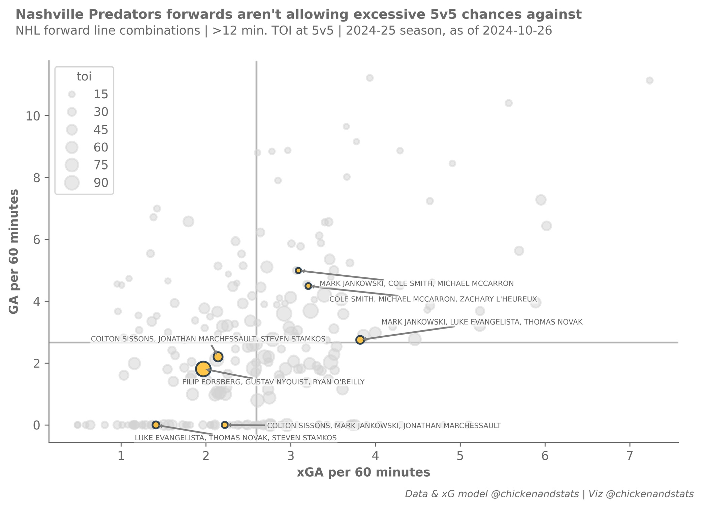

# :material-scatter-plot: **Forward line performance**

Evaluate forward line performance, based on goals scored or allowed vs. expected

{ .on-glb }

## :fontawesome-solid-broom: **Housekeeping**

Import dependencies:

```python
import pandas as pd #(1)!
import numpy as np 

from chickenstats.chicken_nhl import Season, Scraper #(2)!
from chickenstats.chicken_nhl.info import NHL_COLORS #(3)!
import chickenstats.utilities #(4)!

import matplotlib.pyplot as plt #(5)!
import seaborn as sns 
```

1. Import basic data science stack
2. These are the basic scraping tools
3. This is a dictionary of NHL teams and their primary colors
4. This imports the `chickenstats` matplotlib style
5. These are the basic plotting libraries

Set pandas options:

```python
pd.set_option("display.max_columns", None) #(1)!
pd.set_option("display.max_rows", 100)
```

1. Enables you to scroll and see the full width of the dataframe

Import the `chickenstats` matplotlib style:

```python
plt.style.use("chickenstats") #(1)!
```

1. This is also optional

## :material-download-box: **Scrape data**

Scrape the schedule to collect game IDs:

```python
season = Season(2024) #(1)!
schedule = season.schedule() #(2)!

condition = schedule.game_state == "OFF" #(3)!
game_ids = schedule.loc[condition].game_id.tolist()

scraper = Scraper(game_ids) #(4)!
play_by_play = scraper.play_by_play #(5)!
```

1. You can provide other years
2. You can provide the three-letter team code to scrape a single team's schedule, e.g., "NSH"
3. Filtering the game IDs for those that have already been played
4. Instantiates the `Scraper` object with the game IDs
5. This isn't strictly necessary for this exercise 

## :material-plus-box: **Aggregate line stats**

Then, you can aggregate the line statistics:

```python
scraper.prep_lines(position="f", level="season") #(1)!
lines = scraper.lines.reset_index(drop=True) #(2)!
```

1. Aggregate forward line statistics to the season level
2. Create a copy of the DataFrame for later use

## :material-numeric-1-box: **Single team output**

Set the preferred team, strength state, and time-on-ice minimums, then filter line stats:

```python
team = "NSH" #(1)!
strength_state = "5v5"
toi_min = 10

conds = np.logical_and(lines.strength_state == strength_state,
                       lines.toi >= toi_min)
plot_lines = lines.loc[conds].sort_values(by="xgf_percent", ascending=False).reset_index(drop=True)
```

1. You can obviously replace this with the three-letter team code of your choice

---

### **xGF vs. xGA**

{ .on-glb }

Setting up the Matplotlib figure:

```python
fig, ax = plt.subplots(dpi=650, figsize=(8, 5))

fig.tight_layout()
```

Getting xGF and xGA averages and plotting the average lines:

```python
xga_mean = plot_lines.xga_p60.mean()
xgf_mean = plot_lines.xgf_p60.mean()

ax.axvline(x=xga_mean, zorder=-1, alpha=.5)
ax.axhline(y=xgf_mean, zorder=-1, alpha=.5)
```

Set the size norm for the bubbles and get team colors:

```python
size_norm = (plot_lines.toi.min(), plot_lines.toi.max()) #(1)!

colors = NHL_COLORS[team] #(2)!
```

1. This is used in the `sns.scatter` functions
2. This is a dictionary of dictionaries, where each team has a dictionary of 
colors, with the primary mapped to "GOAL" and the secondary to "MISS"

First, plot the data from the non-preferred teams:

```python
conds = plot_lines.team != team
plot_data = plot_lines.loc[conds] #(1)!

facecolor = colors["MISS"] #(2)!
edgecolor = colors["MISS"]

sns.scatterplot(data=plot_data,
                x="xga_p60",
                y="xgf_p60",
                size="toi",
                sizes=(20, 150),
                size_norm=size_norm,
                lw=1.5,
                facecolor=facecolor,
                edgecolor=edgecolor,
                alpha = 0.5,
                legend=True
               )
```

1. Filter data for the non-preferred team
2. All the non-preferred teams get gray face and edge colors

Then, plot the data from the selected team:

```python
conds = plot_lines.team == team
plot_data = plot_lines.loc[conds] #(1)!

facecolor = colors["GOAL"] #(2)!
edgecolor = colors["SHOT"]

sns.scatterplot(data=plot_data,
                x="xga_p60",
                y="xgf_p60",
                size="toi",
                sizes=(20, 150),
                lw=1.5,
                facecolor=facecolor,
                edgecolor=edgecolor,
                alpha = 0.8,
                legend=False)
```

1. Filtering the data again
2. The preferred team gets different colors

Labeling the preferred team's bubbles:

```python
for row, line in plot_data.iterrows(): #(1)! 

    x_position = line.xga_p60 + .25 #(2)!
    y_position = line.xgf_p60 - .25
    
    arrow_props = {"arrowstyle": "simple", #(3)!
                   "linewidth": .25,
                   "color": "tab:gray",
                  }
    
    bbox = {"facecolor": "white", #(4)!
            "alpha": .5,
            "edgecolor": "white",
            "pad": 0,
            }

    ax.annotate(text=f"{line.forwards}",
                xy=(line.xga_p60, line.xgf_p60),
                xytext=(x_position, y_position),
                fontsize=6,
                bbox=bbox,
                arrowprops=arrow_props)
```

1. Iterate through the data
2. You can tailor these if the names overlap with others
3. Settings for the arrow
4. Settings for the annotation

Adding axis labels and figure title and subtitle:

```python
ax.axes.set_xlabel("xGA per 60 minutes")
ax.axes.set_ylabel("xGF per 60 minutes")

fig_suptitle = "Nashville Predators forwards are generating 5v5 offense at rates above the NHL average"
fig.suptitle(fig_suptitle, x=.01, y=1.08, fontsize=11, fontweight="bold", horizontalalignment="left")

todays_date = dt.datetime.now().strftime("%Y-%m-%d")
subtitle = f"NHL forward line combinations | >{toi_min} min. TOI at 5v5 | 2024-25 season, as of {todays_date}"
fig.text(s=subtitle, x=.01, y=1.02, fontsize=10, horizontalalignment="left")

attribution = f"Data & xG model @chickenandstats | Viz @chickenandstats"
fig.text(s=attribution, x=.99, y=-.05, fontsize=8, horizontalalignment="right", style="italic")
```

Finally, save figure:

```python
savepath = Path(f"./charts/5v5_xgf_xga_{team}.png")
fig.savefig(savepath, transparent=False, bbox_inches="tight")
```

---

### **xGF vs. GF**

{ .on-glb }

Setting up the Matplotlib figure:

```python
fig, ax = plt.subplots(dpi=650, figsize=(8, 5))

fig.tight_layout()
```

Getting xGF and xGA averages and plotting the average lines:

```python
gf_mean = plot_lines.gf_p60.mean()
xgf_mean = plot_lines.xgf_p60.mean()

ax.axvline(x=gf_mean, zorder=-1, alpha=.5)
ax.axhline(y=xgf_mean, zorder=-1, alpha=.5)
```

Set the size norm for the bubbles and get team colors:

```python
size_norm = (plot_lines.toi.min(), plot_lines.toi.max()) #(1)!

colors = NHL_COLORS[team] #(2)!
```

1. This is used in the `sns.scatter` functions
2. This is a dictionary of dictionaries, where each team has a dictionary of 
colors, with the primary mapped to "GOAL" and the secondary to "MISS"

First, plot the data from the non-preferred teams:

```python
conds = plot_lines.team != team
plot_data = plot_lines.loc[conds] #(1)!

facecolor = colors["MISS"] #(2)!
edgecolor = colors["MISS"]

sns.scatterplot(data=plot_data,
                x="gf_p60",
                y="xgf_p60",
                size="toi",
                sizes=(20, 150),
                size_norm=size_norm,
                lw=1.5,
                facecolor=facecolor,
                edgecolor=edgecolor,
                alpha = 0.5,
                legend=True
               )
```

1. Filter data for the non-preferred team
2. All the non-preferred teams get gray face and edge colors

Then, plot the data from the selected team:

```python
conds = plot_lines.team == team
plot_data = plot_lines.loc[conds] #(1)!

facecolor = colors["GOAL"] #(2)!
edgecolor = colors["SHOT"]

sns.scatterplot(data=plot_data,
                x="gf_p60",
                y="xgf_p60",
                size="toi",
                sizes=(20, 150),
                lw=1.5,
                facecolor=facecolor,
                edgecolor=edgecolor,
                alpha = 0.8,
                legend=False)
```

1. Filtering the data again
2. The preferred team gets different colors

Labeling the preferred team's bubbles:

```python
for row, line in plot_data.iterrows(): #(1)! 

    x_position = line.gf_p60 + .25 #(2)!
    y_position = line.xgf_p60 - .25
    
    arrow_props = {"arrowstyle": "simple", #(3)!
                   "linewidth": .25,
                   "color": "tab:gray",
                  }
    
    bbox = {"facecolor": "white", #(4)!
            "alpha": .5,
            "edgecolor": "white",
            "pad": 0,
            }

    ax.annotate(text=f"{line.forwards}",
                xy=(line.gf_p60, line.xgf_p60),
                xytext=(x_position, y_position),
                fontsize=6,
                bbox=bbox,
                arrowprops=arrow_props)
```

1. Iterate through the data
2. You can tailor these if the names overlap with others
3. Settings for the arrow
4. Settings for the annotation

Adding axis labels and figure title and subtitle:

```python
ax.axes.set_xlabel("GF per 60 minutes")
ax.axes.set_ylabel("xGF per 60 minutes")

fig_suptitle = "Nashville Predators forwards aren't converting 5v5 offensive chances"
fig.suptitle(fig_suptitle, x=.01, y=1.08, fontsize=11, fontweight="bold", horizontalalignment="left")

todays_date = dt.datetime.now().strftime("%Y-%m-%d")
subtitle = f"NHL forward line combinations | >{toi_min} min. TOI at 5v5 | 2024-25 season, as of {todays_date}"
fig.text(s=subtitle, x=.01, y=1.02, fontsize=10, horizontalalignment="left")

attribution = f"Data & xG model @chickenandstats | Viz @chickenandstats"
fig.text(s=attribution, x=.99, y=-.05, fontsize=8, horizontalalignment="right", style="italic")
```

Finally, save figure:

```python
savepath = Path(f"./charts/5v5_xgf_gf_{team}.png")
fig.savefig(savepath, transparent=False, bbox_inches="tight")
```

---

### **GA vs. xGA**

{ .on-glb }

Setting up the Matplotlib figure:

```python
fig, ax = plt.subplots(dpi=650, figsize=(8, 5))

fig.tight_layout()
```

Getting xGA and GA averages and plotting the average lines:

```python
xga_mean = plot_lines.xga_p60.mean()
ga_mean = plot_lines.ga_p60.mean()

ax.axvline(x=xga_mean, zorder=-1, alpha=.5)
ax.axhline(y=ga_mean, zorder=-1, alpha=.5)
```

Set the size norm for the bubbles and get team colors:

```python
size_norm = (plot_lines.toi.min(), plot_lines.toi.max()) #(1)!

colors = NHL_COLORS[team] #(2)!
```

1. This is used in the `sns.scatter` functions
2. This is a dictionary of dictionaries, where each team has a dictionary of 
colors, with the primary mapped to "GOAL" and the secondary to "MISS"

First, plot the data from the non-preferred teams:

```python
conds = plot_lines.team != team
plot_data = plot_lines.loc[conds] #(1)!

facecolor = colors["MISS"] #(2)!
edgecolor = colors["MISS"]

sns.scatterplot(data=plot_data,
                x="xga_p60",
                y="ga_p60",
                size="toi",
                sizes=(20, 150),
                size_norm=size_norm,
                lw=1.5,
                facecolor=facecolor,
                edgecolor=edgecolor,
                alpha = 0.5,
                legend=True
               )
```

1. Filter data for the non-preferred team
2. All the non-preferred teams get gray face and edge colors

Then, plot the data from the selected team:

```python
conds = plot_lines.team == team
plot_data = plot_lines.loc[conds] #(1)!

facecolor = colors["GOAL"] #(2)!
edgecolor = colors["SHOT"]

sns.scatterplot(data=plot_data,
                x="xga_p60",
                y="ga_p60",
                size="toi",
                sizes=(20, 150),
                lw=1.5,
                facecolor=facecolor,
                edgecolor=edgecolor,
                alpha = 0.8,
                legend=False)
```

1. Filtering the data again
2. The preferred team gets different colors

Labeling the preferred team's bubbles:

```python
for row, line in plot_data.iterrows(): #(1)! 

    x_position = line.xga_p60 + .25 #(2)!
    y_position = line.ga_p60 - .25
    
    arrow_props = {"arrowstyle": "simple", #(3)!
                   "linewidth": .25,
                   "color": "tab:gray",
                  }
    
    bbox = {"facecolor": "white", #(4)!
            "alpha": .5,
            "edgecolor": "white",
            "pad": 0,
            }

    ax.annotate(text=f"{line.forwards}",
                xy=(line.xga_p60, line.ga_p60),
                xytext=(x_position, y_position),
                fontsize=6,
                bbox=bbox,
                arrowprops=arrow_props)
```

1. Iterate through the data
2. You can tailor these if the names overlap with others
3. Settings for the arrow
4. Settings for the annotation

Adding axis labels and figure title and subtitle:

```python
ax.axes.set_xlabel("xGA per 60 minutes")
ax.axes.set_ylabel("GA per 60 minutes")

fig_suptitle = "Nashville Predators forwards aren't allowing excessive 5v5 chances against"
fig.suptitle(fig_suptitle, x=.01, y=1.08, fontsize=11, fontweight="bold", horizontalalignment="left")

todays_date = dt.datetime.now().strftime("%Y-%m-%d")
subtitle = f"NHL forward line combinations | >{toi_min} min. TOI at 5v5 | 2024-25 season, as of {todays_date}"
fig.text(s=subtitle, x=.01, y=1.02, fontsize=10, horizontalalignment="left")

attribution = f"Data & xG model @chickenandstats | Viz @chickenandstats"
fig.text(s=attribution, x=.99, y=-.05, fontsize=8, horizontalalignment="right", style="italic")
```

Finally, save figure:

```python
savepath = Path(f"./charts/5v5_ga_xga_{team}.png")
fig.savefig(savepath, transparent=False, bbox_inches="tight")
```

## :material-chart-scatter-plot: **Whole NHL**

Get the standings data:

```python
standings = season.standings #(1)!
```

1. This scrapes the standings automatically

Set the preferred strength state time-on-ice minimums, then filter line stats:

```python
strength_state = "5v5"
toi_min = 10

conds = np.logical_and(lines.strength_state == strength_state,
                       lines.toi >= toi_min)
plot_lines = lines.loc[conds].sort_values(by="xgf_percent", ascending=False).reset_index(drop=True)
```

---

### **xGF vs. xGA**

{ .on-glb }

Setting up the Matplotlib figure and subplots:

```python
fig, axes = plt.subplots(nrows=8, ncols=4, dpi=650, figsize=(12, 18))

fig.tight_layout(pad=1.5)

axes = axes.reshape(-1) #(1)!
```

1. This makes it easier to iterate through the axes for plotting

Getting xGF and xGA averages and plotting the average lines:

```python
xga_mean = plot_lines.xga_p60.mean()
xgf_mean = plot_lines.xgf_p60.mean()
```

Set the size norm for the bubbles and get team colors:

```python
size_norm = (plot_lines.toi.min(), plot_lines.toi.max()) #(1)!
```

1. This is used in the `sns.scatter` functions

Getting the standings for iterating:

```python
teams = standings.team.unique().tolist() #(1)!
team_names = dict(zip(standings.team, standings.team_name)) #(2)!
```

1. Getting team names from the standings
2. Creating a dictionary mapping the short code to the longer team name

Iterating through the standings to plot each team:

```python
for idx, row in standings.iterrows():

    team = row.team

    ax = axes[idx]

    ax.axvline(x=xga_mean, zorder=-1, alpha=.5)
    ax.axhline(y=xgf_mean, zorder=-1, alpha=.5)
    
    colors = NHL_COLORS[team]
    
    conds = plot_lines.team != team
    plot_data = plot_lines.loc[conds]
    
    facecolor = colors["MISS"]
    edgecolor = colors["MISS"]
    
    sns.scatterplot(data=plot_data,
                    x="xga_p60",
                    y="xgf_p60",
                    size="toi",
                    sizes=(20, 150),
                    size_norm=size_norm,
                    lw=1.5,
                    facecolor=facecolor,
                    edgecolor=edgecolor,
                    alpha = 0.5,
                    legend=False,
                    ax=ax
                   )
    
    conds = plot_lines.team == team
    plot_data = plot_lines.loc[conds]

    facecolor = colors["GOAL"]
    edgecolor = colors["SHOT"]

    sns.scatterplot(data=plot_data,
                    x="xga_p60",
                    y="xgf_p60",
                    size="toi",
                    sizes=(20, 150),
                    size_norm=size_norm,
                    lw=1.5,
                    facecolor=facecolor,
                    edgecolor=edgecolor,
                    alpha = 0.8,
                    legend=False,
                    ax=ax
                   )

    x_labels = [28, 29, 30, 31]

    if idx in x_labels:
        ax.axes.set_xlabel("xGA per 60 minutes", fontsize=8)
    else:
        ax.axes.set_xlabel("")
        
    y_labels = [0, 4, 8, 12, 16, 20, 24, 28]

    if idx in y_labels:
        ax.axes.set_ylabel("xGF per 60 minutes", fontsize=8)
    else:
       ax.axes.set_ylabel("") 

    ax.tick_params(axis='both', which='major', labelsize=8)

    ax_title = f"{row.team_name} | {row.points} points | {row.wins} - {row.losses} - {row.ot_losses}" 
    ax.set_title(ax_title, fontsize=8, x=-.085, y=1.03, horizontalalignment="left")
```

Adding figure title and subtitle:

```python
fig_suptitle = "Forward line combinations' chances created vs. chances allowed"
fig.suptitle(fig_suptitle, x=.01, y=1.029, fontsize=11, fontweight="bold", horizontalalignment="left")

todays_date = dt.datetime.now().strftime("%Y-%m-%d")
subtitle = f"NHL forward line combinations | >{toi_min} min. TOI at 5v5 (size indicates TOI) | 2024-25 season, as of {todays_date}"
fig.text(s=subtitle, x=.01, y=1.0115, fontsize=10, horizontalalignment="left")

attribution = f"Data & xG model @chickenandstats | Viz @chickenandstats"
fig.text(s=attribution, x=.99, y=-.01, fontsize=8, horizontalalignment="right", style="italic")
```

Finally, save figure:

```python
savepath = Path(f"./charts/5v5_xgf_xga_nhl.png")
fig.savefig(savepath, transparent=False, bbox_inches="tight")
```

---

### **xGF vs. GF**

{ .on-glb }

Setting up the Matplotlib figure and subplots:

```python
fig, axes = plt.subplots(nrows=8, ncols=4, dpi=650, figsize=(12, 18))

fig.tight_layout(pad=1.5)

axes = axes.reshape(-1) #(1)!
```

1. This makes it easier to iterate through the axes for plotting

Getting xGF and xGA averages and plotting the average lines:

```python
gf_mean = plot_lines.gf_p60.mean()
xgf_mean = plot_lines.xgf_p60.mean()
```

Set the size norm for the bubbles and get team colors:

```python
size_norm = (plot_lines.toi.min(), plot_lines.toi.max()) #(1)!
```

1. This is used in the `sns.scatter` functions

Getting the standings for iterating:

```python
teams = standings.team.unique().tolist() #(1)!
team_names = dict(zip(standings.team, standings.team_name)) #(2)!
```

1. Getting team names from the standings
2. Creating a dictionary mapping the short code to the longer team name

Iterating through the standings to plot each team:

```python
for idx, row in standings.iterrows():

    team = row.team

    ax = axes[idx]

    ax.axvline(x=gf_mean, zorder=-1, alpha=.5)
    ax.axhline(y=xgf_mean, zorder=-1, alpha=.5)
    
    colors = NHL_COLORS[team]
    
    conds = plot_lines.team != team
    plot_data = plot_lines.loc[conds]
    
    facecolor = colors["MISS"]
    edgecolor = colors["MISS"]
    
    sns.scatterplot(data=plot_data,
                    x="gf_p60",
                    y="xgf_p60",
                    size="toi",
                    sizes=(20, 150),
                    size_norm=size_norm,
                    lw=1.5,
                    facecolor=facecolor,
                    edgecolor=edgecolor,
                    alpha = 0.5,
                    legend=False,
                    ax=ax
                   )
    
    conds = plot_lines.team == team
    plot_data = plot_lines.loc[conds]

    facecolor = colors["GOAL"]
    edgecolor = colors["SHOT"]

    sns.scatterplot(data=plot_data,
                    x="gf_p60",
                    y="xgf_p60",
                    size="toi",
                    sizes=(20, 150),
                    size_norm=size_norm,
                    lw=1.5,
                    facecolor=facecolor,
                    edgecolor=edgecolor,
                    alpha = 0.8,
                    legend=False,
                    ax=ax
                   )

    x_labels = [28, 29, 30, 31]

    if idx in x_labels:
        ax.axes.set_xlabel("GF per 60 minutes", fontsize=8)
    else:
        ax.axes.set_xlabel("")
        
    y_labels = [0, 4, 8, 12, 16, 20, 24, 28]

    if idx in y_labels:
        ax.axes.set_ylabel("xGF per 60 minutes", fontsize=8)
    else:
       ax.axes.set_ylabel("") 

    ax.tick_params(axis='both', which='major', labelsize=8)

    ax_title = f"{row.team_name} | {row.points} points | {row.wins} - {row.losses} - {row.ot_losses}" 
    ax.set_title(ax_title, fontsize=8, x=-.085, y=1.03, horizontalalignment="left")
```

Adding figure title and subtitle:

```python
fig_suptitle = "Forward line combinations' chances created vs. goals scored"
fig.suptitle(fig_suptitle, x=.01, y=1.029, fontsize=11, fontweight="bold", horizontalalignment="left")

todays_date = dt.datetime.now().strftime("%Y-%m-%d")
subtitle = f"NHL forward line combinations | >{toi_min} min. TOI at 5v5 (size indicates TOI) | 2024-25 season, as of {todays_date}"
fig.text(s=subtitle, x=.01, y=1.0115, fontsize=10, horizontalalignment="left")

attribution = f"Data & xG model @chickenandstats | Viz @chickenandstats"
fig.text(s=attribution, x=.99, y=-.01, fontsize=8, horizontalalignment="right", style="italic")
```

Finally, save figure:

```python
savepath = Path(f"./charts/5v5_xgf_gf_nhl.png")
fig.savefig(savepath, transparent=False, bbox_inches="tight")
```

---

### **GA vs. xGA**

{ .on-glb }

Setting up the Matplotlib figure and subplots:

```python
fig, axes = plt.subplots(nrows=8, ncols=4, dpi=650, figsize=(12, 18))

fig.tight_layout(pad=1.5)

axes = axes.reshape(-1) #(1)!
```

1. This makes it easier to iterate through the axes for plotting

Getting xGF and xGA averages and plotting the average lines:

```python
xga_mean = plot_lines.xga_p60.mean()
ga_mean = plot_lines.ga_p60.mean()
```

Set the size norm for the bubbles and get team colors:

```python
size_norm = (plot_lines.toi.min(), plot_lines.toi.max()) #(1)!
```

1. This is used in the `sns.scatter` functions

Getting the standings for iterating:

```python
teams = standings.team.unique().tolist() #(1)!
team_names = dict(zip(standings.team, standings.team_name)) #(2)!
```

1. Getting team names from the standings
2. Creating a dictionary mapping the short code to the longer team name

Iterating through the standings to plot each team:

```python
for idx, row in standings.iterrows():

    team = row.team

    ax = axes[idx]

    ax.axvline(x=xga_mean, zorder=-1, alpha=.5)
    ax.axhline(y=ga_mean, zorder=-1, alpha=.5)
    
    colors = NHL_COLORS[team]
    
    conds = plot_lines.team != team
    plot_data = plot_lines.loc[conds]
    
    facecolor = colors["MISS"]
    edgecolor = colors["MISS"]
    
    sns.scatterplot(data=plot_data,
                    x="xga_p60",
                    y="ga_p60",
                    size="toi",
                    sizes=(20, 150),
                    size_norm=size_norm,
                    lw=1.5,
                    facecolor=facecolor,
                    edgecolor=edgecolor,
                    alpha = 0.5,
                    legend=False,
                    ax=ax
                   )
    
    conds = plot_lines.team == team
    plot_data = plot_lines.loc[conds]

    facecolor = colors["GOAL"]
    edgecolor = colors["SHOT"]

    sns.scatterplot(data=plot_data,
                    x="xga_p60",
                    y="ga_p60",
                    size="toi",
                    sizes=(20, 150),
                    size_norm=size_norm,
                    lw=1.5,
                    facecolor=facecolor,
                    edgecolor=edgecolor,
                    alpha = 0.8,
                    legend=False,
                    ax=ax
                   )

    x_labels = [28, 29, 30, 31]

    if idx in x_labels:
        ax.axes.set_xlabel("xGA per 60 minutes", fontsize=8)
    else:
        ax.axes.set_xlabel("")
        
    y_labels = [0, 4, 8, 12, 16, 20, 24, 28]

    if idx in y_labels:
        ax.axes.set_ylabel("GA per 60 minutes", fontsize=8)
    else:
       ax.axes.set_ylabel("") 

    ax.tick_params(axis='both', which='major', labelsize=8)

    ax_title = f"{row.team_name} | {row.points} points | {row.wins} - {row.losses} - {row.ot_losses}" 
    ax.set_title(ax_title, fontsize=8, x=-.085, y=1.03, horizontalalignment="left")
```

Adding figure title and subtitle:

```python
fig_suptitle = "Forward line combinations' chances allowed vs. goals allowed"
fig.suptitle(fig_suptitle, x=.01, y=1.029, fontsize=11, fontweight="bold", horizontalalignment="left")

todays_date = dt.datetime.now().strftime("%Y-%m-%d")
subtitle = f"NHL forward line combinations | >{toi_min} min. TOI at 5v5 (size indicates TOI) | 2024-25 season, as of {todays_date}"
fig.text(s=subtitle, x=.01, y=1.0115, fontsize=10, horizontalalignment="left")

attribution = f"Data & xG model @chickenandstats | Viz @chickenandstats"
fig.text(s=attribution, x=.99, y=-.01, fontsize=8, horizontalalignment="right", style="italic")
```

Finally, save figure:

```python
savepath = Path(f"./charts/5v5_ga_xga_nhl.png")
fig.savefig(savepath, transparent=False, bbox_inches="tight")
```