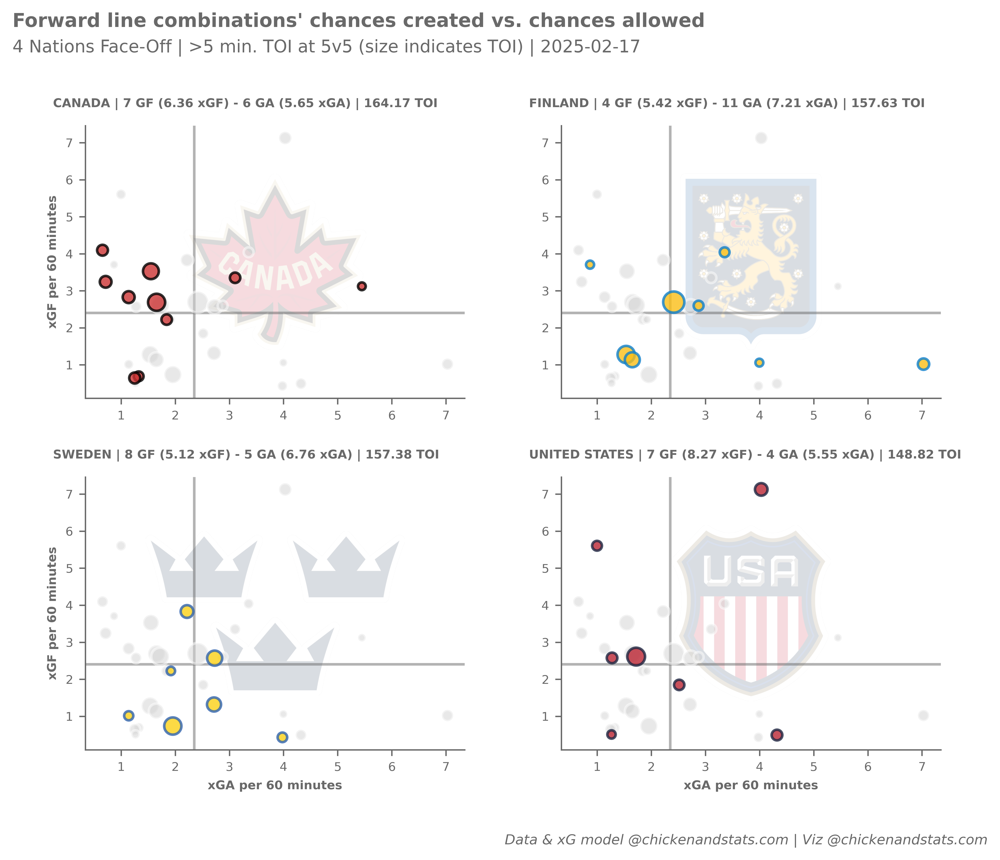

# **Tutorial for 4 Nations Face-Off**

---

## **Intro**

Use the `chickenstats` library to scrape play-by-play data and international team performance in the 4 Nations Face-Off.

Parts of this tutorial are optional and will be clearly marked as such. For help, or any questions,
please don't hesitate to reach out to [chicken@chickenandstats.com](mailto:chicken@chickenandstats.com) or
[@chickenandstats.com](https://bsky.app/profile/chickenandstats.com) on Blue Sky.

---


---

## **Housekeeping**

### Import dependencies

Import the dependencies we'll need for the guide

```python
import datetime as dt

import matplotlib.pyplot as plt
import numpy as np
import pandas as pd
import seaborn as sns
from matplotlib.offsetbox import OffsetImage, AnnotationBbox

import chickenstats.utilities
from chickenstats.utilities import ChickenSession
from chickenstats.chicken_nhl import Scraper, Season
from chickenstats.chicken_nhl.info import INTERNATIONAL_COLORS, Team
from chickenstats.chicken_nhl._helpers import charts_directory

from pathlib import Path

from PIL import Image
from io import BytesIO

from bokeh.plotting import figure, output_file, output_notebook, show, save
from bokeh.models import HoverTool, ColumnDataSource, Title, Div, Span
from bokeh.layouts import gridplot, column
from bokeh.models import Range1d
```

### Pandas options

Set different pandas options. This cell is optional


```python
pd.set_option("display.max_columns", None)
pd.set_option("display.max_rows", 100)
```

### Folder structure


```python
charts_directory()
```

### Chickenstats matplotlib style

chickenstats.utilities includes a custom style package - this activates it. This cell is also optional


```python
plt.style.use("chickenstats")
```

---

## **Scrape data**

### Schedule

Scrape the schedule using the `Season` object


```python
season = Season(2024)
```


```python
schedule = season.schedule(disable_progress_bar=True, sessions="FO")
```

### Game IDs

Create a list of game IDs to scrape


```python
conds = schedule.game_state.isin(["OFF", "FINAL"])

game_ids = schedule.loc[conds].game_id.unique().tolist()

latest_date = schedule.loc[conds].game_date.max()
```

### Play-by-play

Scrape play-by-play data using the `Scraper` object


```python
scraper = Scraper(game_ids, disable_progress_bar=True)
```


```python
pbp = scraper.play_by_play
```

### Stats

Aggregate statistics to season and game level


```python
scraper.prep_stats(level="season")
season_stats = scraper.stats
```


```python
scraper.prep_stats(level="game")
game_stats = scraper.stats
```


```python
scraper.prep_lines(level="season")
lines = scraper.lines
```


```python
scraper.prep_team_stats(level="season")
team_stats = scraper.team_stats
```

## **Matplotlib**


```python
strength_state = "5v5"
toi_min = 5

# Setting filter conditions and filtering data
conds = np.logical_and(lines.strength_state == strength_state, lines.toi >= toi_min)
plot_lines = lines.loc[conds].sort_values(by="xgf_percent", ascending=False).reset_index(drop=True)

# Setting overall figures
fig, axes = plt.subplots(nrows=2, ncols=2, dpi=650, figsize=(8, 6))

fig.tight_layout(pad=2.5)

axes = axes.reshape(-1)

# Getting the averages and drawing the average lines
xga_mean = plot_lines.xga_p60.mean()
xgf_mean = plot_lines.xgf_p60.mean()

# Setting the size norm so bubbles are consistent across figures
size_norm = (plot_lines.toi.min(), plot_lines.toi.max())

# Getting the teams and standings data to iterate through
teams = ["CAN", "FIN", "SWE", "USA"]
team_names = ["CANADA", "FINLAND", "SWEDEN", "UNITED STATES"]
team_names = dict(zip(teams, team_names, strict=False))

# Iterating through the standings data
for _idx, team in enumerate(teams):
    # Setting the team    # Setting the axis
    ax = axes[_idx]

    team_info = Team(team)

    team_name = team_info.team_name
    colors = team_info.colors

    team_stats_plot = team_stats.loc[
        np.logical_and(team_stats.strength_state == strength_state, team_stats.team == team)
    ]

    # Average lines
    ax.axvline(x=xga_mean, zorder=-1, alpha=0.5)
    ax.axhline(y=xgf_mean, zorder=-1, alpha=0.5)

    # Filtering data and plotting the non-selected teams first
    conds = plot_lines.team != team
    plot_data = plot_lines.loc[conds]

    # They all get gray colors
    facecolor = colors["MISS"]
    edgecolor = "white"  # colors["MISS"]

    # Plotting the non-selected teams' data
    sns.scatterplot(
        data=plot_data,
        x="xga_p60",
        y="xgf_p60",
        size="toi",
        sizes=(20, 150),
        size_norm=size_norm,
        lw=1.5,
        facecolor=facecolor,
        edgecolor=edgecolor,
        alpha=0.5,
        legend=False,
        ax=ax,
    )

    # Filtering and plotting the selected team's data
    conds = plot_lines.team == team
    plot_data = plot_lines.loc[conds]

    # Setting the colors
    facecolor = colors["GOAL"]
    edgecolor = colors["SHOT"]

    # Plotting the selected team's data
    sns.scatterplot(
        data=plot_data,
        x="xga_p60",
        y="xgf_p60",
        size="toi",
        sizes=(20, 150),
        size_norm=size_norm,
        lw=1.5,
        facecolor=facecolor,
        edgecolor=edgecolor,
        alpha=0.8,
        legend=False,
        ax=ax,
    )

    # Setting x and y axes labels
    x_labels = [2, 3]

    if _idx in x_labels:
        ax.axes.set_xlabel("xGA per 60 minutes", fontsize=7)
    else:
        ax.axes.set_xlabel("")

    y_labels = [0, 2]

    if _idx in y_labels:
        ax.axes.set_ylabel("xGF per 60 minutes", fontsize=7)
    else:
        ax.axes.set_ylabel("")

    # Setting tick params font size
    ax.tick_params(axis="both", which="major", labelsize=7)

    gf = team_stats_plot.gf.iloc[0]
    xgf = round(team_stats_plot.xgf.iloc[0], 2)
    ga = team_stats_plot.ga.iloc[0]
    xga = round(team_stats_plot.xga.iloc[0], 2)
    toi = round(team_stats_plot.toi.iloc[0], 2)

    # Setting the ax title
    ax_title = f"{team_name} | {gf} GF ({xgf} xGF) - {ga} GA ({xga} xGA) | {toi} TOI"
    ax.set_title(ax_title, fontsize=7, x=-0.085, y=1.03, horizontalalignment="left")

    logo = team_info.logo

    imagebox = OffsetImage(logo, zoom=0.15, alpha=0.15, zorder=-10)
    imagebox.image.axes = ax

    ab = AnnotationBbox(imagebox, (0.5, 0.5), xycoords="axes fraction", bboxprops={"lw": 0}, alpha=0, zorder=-10)

    ax.add_artist(ab)

# Figure suptitle and subtitle
fig_suptitle = "Forward line combinations' chances created vs. chances allowed"
fig.suptitle(fig_suptitle, x=0.01, y=1.085, fontsize=11, fontweight="bold", horizontalalignment="left")

subtitle = f"4 Nations Face-Off | >{toi_min} min. TOI at 5v5 (size indicates TOI) | {latest_date}"
fig.text(s=subtitle, x=0.01, y=1.0315, fontsize=10, horizontalalignment="left")

# Attribution
attribution = "Data & xG model @chickenandstats.com | Viz @chickenandstats.com"
fig.text(s=attribution, x=0.99, y=-0.03, fontsize=8, horizontalalignment="right", style="italic")

savepath = Path("./charts/5v5_4n_fo_forwards.png")
fig.savefig(savepath, transparent=False, bbox_inches="tight")
```


    

    


## **Bokeh**


```python
team = "USA"
team_name = "UNITED STATES"
strength_state = "5v5"
device_type = "desktop"
data = lines.copy()
toi_min = 5
display_plot = False

output_file_str = f"{team.lower()}_5v5_{device_type}.html"

plot_attributes = {
    "desktop": {
        "size_multiplier": 15,
        "major_label_font_size": "9pt",
        "axis_label_font_size": "10pt",
        "title_font_size": "18pt",
        "subtitle_font_size": "14pt",
        "stats_font_size": "10pt",
        "stats_y_value": 0.95,
        "player_name_font_size": "10pt",
        "ncols": 4,
        "height": 240,  # 240,
    },
    "mobile": {
        "size_multiplier": 8,
        "major_label_font_size": "7pt",
        "axis_label_font_size": "8pt",
        "title_font_size": "14pt",
        "subtitle_font_size": "11pt",
        "stats_font_size": "8pt",
        "stats_y_value": 0.95,
        "player_name_font_size": "10pt",
        "ncols": 1,
        "height": 240,  # 240,
    },
}

plot_attributes = plot_attributes[device_type]
plot_colors = {"dark_gray": "#696969", "light_gray": "#D3D3D3", "medium_gray": "#808080"}

# Setting filter conditions and filtering data
conditions = np.logical_and(lines.strength_state == strength_state, lines.toi >= toi_min)
plot_lines = lines.loc[conditions].sort_values(by="xgf_percent", ascending=False).reset_index(drop=True)

x_range = Range1d(plot_lines.xga_p60.min() - 1, plot_lines.xga_p60.max() + 1)
y_range = Range1d(plot_lines.xgf_p60.min() - 1, plot_lines.xgf_p60.max() + 1)

# Getting the averages and drawing the average lines
xga_mean = plot_lines.xga_p60.mean()
xgf_mean = plot_lines.xgf_p60.mean()

# Setting the size norm so bubbles are consistent across figures
size_norm = (plot_lines.toi.min(), plot_lines.toi.max())

# Getting the teams and standings data to iterate through
teams = ["CAN", "FIN", "SWE", "USA"]
team_names = ["CANADA", "FINLAND", "SWEDEN", "UNITED STATES"]
team_names = dict(zip(teams, team_names, strict=False))

plot_list = []

if display_plot:
    output_notebook()

else:
    output_file(output_file_str)

# Iterating through the standings data
for _idx, team in enumerate(teams):
    team_name = team_names[team]
    team_stats_plot = team_stats.loc[
        np.logical_and(team_stats.strength_state == strength_state, team_stats.team == team)
    ]

    colors = INTERNATIONAL_COLORS[team]

    condition = plot_lines.team == team

    plot_data = plot_lines.loc[condition].copy()

    # plot = prep_stats(data = plot, strengths = strengths)

    plot_data["edgecolors"] = colors["SHOT"]
    plot_data["colors"] = colors["GOAL"]
    plot_data["toi_size"] = plot_data.toi

    source = plot_data.copy()

    source = ColumnDataSource(source)

    TOOLS = "hover,crosshair,pan,wheel_zoom,zoom_in,zoom_out,box_zoom,undo,redo,reset,tap,box_select,poly_select,lasso_select"

    p = figure(tools=TOOLS, x_range=x_range, y_range=y_range)

    vline = Span(
        location=xga_mean, dimension="height", line_color=plot_colors["light_gray"], line_width=2, level="underlay"
    )
    hline = Span(
        location=xgf_mean, dimension="width", line_color=plot_colors["light_gray"], line_width=2, level="underlay"
    )

    p.add_layout(vline)
    p.add_layout(hline)

    test = p.scatter(
        x="xga_p60",
        y="xgf_p60",
        size="toi",
        source=source,
        color="colors",
        alpha=0.65,
        line_color="edgecolors",
        line_width=2.5,
    )

    condition = plot_lines.team != team

    plot_data = plot_lines.loc[condition].copy()

    # plot = prep_stats(data = plot, strengths = strengths)

    plot_data["edgecolors"] = "white"
    plot_data["colors"] = colors["MISS"]
    plot_data["toi_size"] = plot_data.toi

    source = plot_data.copy()

    source = ColumnDataSource(source)

    p.scatter(
        x="xga_p60",
        y="xgf_p60",
        size="toi",
        source=source,
        color="colors",
        alpha=0.65,
        line_color="edgecolors",
        line_width=2.5,
        level="underlay",
    )

    gf = team_stats_plot.gf.iloc[0]
    xgf = round(team_stats_plot.xgf.iloc[0], 2)
    ga = team_stats_plot.ga.iloc[0]
    xga = round(team_stats_plot.xga.iloc[0], 2)
    toi = round(team_stats_plot.toi.iloc[0], 2)

    # Setting the ax title
    subtitle = f"{team_name} | {gf} GF ({xgf} xGF) - {ga} GA ({xga} xGA) | {toi} TOI"

    p.add_layout(
        Title(
            text=subtitle,
            text_font_size=plot_attributes["player_name_font_size"],
            text_font_style="bold",
            text_color=plot_colors["dark_gray"],
            vertical_align="middle",
            align="left",
            text_line_height=1,
        ),
        "above",
    )

    p.outline_line_width = 0
    p.grid.grid_line_color = None
    p.axis.minor_tick_line_color = None
    p.axis.major_tick_line_color = plot_colors["dark_gray"]
    p.axis.major_tick_out = 3
    p.axis.major_tick_line_width = 2.5
    # p.axis.ticker = [0, 0.25, 0.5, 0.75, 1]
    # p.axis.major_label_overrides = {x: f"{round(x * 100)}" for x in [0, 0.25, 0.5, 0.75, 1]}

    p.axis.major_label_text_font_size = plot_attributes["major_label_font_size"]
    p.axis.axis_label_text_font_size = plot_attributes["axis_label_font_size"]
    p.axis.axis_line_color = plot_colors["dark_gray"]
    p.axis.axis_line_width = 2

    p.yaxis.axis_label = "xGF per 60 minutes"

    p.xaxis.axis_label = "xGA per 60 minutes"

    hover = p.select(dict(type=HoverTool))

    hover.tooltips = [
        ("LINE", "@forwards"),
        ("TEAM", "@team"),
        ("TOI", "@toi{0.0}"),
        ("GOALS", "@gf"),
        ("xGF%", "@xgf_percent{0.0%}"),
        ("xGF", "@xgf{0.0}"),
        ("xGA", "@xga{0.0}"),
        ("xGF/60", "@xgf_p60{0.0}"),
        ("xGA/60", "@xga_p60{0.0}"),
    ]
    hover.mode = "mouse"
    hover.name = "tooltips"
    hover.renderers = [test]

    plot_list.append(p)

grid = gridplot(
    plot_list,
    ncols=2,
    toolbar_location="right",
    height=300,  # plot_attributes["height"],
    sizing_mode="stretch_width",
)

title_str = "Forward line combinations' chances created vs. chances allowed"

title = Div(
    text=title_str,
    styles={"font-size": plot_attributes["title_font_size"], "color": plot_colors["dark_gray"], "font-weight": "bold"},
    margin=(0, 0, 0, 10),
)

todays_date = dt.datetime.now().strftime("%Y-%m-%d")
subtitle_str = f"4 Nations Face-Off | >{toi_min} min. TOI at 5v5 (size indicates TOI) | {todays_date}"

subtitle = Div(
    text=subtitle_str,
    styles={
        "font-size": plot_attributes["subtitle_font_size"],
        "color": plot_colors["medium_gray"],
        "font-weight": "light",
    },
    margin=(-5, 0, 10, 13),
    background="white",
)

attribution = "Data & xG model @chickenandstats.com | Viz @chickenandstats.com"

footer = Div(
    text=attribution, styles={"font-size": "10pt", "color": plot_colors["medium_gray"], "font-weight": "light"}
)
# margin=(0, 0, 0, 0))


chart = column(title, subtitle, grid, footer, sizing_mode="scale_width", background="white")

if display_plot is True:
    show(chart, background_fill_color="white")

else:
    save(chart)
```

--8<-- "./docs/guide/tutorials/four_nations_files/usa_5v5_desktop.html"
