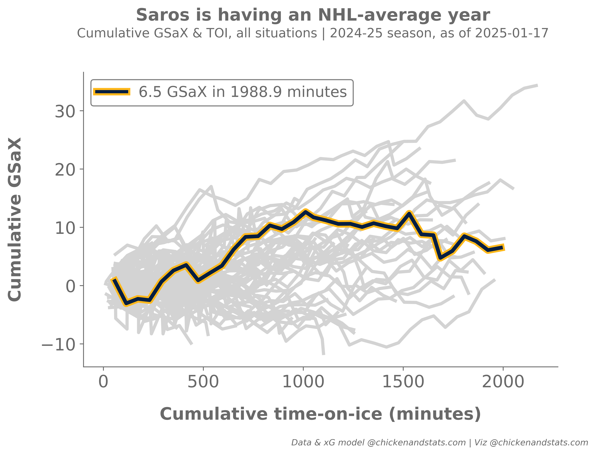

# **Tutorial for goals saved above expected**

---

## **Intro**

Use the `chickenstats` library to scrape play-by-play data and analyze goalies' goals saved above expected.

Parts of this tutorial are optional and will be clearly marked as such. For help, or any questions,
please don't hesitate to reach out to [chicken@chickenandstats.com](mailto:chicken@chickenandstats.com) or
[@chickenandstats.com](https://bsky.app/profile/chickenandstats.com) on Blue Sky.

---

## **Housekeeping**

### Import dependencies

Import the dependencies we'll need for the guide


```python
import pandas as pd
import numpy as np

from chickenstats.chicken_nhl import Season, Scraper
from chickenstats.chicken_nhl.info import NHL_COLORS
import chickenstats.utilities

import matplotlib.pyplot as plt
from matplotlib.lines import Line2D
import matplotlib.patheffects as mpe
import seaborn as sns

import datetime as dt
```

### Pandas options

Set different pandas options. This cell is optional


```python
pd.set_option("display.max_columns", None)
pd.set_option("display.max_rows", 100)
```

### Chickenstats matplotlib style

chickenstats.utilities includes a custom style package - this activates it. This cell is also optional


```python
plt.style.use("chickenstats")
```

---

## **Scrape data**

### Schedule

Scrape the schedule using the `Season` object


```python
season = Season(2024)
```


```python
schedule = season.schedule(disable_progress_bar=True)
```

### Standings and team names

Scrape the standings and create team name dictionaries to use later


```python
standings = season.standings.copy(deep=True)
```


```python
team_names = standings.sort_values(by="team_name").team_name.str.upper().tolist()
team_codes = standings.sort_values(by="team_name").team.str.upper().tolist()
team_names_dict = dict(zip(team_codes, team_names))
```

### Game IDs

Create a list of game IDs to crape


```python
conds = schedule.game_state == "OFF"

game_ids = schedule.loc[conds].game_id.unique().tolist()
```

### Play-by-play

Scrape play-by-play data using the `Scraper` object


```python
scraper = Scraper(game_ids, disable_progress_bar=True)
```


```python
pbp = scraper.play_by_play
```

### Stats

Aggregate statistics to season and game level


```python
scraper.prep_stats(level="season", disable_progress_bar=True)
season_stats = scraper.stats.copy(deep=True)
```


```python
scraper.prep_stats(level="game", disable_progress_bar=True)
game_stats = scraper.stats.copy(deep=True)
```

### Goalie dataframes

Filter the dataframes for goalies and add goals saved above expected stats


```python
def prep_goalie_df(data: pd.DataFrame, strengths: bool) -> pd.DataFrame:
    """Prep goalie dataframes for later analysis.

    Parameters:
        data (pd.DataFrame):
            Pandas dataframe of individual statistics scraped using `chickenstats` library
        strengths (bool):
            If False, aggregates data to all strengths states. If True, data are aggregated
            to strength state level

    """
    df = data.copy(deep=True)

    df = df.loc[df.position == "G"].reset_index(drop=True)

    if not strengths:
        group_cols = [
            "season",
            "session",
            "game_id",
            "game_date",
            "player",
            "eh_id",
            "api_id",
            "position",
            "team",
            "opp_team",
        ]

        group_cols = [x for x in group_cols if x in df.columns]

        agg_stats = {
            x: "sum"
            for x in df.columns
            if x not in group_cols
            and x != "strength_state"
            and "percent" not in x
            and "p60" not in x
        }

        df = df.groupby(group_cols, as_index=False).agg(agg_stats)

    df["gsax"] = df.xga - df.ga
    df["gsax_p60"] = df.gsax / df.toi * 60

    return df
```


```python
goalies_game = prep_goalie_df(data=game_stats, strengths=True)
```


```python
goalies_game_all_sit = prep_goalie_df(data=game_stats, strengths=False)
```


```python
goalies_season = prep_goalie_df(data=season_stats, strengths=True)
```


```python
goalies_season_all_sit = prep_goalie_df(data=season_stats, strengths=False)
```

## **GSaX line charts**

### Prepping data

Calculating cumlative stats


```python
def calc_cumulative_stats(data: pd.DataFrame) -> pd.DataFrame:
    """Calculate cumulative TOI and xG against.

    Parameters:
        data (pd.DataFrame):
            Pandas dataframe of statistics aggregated from the `chickenstats` library and
            prepped for goalie analysis
    """
    df = data.copy(deep=True)

    group_list = ["season", "session", "player", "eh_id", "api_id", "team"]

    df["cum_gp"] = df.groupby(group_list)["game_id"].transform("cumcount") + 1

    df["cum_toi"] = df.groupby(group_list)["toi"].transform("cumsum")

    df["cum_gsax"] = df.groupby(group_list)["gsax"].transform("cumsum")

    return df
```


```python
goalies_game_all_sit = calc_cumulative_stats(data=goalies_game_all_sit)
```

### Top-6 goalies

Create the top goalies dataframe to iterate through for plotting


```python
top_goalies = (
    goalies_season_all_sit.sort_values(by="gsax", ascending=False)
    .head(6)
    .reset_index(drop=True)
)
```

### Plot cumulative GSaX and TOI

Cumulative time-on-ice and goals saved above expected for top-6 goalies in NHL


```python
## setting figure size

fig_size = (15, 15)

fig, axes = plt.subplots(3, 2, figsize=fig_size, dpi=650, sharex=True, sharey=True)

fig.tight_layout(pad=5)

axes = axes.reshape(-1)

for idx, top_goalie in top_goalies.iterrows():
    ax = axes[idx]

    plot_df = goalies_game_all_sit.copy()

    color_palette = np.where(
        plot_df.api_id == top_goalie.api_id,
        NHL_COLORS[top_goalie.team]["SHOT"],
        NHL_COLORS[top_goalie.team]["MISS"],
    )

    color_palette = dict(zip(plot_df.player, color_palette))

    line_color = NHL_COLORS[top_goalie.team]["MISS"]
    line_width = 3

    conds = plot_df.player != top_goalie.player

    sns.lineplot(
        x="cum_toi",
        y="cum_gsax",
        data=plot_df[conds],
        hue="player",
        palette=color_palette,
        ax=ax,
        lw=line_width,
    )

    conds = plot_df.player == top_goalie.player
    line_color = NHL_COLORS[top_goalie.team]["SHOT"]
    line_width = 6
    path_effect_ec = NHL_COLORS[top_goalie.team]["GOAL"]

    path_effect = [
        mpe.Stroke(linewidth=3.25, foreground=line_color),
        mpe.Stroke(foreground=path_effect_ec, alpha=1, linewidth=4),
        mpe.Normal(),
    ]

    sns.lineplot(
        x="cum_toi",
        y="cum_gsax",
        data=plot_df[conds],
        hue="player",
        palette=color_palette,
        ax=ax,
        zorder=3,
        path_effects=path_effect,
    )

    ax.set_title(top_goalie.player, size=18, weight="heavy", pad=15)

    if idx in [0, 2, 4]:
        ax.set_ylabel("Cumulative GSaX", size=16, labelpad=15, weight="heavy")

    else:
        ax.set_ylabel("")
        ax.yaxis.set_tick_params(which="both", labelbottom=True)

    if idx >= 4:
        ax.set_xlabel(
            "Cumulative time-on-ice (minutes)", size=16, labelpad=15, weight="heavy"
        )

    else:
        ax.set_xlabel("")
        ax.xaxis.set_tick_params(which="both", labelbottom=True)

    legend_elements = list()
    color = NHL_COLORS[top_goalie.team]["SHOT"]
    edge_color = color

    xG = round(top_goalie.gsax, 2)

    toi_max = round(top_goalie.toi, 2)

    label = f"{xG} GSaX in {toi_max} minutes"

    element = Line2D([0], [0], lw=3, label=label, color=color)

    legend_elements.append(element)

    legend = ax.legend(
        handles=legend_elements,
        loc="upper left",
        ncol=1,
        fontsize=14,
        title_fontsize=12,
        facecolor="white",
        framealpha=1,
        edgecolor="gray",
    ).set_zorder(-1)

    ax.xaxis.set_tick_params(labelsize=16)
    ax.yaxis.set_tick_params(labelsize=16)


title = "Top-6 goaltenders by cumulative goals saved above expected"
fig.suptitle(title, ha="center", va="center", y=1.027, size=24, weight="heavy")

todays_date = dt.datetime.now().strftime("%Y-%m-%d")
subtitle = f"Cumulative GSaX & cumulative TOI, all situations | 2024-25 season, as of {todays_date}"
fig.text(s=subtitle, ha="center", va="center", x=0.5, y=1.001, size=18)


# Attribution
attribution = f"Data & xG model @chickenandstats.com | Viz @chickenandstats.com"
fig.text(
    s=attribution,
    x=0.99,
    y=-0.0125,
    fontsize=12,
    horizontalalignment="right",
    style="italic",
)

fig.savefig("./charts/top_6_gsax.png", dpi=650, bbox_inches="tight", facecolor="white")
```


    

    

