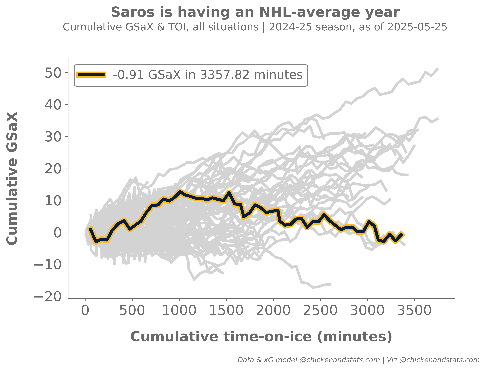

# **Tutorial for goals saved above expected**

---

## **Intro**

Use the `chickenstats` library to scrape play-by-play data and analyze goalies' goals saved above expected.

Parts of this tutorial are optional and will be clearly marked as such. For help, or any questions,
please don't hesitate to reach out to [chicken@chickenandstats.com](mailto:chicken@chickenandstats.com) or
[@chickenandstats.com](https://bsky.app/profile/chickenandstats.com) on Blue Sky.

---


---

## **Housekeeping**

### Import dependencies

Import the dependencies we'll need for the guide


```python
import datetime as dt

import matplotlib.patheffects as mpe
import matplotlib.pyplot as plt
import matplotlib.ticker as ticker
import numpy as np
import pandas as pd
import seaborn as sns
from matplotlib.lines import Line2D

import chickenstats.utilities
from chickenstats.chicken_nhl import Scraper, Season
from chickenstats.chicken_nhl.info import NHL_COLORS
from chickenstats.chicken_nhl.helpers import charts_directory
```

### Pandas options

Set different pandas options. This cell is optional


```python
pd.set_option("display.max_columns", None)
pd.set_option("display.max_rows", 100)
```

### Folder structure


```python
charts_directory()
```

### Chickenstats matplotlib style

chickenstats.utilities includes a custom style package - this activates it. This cell is also optional


```python
plt.style.use("chickenstats")
```

---

## **Scrape data**

### Schedule

Scrape the schedule using the `Season` object


```python
season = Season(2024)
```


```python
schedule = season.schedule(disable_progress_bar=True)
```

### Standings and team names

Scrape the standings and create team name dictionaries to use later


```python
standings = season.standings.copy(deep=True)
```


```python
team_names = standings.sort_values(by="team_name").team_name.str.upper().tolist()
team_codes = standings.sort_values(by="team_name").team.str.upper().tolist()
team_names_dict = dict(zip(team_codes, team_names, strict=False))
```

### Game IDs

Create a list of game IDs to scrape


```python
conds = schedule.game_state == "OFF"

game_ids = schedule.loc[conds].game_id.unique().tolist()
latest_date = schedule.loc[conds].game_date.max()
```

### Play-by-play

Scrape play-by-play data using the `Scraper` object


```python
scraper = Scraper(game_ids, disable_progress_bar=True)
```


```python
pbp = scraper.play_by_play
```

    Python(39941,0x2072dc800) malloc: Failed to allocate segment from range group - out of space


### Stats

Aggregate statistics to season and game level


```python
scraper.prep_stats(level="season", disable_progress_bar=True)
season_stats = scraper.stats.copy(deep=True)
```


```python
scraper.prep_stats(level="game", disable_progress_bar=True)
game_stats = scraper.stats.copy(deep=True)
```

### Goalie dataframes

Filter the dataframes for goalies and add goals saved above expected stats


```python
def prep_goalie_df(data: pd.DataFrame, strengths: bool) -> pd.DataFrame:
    """Prep goalie dataframes for later analysis.

    Parameters:
        data (pd.DataFrame):
            Pandas dataframe of individual statistics scraped using `chickenstats` library
        strengths (bool):
            If False, aggregates data to all strengths states. If True, data are aggregated
            to strength state level

    """
    df = data.copy(deep=True)

    df = df.loc[df.position == "G"].reset_index(drop=True)

    if not strengths:
        group_cols = [
            "season",
            "session",
            "game_id",
            "game_date",
            "player",
            "eh_id",
            "api_id",
            "position",
            "team",
            "opp_team",
        ]

        group_cols = [x for x in group_cols if x in df.columns]

        agg_stats = {
            x: "sum"
            for x in df.columns
            if x not in group_cols and x != "strength_state" and "percent" not in x and "p60" not in x
        }

        df = df.groupby(group_cols, as_index=False).agg(agg_stats)

    df["gsax"] = df.xga - df.ga
    df["gsax_p60"] = df.gsax / df.toi * 60

    return df
```


```python
goalies_game = prep_goalie_df(data=game_stats, strengths=True)
```


```python
goalies_game_all_sit = prep_goalie_df(data=game_stats, strengths=False)
```


```python
goalies_season = prep_goalie_df(data=season_stats, strengths=True)
```


```python
goalies_season_all_sit = prep_goalie_df(data=season_stats, strengths=False)
```

## **GSaX line charts**

### Prepping data

Calculating cumlative stats


```python
def calc_cumulative_stats(data: pd.DataFrame) -> pd.DataFrame:
    """Calculate cumulative TOI and xG against.

    Parameters:
        data (pd.DataFrame):
            Pandas dataframe of statistics aggregated from the `chickenstats` library and
            prepped for goalie analysis
    """
    df = data.copy(deep=True).sort_values(by="game_date")

    group_list = ["season", "session", "player", "eh_id", "api_id", "team"]

    df["cum_gp"] = df.groupby(group_list)["game_id"].transform("cumcount") + 1

    df["cum_toi"] = df.groupby(group_list)["toi"].transform("cumsum")

    df["cum_gsax"] = df.groupby(group_list)["gsax"].transform("cumsum")

    return df
```


```python
goalies_game_all_sit = calc_cumulative_stats(data=goalies_game_all_sit)
```

### Plot line chart function

Function to plot cumulative GSaX and TOI for a given goalie


```python
def plot_line_chart(
    data: pd.DataFrame,
    goalie: pd.Series,
    ax: plt.axes,
    session: str | None = None,
    ax_title: str | None = None,
    legend_label: str | None = None,
    x_label: bool = False,
    y_label: bool = False,
):
    """Function to plot a seaborn line chart of cumulative time-on-ice and goals scored above expected.

    Parameters:
        data (pd.DataFrame):
            Pandas dataframe of game-level goalie data to plot
        goalie (pd.Series):
            Row of data from season-level goalie data
        ax (plt.axes):
            The matplotlib axes to return after plotting the chart
        session (list):
            Select regular season ("R") or playoffs ("P"), if None, defaults to regular season or "R"
        ax_title (str | None):
            Customize ax title, or, if None, use the goalie's name
        legend_label (str | None):
            Customize the legend label, or, if None, list the cumulative GSaX and TOI
        x_label (bool):
            Whether to print or hide the x-axis label
        y_label (bool):
            Whether to print or hide the y-axis label

    """
    if not session:
        session = "R"
        
    condition = data.session == session
    plot_df = data.loc[condition].copy()

    color_palette = np.where(
        plot_df.api_id == goalie.api_id, NHL_COLORS[goalie.team]["SHOT"], NHL_COLORS[goalie.team]["MISS"]
    )

    color_palette = dict(zip(plot_df.player, color_palette, strict=False))

    NHL_COLORS[goalie.team]["MISS"]
    line_width = 3

    conds = plot_df.player != goalie.player

    sns.lineplot(
        x="cum_toi", y="cum_gsax", data=plot_df[conds], hue="player", palette=color_palette, ax=ax, lw=line_width
    )

    conds = plot_df.player == goalie.player
    NHL_COLORS[goalie.team]["SHOT"]
    line_width = 6
    path_effect_ec = NHL_COLORS[goalie.team]["GOAL"]

    path_effect = [mpe.Stroke(foreground=path_effect_ec, alpha=1, linewidth=7), mpe.Normal()]

    sns.lineplot(
        x="cum_toi",
        y="cum_gsax",
        data=plot_df[conds],
        hue="player",
        palette=color_palette,
        ax=ax,
        zorder=3,
        lw=3.5,
        path_effects=path_effect,
    )

    if ax_title == "":
        ax_title = ""

    elif not ax_title:
        ax_title = goalie.player

    ax.set_title(ax_title, size=18, weight="heavy", pad=15)

    if y_label:
        ax.set_ylabel("Cumulative GSaX", size=16, labelpad=15, weight="heavy")

    else:
        ax.set_ylabel("")
        ax.yaxis.set_tick_params(which="both", labelbottom=True)

    if x_label:
        ax.set_xlabel("Cumulative time-on-ice (minutes)", size=16, labelpad=15, weight="heavy")

    else:
        ax.set_xlabel("")
        ax.xaxis.set_tick_params(which="both", labelbottom=True)

    legend_elements = list()
    color = NHL_COLORS[goalie.team]["SHOT"]

    xG = round(goalie.gsax, 2)

    toi_max = round(goalie.toi, 2)

    if not legend_label:
        legend_label = f"{xG} GSaX in {toi_max} minutes"

    element = Line2D([0], [0], lw=3, label=legend_label, color=color, path_effects=path_effect)

    legend_elements.append(element)

    ax.legend(
        handles=legend_elements,
        loc="upper left",
        ncol=1,
        fontsize=14,
        title_fontsize=12,
        facecolor="white",
        framealpha=1,
        edgecolor="gray",
    ).set_zorder(-1)

    ax.xaxis.set_tick_params(labelsize=16)
    ax.yaxis.set_tick_params(labelsize=16)

    return ax
```

### Juuse Saros

Plot single goalie's goals saved above expected and time-on-ice


```python
selected_goalie = "JUUSE.SAROS"
conds = goalies_season_all_sit.eh_id == selected_goalie

fig_size = (8, 5)

fig, ax = plt.subplots(figsize=fig_size, dpi=650)

for idx, goalie in goalies_season_all_sit.loc[conds].iterrows():
    plot_df = goalies_game_all_sit.copy()

    plot_line_chart(data=plot_df, goalie=goalie, ax=ax, ax_title="", x_label=True, y_label=True)


title = "Saros is having an NHL-average year"
fig.suptitle(title, ha="center", va="center", y=1.027, size=16, weight="heavy")

subtitle = f"Cumulative GSaX & TOI, all situations | 2024-25 season, as of {latest_date}"
fig.text(s=subtitle, ha="center", va="center", x=0.5, y=0.98, size=12)


# Attribution
attribution = "Data & xG model @chickenandstats.com | Viz @chickenandstats.com"
fig.text(s=attribution, x=0.95, y=-0.095, fontsize=8, horizontalalignment="right", style="italic")

fig.savefig("./charts/saros_gsax.png", dpi=650, bbox_inches="tight", facecolor="white")
```


    

    


### Top-6 goalies

Create the top goalies dataframe to iterate through for plotting


```python
top_goalies = goalies_season_all_sit.sort_values(by="gsax", ascending=False).head(6).reset_index(drop=True)
```


```python
top_goalies
```


<div>
<style scoped>
    .dataframe tbody tr th:only-of-type {
        vertical-align: middle;
    }

    .dataframe tbody tr th {
        vertical-align: top;
    }

    .dataframe thead th {
        text-align: right;
    }
</style>
<table border="1" class="dataframe">
  <thead>
    <tr style="text-align: right;">
      <th></th>
      <th>season</th>
      <th>session</th>
      <th>player</th>
      <th>eh_id</th>
      <th>api_id</th>
      <th>position</th>
      <th>team</th>
      <th>toi</th>
      <th>g</th>
      <th>g_adj</th>
      <th>ihdg</th>
      <th>a1</th>
      <th>a2</th>
      <th>ixg</th>
      <th>ixg_adj</th>
      <th>isf</th>
      <th>isf_adj</th>
      <th>ihdsf</th>
      <th>imsf</th>
      <th>imsf_adj</th>
      <th>ihdm</th>
      <th>iff</th>
      <th>iff_adj</th>
      <th>ihdf</th>
      <th>isb</th>
      <th>isb_adj</th>
      <th>icf</th>
      <th>icf_adj</th>
      <th>ibs</th>
      <th>ibs_adj</th>
      <th>igive</th>
      <th>itake</th>
      <th>ihf</th>
      <th>iht</th>
      <th>ifow</th>
      <th>ifol</th>
      <th>iozfw</th>
      <th>iozfl</th>
      <th>inzfw</th>
      <th>inzfl</th>
      <th>idzfw</th>
      <th>idzfl</th>
      <th>a1_xg</th>
      <th>a2_xg</th>
      <th>ipent0</th>
      <th>ipent2</th>
      <th>ipent4</th>
      <th>ipent5</th>
      <th>ipent10</th>
      <th>ipend0</th>
      <th>ipend2</th>
      <th>ipend4</th>
      <th>ipend5</th>
      <th>ipend10</th>
      <th>gf</th>
      <th>ga</th>
      <th>gf_adj</th>
      <th>ga_adj</th>
      <th>hdgf</th>
      <th>hdga</th>
      <th>xgf</th>
      <th>xga</th>
      <th>xgf_adj</th>
      <th>xga_adj</th>
      <th>sf</th>
      <th>sa</th>
      <th>sf_adj</th>
      <th>sa_adj</th>
      <th>hdsf</th>
      <th>hdsa</th>
      <th>ff</th>
      <th>fa</th>
      <th>ff_adj</th>
      <th>fa_adj</th>
      <th>hdff</th>
      <th>hdfa</th>
      <th>cf</th>
      <th>ca</th>
      <th>cf_adj</th>
      <th>ca_adj</th>
      <th>bsf</th>
      <th>bsa</th>
      <th>bsf_adj</th>
      <th>bsa_adj</th>
      <th>msf</th>
      <th>msa</th>
      <th>msf_adj</th>
      <th>msa_adj</th>
      <th>hdmsf</th>
      <th>hdmsa</th>
      <th>teammate_block</th>
      <th>teammate_block_adj</th>
      <th>hf</th>
      <th>ht</th>
      <th>give</th>
      <th>take</th>
      <th>ozf</th>
      <th>nzf</th>
      <th>dzf</th>
      <th>fow</th>
      <th>fol</th>
      <th>ozfw</th>
      <th>ozfl</th>
      <th>nzfw</th>
      <th>nzfl</th>
      <th>dzfw</th>
      <th>dzfl</th>
      <th>pent0</th>
      <th>pent2</th>
      <th>pent4</th>
      <th>pent5</th>
      <th>pent10</th>
      <th>pend0</th>
      <th>pend2</th>
      <th>pend4</th>
      <th>pend5</th>
      <th>pend10</th>
      <th>ozs</th>
      <th>nzs</th>
      <th>dzs</th>
      <th>otf</th>
      <th>gsax</th>
      <th>gsax_p60</th>
    </tr>
  </thead>
  <tbody>
    <tr>
      <th>0</th>
      <td>20242025</td>
      <td>R</td>
      <td>CONNOR HELLEBUYCK</td>
      <td>CONNOR.HELLEBUYCK</td>
      <td>8476945</td>
      <td>G</td>
      <td>WPG</td>
      <td>3741.366667</td>
      <td>0</td>
      <td>0.0</td>
      <td>0</td>
      <td>0</td>
      <td>1</td>
      <td>0.000000</td>
      <td>0.000000</td>
      <td>0</td>
      <td>0.0</td>
      <td>0</td>
      <td>0</td>
      <td>0.0</td>
      <td>0</td>
      <td>0</td>
      <td>0.0</td>
      <td>0</td>
      <td>0</td>
      <td>0.0</td>
      <td>0</td>
      <td>0.0</td>
      <td>0</td>
      <td>0.0</td>
      <td>18</td>
      <td>0</td>
      <td>0</td>
      <td>0</td>
      <td>0</td>
      <td>0</td>
      <td>0</td>
      <td>0</td>
      <td>0</td>
      <td>0</td>
      <td>0</td>
      <td>0</td>
      <td>0.0</td>
      <td>0.102360</td>
      <td>0</td>
      <td>1</td>
      <td>0</td>
      <td>0</td>
      <td>0</td>
      <td>0</td>
      <td>1</td>
      <td>0</td>
      <td>0</td>
      <td>0</td>
      <td>211</td>
      <td>125</td>
      <td>212.005429</td>
      <td>124.054898</td>
      <td>96</td>
      <td>52</td>
      <td>205.021225</td>
      <td>178.407307</td>
      <td>206.168954</td>
      <td>177.459366</td>
      <td>1747</td>
      <td>1664</td>
      <td>1775.089671</td>
      <td>1638.917336</td>
      <td>401</td>
      <td>328</td>
      <td>2649</td>
      <td>2599</td>
      <td>2688.052975</td>
      <td>2554.210809</td>
      <td>602</td>
      <td>512</td>
      <td>3576</td>
      <td>3647</td>
      <td>2688.052975</td>
      <td>2554.210809</td>
      <td>927</td>
      <td>961</td>
      <td>0.0</td>
      <td>0.0</td>
      <td>902</td>
      <td>935</td>
      <td>912.823260</td>
      <td>915.693709</td>
      <td>201</td>
      <td>184</td>
      <td>87</td>
      <td>0.0</td>
      <td>1265</td>
      <td>1514</td>
      <td>0</td>
      <td>0</td>
      <td>1183</td>
      <td>1028</td>
      <td>1144</td>
      <td>1663</td>
      <td>1692</td>
      <td>623</td>
      <td>560</td>
      <td>502</td>
      <td>526</td>
      <td>538</td>
      <td>606</td>
      <td>0</td>
      <td>160</td>
      <td>5</td>
      <td>13</td>
      <td>7</td>
      <td>1</td>
      <td>156</td>
      <td>0</td>
      <td>13</td>
      <td>8</td>
      <td>21</td>
      <td>211</td>
      <td>1</td>
      <td>0</td>
      <td>53.407307</td>
      <td>0.856489</td>
    </tr>
    <tr>
      <th>1</th>
      <td>20242025</td>
      <td>R</td>
      <td>ANDREI VASILEVSKIY</td>
      <td>ANDREI.VASILEVSKIY</td>
      <td>8476883</td>
      <td>G</td>
      <td>TBL</td>
      <td>3743.083333</td>
      <td>0</td>
      <td>0.0</td>
      <td>0</td>
      <td>0</td>
      <td>2</td>
      <td>0.000000</td>
      <td>0.000000</td>
      <td>0</td>
      <td>0.0</td>
      <td>0</td>
      <td>0</td>
      <td>0.0</td>
      <td>0</td>
      <td>0</td>
      <td>0.0</td>
      <td>0</td>
      <td>1</td>
      <td>0.0</td>
      <td>1</td>
      <td>0.0</td>
      <td>0</td>
      <td>0.0</td>
      <td>23</td>
      <td>0</td>
      <td>0</td>
      <td>0</td>
      <td>0</td>
      <td>0</td>
      <td>0</td>
      <td>0</td>
      <td>0</td>
      <td>0</td>
      <td>0</td>
      <td>0</td>
      <td>0.0</td>
      <td>0.224553</td>
      <td>0</td>
      <td>4</td>
      <td>0</td>
      <td>0</td>
      <td>0</td>
      <td>0</td>
      <td>1</td>
      <td>0</td>
      <td>0</td>
      <td>0</td>
      <td>213</td>
      <td>136</td>
      <td>213.026828</td>
      <td>135.276058</td>
      <td>96</td>
      <td>49</td>
      <td>212.002044</td>
      <td>173.689999</td>
      <td>212.881615</td>
      <td>172.868676</td>
      <td>1715</td>
      <td>1717</td>
      <td>1736.990283</td>
      <td>1691.161843</td>
      <td>426</td>
      <td>329</td>
      <td>2583</td>
      <td>2497</td>
      <td>2616.524172</td>
      <td>2458.318989</td>
      <td>593</td>
      <td>474</td>
      <td>3598</td>
      <td>3488</td>
      <td>2616.524172</td>
      <td>2458.318989</td>
      <td>1015</td>
      <td>897</td>
      <td>0.0</td>
      <td>0.0</td>
      <td>868</td>
      <td>780</td>
      <td>880.537241</td>
      <td>765.304363</td>
      <td>167</td>
      <td>145</td>
      <td>94</td>
      <td>0.0</td>
      <td>1103</td>
      <td>1535</td>
      <td>0</td>
      <td>0</td>
      <td>1223</td>
      <td>1040</td>
      <td>1266</td>
      <td>1754</td>
      <td>1775</td>
      <td>607</td>
      <td>616</td>
      <td>533</td>
      <td>507</td>
      <td>614</td>
      <td>652</td>
      <td>1</td>
      <td>188</td>
      <td>4</td>
      <td>14</td>
      <td>2</td>
      <td>0</td>
      <td>182</td>
      <td>4</td>
      <td>19</td>
      <td>6</td>
      <td>13</td>
      <td>216</td>
      <td>2</td>
      <td>0</td>
      <td>37.689999</td>
      <td>0.604154</td>
    </tr>
    <tr>
      <th>2</th>
      <td>20242025</td>
      <td>R</td>
      <td>SAM MONTEMBEAULT</td>
      <td>SAM.MONTEMBEAULT</td>
      <td>8478470</td>
      <td>G</td>
      <td>MTL</td>
      <td>3533.983333</td>
      <td>0</td>
      <td>0.0</td>
      <td>0</td>
      <td>0</td>
      <td>1</td>
      <td>0.000000</td>
      <td>0.000000</td>
      <td>0</td>
      <td>0.0</td>
      <td>0</td>
      <td>0</td>
      <td>0.0</td>
      <td>0</td>
      <td>0</td>
      <td>0.0</td>
      <td>0</td>
      <td>0</td>
      <td>0.0</td>
      <td>0</td>
      <td>0.0</td>
      <td>0</td>
      <td>0.0</td>
      <td>6</td>
      <td>0</td>
      <td>0</td>
      <td>0</td>
      <td>0</td>
      <td>0</td>
      <td>0</td>
      <td>0</td>
      <td>0</td>
      <td>0</td>
      <td>0</td>
      <td>0</td>
      <td>0.0</td>
      <td>0.407411</td>
      <td>0</td>
      <td>0</td>
      <td>0</td>
      <td>0</td>
      <td>0</td>
      <td>0</td>
      <td>4</td>
      <td>0</td>
      <td>0</td>
      <td>0</td>
      <td>174</td>
      <td>166</td>
      <td>172.254963</td>
      <td>167.112967</td>
      <td>60</td>
      <td>74</td>
      <td>191.489316</td>
      <td>200.822576</td>
      <td>189.060490</td>
      <td>203.546749</td>
      <td>1499</td>
      <td>1679</td>
      <td>1487.352452</td>
      <td>1690.339796</td>
      <td>299</td>
      <td>394</td>
      <td>2284</td>
      <td>2585</td>
      <td>2265.095328</td>
      <td>2602.484404</td>
      <td>447</td>
      <td>580</td>
      <td>3206</td>
      <td>3694</td>
      <td>2265.095328</td>
      <td>2602.484404</td>
      <td>922</td>
      <td>1005</td>
      <td>0.0</td>
      <td>0.0</td>
      <td>785</td>
      <td>906</td>
      <td>777.239936</td>
      <td>908.647628</td>
      <td>148</td>
      <td>186</td>
      <td>104</td>
      <td>0.0</td>
      <td>1462</td>
      <td>1294</td>
      <td>0</td>
      <td>0</td>
      <td>1036</td>
      <td>1035</td>
      <td>1146</td>
      <td>1632</td>
      <td>1585</td>
      <td>506</td>
      <td>530</td>
      <td>527</td>
      <td>508</td>
      <td>599</td>
      <td>547</td>
      <td>1</td>
      <td>195</td>
      <td>3</td>
      <td>11</td>
      <td>2</td>
      <td>3</td>
      <td>167</td>
      <td>2</td>
      <td>11</td>
      <td>2</td>
      <td>20</td>
      <td>205</td>
      <td>4</td>
      <td>0</td>
      <td>34.822576</td>
      <td>0.591218</td>
    </tr>
    <tr>
      <th>3</th>
      <td>20242025</td>
      <td>R</td>
      <td>IGOR SHESTERKIN</td>
      <td>IGOR.SHESTERKIN</td>
      <td>8478048</td>
      <td>G</td>
      <td>NYR</td>
      <td>3505.133333</td>
      <td>0</td>
      <td>0.0</td>
      <td>0</td>
      <td>0</td>
      <td>0</td>
      <td>0.736852</td>
      <td>0.736852</td>
      <td>0</td>
      <td>0.0</td>
      <td>0</td>
      <td>1</td>
      <td>1.0</td>
      <td>0</td>
      <td>1</td>
      <td>1.0</td>
      <td>0</td>
      <td>0</td>
      <td>0.0</td>
      <td>1</td>
      <td>1.0</td>
      <td>0</td>
      <td>0.0</td>
      <td>19</td>
      <td>0</td>
      <td>0</td>
      <td>0</td>
      <td>0</td>
      <td>0</td>
      <td>0</td>
      <td>0</td>
      <td>0</td>
      <td>0</td>
      <td>0</td>
      <td>0</td>
      <td>0.0</td>
      <td>0.000000</td>
      <td>0</td>
      <td>3</td>
      <td>0</td>
      <td>0</td>
      <td>0</td>
      <td>0</td>
      <td>7</td>
      <td>0</td>
      <td>0</td>
      <td>0</td>
      <td>171</td>
      <td>167</td>
      <td>171.823287</td>
      <td>168.784579</td>
      <td>70</td>
      <td>81</td>
      <td>190.334975</td>
      <td>201.318847</td>
      <td>190.629082</td>
      <td>202.129472</td>
      <td>1606</td>
      <td>1751</td>
      <td>1615.372162</td>
      <td>1751.684472</td>
      <td>352</td>
      <td>432</td>
      <td>2496</td>
      <td>2610</td>
      <td>2505.598044</td>
      <td>2610.031191</td>
      <td>493</td>
      <td>606</td>
      <td>3382</td>
      <td>3589</td>
      <td>2505.598044</td>
      <td>2610.031191</td>
      <td>886</td>
      <td>891</td>
      <td>0.0</td>
      <td>0.0</td>
      <td>890</td>
      <td>859</td>
      <td>889.336451</td>
      <td>859.173709</td>
      <td>141</td>
      <td>174</td>
      <td>88</td>
      <td>0.0</td>
      <td>1477</td>
      <td>1172</td>
      <td>0</td>
      <td>0</td>
      <td>1064</td>
      <td>966</td>
      <td>1142</td>
      <td>1699</td>
      <td>1473</td>
      <td>554</td>
      <td>510</td>
      <td>530</td>
      <td>436</td>
      <td>615</td>
      <td>527</td>
      <td>0</td>
      <td>200</td>
      <td>2</td>
      <td>12</td>
      <td>3</td>
      <td>0</td>
      <td>147</td>
      <td>1</td>
      <td>10</td>
      <td>2</td>
      <td>17</td>
      <td>197</td>
      <td>2</td>
      <td>0</td>
      <td>34.318847</td>
      <td>0.587461</td>
    </tr>
    <tr>
      <th>4</th>
      <td>20242025</td>
      <td>R</td>
      <td>DARCY KUEMPER</td>
      <td>DARCY.KUEMPER</td>
      <td>8475311</td>
      <td>G</td>
      <td>LAK</td>
      <td>2973.650000</td>
      <td>0</td>
      <td>0.0</td>
      <td>0</td>
      <td>0</td>
      <td>1</td>
      <td>0.453933</td>
      <td>0.453933</td>
      <td>0</td>
      <td>0.0</td>
      <td>0</td>
      <td>1</td>
      <td>1.0</td>
      <td>0</td>
      <td>1</td>
      <td>1.0</td>
      <td>0</td>
      <td>0</td>
      <td>0.0</td>
      <td>1</td>
      <td>1.0</td>
      <td>0</td>
      <td>0.0</td>
      <td>9</td>
      <td>0</td>
      <td>0</td>
      <td>0</td>
      <td>0</td>
      <td>0</td>
      <td>0</td>
      <td>0</td>
      <td>0</td>
      <td>0</td>
      <td>0</td>
      <td>0</td>
      <td>0.0</td>
      <td>0.067940</td>
      <td>0</td>
      <td>6</td>
      <td>0</td>
      <td>0</td>
      <td>0</td>
      <td>0</td>
      <td>4</td>
      <td>0</td>
      <td>0</td>
      <td>0</td>
      <td>151</td>
      <td>100</td>
      <td>151.738458</td>
      <td>98.471552</td>
      <td>54</td>
      <td>45</td>
      <td>155.818089</td>
      <td>132.541525</td>
      <td>158.264487</td>
      <td>131.075308</td>
      <td>1357</td>
      <td>1268</td>
      <td>1384.583362</td>
      <td>1242.546460</td>
      <td>280</td>
      <td>280</td>
      <td>2121</td>
      <td>1954</td>
      <td>2164.116689</td>
      <td>1912.015128</td>
      <td>411</td>
      <td>401</td>
      <td>2950</td>
      <td>2735</td>
      <td>2164.116689</td>
      <td>1912.015128</td>
      <td>829</td>
      <td>720</td>
      <td>0.0</td>
      <td>0.0</td>
      <td>764</td>
      <td>686</td>
      <td>780.184198</td>
      <td>668.246167</td>
      <td>131</td>
      <td>121</td>
      <td>61</td>
      <td>0.0</td>
      <td>1021</td>
      <td>1158</td>
      <td>0</td>
      <td>0</td>
      <td>899</td>
      <td>850</td>
      <td>981</td>
      <td>1371</td>
      <td>1359</td>
      <td>444</td>
      <td>455</td>
      <td>440</td>
      <td>410</td>
      <td>487</td>
      <td>494</td>
      <td>2</td>
      <td>165</td>
      <td>2</td>
      <td>14</td>
      <td>0</td>
      <td>1</td>
      <td>124</td>
      <td>0</td>
      <td>14</td>
      <td>5</td>
      <td>19</td>
      <td>170</td>
      <td>1</td>
      <td>0</td>
      <td>32.541525</td>
      <td>0.656598</td>
    </tr>
    <tr>
      <th>5</th>
      <td>20242025</td>
      <td>R</td>
      <td>ANTHONY STOLARZ</td>
      <td>ANTHONY.STOLARZ</td>
      <td>8476932</td>
      <td>G</td>
      <td>TOR</td>
      <td>1986.900000</td>
      <td>0</td>
      <td>0.0</td>
      <td>0</td>
      <td>0</td>
      <td>1</td>
      <td>0.000000</td>
      <td>0.000000</td>
      <td>0</td>
      <td>0.0</td>
      <td>0</td>
      <td>0</td>
      <td>0.0</td>
      <td>0</td>
      <td>0</td>
      <td>0.0</td>
      <td>0</td>
      <td>0</td>
      <td>0.0</td>
      <td>0</td>
      <td>0.0</td>
      <td>0</td>
      <td>0.0</td>
      <td>11</td>
      <td>0</td>
      <td>0</td>
      <td>0</td>
      <td>0</td>
      <td>0</td>
      <td>0</td>
      <td>0</td>
      <td>0</td>
      <td>0</td>
      <td>0</td>
      <td>0</td>
      <td>0.0</td>
      <td>0.042604</td>
      <td>0</td>
      <td>0</td>
      <td>0</td>
      <td>0</td>
      <td>0</td>
      <td>0</td>
      <td>1</td>
      <td>0</td>
      <td>0</td>
      <td>0</td>
      <td>105</td>
      <td>71</td>
      <td>104.994093</td>
      <td>70.668429</td>
      <td>46</td>
      <td>30</td>
      <td>106.028868</td>
      <td>102.871186</td>
      <td>106.394040</td>
      <td>102.221017</td>
      <td>871</td>
      <td>955</td>
      <td>876.422947</td>
      <td>943.049714</td>
      <td>191</td>
      <td>190</td>
      <td>1282</td>
      <td>1501</td>
      <td>1288.193614</td>
      <td>1482.636050</td>
      <td>278</td>
      <td>290</td>
      <td>1751</td>
      <td>2133</td>
      <td>1288.193614</td>
      <td>1482.636050</td>
      <td>469</td>
      <td>574</td>
      <td>0.0</td>
      <td>0.0</td>
      <td>411</td>
      <td>546</td>
      <td>413.061923</td>
      <td>539.188001</td>
      <td>87</td>
      <td>100</td>
      <td>58</td>
      <td>0.0</td>
      <td>810</td>
      <td>753</td>
      <td>0</td>
      <td>0</td>
      <td>550</td>
      <td>550</td>
      <td>685</td>
      <td>971</td>
      <td>814</td>
      <td>307</td>
      <td>243</td>
      <td>295</td>
      <td>255</td>
      <td>369</td>
      <td>316</td>
      <td>0</td>
      <td>111</td>
      <td>2</td>
      <td>11</td>
      <td>0</td>
      <td>0</td>
      <td>92</td>
      <td>2</td>
      <td>10</td>
      <td>0</td>
      <td>9</td>
      <td>117</td>
      <td>1</td>
      <td>0</td>
      <td>31.871186</td>
      <td>0.962440</td>
    </tr>
  </tbody>
</table>
</div>


### Plot cumulative GSaX and TOI

Cumulative time-on-ice and goals saved above expected for top-6 goalies in NHL


```python
## setting figure size

fig_size = (15, 15)

fig, axes = plt.subplots(3, 2, figsize=fig_size, dpi=650, sharex=True, sharey=True)

fig.tight_layout(pad=5)

axes = axes.reshape(-1)

for idx, top_goalie in top_goalies.iterrows():
    ax = axes[idx]

    x_label = idx >= 4

    y_label = idx in [0, 2, 4]

    plot_df = goalies_game_all_sit.copy()

    plot_line_chart(data=plot_df, goalie=top_goalie, ax=ax, x_label=x_label, y_label=y_label)


title = "Top-6 goaltenders by cumulative goals saved above expected"
fig.suptitle(title, ha="center", va="center", y=1.027, size=24, weight="heavy")

subtitle = f"Cumulative GSaX & cumulative TOI, all situations | 2024-25 season, as of {latest_date}"
fig.text(s=subtitle, ha="center", va="center", x=0.5, y=1.001, size=18)


# Attribution
attribution = "Data & xG model @chickenandstats.com | Viz @chickenandstats.com"
fig.text(s=attribution, x=0.99, y=-0.0125, fontsize=12, horizontalalignment="right", style="italic")

fig.savefig("./charts/top_6_gsax.png", dpi=650, bbox_inches="tight", facecolor="white")
```


    

    


```python
goalies_game_all_sit.loc[goalies_game_all_sit.player == "CONNOR HELLEBUYCK"]
```


<div>
<style scoped>
    .dataframe tbody tr th:only-of-type {
        vertical-align: middle;
    }

    .dataframe tbody tr th {
        vertical-align: top;
    }

    .dataframe thead th {
        text-align: right;
    }
</style>
<table border="1" class="dataframe">
  <thead>
    <tr style="text-align: right;">
      <th></th>
      <th>season</th>
      <th>session</th>
      <th>game_id</th>
      <th>game_date</th>
      <th>player</th>
      <th>eh_id</th>
      <th>api_id</th>
      <th>position</th>
      <th>team</th>
      <th>opp_team</th>
      <th>toi</th>
      <th>g</th>
      <th>g_adj</th>
      <th>ihdg</th>
      <th>a1</th>
      <th>a2</th>
      <th>ixg</th>
      <th>ixg_adj</th>
      <th>isf</th>
      <th>isf_adj</th>
      <th>ihdsf</th>
      <th>imsf</th>
      <th>imsf_adj</th>
      <th>ihdm</th>
      <th>iff</th>
      <th>iff_adj</th>
      <th>ihdf</th>
      <th>isb</th>
      <th>isb_adj</th>
      <th>icf</th>
      <th>icf_adj</th>
      <th>ibs</th>
      <th>ibs_adj</th>
      <th>igive</th>
      <th>itake</th>
      <th>ihf</th>
      <th>iht</th>
      <th>ifow</th>
      <th>ifol</th>
      <th>iozfw</th>
      <th>iozfl</th>
      <th>inzfw</th>
      <th>inzfl</th>
      <th>idzfw</th>
      <th>idzfl</th>
      <th>a1_xg</th>
      <th>a2_xg</th>
      <th>ipent0</th>
      <th>ipent2</th>
      <th>ipent4</th>
      <th>ipent5</th>
      <th>ipent10</th>
      <th>ipend0</th>
      <th>ipend2</th>
      <th>ipend4</th>
      <th>ipend5</th>
      <th>ipend10</th>
      <th>gf</th>
      <th>ga</th>
      <th>gf_adj</th>
      <th>ga_adj</th>
      <th>hdgf</th>
      <th>hdga</th>
      <th>xgf</th>
      <th>xga</th>
      <th>xgf_adj</th>
      <th>xga_adj</th>
      <th>sf</th>
      <th>sa</th>
      <th>sf_adj</th>
      <th>sa_adj</th>
      <th>hdsf</th>
      <th>hdsa</th>
      <th>ff</th>
      <th>fa</th>
      <th>ff_adj</th>
      <th>fa_adj</th>
      <th>hdff</th>
      <th>hdfa</th>
      <th>cf</th>
      <th>ca</th>
      <th>cf_adj</th>
      <th>ca_adj</th>
      <th>bsf</th>
      <th>bsa</th>
      <th>bsf_adj</th>
      <th>bsa_adj</th>
      <th>msf</th>
      <th>msa</th>
      <th>msf_adj</th>
      <th>msa_adj</th>
      <th>hdmsf</th>
      <th>hdmsa</th>
      <th>teammate_block</th>
      <th>teammate_block_adj</th>
      <th>hf</th>
      <th>ht</th>
      <th>give</th>
      <th>take</th>
      <th>ozf</th>
      <th>nzf</th>
      <th>dzf</th>
      <th>fow</th>
      <th>fol</th>
      <th>ozfw</th>
      <th>ozfl</th>
      <th>nzfw</th>
      <th>nzfl</th>
      <th>dzfw</th>
      <th>dzfl</th>
      <th>pent0</th>
      <th>pent2</th>
      <th>pent4</th>
      <th>pent5</th>
      <th>pent10</th>
      <th>pend0</th>
      <th>pend2</th>
      <th>pend4</th>
      <th>pend5</th>
      <th>pend10</th>
      <th>ozs</th>
      <th>nzs</th>
      <th>dzs</th>
      <th>otf</th>
      <th>gsax</th>
      <th>gsax_p60</th>
      <th>cum_gp</th>
      <th>cum_toi</th>
      <th>cum_gsax</th>
    </tr>
  </thead>
  <tbody>
    <tr>
      <th>204</th>
      <td>20242025</td>
      <td>R</td>
      <td>2024020008</td>
      <td>2024-10-09</td>
      <td>CONNOR HELLEBUYCK</td>
      <td>CONNOR.HELLEBUYCK</td>
      <td>8476945</td>
      <td>G</td>
      <td>WPG</td>
      <td>EDM</td>
      <td>60.000000</td>
      <td>0</td>
      <td>0.0</td>
      <td>0</td>
      <td>0</td>
      <td>0</td>
      <td>0.0</td>
      <td>0.0</td>
      <td>0</td>
      <td>0.0</td>
      <td>0</td>
      <td>0</td>
      <td>0.0</td>
      <td>0</td>
      <td>0</td>
      <td>0.0</td>
      <td>0</td>
      <td>0</td>
      <td>0.0</td>
      <td>0</td>
      <td>0.0</td>
      <td>0</td>
      <td>0.0</td>
      <td>0</td>
      <td>0</td>
      <td>0</td>
      <td>0</td>
      <td>0</td>
      <td>0</td>
      <td>0</td>
      <td>0</td>
      <td>0</td>
      <td>0</td>
      <td>0</td>
      <td>0</td>
      <td>0.0</td>
      <td>0.00000</td>
      <td>0</td>
      <td>0</td>
      <td>0</td>
      <td>0</td>
      <td>0</td>
      <td>0</td>
      <td>0</td>
      <td>0</td>
      <td>0</td>
      <td>0</td>
      <td>6</td>
      <td>0</td>
      <td>6.569582</td>
      <td>0.000000</td>
      <td>1</td>
      <td>0</td>
      <td>1.896853</td>
      <td>2.868501</td>
      <td>2.057977</td>
      <td>2.644942</td>
      <td>20</td>
      <td>30</td>
      <td>22.304050</td>
      <td>27.871190</td>
      <td>4</td>
      <td>5</td>
      <td>31</td>
      <td>48</td>
      <td>34.249476</td>
      <td>44.054586</td>
      <td>4</td>
      <td>7</td>
      <td>40</td>
      <td>77</td>
      <td>34.249476</td>
      <td>44.054586</td>
      <td>9</td>
      <td>29</td>
      <td>0.0</td>
      <td>0.0</td>
      <td>11</td>
      <td>18</td>
      <td>12.228917</td>
      <td>15.896399</td>
      <td>0</td>
      <td>2</td>
      <td>0</td>
      <td>0.0</td>
      <td>11</td>
      <td>20</td>
      <td>0</td>
      <td>0</td>
      <td>12</td>
      <td>16</td>
      <td>21</td>
      <td>20</td>
      <td>29</td>
      <td>4</td>
      <td>8</td>
      <td>9</td>
      <td>7</td>
      <td>7</td>
      <td>14</td>
      <td>0</td>
      <td>1</td>
      <td>0</td>
      <td>0</td>
      <td>0</td>
      <td>0</td>
      <td>3</td>
      <td>0</td>
      <td>0</td>
      <td>0</td>
      <td>0</td>
      <td>3</td>
      <td>0</td>
      <td>0</td>
      <td>2.868501</td>
      <td>2.868501</td>
      <td>1</td>
      <td>60.000000</td>
      <td>2.868501</td>
    </tr>
    <tr>
      <th>233</th>
      <td>20242025</td>
      <td>R</td>
      <td>2024020021</td>
      <td>2024-10-11</td>
      <td>CONNOR HELLEBUYCK</td>
      <td>CONNOR.HELLEBUYCK</td>
      <td>8476945</td>
      <td>G</td>
      <td>WPG</td>
      <td>CHI</td>
      <td>60.066667</td>
      <td>0</td>
      <td>0.0</td>
      <td>0</td>
      <td>0</td>
      <td>0</td>
      <td>0.0</td>
      <td>0.0</td>
      <td>0</td>
      <td>0.0</td>
      <td>0</td>
      <td>0</td>
      <td>0.0</td>
      <td>0</td>
      <td>0</td>
      <td>0.0</td>
      <td>0</td>
      <td>0</td>
      <td>0.0</td>
      <td>0</td>
      <td>0.0</td>
      <td>0</td>
      <td>0.0</td>
      <td>1</td>
      <td>0</td>
      <td>0</td>
      <td>0</td>
      <td>0</td>
      <td>0</td>
      <td>0</td>
      <td>0</td>
      <td>0</td>
      <td>0</td>
      <td>0</td>
      <td>0</td>
      <td>0.0</td>
      <td>0.00000</td>
      <td>0</td>
      <td>0</td>
      <td>0</td>
      <td>0</td>
      <td>0</td>
      <td>0</td>
      <td>0</td>
      <td>0</td>
      <td>0</td>
      <td>0</td>
      <td>1</td>
      <td>1</td>
      <td>1.003687</td>
      <td>1.043916</td>
      <td>1</td>
      <td>0</td>
      <td>2.694370</td>
      <td>3.258059</td>
      <td>2.531022</td>
      <td>3.497891</td>
      <td>32</td>
      <td>26</td>
      <td>30.353858</td>
      <td>27.370807</td>
      <td>6</td>
      <td>6</td>
      <td>48</td>
      <td>46</td>
      <td>45.491122</td>
      <td>48.696205</td>
      <td>9</td>
      <td>10</td>
      <td>67</td>
      <td>58</td>
      <td>45.491122</td>
      <td>48.696205</td>
      <td>19</td>
      <td>10</td>
      <td>0.0</td>
      <td>0.0</td>
      <td>16</td>
      <td>20</td>
      <td>15.258164</td>
      <td>21.204084</td>
      <td>3</td>
      <td>4</td>
      <td>2</td>
      <td>0.0</td>
      <td>14</td>
      <td>19</td>
      <td>0</td>
      <td>0</td>
      <td>25</td>
      <td>15</td>
      <td>18</td>
      <td>36</td>
      <td>22</td>
      <td>18</td>
      <td>7</td>
      <td>8</td>
      <td>7</td>
      <td>10</td>
      <td>8</td>
      <td>0</td>
      <td>1</td>
      <td>0</td>
      <td>0</td>
      <td>0</td>
      <td>0</td>
      <td>1</td>
      <td>0</td>
      <td>0</td>
      <td>0</td>
      <td>1</td>
      <td>1</td>
      <td>0</td>
      <td>0</td>
      <td>2.258059</td>
      <td>2.255553</td>
      <td>2</td>
      <td>120.066667</td>
      <td>5.126560</td>
    </tr>
    <tr>
      <th>267</th>
      <td>20242025</td>
      <td>R</td>
      <td>2024020038</td>
      <td>2024-10-13</td>
      <td>CONNOR HELLEBUYCK</td>
      <td>CONNOR.HELLEBUYCK</td>
      <td>8476945</td>
      <td>G</td>
      <td>WPG</td>
      <td>MIN</td>
      <td>60.833333</td>
      <td>0</td>
      <td>0.0</td>
      <td>0</td>
      <td>0</td>
      <td>0</td>
      <td>0.0</td>
      <td>0.0</td>
      <td>0</td>
      <td>0.0</td>
      <td>0</td>
      <td>0</td>
      <td>0.0</td>
      <td>0</td>
      <td>0</td>
      <td>0.0</td>
      <td>0</td>
      <td>0</td>
      <td>0.0</td>
      <td>0</td>
      <td>0.0</td>
      <td>0</td>
      <td>0.0</td>
      <td>1</td>
      <td>0</td>
      <td>0</td>
      <td>0</td>
      <td>0</td>
      <td>0</td>
      <td>0</td>
      <td>0</td>
      <td>0</td>
      <td>0</td>
      <td>0</td>
      <td>0</td>
      <td>0.0</td>
      <td>0.00000</td>
      <td>0</td>
      <td>0</td>
      <td>0</td>
      <td>0</td>
      <td>0</td>
      <td>0</td>
      <td>0</td>
      <td>0</td>
      <td>0</td>
      <td>0</td>
      <td>1</td>
      <td>1</td>
      <td>0.906566</td>
      <td>1.043916</td>
      <td>0</td>
      <td>0</td>
      <td>2.830792</td>
      <td>2.128560</td>
      <td>2.660342</td>
      <td>2.271985</td>
      <td>34</td>
      <td>27</td>
      <td>32.625621</td>
      <td>27.949667</td>
      <td>3</td>
      <td>4</td>
      <td>52</td>
      <td>40</td>
      <td>49.618650</td>
      <td>41.770439</td>
      <td>7</td>
      <td>6</td>
      <td>71</td>
      <td>52</td>
      <td>49.618650</td>
      <td>41.770439</td>
      <td>19</td>
      <td>11</td>
      <td>0.0</td>
      <td>0.0</td>
      <td>18</td>
      <td>13</td>
      <td>17.114971</td>
      <td>13.686592</td>
      <td>4</td>
      <td>2</td>
      <td>1</td>
      <td>0.0</td>
      <td>16</td>
      <td>18</td>
      <td>0</td>
      <td>0</td>
      <td>20</td>
      <td>14</td>
      <td>24</td>
      <td>30</td>
      <td>28</td>
      <td>12</td>
      <td>8</td>
      <td>9</td>
      <td>5</td>
      <td>9</td>
      <td>15</td>
      <td>0</td>
      <td>3</td>
      <td>0</td>
      <td>0</td>
      <td>0</td>
      <td>0</td>
      <td>2</td>
      <td>0</td>
      <td>0</td>
      <td>0</td>
      <td>0</td>
      <td>1</td>
      <td>0</td>
      <td>0</td>
      <td>1.128560</td>
      <td>1.113100</td>
      <td>3</td>
      <td>180.900000</td>
      <td>6.255120</td>
    </tr>
    <tr>
      <th>342</th>
      <td>20242025</td>
      <td>R</td>
      <td>2024020073</td>
      <td>2024-10-18</td>
      <td>CONNOR HELLEBUYCK</td>
      <td>CONNOR.HELLEBUYCK</td>
      <td>8476945</td>
      <td>G</td>
      <td>WPG</td>
      <td>SJS</td>
      <td>59.266667</td>
      <td>0</td>
      <td>0.0</td>
      <td>0</td>
      <td>0</td>
      <td>0</td>
      <td>0.0</td>
      <td>0.0</td>
      <td>0</td>
      <td>0.0</td>
      <td>0</td>
      <td>0</td>
      <td>0.0</td>
      <td>0</td>
      <td>0</td>
      <td>0.0</td>
      <td>0</td>
      <td>0</td>
      <td>0.0</td>
      <td>0</td>
      <td>0.0</td>
      <td>0</td>
      <td>0.0</td>
      <td>0</td>
      <td>0</td>
      <td>0</td>
      <td>0</td>
      <td>0</td>
      <td>0</td>
      <td>0</td>
      <td>0</td>
      <td>0</td>
      <td>0</td>
      <td>0</td>
      <td>0</td>
      <td>0.0</td>
      <td>0.00000</td>
      <td>0</td>
      <td>0</td>
      <td>0</td>
      <td>0</td>
      <td>0</td>
      <td>0</td>
      <td>0</td>
      <td>0</td>
      <td>0</td>
      <td>0</td>
      <td>8</td>
      <td>3</td>
      <td>7.864485</td>
      <td>3.044216</td>
      <td>0</td>
      <td>1</td>
      <td>3.769829</td>
      <td>1.622086</td>
      <td>3.727101</td>
      <td>1.633760</td>
      <td>36</td>
      <td>22</td>
      <td>38.157420</td>
      <td>20.705731</td>
      <td>5</td>
      <td>3</td>
      <td>50</td>
      <td>35</td>
      <td>52.805910</td>
      <td>32.899018</td>
      <td>8</td>
      <td>4</td>
      <td>69</td>
      <td>45</td>
      <td>52.805910</td>
      <td>32.899018</td>
      <td>19</td>
      <td>10</td>
      <td>0.0</td>
      <td>0.0</td>
      <td>14</td>
      <td>13</td>
      <td>14.918615</td>
      <td>12.124831</td>
      <td>3</td>
      <td>1</td>
      <td>0</td>
      <td>0.0</td>
      <td>20</td>
      <td>25</td>
      <td>0</td>
      <td>0</td>
      <td>27</td>
      <td>16</td>
      <td>12</td>
      <td>28</td>
      <td>27</td>
      <td>14</td>
      <td>13</td>
      <td>10</td>
      <td>6</td>
      <td>4</td>
      <td>8</td>
      <td>0</td>
      <td>2</td>
      <td>0</td>
      <td>0</td>
      <td>0</td>
      <td>0</td>
      <td>5</td>
      <td>0</td>
      <td>0</td>
      <td>0</td>
      <td>2</td>
      <td>0</td>
      <td>0</td>
      <td>0</td>
      <td>-1.377914</td>
      <td>-1.394964</td>
      <td>4</td>
      <td>240.166667</td>
      <td>4.877205</td>
    </tr>
    <tr>
      <th>398</th>
      <td>20242025</td>
      <td>R</td>
      <td>2024020099</td>
      <td>2024-10-22</td>
      <td>CONNOR HELLEBUYCK</td>
      <td>CONNOR.HELLEBUYCK</td>
      <td>8476945</td>
      <td>G</td>
      <td>WPG</td>
      <td>STL</td>
      <td>59.416667</td>
      <td>0</td>
      <td>0.0</td>
      <td>0</td>
      <td>0</td>
      <td>0</td>
      <td>0.0</td>
      <td>0.0</td>
      <td>0</td>
      <td>0.0</td>
      <td>0</td>
      <td>0</td>
      <td>0.0</td>
      <td>0</td>
      <td>0</td>
      <td>0.0</td>
      <td>0</td>
      <td>0</td>
      <td>0.0</td>
      <td>0</td>
      <td>0.0</td>
      <td>0</td>
      <td>0.0</td>
      <td>0</td>
      <td>0</td>
      <td>0</td>
      <td>0</td>
      <td>0</td>
      <td>0</td>
      <td>0</td>
      <td>0</td>
      <td>0</td>
      <td>0</td>
      <td>0</td>
      <td>0</td>
      <td>0.0</td>
      <td>0.00000</td>
      <td>0</td>
      <td>0</td>
      <td>0</td>
      <td>0</td>
      <td>0</td>
      <td>0</td>
      <td>0</td>
      <td>0</td>
      <td>0</td>
      <td>0</td>
      <td>3</td>
      <td>2</td>
      <td>3.105985</td>
      <td>1.908908</td>
      <td>0</td>
      <td>2</td>
      <td>2.710533</td>
      <td>3.250390</td>
      <td>2.842207</td>
      <td>3.096848</td>
      <td>23</td>
      <td>29</td>
      <td>23.792874</td>
      <td>28.158719</td>
      <td>3</td>
      <td>10</td>
      <td>38</td>
      <td>41</td>
      <td>39.543330</td>
      <td>39.427135</td>
      <td>6</td>
      <td>11</td>
      <td>62</td>
      <td>60</td>
      <td>39.543330</td>
      <td>39.427135</td>
      <td>24</td>
      <td>16</td>
      <td>0.0</td>
      <td>0.0</td>
      <td>15</td>
      <td>12</td>
      <td>15.639138</td>
      <td>11.329692</td>
      <td>3</td>
      <td>1</td>
      <td>3</td>
      <td>0.0</td>
      <td>14</td>
      <td>22</td>
      <td>0</td>
      <td>0</td>
      <td>21</td>
      <td>13</td>
      <td>18</td>
      <td>30</td>
      <td>22</td>
      <td>10</td>
      <td>11</td>
      <td>9</td>
      <td>4</td>
      <td>11</td>
      <td>7</td>
      <td>0</td>
      <td>2</td>
      <td>0</td>
      <td>0</td>
      <td>0</td>
      <td>0</td>
      <td>1</td>
      <td>0</td>
      <td>0</td>
      <td>0</td>
      <td>1</td>
      <td>3</td>
      <td>0</td>
      <td>0</td>
      <td>1.250390</td>
      <td>1.262666</td>
      <td>5</td>
      <td>299.583333</td>
      <td>6.127596</td>
    </tr>
    <tr>
      <th>433</th>
      <td>20242025</td>
      <td>R</td>
      <td>2024020116</td>
      <td>2024-10-24</td>
      <td>CONNOR HELLEBUYCK</td>
      <td>CONNOR.HELLEBUYCK</td>
      <td>8476945</td>
      <td>G</td>
      <td>WPG</td>
      <td>SEA</td>
      <td>61.316667</td>
      <td>0</td>
      <td>0.0</td>
      <td>0</td>
      <td>0</td>
      <td>0</td>
      <td>0.0</td>
      <td>0.0</td>
      <td>0</td>
      <td>0.0</td>
      <td>0</td>
      <td>0</td>
      <td>0.0</td>
      <td>0</td>
      <td>0</td>
      <td>0.0</td>
      <td>0</td>
      <td>0</td>
      <td>0.0</td>
      <td>0</td>
      <td>0.0</td>
      <td>0</td>
      <td>0.0</td>
      <td>0</td>
      <td>0</td>
      <td>0</td>
      <td>0</td>
      <td>0</td>
      <td>0</td>
      <td>0</td>
      <td>0</td>
      <td>0</td>
      <td>0</td>
      <td>0</td>
      <td>0</td>
      <td>0.0</td>
      <td>0.00000</td>
      <td>0</td>
      <td>0</td>
      <td>0</td>
      <td>0</td>
      <td>0</td>
      <td>0</td>
      <td>0</td>
      <td>0</td>
      <td>0</td>
      <td>0</td>
      <td>3</td>
      <td>3</td>
      <td>3.119662</td>
      <td>2.858186</td>
      <td>2</td>
      <td>1</td>
      <td>2.105195</td>
      <td>2.752514</td>
      <td>2.235589</td>
      <td>2.617155</td>
      <td>35</td>
      <td>32</td>
      <td>36.641513</td>
      <td>31.225979</td>
      <td>5</td>
      <td>4</td>
      <td>37</td>
      <td>46</td>
      <td>38.890214</td>
      <td>44.400979</td>
      <td>5</td>
      <td>6</td>
      <td>55</td>
      <td>62</td>
      <td>38.890214</td>
      <td>44.400979</td>
      <td>18</td>
      <td>15</td>
      <td>0.0</td>
      <td>0.0</td>
      <td>2</td>
      <td>14</td>
      <td>2.101547</td>
      <td>13.304035</td>
      <td>0</td>
      <td>2</td>
      <td>1</td>
      <td>0.0</td>
      <td>31</td>
      <td>34</td>
      <td>0</td>
      <td>0</td>
      <td>31</td>
      <td>18</td>
      <td>26</td>
      <td>40</td>
      <td>35</td>
      <td>17</td>
      <td>14</td>
      <td>9</td>
      <td>9</td>
      <td>14</td>
      <td>12</td>
      <td>0</td>
      <td>2</td>
      <td>0</td>
      <td>0</td>
      <td>0</td>
      <td>0</td>
      <td>1</td>
      <td>0</td>
      <td>0</td>
      <td>0</td>
      <td>0</td>
      <td>4</td>
      <td>0</td>
      <td>0</td>
      <td>-0.247486</td>
      <td>-0.242171</td>
      <td>6</td>
      <td>360.900000</td>
      <td>5.880110</td>
    </tr>
    <tr>
      <th>489</th>
      <td>20242025</td>
      <td>R</td>
      <td>2024020143</td>
      <td>2024-10-28</td>
      <td>CONNOR HELLEBUYCK</td>
      <td>CONNOR.HELLEBUYCK</td>
      <td>8476945</td>
      <td>G</td>
      <td>WPG</td>
      <td>TOR</td>
      <td>59.350000</td>
      <td>0</td>
      <td>0.0</td>
      <td>0</td>
      <td>0</td>
      <td>0</td>
      <td>0.0</td>
      <td>0.0</td>
      <td>0</td>
      <td>0.0</td>
      <td>0</td>
      <td>0</td>
      <td>0.0</td>
      <td>0</td>
      <td>0</td>
      <td>0.0</td>
      <td>0</td>
      <td>0</td>
      <td>0.0</td>
      <td>0</td>
      <td>0.0</td>
      <td>0</td>
      <td>0.0</td>
      <td>0</td>
      <td>0</td>
      <td>0</td>
      <td>0</td>
      <td>0</td>
      <td>0</td>
      <td>0</td>
      <td>0</td>
      <td>0</td>
      <td>0</td>
      <td>0</td>
      <td>0</td>
      <td>0.0</td>
      <td>0.00000</td>
      <td>0</td>
      <td>0</td>
      <td>0</td>
      <td>0</td>
      <td>0</td>
      <td>0</td>
      <td>0</td>
      <td>0</td>
      <td>0</td>
      <td>0</td>
      <td>2</td>
      <td>5</td>
      <td>1.737288</td>
      <td>5.269709</td>
      <td>0</td>
      <td>3</td>
      <td>1.987055</td>
      <td>3.801955</td>
      <td>1.781793</td>
      <td>4.134349</td>
      <td>21</td>
      <td>35</td>
      <td>19.095199</td>
      <td>37.600843</td>
      <td>0</td>
      <td>9</td>
      <td>34</td>
      <td>47</td>
      <td>30.521043</td>
      <td>50.630890</td>
      <td>5</td>
      <td>9</td>
      <td>53</td>
      <td>60</td>
      <td>30.521043</td>
      <td>50.630890</td>
      <td>19</td>
      <td>11</td>
      <td>0.0</td>
      <td>0.0</td>
      <td>13</td>
      <td>12</td>
      <td>11.477340</td>
      <td>13.550698</td>
      <td>5</td>
      <td>0</td>
      <td>2</td>
      <td>0.0</td>
      <td>20</td>
      <td>25</td>
      <td>0</td>
      <td>0</td>
      <td>13</td>
      <td>28</td>
      <td>15</td>
      <td>19</td>
      <td>37</td>
      <td>5</td>
      <td>8</td>
      <td>9</td>
      <td>19</td>
      <td>5</td>
      <td>10</td>
      <td>0</td>
      <td>2</td>
      <td>0</td>
      <td>0</td>
      <td>0</td>
      <td>0</td>
      <td>4</td>
      <td>0</td>
      <td>0</td>
      <td>0</td>
      <td>0</td>
      <td>3</td>
      <td>0</td>
      <td>0</td>
      <td>-1.198045</td>
      <td>-1.211166</td>
      <td>7</td>
      <td>420.250000</td>
      <td>4.682065</td>
    </tr>
    <tr>
      <th>517</th>
      <td>20242025</td>
      <td>R</td>
      <td>2024020156</td>
      <td>2024-10-30</td>
      <td>CONNOR HELLEBUYCK</td>
      <td>CONNOR.HELLEBUYCK</td>
      <td>8476945</td>
      <td>G</td>
      <td>WPG</td>
      <td>DET</td>
      <td>60.000000</td>
      <td>0</td>
      <td>0.0</td>
      <td>0</td>
      <td>0</td>
      <td>0</td>
      <td>0.0</td>
      <td>0.0</td>
      <td>0</td>
      <td>0.0</td>
      <td>0</td>
      <td>0</td>
      <td>0.0</td>
      <td>0</td>
      <td>0</td>
      <td>0.0</td>
      <td>0</td>
      <td>0</td>
      <td>0.0</td>
      <td>0</td>
      <td>0.0</td>
      <td>0</td>
      <td>0.0</td>
      <td>1</td>
      <td>0</td>
      <td>0</td>
      <td>0</td>
      <td>0</td>
      <td>0</td>
      <td>0</td>
      <td>0</td>
      <td>0</td>
      <td>0</td>
      <td>0</td>
      <td>0</td>
      <td>0.0</td>
      <td>0.00000</td>
      <td>0</td>
      <td>0</td>
      <td>0</td>
      <td>0</td>
      <td>0</td>
      <td>0</td>
      <td>0</td>
      <td>0</td>
      <td>0</td>
      <td>0</td>
      <td>6</td>
      <td>2</td>
      <td>6.447870</td>
      <td>1.737288</td>
      <td>3</td>
      <td>1</td>
      <td>3.155265</td>
      <td>1.661105</td>
      <td>3.461482</td>
      <td>1.518430</td>
      <td>29</td>
      <td>21</td>
      <td>32.729521</td>
      <td>18.667958</td>
      <td>8</td>
      <td>1</td>
      <td>43</td>
      <td>34</td>
      <td>48.826610</td>
      <td>30.275204</td>
      <td>11</td>
      <td>3</td>
      <td>51</td>
      <td>51</td>
      <td>48.826610</td>
      <td>30.275204</td>
      <td>8</td>
      <td>17</td>
      <td>0.0</td>
      <td>0.0</td>
      <td>14</td>
      <td>13</td>
      <td>15.917181</td>
      <td>11.688197</td>
      <td>3</td>
      <td>2</td>
      <td>0</td>
      <td>0.0</td>
      <td>10</td>
      <td>31</td>
      <td>0</td>
      <td>0</td>
      <td>18</td>
      <td>18</td>
      <td>18</td>
      <td>33</td>
      <td>21</td>
      <td>15</td>
      <td>3</td>
      <td>11</td>
      <td>7</td>
      <td>7</td>
      <td>11</td>
      <td>0</td>
      <td>3</td>
      <td>0</td>
      <td>0</td>
      <td>0</td>
      <td>0</td>
      <td>2</td>
      <td>0</td>
      <td>0</td>
      <td>0</td>
      <td>0</td>
      <td>3</td>
      <td>0</td>
      <td>0</td>
      <td>-0.338895</td>
      <td>-0.338895</td>
      <td>8</td>
      <td>480.250000</td>
      <td>4.343170</td>
    </tr>
    <tr>
      <th>578</th>
      <td>20242025</td>
      <td>R</td>
      <td>2024020186</td>
      <td>2024-11-03</td>
      <td>CONNOR HELLEBUYCK</td>
      <td>CONNOR.HELLEBUYCK</td>
      <td>8476945</td>
      <td>G</td>
      <td>WPG</td>
      <td>TBL</td>
      <td>60.000000</td>
      <td>0</td>
      <td>0.0</td>
      <td>0</td>
      <td>0</td>
      <td>0</td>
      <td>0.0</td>
      <td>0.0</td>
      <td>0</td>
      <td>0.0</td>
      <td>0</td>
      <td>0</td>
      <td>0.0</td>
      <td>0</td>
      <td>0</td>
      <td>0.0</td>
      <td>0</td>
      <td>0</td>
      <td>0.0</td>
      <td>0</td>
      <td>0.0</td>
      <td>0</td>
      <td>0.0</td>
      <td>0</td>
      <td>0</td>
      <td>0</td>
      <td>0</td>
      <td>0</td>
      <td>0</td>
      <td>0</td>
      <td>0</td>
      <td>0</td>
      <td>0</td>
      <td>0</td>
      <td>0</td>
      <td>0.0</td>
      <td>0.00000</td>
      <td>0</td>
      <td>0</td>
      <td>0</td>
      <td>0</td>
      <td>0</td>
      <td>0</td>
      <td>0</td>
      <td>0</td>
      <td>0</td>
      <td>0</td>
      <td>7</td>
      <td>4</td>
      <td>6.748810</td>
      <td>4.260672</td>
      <td>3</td>
      <td>2</td>
      <td>4.366448</td>
      <td>2.967547</td>
      <td>4.229758</td>
      <td>3.099609</td>
      <td>34</td>
      <td>30</td>
      <td>32.695340</td>
      <td>30.649921</td>
      <td>10</td>
      <td>5</td>
      <td>45</td>
      <td>41</td>
      <td>43.132965</td>
      <td>42.179155</td>
      <td>10</td>
      <td>7</td>
      <td>51</td>
      <td>56</td>
      <td>43.132965</td>
      <td>42.179155</td>
      <td>6</td>
      <td>13</td>
      <td>0.0</td>
      <td>0.0</td>
      <td>11</td>
      <td>11</td>
      <td>10.568424</td>
      <td>11.440579</td>
      <td>0</td>
      <td>2</td>
      <td>2</td>
      <td>0.0</td>
      <td>31</td>
      <td>16</td>
      <td>0</td>
      <td>0</td>
      <td>25</td>
      <td>23</td>
      <td>24</td>
      <td>33</td>
      <td>39</td>
      <td>10</td>
      <td>15</td>
      <td>13</td>
      <td>10</td>
      <td>10</td>
      <td>14</td>
      <td>0</td>
      <td>2</td>
      <td>0</td>
      <td>1</td>
      <td>1</td>
      <td>0</td>
      <td>3</td>
      <td>0</td>
      <td>1</td>
      <td>2</td>
      <td>0</td>
      <td>2</td>
      <td>0</td>
      <td>0</td>
      <td>-1.032453</td>
      <td>-1.032453</td>
      <td>9</td>
      <td>540.250000</td>
      <td>3.310717</td>
    </tr>
    <tr>
      <th>608</th>
      <td>20242025</td>
      <td>R</td>
      <td>2024020201</td>
      <td>2024-11-05</td>
      <td>CONNOR HELLEBUYCK</td>
      <td>CONNOR.HELLEBUYCK</td>
      <td>8476945</td>
      <td>G</td>
      <td>WPG</td>
      <td>UTA</td>
      <td>60.000000</td>
      <td>0</td>
      <td>0.0</td>
      <td>0</td>
      <td>0</td>
      <td>0</td>
      <td>0.0</td>
      <td>0.0</td>
      <td>0</td>
      <td>0.0</td>
      <td>0</td>
      <td>0</td>
      <td>0.0</td>
      <td>0</td>
      <td>0</td>
      <td>0.0</td>
      <td>0</td>
      <td>0</td>
      <td>0.0</td>
      <td>0</td>
      <td>0.0</td>
      <td>0</td>
      <td>0.0</td>
      <td>0</td>
      <td>0</td>
      <td>0</td>
      <td>0</td>
      <td>0</td>
      <td>0</td>
      <td>0</td>
      <td>0</td>
      <td>0</td>
      <td>0</td>
      <td>0</td>
      <td>0</td>
      <td>0.0</td>
      <td>0.00000</td>
      <td>0</td>
      <td>0</td>
      <td>0</td>
      <td>0</td>
      <td>0</td>
      <td>0</td>
      <td>0</td>
      <td>0</td>
      <td>0</td>
      <td>0</td>
      <td>3</td>
      <td>0</td>
      <td>2.912414</td>
      <td>0.000000</td>
      <td>2</td>
      <td>0</td>
      <td>2.803792</td>
      <td>1.784025</td>
      <td>2.712589</td>
      <td>1.832288</td>
      <td>28</td>
      <td>21</td>
      <td>27.800688</td>
      <td>20.994183</td>
      <td>5</td>
      <td>2</td>
      <td>39</td>
      <td>33</td>
      <td>38.554562</td>
      <td>33.206755</td>
      <td>7</td>
      <td>6</td>
      <td>45</td>
      <td>52</td>
      <td>38.554562</td>
      <td>33.206755</td>
      <td>6</td>
      <td>18</td>
      <td>0.0</td>
      <td>0.0</td>
      <td>11</td>
      <td>12</td>
      <td>10.853793</td>
      <td>12.121065</td>
      <td>2</td>
      <td>4</td>
      <td>1</td>
      <td>0.0</td>
      <td>24</td>
      <td>19</td>
      <td>0</td>
      <td>0</td>
      <td>13</td>
      <td>16</td>
      <td>28</td>
      <td>31</td>
      <td>26</td>
      <td>6</td>
      <td>7</td>
      <td>8</td>
      <td>8</td>
      <td>17</td>
      <td>11</td>
      <td>0</td>
      <td>4</td>
      <td>0</td>
      <td>0</td>
      <td>0</td>
      <td>0</td>
      <td>2</td>
      <td>0</td>
      <td>0</td>
      <td>0</td>
      <td>0</td>
      <td>3</td>
      <td>0</td>
      <td>0</td>
      <td>1.784025</td>
      <td>1.784025</td>
      <td>10</td>
      <td>600.250000</td>
      <td>5.094742</td>
    </tr>
    <tr>
      <th>642</th>
      <td>20242025</td>
      <td>R</td>
      <td>2024020217</td>
      <td>2024-11-07</td>
      <td>CONNOR HELLEBUYCK</td>
      <td>CONNOR.HELLEBUYCK</td>
      <td>8476945</td>
      <td>G</td>
      <td>WPG</td>
      <td>COL</td>
      <td>59.750000</td>
      <td>0</td>
      <td>0.0</td>
      <td>0</td>
      <td>0</td>
      <td>0</td>
      <td>0.0</td>
      <td>0.0</td>
      <td>0</td>
      <td>0.0</td>
      <td>0</td>
      <td>0</td>
      <td>0.0</td>
      <td>0</td>
      <td>0</td>
      <td>0.0</td>
      <td>0</td>
      <td>0</td>
      <td>0.0</td>
      <td>0</td>
      <td>0.0</td>
      <td>0</td>
      <td>0.0</td>
      <td>0</td>
      <td>0</td>
      <td>0</td>
      <td>0</td>
      <td>0</td>
      <td>0</td>
      <td>0</td>
      <td>0</td>
      <td>0</td>
      <td>0</td>
      <td>0</td>
      <td>0</td>
      <td>0.0</td>
      <td>0.00000</td>
      <td>0</td>
      <td>0</td>
      <td>0</td>
      <td>0</td>
      <td>0</td>
      <td>0</td>
      <td>0</td>
      <td>0</td>
      <td>0</td>
      <td>0</td>
      <td>1</td>
      <td>0</td>
      <td>0.959630</td>
      <td>0.000000</td>
      <td>1</td>
      <td>0</td>
      <td>3.110660</td>
      <td>4.179679</td>
      <td>3.094563</td>
      <td>4.209046</td>
      <td>28</td>
      <td>35</td>
      <td>28.921727</td>
      <td>34.025595</td>
      <td>3</td>
      <td>8</td>
      <td>38</td>
      <td>54</td>
      <td>39.154483</td>
      <td>52.584408</td>
      <td>5</td>
      <td>11</td>
      <td>55</td>
      <td>73</td>
      <td>39.154483</td>
      <td>52.584408</td>
      <td>17</td>
      <td>15</td>
      <td>0.0</td>
      <td>0.0</td>
      <td>10</td>
      <td>19</td>
      <td>10.313658</td>
      <td>18.518699</td>
      <td>2</td>
      <td>3</td>
      <td>4</td>
      <td>0.0</td>
      <td>10</td>
      <td>18</td>
      <td>0</td>
      <td>0</td>
      <td>24</td>
      <td>15</td>
      <td>20</td>
      <td>33</td>
      <td>26</td>
      <td>16</td>
      <td>8</td>
      <td>8</td>
      <td>7</td>
      <td>9</td>
      <td>11</td>
      <td>0</td>
      <td>1</td>
      <td>0</td>
      <td>0</td>
      <td>0</td>
      <td>0</td>
      <td>1</td>
      <td>0</td>
      <td>0</td>
      <td>0</td>
      <td>1</td>
      <td>3</td>
      <td>0</td>
      <td>0</td>
      <td>4.179679</td>
      <td>4.197167</td>
      <td>11</td>
      <td>660.000000</td>
      <td>9.274422</td>
    </tr>
    <tr>
      <th>668</th>
      <td>20242025</td>
      <td>R</td>
      <td>2024020230</td>
      <td>2024-11-09</td>
      <td>CONNOR HELLEBUYCK</td>
      <td>CONNOR.HELLEBUYCK</td>
      <td>8476945</td>
      <td>G</td>
      <td>WPG</td>
      <td>DAL</td>
      <td>60.000000</td>
      <td>0</td>
      <td>0.0</td>
      <td>0</td>
      <td>0</td>
      <td>0</td>
      <td>0.0</td>
      <td>0.0</td>
      <td>0</td>
      <td>0.0</td>
      <td>0</td>
      <td>0</td>
      <td>0.0</td>
      <td>0</td>
      <td>0</td>
      <td>0.0</td>
      <td>0</td>
      <td>0</td>
      <td>0.0</td>
      <td>0</td>
      <td>0.0</td>
      <td>0</td>
      <td>0.0</td>
      <td>0</td>
      <td>0</td>
      <td>0</td>
      <td>0</td>
      <td>0</td>
      <td>0</td>
      <td>0</td>
      <td>0</td>
      <td>0</td>
      <td>0</td>
      <td>0</td>
      <td>0</td>
      <td>0.0</td>
      <td>0.00000</td>
      <td>0</td>
      <td>0</td>
      <td>0</td>
      <td>0</td>
      <td>0</td>
      <td>0</td>
      <td>0</td>
      <td>0</td>
      <td>0</td>
      <td>0</td>
      <td>4</td>
      <td>1</td>
      <td>3.888275</td>
      <td>1.019297</td>
      <td>2</td>
      <td>0</td>
      <td>4.447070</td>
      <td>4.250764</td>
      <td>4.288842</td>
      <td>4.266244</td>
      <td>25</td>
      <td>33</td>
      <td>25.571132</td>
      <td>31.083463</td>
      <td>9</td>
      <td>11</td>
      <td>41</td>
      <td>54</td>
      <td>42.094122</td>
      <td>50.987468</td>
      <td>15</td>
      <td>18</td>
      <td>50</td>
      <td>72</td>
      <td>42.094122</td>
      <td>50.987468</td>
      <td>9</td>
      <td>17</td>
      <td>0.0</td>
      <td>0.0</td>
      <td>16</td>
      <td>21</td>
      <td>16.713526</td>
      <td>19.744869</td>
      <td>6</td>
      <td>7</td>
      <td>1</td>
      <td>0.0</td>
      <td>18</td>
      <td>18</td>
      <td>0</td>
      <td>0</td>
      <td>13</td>
      <td>17</td>
      <td>22</td>
      <td>24</td>
      <td>28</td>
      <td>10</td>
      <td>3</td>
      <td>5</td>
      <td>12</td>
      <td>9</td>
      <td>13</td>
      <td>0</td>
      <td>5</td>
      <td>0</td>
      <td>1</td>
      <td>0</td>
      <td>0</td>
      <td>6</td>
      <td>0</td>
      <td>1</td>
      <td>1</td>
      <td>0</td>
      <td>0</td>
      <td>0</td>
      <td>0</td>
      <td>3.250764</td>
      <td>3.250764</td>
      <td>12</td>
      <td>720.000000</td>
      <td>12.525185</td>
    </tr>
    <tr>
      <th>707</th>
      <td>20242025</td>
      <td>R</td>
      <td>2024020247</td>
      <td>2024-11-12</td>
      <td>CONNOR HELLEBUYCK</td>
      <td>CONNOR.HELLEBUYCK</td>
      <td>8476945</td>
      <td>G</td>
      <td>WPG</td>
      <td>NYR</td>
      <td>59.983333</td>
      <td>0</td>
      <td>0.0</td>
      <td>0</td>
      <td>0</td>
      <td>0</td>
      <td>0.0</td>
      <td>0.0</td>
      <td>0</td>
      <td>0.0</td>
      <td>0</td>
      <td>0</td>
      <td>0.0</td>
      <td>0</td>
      <td>0</td>
      <td>0.0</td>
      <td>0</td>
      <td>0</td>
      <td>0.0</td>
      <td>0</td>
      <td>0.0</td>
      <td>0</td>
      <td>0.0</td>
      <td>0</td>
      <td>0</td>
      <td>0</td>
      <td>0</td>
      <td>0</td>
      <td>0</td>
      <td>0</td>
      <td>0</td>
      <td>0</td>
      <td>0</td>
      <td>0</td>
      <td>0</td>
      <td>0.0</td>
      <td>0.00000</td>
      <td>0</td>
      <td>0</td>
      <td>0</td>
      <td>0</td>
      <td>0</td>
      <td>0</td>
      <td>0</td>
      <td>0</td>
      <td>0</td>
      <td>0</td>
      <td>6</td>
      <td>3</td>
      <td>6.280782</td>
      <td>2.767200</td>
      <td>3</td>
      <td>2</td>
      <td>3.583857</td>
      <td>4.199915</td>
      <td>3.825790</td>
      <td>3.919447</td>
      <td>33</td>
      <td>36</td>
      <td>34.932648</td>
      <td>34.095863</td>
      <td>7</td>
      <td>8</td>
      <td>41</td>
      <td>54</td>
      <td>43.585736</td>
      <td>50.871155</td>
      <td>8</td>
      <td>10</td>
      <td>54</td>
      <td>68</td>
      <td>43.585736</td>
      <td>50.871155</td>
      <td>13</td>
      <td>12</td>
      <td>0.0</td>
      <td>0.0</td>
      <td>8</td>
      <td>18</td>
      <td>8.488662</td>
      <td>16.727711</td>
      <td>1</td>
      <td>2</td>
      <td>2</td>
      <td>0.0</td>
      <td>13</td>
      <td>21</td>
      <td>0</td>
      <td>0</td>
      <td>17</td>
      <td>18</td>
      <td>16</td>
      <td>18</td>
      <td>33</td>
      <td>5</td>
      <td>12</td>
      <td>5</td>
      <td>13</td>
      <td>8</td>
      <td>8</td>
      <td>0</td>
      <td>4</td>
      <td>0</td>
      <td>0</td>
      <td>0</td>
      <td>0</td>
      <td>1</td>
      <td>0</td>
      <td>0</td>
      <td>0</td>
      <td>1</td>
      <td>3</td>
      <td>0</td>
      <td>0</td>
      <td>1.199915</td>
      <td>1.200248</td>
      <td>13</td>
      <td>779.983333</td>
      <td>13.725100</td>
    </tr>
    <tr>
      <th>770</th>
      <td>20242025</td>
      <td>R</td>
      <td>2024020277</td>
      <td>2024-11-16</td>
      <td>CONNOR HELLEBUYCK</td>
      <td>CONNOR.HELLEBUYCK</td>
      <td>8476945</td>
      <td>G</td>
      <td>WPG</td>
      <td>FLA</td>
      <td>60.000000</td>
      <td>0</td>
      <td>0.0</td>
      <td>0</td>
      <td>0</td>
      <td>0</td>
      <td>0.0</td>
      <td>0.0</td>
      <td>0</td>
      <td>0.0</td>
      <td>0</td>
      <td>0</td>
      <td>0.0</td>
      <td>0</td>
      <td>0</td>
      <td>0.0</td>
      <td>0</td>
      <td>0</td>
      <td>0.0</td>
      <td>0</td>
      <td>0.0</td>
      <td>0</td>
      <td>0.0</td>
      <td>0</td>
      <td>0</td>
      <td>0</td>
      <td>0</td>
      <td>0</td>
      <td>0</td>
      <td>0</td>
      <td>0</td>
      <td>0</td>
      <td>0</td>
      <td>0</td>
      <td>0</td>
      <td>0.0</td>
      <td>0.00000</td>
      <td>0</td>
      <td>0</td>
      <td>0</td>
      <td>0</td>
      <td>0</td>
      <td>0</td>
      <td>0</td>
      <td>0</td>
      <td>0</td>
      <td>0</td>
      <td>0</td>
      <td>5</td>
      <td>0.000000</td>
      <td>4.867989</td>
      <td>0</td>
      <td>5</td>
      <td>1.261189</td>
      <td>3.773694</td>
      <td>1.279743</td>
      <td>3.714235</td>
      <td>27</td>
      <td>31</td>
      <td>25.534665</td>
      <td>31.865678</td>
      <td>2</td>
      <td>10</td>
      <td>32</td>
      <td>38</td>
      <td>30.531833</td>
      <td>38.987034</td>
      <td>2</td>
      <td>13</td>
      <td>43</td>
      <td>55</td>
      <td>30.531833</td>
      <td>38.987034</td>
      <td>11</td>
      <td>14</td>
      <td>0.0</td>
      <td>0.0</td>
      <td>5</td>
      <td>7</td>
      <td>4.888353</td>
      <td>7.290274</td>
      <td>0</td>
      <td>3</td>
      <td>3</td>
      <td>0.0</td>
      <td>29</td>
      <td>27</td>
      <td>0</td>
      <td>0</td>
      <td>21</td>
      <td>19</td>
      <td>18</td>
      <td>35</td>
      <td>23</td>
      <td>11</td>
      <td>10</td>
      <td>14</td>
      <td>5</td>
      <td>10</td>
      <td>8</td>
      <td>0</td>
      <td>4</td>
      <td>0</td>
      <td>1</td>
      <td>3</td>
      <td>0</td>
      <td>3</td>
      <td>0</td>
      <td>1</td>
      <td>2</td>
      <td>0</td>
      <td>3</td>
      <td>0</td>
      <td>0</td>
      <td>-1.226306</td>
      <td>-1.226306</td>
      <td>14</td>
      <td>839.983333</td>
      <td>12.498794</td>
    </tr>
    <tr>
      <th>812</th>
      <td>20242025</td>
      <td>R</td>
      <td>2024020297</td>
      <td>2024-11-19</td>
      <td>CONNOR HELLEBUYCK</td>
      <td>CONNOR.HELLEBUYCK</td>
      <td>8476945</td>
      <td>G</td>
      <td>WPG</td>
      <td>FLA</td>
      <td>59.900000</td>
      <td>0</td>
      <td>0.0</td>
      <td>0</td>
      <td>0</td>
      <td>0</td>
      <td>0.0</td>
      <td>0.0</td>
      <td>0</td>
      <td>0.0</td>
      <td>0</td>
      <td>0</td>
      <td>0.0</td>
      <td>0</td>
      <td>0</td>
      <td>0.0</td>
      <td>0</td>
      <td>0</td>
      <td>0.0</td>
      <td>0</td>
      <td>0.0</td>
      <td>0</td>
      <td>0.0</td>
      <td>1</td>
      <td>0</td>
      <td>0</td>
      <td>0</td>
      <td>0</td>
      <td>0</td>
      <td>0</td>
      <td>0</td>
      <td>0</td>
      <td>0</td>
      <td>0</td>
      <td>0</td>
      <td>0.0</td>
      <td>0.00000</td>
      <td>0</td>
      <td>0</td>
      <td>0</td>
      <td>0</td>
      <td>0</td>
      <td>0</td>
      <td>0</td>
      <td>0</td>
      <td>0</td>
      <td>0</td>
      <td>6</td>
      <td>3</td>
      <td>5.916910</td>
      <td>3.024919</td>
      <td>2</td>
      <td>0</td>
      <td>4.546477</td>
      <td>3.227734</td>
      <td>4.447151</td>
      <td>3.281640</td>
      <td>26</td>
      <td>23</td>
      <td>26.848135</td>
      <td>22.402530</td>
      <td>5</td>
      <td>3</td>
      <td>49</td>
      <td>49</td>
      <td>50.435237</td>
      <td>47.840904</td>
      <td>10</td>
      <td>13</td>
      <td>65</td>
      <td>59</td>
      <td>50.435237</td>
      <td>47.840904</td>
      <td>16</td>
      <td>10</td>
      <td>0.0</td>
      <td>0.0</td>
      <td>23</td>
      <td>26</td>
      <td>23.766823</td>
      <td>25.376269</td>
      <td>5</td>
      <td>10</td>
      <td>0</td>
      <td>0.0</td>
      <td>20</td>
      <td>36</td>
      <td>0</td>
      <td>0</td>
      <td>20</td>
      <td>18</td>
      <td>23</td>
      <td>26</td>
      <td>35</td>
      <td>10</td>
      <td>10</td>
      <td>7</td>
      <td>11</td>
      <td>9</td>
      <td>14</td>
      <td>0</td>
      <td>5</td>
      <td>0</td>
      <td>0</td>
      <td>0</td>
      <td>0</td>
      <td>3</td>
      <td>0</td>
      <td>0</td>
      <td>0</td>
      <td>1</td>
      <td>3</td>
      <td>0</td>
      <td>0</td>
      <td>0.227734</td>
      <td>0.228114</td>
      <td>15</td>
      <td>899.883333</td>
      <td>12.726528</td>
    </tr>
    <tr>
      <th>850</th>
      <td>20242025</td>
      <td>R</td>
      <td>2024020316</td>
      <td>2024-11-22</td>
      <td>CONNOR HELLEBUYCK</td>
      <td>CONNOR.HELLEBUYCK</td>
      <td>8476945</td>
      <td>G</td>
      <td>WPG</td>
      <td>PIT</td>
      <td>60.000000</td>
      <td>0</td>
      <td>0.0</td>
      <td>0</td>
      <td>0</td>
      <td>0</td>
      <td>0.0</td>
      <td>0.0</td>
      <td>0</td>
      <td>0.0</td>
      <td>0</td>
      <td>0</td>
      <td>0.0</td>
      <td>0</td>
      <td>0</td>
      <td>0.0</td>
      <td>0</td>
      <td>0</td>
      <td>0.0</td>
      <td>0</td>
      <td>0.0</td>
      <td>0</td>
      <td>0.0</td>
      <td>1</td>
      <td>0</td>
      <td>0</td>
      <td>0</td>
      <td>0</td>
      <td>0</td>
      <td>0</td>
      <td>0</td>
      <td>0</td>
      <td>0</td>
      <td>0</td>
      <td>0</td>
      <td>0.0</td>
      <td>0.00000</td>
      <td>0</td>
      <td>0</td>
      <td>0</td>
      <td>0</td>
      <td>0</td>
      <td>0</td>
      <td>0</td>
      <td>0</td>
      <td>0</td>
      <td>0</td>
      <td>4</td>
      <td>1</td>
      <td>4.278525</td>
      <td>0.868644</td>
      <td>3</td>
      <td>1</td>
      <td>4.670806</td>
      <td>1.996181</td>
      <td>5.010189</td>
      <td>1.806271</td>
      <td>30</td>
      <td>18</td>
      <td>33.035077</td>
      <td>16.726696</td>
      <td>7</td>
      <td>4</td>
      <td>47</td>
      <td>34</td>
      <td>52.283987</td>
      <td>31.194519</td>
      <td>13</td>
      <td>7</td>
      <td>61</td>
      <td>51</td>
      <td>52.283987</td>
      <td>31.194519</td>
      <td>14</td>
      <td>14</td>
      <td>0.0</td>
      <td>0.0</td>
      <td>17</td>
      <td>16</td>
      <td>19.078805</td>
      <td>14.524460</td>
      <td>6</td>
      <td>3</td>
      <td>3</td>
      <td>0.0</td>
      <td>11</td>
      <td>29</td>
      <td>0</td>
      <td>0</td>
      <td>24</td>
      <td>18</td>
      <td>21</td>
      <td>32</td>
      <td>31</td>
      <td>12</td>
      <td>12</td>
      <td>7</td>
      <td>11</td>
      <td>13</td>
      <td>8</td>
      <td>0</td>
      <td>3</td>
      <td>0</td>
      <td>1</td>
      <td>0</td>
      <td>0</td>
      <td>3</td>
      <td>0</td>
      <td>1</td>
      <td>0</td>
      <td>0</td>
      <td>3</td>
      <td>0</td>
      <td>0</td>
      <td>0.996181</td>
      <td>0.996181</td>
      <td>16</td>
      <td>959.883333</td>
      <td>13.722710</td>
    </tr>
    <tr>
      <th>906</th>
      <td>20242025</td>
      <td>R</td>
      <td>2024020342</td>
      <td>2024-11-25</td>
      <td>CONNOR HELLEBUYCK</td>
      <td>CONNOR.HELLEBUYCK</td>
      <td>8476945</td>
      <td>G</td>
      <td>WPG</td>
      <td>MIN</td>
      <td>60.000000</td>
      <td>0</td>
      <td>0.0</td>
      <td>0</td>
      <td>0</td>
      <td>0</td>
      <td>0.0</td>
      <td>0.0</td>
      <td>0</td>
      <td>0.0</td>
      <td>0</td>
      <td>0</td>
      <td>0.0</td>
      <td>0</td>
      <td>0</td>
      <td>0.0</td>
      <td>0</td>
      <td>0</td>
      <td>0.0</td>
      <td>0</td>
      <td>0.0</td>
      <td>0</td>
      <td>0.0</td>
      <td>0</td>
      <td>0</td>
      <td>0</td>
      <td>0</td>
      <td>0</td>
      <td>0</td>
      <td>0</td>
      <td>0</td>
      <td>0</td>
      <td>0</td>
      <td>0</td>
      <td>0</td>
      <td>0.0</td>
      <td>0.00000</td>
      <td>0</td>
      <td>0</td>
      <td>0</td>
      <td>0</td>
      <td>0</td>
      <td>0</td>
      <td>0</td>
      <td>0</td>
      <td>0</td>
      <td>0</td>
      <td>4</td>
      <td>1</td>
      <td>4.241374</td>
      <td>0.959630</td>
      <td>2</td>
      <td>0</td>
      <td>3.474452</td>
      <td>4.211905</td>
      <td>3.724408</td>
      <td>3.941663</td>
      <td>32</td>
      <td>44</td>
      <td>34.061061</td>
      <td>42.242724</td>
      <td>7</td>
      <td>10</td>
      <td>46</td>
      <td>54</td>
      <td>49.346384</td>
      <td>51.524603</td>
      <td>8</td>
      <td>12</td>
      <td>62</td>
      <td>72</td>
      <td>49.346384</td>
      <td>51.524603</td>
      <td>16</td>
      <td>17</td>
      <td>0.0</td>
      <td>0.0</td>
      <td>14</td>
      <td>10</td>
      <td>15.142133</td>
      <td>9.448361</td>
      <td>1</td>
      <td>2</td>
      <td>1</td>
      <td>0.0</td>
      <td>16</td>
      <td>19</td>
      <td>0</td>
      <td>0</td>
      <td>15</td>
      <td>21</td>
      <td>17</td>
      <td>24</td>
      <td>29</td>
      <td>8</td>
      <td>7</td>
      <td>9</td>
      <td>12</td>
      <td>7</td>
      <td>10</td>
      <td>0</td>
      <td>3</td>
      <td>0</td>
      <td>0</td>
      <td>0</td>
      <td>0</td>
      <td>4</td>
      <td>0</td>
      <td>0</td>
      <td>0</td>
      <td>0</td>
      <td>3</td>
      <td>0</td>
      <td>0</td>
      <td>3.211905</td>
      <td>3.211905</td>
      <td>17</td>
      <td>1019.883333</td>
      <td>16.934614</td>
    </tr>
    <tr>
      <th>940</th>
      <td>20242025</td>
      <td>R</td>
      <td>2024020359</td>
      <td>2024-11-27</td>
      <td>CONNOR HELLEBUYCK</td>
      <td>CONNOR.HELLEBUYCK</td>
      <td>8476945</td>
      <td>G</td>
      <td>WPG</td>
      <td>LAK</td>
      <td>59.566667</td>
      <td>0</td>
      <td>0.0</td>
      <td>0</td>
      <td>0</td>
      <td>0</td>
      <td>0.0</td>
      <td>0.0</td>
      <td>0</td>
      <td>0.0</td>
      <td>0</td>
      <td>0</td>
      <td>0.0</td>
      <td>0</td>
      <td>0</td>
      <td>0.0</td>
      <td>0</td>
      <td>0</td>
      <td>0.0</td>
      <td>0</td>
      <td>0.0</td>
      <td>0</td>
      <td>0.0</td>
      <td>0</td>
      <td>0</td>
      <td>0</td>
      <td>0</td>
      <td>0</td>
      <td>0</td>
      <td>0</td>
      <td>0</td>
      <td>0</td>
      <td>0</td>
      <td>0</td>
      <td>0</td>
      <td>0.0</td>
      <td>0.00000</td>
      <td>0</td>
      <td>0</td>
      <td>0</td>
      <td>0</td>
      <td>0</td>
      <td>0</td>
      <td>0</td>
      <td>0</td>
      <td>0</td>
      <td>0</td>
      <td>1</td>
      <td>3</td>
      <td>1.005621</td>
      <td>2.893834</td>
      <td>1</td>
      <td>2</td>
      <td>1.447106</td>
      <td>3.937962</td>
      <td>1.456873</td>
      <td>3.895469</td>
      <td>13</td>
      <td>32</td>
      <td>12.532997</td>
      <td>33.161534</td>
      <td>4</td>
      <td>8</td>
      <td>26</td>
      <td>49</td>
      <td>25.140412</td>
      <td>50.720123</td>
      <td>5</td>
      <td>12</td>
      <td>39</td>
      <td>63</td>
      <td>25.140412</td>
      <td>50.720123</td>
      <td>13</td>
      <td>12</td>
      <td>0.0</td>
      <td>0.0</td>
      <td>13</td>
      <td>17</td>
      <td>12.564021</td>
      <td>17.669702</td>
      <td>1</td>
      <td>4</td>
      <td>2</td>
      <td>0.0</td>
      <td>18</td>
      <td>32</td>
      <td>0</td>
      <td>0</td>
      <td>14</td>
      <td>19</td>
      <td>23</td>
      <td>26</td>
      <td>30</td>
      <td>7</td>
      <td>7</td>
      <td>12</td>
      <td>7</td>
      <td>7</td>
      <td>16</td>
      <td>0</td>
      <td>3</td>
      <td>0</td>
      <td>0</td>
      <td>0</td>
      <td>1</td>
      <td>4</td>
      <td>0</td>
      <td>0</td>
      <td>0</td>
      <td>0</td>
      <td>4</td>
      <td>0</td>
      <td>0</td>
      <td>0.937962</td>
      <td>0.944785</td>
      <td>18</td>
      <td>1079.450000</td>
      <td>17.872576</td>
    </tr>
    <tr>
      <th>1007</th>
      <td>20242025</td>
      <td>R</td>
      <td>2024020391</td>
      <td>2024-12-01</td>
      <td>CONNOR HELLEBUYCK</td>
      <td>CONNOR.HELLEBUYCK</td>
      <td>8476945</td>
      <td>G</td>
      <td>WPG</td>
      <td>DAL</td>
      <td>58.366667</td>
      <td>0</td>
      <td>0.0</td>
      <td>0</td>
      <td>0</td>
      <td>0</td>
      <td>0.0</td>
      <td>0.0</td>
      <td>0</td>
      <td>0.0</td>
      <td>0</td>
      <td>0</td>
      <td>0.0</td>
      <td>0</td>
      <td>0</td>
      <td>0.0</td>
      <td>0</td>
      <td>0</td>
      <td>0.0</td>
      <td>0</td>
      <td>0.0</td>
      <td>0</td>
      <td>0.0</td>
      <td>0</td>
      <td>0</td>
      <td>0</td>
      <td>0</td>
      <td>0</td>
      <td>0</td>
      <td>0</td>
      <td>0</td>
      <td>0</td>
      <td>0</td>
      <td>0</td>
      <td>0</td>
      <td>0.0</td>
      <td>0.00000</td>
      <td>0</td>
      <td>0</td>
      <td>0</td>
      <td>0</td>
      <td>0</td>
      <td>0</td>
      <td>0</td>
      <td>0</td>
      <td>0</td>
      <td>0</td>
      <td>1</td>
      <td>2</td>
      <td>1.043916</td>
      <td>1.908908</td>
      <td>0</td>
      <td>1</td>
      <td>1.880724</td>
      <td>2.816979</td>
      <td>1.979845</td>
      <td>2.626326</td>
      <td>27</td>
      <td>30</td>
      <td>27.327831</td>
      <td>28.854757</td>
      <td>5</td>
      <td>4</td>
      <td>38</td>
      <td>42</td>
      <td>38.801341</td>
      <td>40.304624</td>
      <td>6</td>
      <td>7</td>
      <td>52</td>
      <td>61</td>
      <td>38.801341</td>
      <td>40.304624</td>
      <td>14</td>
      <td>16</td>
      <td>0.0</td>
      <td>0.0</td>
      <td>11</td>
      <td>12</td>
      <td>11.385120</td>
      <td>11.557824</td>
      <td>1</td>
      <td>3</td>
      <td>3</td>
      <td>0.0</td>
      <td>29</td>
      <td>18</td>
      <td>0</td>
      <td>0</td>
      <td>23</td>
      <td>14</td>
      <td>20</td>
      <td>31</td>
      <td>26</td>
      <td>14</td>
      <td>9</td>
      <td>10</td>
      <td>4</td>
      <td>7</td>
      <td>13</td>
      <td>0</td>
      <td>5</td>
      <td>0</td>
      <td>0</td>
      <td>0</td>
      <td>0</td>
      <td>2</td>
      <td>0</td>
      <td>0</td>
      <td>0</td>
      <td>0</td>
      <td>4</td>
      <td>0</td>
      <td>0</td>
      <td>0.816979</td>
      <td>0.839842</td>
      <td>19</td>
      <td>1137.816667</td>
      <td>18.689555</td>
    </tr>
    <tr>
      <th>1032</th>
      <td>20242025</td>
      <td>R</td>
      <td>2024020403</td>
      <td>2024-12-03</td>
      <td>CONNOR HELLEBUYCK</td>
      <td>CONNOR.HELLEBUYCK</td>
      <td>8476945</td>
      <td>G</td>
      <td>WPG</td>
      <td>STL</td>
      <td>59.116667</td>
      <td>0</td>
      <td>0.0</td>
      <td>0</td>
      <td>0</td>
      <td>0</td>
      <td>0.0</td>
      <td>0.0</td>
      <td>0</td>
      <td>0.0</td>
      <td>0</td>
      <td>0</td>
      <td>0.0</td>
      <td>0</td>
      <td>0</td>
      <td>0.0</td>
      <td>0</td>
      <td>0</td>
      <td>0.0</td>
      <td>0</td>
      <td>0.0</td>
      <td>0</td>
      <td>0.0</td>
      <td>0</td>
      <td>0</td>
      <td>0</td>
      <td>0</td>
      <td>0</td>
      <td>0</td>
      <td>0</td>
      <td>0</td>
      <td>0</td>
      <td>0</td>
      <td>0</td>
      <td>0</td>
      <td>0.0</td>
      <td>0.00000</td>
      <td>0</td>
      <td>0</td>
      <td>0</td>
      <td>0</td>
      <td>0</td>
      <td>0</td>
      <td>0</td>
      <td>0</td>
      <td>0</td>
      <td>0</td>
      <td>0</td>
      <td>3</td>
      <td>0.000000</td>
      <td>3.193073</td>
      <td>0</td>
      <td>2</td>
      <td>1.754979</td>
      <td>4.474239</td>
      <td>1.643834</td>
      <td>4.788955</td>
      <td>21</td>
      <td>31</td>
      <td>19.892006</td>
      <td>31.772172</td>
      <td>1</td>
      <td>13</td>
      <td>36</td>
      <td>38</td>
      <td>34.009683</td>
      <td>38.358836</td>
      <td>4</td>
      <td>13</td>
      <td>48</td>
      <td>52</td>
      <td>34.009683</td>
      <td>38.358836</td>
      <td>12</td>
      <td>13</td>
      <td>0.0</td>
      <td>0.0</td>
      <td>15</td>
      <td>7</td>
      <td>14.174817</td>
      <td>6.626476</td>
      <td>3</td>
      <td>0</td>
      <td>1</td>
      <td>0.0</td>
      <td>18</td>
      <td>24</td>
      <td>0</td>
      <td>0</td>
      <td>19</td>
      <td>16</td>
      <td>19</td>
      <td>19</td>
      <td>35</td>
      <td>6</td>
      <td>13</td>
      <td>8</td>
      <td>8</td>
      <td>5</td>
      <td>14</td>
      <td>0</td>
      <td>3</td>
      <td>0</td>
      <td>0</td>
      <td>0</td>
      <td>0</td>
      <td>2</td>
      <td>0</td>
      <td>0</td>
      <td>0</td>
      <td>0</td>
      <td>2</td>
      <td>0</td>
      <td>0</td>
      <td>1.474239</td>
      <td>1.496267</td>
      <td>20</td>
      <td>1196.933333</td>
      <td>20.163794</td>
    </tr>
    <tr>
      <th>1046</th>
      <td>20242025</td>
      <td>R</td>
      <td>2024020410</td>
      <td>2024-12-05</td>
      <td>CONNOR HELLEBUYCK</td>
      <td>CONNOR.HELLEBUYCK</td>
      <td>8476945</td>
      <td>G</td>
      <td>WPG</td>
      <td>BUF</td>
      <td>63.816667</td>
      <td>0</td>
      <td>0.0</td>
      <td>0</td>
      <td>0</td>
      <td>0</td>
      <td>0.0</td>
      <td>0.0</td>
      <td>0</td>
      <td>0.0</td>
      <td>0</td>
      <td>0</td>
      <td>0.0</td>
      <td>0</td>
      <td>0</td>
      <td>0.0</td>
      <td>0</td>
      <td>0</td>
      <td>0.0</td>
      <td>0</td>
      <td>0.0</td>
      <td>0</td>
      <td>0.0</td>
      <td>0</td>
      <td>0</td>
      <td>0</td>
      <td>0</td>
      <td>0</td>
      <td>0</td>
      <td>0</td>
      <td>0</td>
      <td>0</td>
      <td>0</td>
      <td>0</td>
      <td>0</td>
      <td>0.0</td>
      <td>0.00000</td>
      <td>0</td>
      <td>0</td>
      <td>0</td>
      <td>0</td>
      <td>0</td>
      <td>0</td>
      <td>0</td>
      <td>0</td>
      <td>0</td>
      <td>0</td>
      <td>3</td>
      <td>2</td>
      <td>3.039447</td>
      <td>1.890624</td>
      <td>2</td>
      <td>1</td>
      <td>4.271832</td>
      <td>3.899757</td>
      <td>4.449710</td>
      <td>3.694157</td>
      <td>31</td>
      <td>30</td>
      <td>31.150708</td>
      <td>29.403730</td>
      <td>10</td>
      <td>7</td>
      <td>45</td>
      <td>46</td>
      <td>45.593621</td>
      <td>44.731508</td>
      <td>12</td>
      <td>13</td>
      <td>62</td>
      <td>65</td>
      <td>45.593621</td>
      <td>44.731508</td>
      <td>17</td>
      <td>18</td>
      <td>0.0</td>
      <td>0.0</td>
      <td>14</td>
      <td>16</td>
      <td>14.281661</td>
      <td>15.419174</td>
      <td>2</td>
      <td>6</td>
      <td>1</td>
      <td>0.0</td>
      <td>15</td>
      <td>28</td>
      <td>0</td>
      <td>0</td>
      <td>23</td>
      <td>20</td>
      <td>24</td>
      <td>37</td>
      <td>30</td>
      <td>11</td>
      <td>12</td>
      <td>14</td>
      <td>6</td>
      <td>12</td>
      <td>12</td>
      <td>0</td>
      <td>4</td>
      <td>0</td>
      <td>1</td>
      <td>1</td>
      <td>0</td>
      <td>4</td>
      <td>0</td>
      <td>1</td>
      <td>1</td>
      <td>1</td>
      <td>4</td>
      <td>0</td>
      <td>0</td>
      <td>1.899757</td>
      <td>1.786139</td>
      <td>21</td>
      <td>1260.750000</td>
      <td>22.063551</td>
    </tr>
    <tr>
      <th>1084</th>
      <td>20242025</td>
      <td>R</td>
      <td>2024020427</td>
      <td>2024-12-07</td>
      <td>CONNOR HELLEBUYCK</td>
      <td>CONNOR.HELLEBUYCK</td>
      <td>8476945</td>
      <td>G</td>
      <td>WPG</td>
      <td>CHI</td>
      <td>60.000000</td>
      <td>0</td>
      <td>0.0</td>
      <td>0</td>
      <td>0</td>
      <td>0</td>
      <td>0.0</td>
      <td>0.0</td>
      <td>0</td>
      <td>0.0</td>
      <td>0</td>
      <td>0</td>
      <td>0.0</td>
      <td>0</td>
      <td>0</td>
      <td>0.0</td>
      <td>0</td>
      <td>0</td>
      <td>0.0</td>
      <td>0</td>
      <td>0.0</td>
      <td>0</td>
      <td>0.0</td>
      <td>1</td>
      <td>0</td>
      <td>0</td>
      <td>0</td>
      <td>0</td>
      <td>0</td>
      <td>0</td>
      <td>0</td>
      <td>0</td>
      <td>0</td>
      <td>0</td>
      <td>0</td>
      <td>0.0</td>
      <td>0.00000</td>
      <td>0</td>
      <td>0</td>
      <td>0</td>
      <td>0</td>
      <td>0</td>
      <td>0</td>
      <td>0</td>
      <td>0</td>
      <td>0</td>
      <td>0</td>
      <td>4</td>
      <td>2</td>
      <td>4.082511</td>
      <td>1.890624</td>
      <td>1</td>
      <td>0</td>
      <td>4.706257</td>
      <td>0.838018</td>
      <td>4.842190</td>
      <td>0.805351</td>
      <td>29</td>
      <td>14</td>
      <td>29.417269</td>
      <td>14.007869</td>
      <td>7</td>
      <td>0</td>
      <td>49</td>
      <td>24</td>
      <td>49.572795</td>
      <td>23.793107</td>
      <td>13</td>
      <td>2</td>
      <td>62</td>
      <td>35</td>
      <td>49.572795</td>
      <td>23.793107</td>
      <td>13</td>
      <td>10</td>
      <td>0.0</td>
      <td>0.0</td>
      <td>20</td>
      <td>10</td>
      <td>20.062905</td>
      <td>9.816287</td>
      <td>6</td>
      <td>2</td>
      <td>1</td>
      <td>0.0</td>
      <td>15</td>
      <td>13</td>
      <td>0</td>
      <td>0</td>
      <td>14</td>
      <td>16</td>
      <td>14</td>
      <td>21</td>
      <td>23</td>
      <td>7</td>
      <td>7</td>
      <td>7</td>
      <td>9</td>
      <td>7</td>
      <td>7</td>
      <td>0</td>
      <td>1</td>
      <td>0</td>
      <td>0</td>
      <td>0</td>
      <td>0</td>
      <td>2</td>
      <td>0</td>
      <td>0</td>
      <td>0</td>
      <td>0</td>
      <td>3</td>
      <td>0</td>
      <td>0</td>
      <td>-1.161982</td>
      <td>-1.161982</td>
      <td>22</td>
      <td>1320.750000</td>
      <td>20.901569</td>
    </tr>
    <tr>
      <th>1135</th>
      <td>20242025</td>
      <td>R</td>
      <td>2024020452</td>
      <td>2024-12-10</td>
      <td>CONNOR HELLEBUYCK</td>
      <td>CONNOR.HELLEBUYCK</td>
      <td>8476945</td>
      <td>G</td>
      <td>WPG</td>
      <td>BOS</td>
      <td>59.766667</td>
      <td>0</td>
      <td>0.0</td>
      <td>0</td>
      <td>0</td>
      <td>0</td>
      <td>0.0</td>
      <td>0.0</td>
      <td>0</td>
      <td>0.0</td>
      <td>0</td>
      <td>0</td>
      <td>0.0</td>
      <td>0</td>
      <td>0</td>
      <td>0.0</td>
      <td>0</td>
      <td>0</td>
      <td>0.0</td>
      <td>0</td>
      <td>0.0</td>
      <td>0</td>
      <td>0.0</td>
      <td>1</td>
      <td>0</td>
      <td>0</td>
      <td>0</td>
      <td>0</td>
      <td>0</td>
      <td>0</td>
      <td>0</td>
      <td>0</td>
      <td>0</td>
      <td>0</td>
      <td>0</td>
      <td>0.0</td>
      <td>0.00000</td>
      <td>0</td>
      <td>0</td>
      <td>0</td>
      <td>0</td>
      <td>0</td>
      <td>0</td>
      <td>0</td>
      <td>0</td>
      <td>0</td>
      <td>0</td>
      <td>8</td>
      <td>1</td>
      <td>7.826975</td>
      <td>1.005621</td>
      <td>3</td>
      <td>0</td>
      <td>3.906010</td>
      <td>4.055844</td>
      <td>3.792734</td>
      <td>4.127793</td>
      <td>35</td>
      <td>24</td>
      <td>36.315031</td>
      <td>23.071522</td>
      <td>5</td>
      <td>6</td>
      <td>50</td>
      <td>46</td>
      <td>51.537371</td>
      <td>44.289551</td>
      <td>8</td>
      <td>9</td>
      <td>59</td>
      <td>62</td>
      <td>51.537371</td>
      <td>44.289551</td>
      <td>9</td>
      <td>16</td>
      <td>0.0</td>
      <td>0.0</td>
      <td>15</td>
      <td>22</td>
      <td>15.380097</td>
      <td>21.147376</td>
      <td>3</td>
      <td>3</td>
      <td>0</td>
      <td>0.0</td>
      <td>35</td>
      <td>56</td>
      <td>0</td>
      <td>0</td>
      <td>27</td>
      <td>21</td>
      <td>19</td>
      <td>32</td>
      <td>35</td>
      <td>15</td>
      <td>12</td>
      <td>6</td>
      <td>15</td>
      <td>11</td>
      <td>8</td>
      <td>0</td>
      <td>2</td>
      <td>0</td>
      <td>3</td>
      <td>1</td>
      <td>0</td>
      <td>4</td>
      <td>0</td>
      <td>3</td>
      <td>1</td>
      <td>1</td>
      <td>0</td>
      <td>0</td>
      <td>0</td>
      <td>3.055844</td>
      <td>3.067775</td>
      <td>23</td>
      <td>1380.516667</td>
      <td>23.957414</td>
    </tr>
    <tr>
      <th>1172</th>
      <td>20242025</td>
      <td>R</td>
      <td>2024020468</td>
      <td>2024-12-12</td>
      <td>CONNOR HELLEBUYCK</td>
      <td>CONNOR.HELLEBUYCK</td>
      <td>8476945</td>
      <td>G</td>
      <td>WPG</td>
      <td>VGK</td>
      <td>63.783333</td>
      <td>0</td>
      <td>0.0</td>
      <td>0</td>
      <td>0</td>
      <td>0</td>
      <td>0.0</td>
      <td>0.0</td>
      <td>0</td>
      <td>0.0</td>
      <td>0</td>
      <td>0</td>
      <td>0.0</td>
      <td>0</td>
      <td>0</td>
      <td>0.0</td>
      <td>0</td>
      <td>0</td>
      <td>0.0</td>
      <td>0</td>
      <td>0.0</td>
      <td>0</td>
      <td>0.0</td>
      <td>0</td>
      <td>0</td>
      <td>0</td>
      <td>0</td>
      <td>0</td>
      <td>0</td>
      <td>0</td>
      <td>0</td>
      <td>0</td>
      <td>0</td>
      <td>0</td>
      <td>0</td>
      <td>0.0</td>
      <td>0.00000</td>
      <td>0</td>
      <td>0</td>
      <td>0</td>
      <td>0</td>
      <td>0</td>
      <td>0</td>
      <td>0</td>
      <td>0</td>
      <td>0</td>
      <td>0</td>
      <td>2</td>
      <td>3</td>
      <td>1.919260</td>
      <td>3.039447</td>
      <td>1</td>
      <td>0</td>
      <td>1.725457</td>
      <td>3.961392</td>
      <td>1.686808</td>
      <td>4.051739</td>
      <td>20</td>
      <td>36</td>
      <td>20.242286</td>
      <td>35.437305</td>
      <td>3</td>
      <td>7</td>
      <td>29</td>
      <td>58</td>
      <td>29.271098</td>
      <td>57.428867</td>
      <td>3</td>
      <td>12</td>
      <td>43</td>
      <td>84</td>
      <td>29.271098</td>
      <td>57.428867</td>
      <td>14</td>
      <td>25</td>
      <td>0.0</td>
      <td>0.0</td>
      <td>9</td>
      <td>22</td>
      <td>9.088930</td>
      <td>21.879768</td>
      <td>0</td>
      <td>5</td>
      <td>1</td>
      <td>0.0</td>
      <td>31</td>
      <td>27</td>
      <td>0</td>
      <td>0</td>
      <td>13</td>
      <td>16</td>
      <td>21</td>
      <td>23</td>
      <td>27</td>
      <td>6</td>
      <td>7</td>
      <td>6</td>
      <td>10</td>
      <td>11</td>
      <td>10</td>
      <td>0</td>
      <td>4</td>
      <td>0</td>
      <td>0</td>
      <td>0</td>
      <td>0</td>
      <td>1</td>
      <td>0</td>
      <td>0</td>
      <td>0</td>
      <td>0</td>
      <td>3</td>
      <td>0</td>
      <td>0</td>
      <td>0.961392</td>
      <td>0.904367</td>
      <td>24</td>
      <td>1444.300000</td>
      <td>24.918806</td>
    </tr>
    <tr>
      <th>1200</th>
      <td>20242025</td>
      <td>R</td>
      <td>2024020482</td>
      <td>2024-12-14</td>
      <td>CONNOR HELLEBUYCK</td>
      <td>CONNOR.HELLEBUYCK</td>
      <td>8476945</td>
      <td>G</td>
      <td>WPG</td>
      <td>MTL</td>
      <td>60.000000</td>
      <td>0</td>
      <td>0.0</td>
      <td>0</td>
      <td>0</td>
      <td>0</td>
      <td>0.0</td>
      <td>0.0</td>
      <td>0</td>
      <td>0.0</td>
      <td>0</td>
      <td>0</td>
      <td>0.0</td>
      <td>0</td>
      <td>0</td>
      <td>0.0</td>
      <td>0</td>
      <td>0</td>
      <td>0.0</td>
      <td>0</td>
      <td>0.0</td>
      <td>0</td>
      <td>0.0</td>
      <td>0</td>
      <td>0</td>
      <td>0</td>
      <td>0</td>
      <td>0</td>
      <td>0</td>
      <td>0</td>
      <td>0</td>
      <td>0</td>
      <td>0</td>
      <td>0</td>
      <td>0</td>
      <td>0.0</td>
      <td>0.00000</td>
      <td>0</td>
      <td>0</td>
      <td>0</td>
      <td>0</td>
      <td>0</td>
      <td>0</td>
      <td>0</td>
      <td>0</td>
      <td>0</td>
      <td>0</td>
      <td>4</td>
      <td>2</td>
      <td>3.805547</td>
      <td>2.063213</td>
      <td>2</td>
      <td>1</td>
      <td>3.702858</td>
      <td>2.554704</td>
      <td>3.585685</td>
      <td>2.605089</td>
      <td>27</td>
      <td>28</td>
      <td>27.172796</td>
      <td>27.684321</td>
      <td>6</td>
      <td>4</td>
      <td>38</td>
      <td>40</td>
      <td>38.264846</td>
      <td>39.662013</td>
      <td>8</td>
      <td>6</td>
      <td>49</td>
      <td>56</td>
      <td>38.264846</td>
      <td>39.662013</td>
      <td>11</td>
      <td>15</td>
      <td>0.0</td>
      <td>0.0</td>
      <td>11</td>
      <td>12</td>
      <td>11.214797</td>
      <td>11.886065</td>
      <td>2</td>
      <td>2</td>
      <td>1</td>
      <td>0.0</td>
      <td>11</td>
      <td>20</td>
      <td>0</td>
      <td>0</td>
      <td>17</td>
      <td>19</td>
      <td>16</td>
      <td>26</td>
      <td>26</td>
      <td>10</td>
      <td>7</td>
      <td>9</td>
      <td>10</td>
      <td>7</td>
      <td>9</td>
      <td>0</td>
      <td>4</td>
      <td>0</td>
      <td>0</td>
      <td>0</td>
      <td>0</td>
      <td>6</td>
      <td>0</td>
      <td>0</td>
      <td>0</td>
      <td>0</td>
      <td>3</td>
      <td>0</td>
      <td>0</td>
      <td>0.554704</td>
      <td>0.554704</td>
      <td>25</td>
      <td>1504.300000</td>
      <td>25.473510</td>
    </tr>
    <tr>
      <th>1251</th>
      <td>20242025</td>
      <td>R</td>
      <td>2024020506</td>
      <td>2024-12-17</td>
      <td>CONNOR HELLEBUYCK</td>
      <td>CONNOR.HELLEBUYCK</td>
      <td>8476945</td>
      <td>G</td>
      <td>WPG</td>
      <td>SJS</td>
      <td>60.000000</td>
      <td>0</td>
      <td>0.0</td>
      <td>0</td>
      <td>0</td>
      <td>0</td>
      <td>0.0</td>
      <td>0.0</td>
      <td>0</td>
      <td>0.0</td>
      <td>0</td>
      <td>0</td>
      <td>0.0</td>
      <td>0</td>
      <td>0</td>
      <td>0.0</td>
      <td>0</td>
      <td>0</td>
      <td>0.0</td>
      <td>0</td>
      <td>0.0</td>
      <td>0</td>
      <td>0.0</td>
      <td>0</td>
      <td>0</td>
      <td>0</td>
      <td>0</td>
      <td>0</td>
      <td>0</td>
      <td>0</td>
      <td>0</td>
      <td>0</td>
      <td>0</td>
      <td>0</td>
      <td>0</td>
      <td>0.0</td>
      <td>0.00000</td>
      <td>0</td>
      <td>0</td>
      <td>0</td>
      <td>0</td>
      <td>0</td>
      <td>0</td>
      <td>0</td>
      <td>0</td>
      <td>0</td>
      <td>0</td>
      <td>4</td>
      <td>3</td>
      <td>4.173507</td>
      <td>2.777552</td>
      <td>1</td>
      <td>0</td>
      <td>3.081005</td>
      <td>3.038102</td>
      <td>3.243502</td>
      <td>2.833197</td>
      <td>33</td>
      <td>35</td>
      <td>33.655742</td>
      <td>33.309105</td>
      <td>8</td>
      <td>4</td>
      <td>48</td>
      <td>54</td>
      <td>49.596593</td>
      <td>51.191349</td>
      <td>11</td>
      <td>7</td>
      <td>62</td>
      <td>69</td>
      <td>49.596593</td>
      <td>51.191349</td>
      <td>14</td>
      <td>13</td>
      <td>0.0</td>
      <td>0.0</td>
      <td>15</td>
      <td>19</td>
      <td>15.769376</td>
      <td>18.021507</td>
      <td>3</td>
      <td>3</td>
      <td>2</td>
      <td>0.0</td>
      <td>17</td>
      <td>18</td>
      <td>0</td>
      <td>0</td>
      <td>14</td>
      <td>16</td>
      <td>20</td>
      <td>30</td>
      <td>20</td>
      <td>10</td>
      <td>4</td>
      <td>10</td>
      <td>6</td>
      <td>10</td>
      <td>10</td>
      <td>0</td>
      <td>3</td>
      <td>0</td>
      <td>0</td>
      <td>0</td>
      <td>0</td>
      <td>2</td>
      <td>0</td>
      <td>0</td>
      <td>0</td>
      <td>0</td>
      <td>3</td>
      <td>0</td>
      <td>0</td>
      <td>0.038102</td>
      <td>0.038102</td>
      <td>26</td>
      <td>1564.300000</td>
      <td>25.511612</td>
    </tr>
    <tr>
      <th>1313</th>
      <td>20242025</td>
      <td>R</td>
      <td>2024020536</td>
      <td>2024-12-21</td>
      <td>CONNOR HELLEBUYCK</td>
      <td>CONNOR.HELLEBUYCK</td>
      <td>8476945</td>
      <td>G</td>
      <td>WPG</td>
      <td>MIN</td>
      <td>60.000000</td>
      <td>0</td>
      <td>0.0</td>
      <td>0</td>
      <td>0</td>
      <td>0</td>
      <td>0.0</td>
      <td>0.0</td>
      <td>0</td>
      <td>0.0</td>
      <td>0</td>
      <td>0</td>
      <td>0.0</td>
      <td>0</td>
      <td>0</td>
      <td>0.0</td>
      <td>0</td>
      <td>0</td>
      <td>0.0</td>
      <td>0</td>
      <td>0.0</td>
      <td>0</td>
      <td>0.0</td>
      <td>1</td>
      <td>0</td>
      <td>0</td>
      <td>0</td>
      <td>0</td>
      <td>0</td>
      <td>0</td>
      <td>0</td>
      <td>0</td>
      <td>0</td>
      <td>0</td>
      <td>0</td>
      <td>0.0</td>
      <td>0.00000</td>
      <td>0</td>
      <td>0</td>
      <td>0</td>
      <td>0</td>
      <td>0</td>
      <td>0</td>
      <td>0</td>
      <td>0</td>
      <td>0</td>
      <td>0</td>
      <td>5</td>
      <td>0</td>
      <td>4.869695</td>
      <td>0.000000</td>
      <td>3</td>
      <td>0</td>
      <td>3.643749</td>
      <td>2.539283</td>
      <td>3.592628</td>
      <td>2.616863</td>
      <td>24</td>
      <td>19</td>
      <td>25.302087</td>
      <td>18.339728</td>
      <td>9</td>
      <td>3</td>
      <td>41</td>
      <td>35</td>
      <td>42.892092</td>
      <td>34.173718</td>
      <td>13</td>
      <td>10</td>
      <td>57</td>
      <td>54</td>
      <td>42.892092</td>
      <td>34.173718</td>
      <td>16</td>
      <td>16</td>
      <td>0.0</td>
      <td>0.0</td>
      <td>17</td>
      <td>16</td>
      <td>17.825026</td>
      <td>15.646999</td>
      <td>4</td>
      <td>7</td>
      <td>3</td>
      <td>0.0</td>
      <td>7</td>
      <td>12</td>
      <td>0</td>
      <td>0</td>
      <td>19</td>
      <td>15</td>
      <td>16</td>
      <td>26</td>
      <td>24</td>
      <td>11</td>
      <td>8</td>
      <td>8</td>
      <td>7</td>
      <td>7</td>
      <td>9</td>
      <td>0</td>
      <td>5</td>
      <td>0</td>
      <td>0</td>
      <td>0</td>
      <td>0</td>
      <td>6</td>
      <td>0</td>
      <td>0</td>
      <td>0</td>
      <td>0</td>
      <td>1</td>
      <td>0</td>
      <td>0</td>
      <td>2.539283</td>
      <td>2.539283</td>
      <td>27</td>
      <td>1624.300000</td>
      <td>28.050895</td>
    </tr>
    <tr>
      <th>1334</th>
      <td>20242025</td>
      <td>R</td>
      <td>2024020546</td>
      <td>2024-12-23</td>
      <td>CONNOR HELLEBUYCK</td>
      <td>CONNOR.HELLEBUYCK</td>
      <td>8476945</td>
      <td>G</td>
      <td>WPG</td>
      <td>TOR</td>
      <td>60.000000</td>
      <td>0</td>
      <td>0.0</td>
      <td>0</td>
      <td>0</td>
      <td>0</td>
      <td>0.0</td>
      <td>0.0</td>
      <td>0</td>
      <td>0.0</td>
      <td>0</td>
      <td>0</td>
      <td>0.0</td>
      <td>0</td>
      <td>0</td>
      <td>0.0</td>
      <td>0</td>
      <td>0</td>
      <td>0.0</td>
      <td>0</td>
      <td>0.0</td>
      <td>0</td>
      <td>0.0</td>
      <td>0</td>
      <td>0</td>
      <td>0</td>
      <td>0</td>
      <td>0</td>
      <td>0</td>
      <td>0</td>
      <td>0</td>
      <td>0</td>
      <td>0</td>
      <td>0</td>
      <td>0</td>
      <td>0.0</td>
      <td>0.00000</td>
      <td>0</td>
      <td>0</td>
      <td>0</td>
      <td>0</td>
      <td>0</td>
      <td>0</td>
      <td>0</td>
      <td>0</td>
      <td>0</td>
      <td>0</td>
      <td>5</td>
      <td>2</td>
      <td>5.249398</td>
      <td>1.817922</td>
      <td>3</td>
      <td>1</td>
      <td>4.203998</td>
      <td>2.799079</td>
      <td>4.506170</td>
      <td>2.612874</td>
      <td>27</td>
      <td>25</td>
      <td>28.935408</td>
      <td>23.710866</td>
      <td>11</td>
      <td>4</td>
      <td>35</td>
      <td>48</td>
      <td>37.936595</td>
      <td>44.811544</td>
      <td>14</td>
      <td>9</td>
      <td>42</td>
      <td>70</td>
      <td>37.936595</td>
      <td>44.811544</td>
      <td>7</td>
      <td>22</td>
      <td>0.0</td>
      <td>0.0</td>
      <td>8</td>
      <td>23</td>
      <td>8.861055</td>
      <td>21.185616</td>
      <td>3</td>
      <td>5</td>
      <td>0</td>
      <td>0.0</td>
      <td>15</td>
      <td>29</td>
      <td>0</td>
      <td>0</td>
      <td>10</td>
      <td>20</td>
      <td>19</td>
      <td>23</td>
      <td>26</td>
      <td>6</td>
      <td>4</td>
      <td>9</td>
      <td>11</td>
      <td>8</td>
      <td>11</td>
      <td>0</td>
      <td>1</td>
      <td>1</td>
      <td>1</td>
      <td>0</td>
      <td>0</td>
      <td>2</td>
      <td>0</td>
      <td>1</td>
      <td>0</td>
      <td>0</td>
      <td>3</td>
      <td>0</td>
      <td>0</td>
      <td>0.799079</td>
      <td>0.799079</td>
      <td>28</td>
      <td>1684.300000</td>
      <td>28.849974</td>
    </tr>
    <tr>
      <th>1396</th>
      <td>20242025</td>
      <td>R</td>
      <td>2024020574</td>
      <td>2024-12-28</td>
      <td>CONNOR HELLEBUYCK</td>
      <td>CONNOR.HELLEBUYCK</td>
      <td>8476945</td>
      <td>G</td>
      <td>WPG</td>
      <td>OTT</td>
      <td>60.000000</td>
      <td>0</td>
      <td>0.0</td>
      <td>0</td>
      <td>0</td>
      <td>0</td>
      <td>0.0</td>
      <td>0.0</td>
      <td>0</td>
      <td>0.0</td>
      <td>0</td>
      <td>0</td>
      <td>0.0</td>
      <td>0</td>
      <td>0</td>
      <td>0.0</td>
      <td>0</td>
      <td>0</td>
      <td>0.0</td>
      <td>0</td>
      <td>0.0</td>
      <td>0</td>
      <td>0.0</td>
      <td>0</td>
      <td>0</td>
      <td>0</td>
      <td>0</td>
      <td>0</td>
      <td>0</td>
      <td>0</td>
      <td>0</td>
      <td>0</td>
      <td>0</td>
      <td>0</td>
      <td>0</td>
      <td>0.0</td>
      <td>0.00000</td>
      <td>0</td>
      <td>0</td>
      <td>0</td>
      <td>0</td>
      <td>0</td>
      <td>0</td>
      <td>0</td>
      <td>0</td>
      <td>0</td>
      <td>0</td>
      <td>4</td>
      <td>2</td>
      <td>3.810970</td>
      <td>2.258215</td>
      <td>1</td>
      <td>1</td>
      <td>4.676793</td>
      <td>3.756737</td>
      <td>4.392594</td>
      <td>4.030702</td>
      <td>23</td>
      <td>35</td>
      <td>21.802226</td>
      <td>36.551594</td>
      <td>10</td>
      <td>9</td>
      <td>40</td>
      <td>53</td>
      <td>38.012674</td>
      <td>54.619067</td>
      <td>15</td>
      <td>12</td>
      <td>55</td>
      <td>73</td>
      <td>38.012674</td>
      <td>54.619067</td>
      <td>15</td>
      <td>18</td>
      <td>0.0</td>
      <td>0.0</td>
      <td>17</td>
      <td>18</td>
      <td>16.143229</td>
      <td>18.449386</td>
      <td>5</td>
      <td>3</td>
      <td>2</td>
      <td>0.0</td>
      <td>15</td>
      <td>21</td>
      <td>0</td>
      <td>0</td>
      <td>12</td>
      <td>16</td>
      <td>18</td>
      <td>18</td>
      <td>28</td>
      <td>5</td>
      <td>7</td>
      <td>6</td>
      <td>10</td>
      <td>7</td>
      <td>11</td>
      <td>0</td>
      <td>2</td>
      <td>1</td>
      <td>0</td>
      <td>0</td>
      <td>0</td>
      <td>3</td>
      <td>0</td>
      <td>0</td>
      <td>0</td>
      <td>0</td>
      <td>3</td>
      <td>0</td>
      <td>0</td>
      <td>1.756737</td>
      <td>1.756737</td>
      <td>29</td>
      <td>1744.300000</td>
      <td>30.606711</td>
    </tr>
    <tr>
      <th>1422</th>
      <td>20242025</td>
      <td>R</td>
      <td>2024020587</td>
      <td>2024-12-30</td>
      <td>CONNOR HELLEBUYCK</td>
      <td>CONNOR.HELLEBUYCK</td>
      <td>8476945</td>
      <td>G</td>
      <td>WPG</td>
      <td>NSH</td>
      <td>60.000000</td>
      <td>0</td>
      <td>0.0</td>
      <td>0</td>
      <td>0</td>
      <td>0</td>
      <td>0.0</td>
      <td>0.0</td>
      <td>0</td>
      <td>0.0</td>
      <td>0</td>
      <td>0</td>
      <td>0.0</td>
      <td>0</td>
      <td>0</td>
      <td>0.0</td>
      <td>0</td>
      <td>0</td>
      <td>0.0</td>
      <td>0</td>
      <td>0.0</td>
      <td>0</td>
      <td>0.0</td>
      <td>0</td>
      <td>0</td>
      <td>0</td>
      <td>0</td>
      <td>0</td>
      <td>0</td>
      <td>0</td>
      <td>0</td>
      <td>0</td>
      <td>0</td>
      <td>0</td>
      <td>0</td>
      <td>0.0</td>
      <td>0.00000</td>
      <td>0</td>
      <td>0</td>
      <td>0</td>
      <td>0</td>
      <td>0</td>
      <td>0</td>
      <td>0</td>
      <td>0</td>
      <td>0</td>
      <td>0</td>
      <td>3</td>
      <td>0</td>
      <td>2.931344</td>
      <td>0.000000</td>
      <td>2</td>
      <td>0</td>
      <td>4.326503</td>
      <td>1.850256</td>
      <td>4.209960</td>
      <td>1.923158</td>
      <td>28</td>
      <td>22</td>
      <td>27.944442</td>
      <td>21.977495</td>
      <td>9</td>
      <td>3</td>
      <td>43</td>
      <td>39</td>
      <td>42.858639</td>
      <td>39.261227</td>
      <td>12</td>
      <td>4</td>
      <td>59</td>
      <td>61</td>
      <td>42.858639</td>
      <td>39.261227</td>
      <td>16</td>
      <td>21</td>
      <td>0.0</td>
      <td>0.0</td>
      <td>15</td>
      <td>17</td>
      <td>15.137529</td>
      <td>17.209391</td>
      <td>3</td>
      <td>1</td>
      <td>1</td>
      <td>0.0</td>
      <td>17</td>
      <td>28</td>
      <td>0</td>
      <td>0</td>
      <td>21</td>
      <td>20</td>
      <td>13</td>
      <td>30</td>
      <td>24</td>
      <td>11</td>
      <td>10</td>
      <td>12</td>
      <td>8</td>
      <td>7</td>
      <td>6</td>
      <td>0</td>
      <td>2</td>
      <td>0</td>
      <td>0</td>
      <td>0</td>
      <td>0</td>
      <td>5</td>
      <td>0</td>
      <td>0</td>
      <td>0</td>
      <td>0</td>
      <td>2</td>
      <td>0</td>
      <td>0</td>
      <td>1.850256</td>
      <td>1.850256</td>
      <td>30</td>
      <td>1804.300000</td>
      <td>32.456967</td>
    </tr>
    <tr>
      <th>1467</th>
      <td>20242025</td>
      <td>R</td>
      <td>2024020609</td>
      <td>2025-01-02</td>
      <td>CONNOR HELLEBUYCK</td>
      <td>CONNOR.HELLEBUYCK</td>
      <td>8476945</td>
      <td>G</td>
      <td>WPG</td>
      <td>ANA</td>
      <td>63.566667</td>
      <td>0</td>
      <td>0.0</td>
      <td>0</td>
      <td>0</td>
      <td>0</td>
      <td>0.0</td>
      <td>0.0</td>
      <td>0</td>
      <td>0.0</td>
      <td>0</td>
      <td>0</td>
      <td>0.0</td>
      <td>0</td>
      <td>0</td>
      <td>0.0</td>
      <td>0</td>
      <td>0</td>
      <td>0.0</td>
      <td>0</td>
      <td>0.0</td>
      <td>0</td>
      <td>0.0</td>
      <td>0</td>
      <td>0</td>
      <td>0</td>
      <td>0</td>
      <td>0</td>
      <td>0</td>
      <td>0</td>
      <td>0</td>
      <td>0</td>
      <td>0</td>
      <td>0</td>
      <td>0</td>
      <td>0.0</td>
      <td>0.00000</td>
      <td>0</td>
      <td>0</td>
      <td>0</td>
      <td>0</td>
      <td>0</td>
      <td>0</td>
      <td>0</td>
      <td>0</td>
      <td>0</td>
      <td>0</td>
      <td>3</td>
      <td>4</td>
      <td>2.900679</td>
      <td>4.034935</td>
      <td>3</td>
      <td>1</td>
      <td>3.869953</td>
      <td>1.538366</td>
      <td>3.715166</td>
      <td>1.569390</td>
      <td>30</td>
      <td>24</td>
      <td>29.597171</td>
      <td>23.804558</td>
      <td>8</td>
      <td>1</td>
      <td>50</td>
      <td>35</td>
      <td>49.365270</td>
      <td>34.878893</td>
      <td>13</td>
      <td>3</td>
      <td>73</td>
      <td>45</td>
      <td>49.365270</td>
      <td>34.878893</td>
      <td>23</td>
      <td>9</td>
      <td>0.0</td>
      <td>0.0</td>
      <td>20</td>
      <td>11</td>
      <td>19.854899</td>
      <td>11.033398</td>
      <td>5</td>
      <td>2</td>
      <td>1</td>
      <td>0.0</td>
      <td>26</td>
      <td>44</td>
      <td>0</td>
      <td>0</td>
      <td>23</td>
      <td>16</td>
      <td>11</td>
      <td>32</td>
      <td>18</td>
      <td>12</td>
      <td>11</td>
      <td>10</td>
      <td>6</td>
      <td>10</td>
      <td>1</td>
      <td>0</td>
      <td>0</td>
      <td>0</td>
      <td>0</td>
      <td>0</td>
      <td>0</td>
      <td>2</td>
      <td>0</td>
      <td>0</td>
      <td>0</td>
      <td>0</td>
      <td>3</td>
      <td>0</td>
      <td>0</td>
      <td>-2.461634</td>
      <td>-2.323514</td>
      <td>31</td>
      <td>1867.866667</td>
      <td>29.995333</td>
    </tr>
    <tr>
      <th>1494</th>
      <td>20242025</td>
      <td>R</td>
      <td>2024020621</td>
      <td>2025-01-04</td>
      <td>CONNOR HELLEBUYCK</td>
      <td>CONNOR.HELLEBUYCK</td>
      <td>8476945</td>
      <td>G</td>
      <td>WPG</td>
      <td>DET</td>
      <td>57.883333</td>
      <td>0</td>
      <td>0.0</td>
      <td>0</td>
      <td>0</td>
      <td>0</td>
      <td>0.0</td>
      <td>0.0</td>
      <td>0</td>
      <td>0.0</td>
      <td>0</td>
      <td>0</td>
      <td>0.0</td>
      <td>0</td>
      <td>0</td>
      <td>0.0</td>
      <td>0</td>
      <td>0</td>
      <td>0.0</td>
      <td>0</td>
      <td>0.0</td>
      <td>0</td>
      <td>0.0</td>
      <td>0</td>
      <td>0</td>
      <td>0</td>
      <td>0</td>
      <td>0</td>
      <td>0</td>
      <td>0</td>
      <td>0</td>
      <td>0</td>
      <td>0</td>
      <td>0</td>
      <td>0</td>
      <td>0.0</td>
      <td>0.00000</td>
      <td>0</td>
      <td>0</td>
      <td>0</td>
      <td>0</td>
      <td>0</td>
      <td>0</td>
      <td>0</td>
      <td>0</td>
      <td>0</td>
      <td>0</td>
      <td>2</td>
      <td>3</td>
      <td>1.898556</td>
      <td>3.314663</td>
      <td>1</td>
      <td>1</td>
      <td>3.470355</td>
      <td>2.371612</td>
      <td>3.184451</td>
      <td>2.607771</td>
      <td>23</td>
      <td>28</td>
      <td>21.257672</td>
      <td>30.177388</td>
      <td>9</td>
      <td>6</td>
      <td>45</td>
      <td>36</td>
      <td>40.967758</td>
      <td>38.977123</td>
      <td>15</td>
      <td>6</td>
      <td>57</td>
      <td>52</td>
      <td>40.967758</td>
      <td>38.977123</td>
      <td>12</td>
      <td>15</td>
      <td>0.0</td>
      <td>0.0</td>
      <td>22</td>
      <td>8</td>
      <td>19.796536</td>
      <td>8.665305</td>
      <td>6</td>
      <td>0</td>
      <td>1</td>
      <td>0.0</td>
      <td>21</td>
      <td>9</td>
      <td>0</td>
      <td>0</td>
      <td>10</td>
      <td>16</td>
      <td>16</td>
      <td>17</td>
      <td>25</td>
      <td>5</td>
      <td>5</td>
      <td>5</td>
      <td>11</td>
      <td>7</td>
      <td>9</td>
      <td>0</td>
      <td>3</td>
      <td>0</td>
      <td>0</td>
      <td>0</td>
      <td>0</td>
      <td>2</td>
      <td>0</td>
      <td>0</td>
      <td>0</td>
      <td>0</td>
      <td>5</td>
      <td>0</td>
      <td>0</td>
      <td>-0.628388</td>
      <td>-0.651367</td>
      <td>32</td>
      <td>1925.750000</td>
      <td>29.366945</td>
    </tr>
    <tr>
      <th>1548</th>
      <td>20242025</td>
      <td>R</td>
      <td>2024020647</td>
      <td>2025-01-07</td>
      <td>CONNOR HELLEBUYCK</td>
      <td>CONNOR.HELLEBUYCK</td>
      <td>8476945</td>
      <td>G</td>
      <td>WPG</td>
      <td>NSH</td>
      <td>60.000000</td>
      <td>0</td>
      <td>0.0</td>
      <td>0</td>
      <td>0</td>
      <td>0</td>
      <td>0.0</td>
      <td>0.0</td>
      <td>0</td>
      <td>0.0</td>
      <td>0</td>
      <td>0</td>
      <td>0.0</td>
      <td>0</td>
      <td>0</td>
      <td>0.0</td>
      <td>0</td>
      <td>0</td>
      <td>0.0</td>
      <td>0</td>
      <td>0.0</td>
      <td>0</td>
      <td>0.0</td>
      <td>0</td>
      <td>0</td>
      <td>0</td>
      <td>0</td>
      <td>0</td>
      <td>0</td>
      <td>0</td>
      <td>0</td>
      <td>0</td>
      <td>0</td>
      <td>0</td>
      <td>0</td>
      <td>0.0</td>
      <td>0.00000</td>
      <td>0</td>
      <td>0</td>
      <td>0</td>
      <td>0</td>
      <td>0</td>
      <td>0</td>
      <td>0</td>
      <td>0</td>
      <td>0</td>
      <td>0</td>
      <td>5</td>
      <td>2</td>
      <td>4.916910</td>
      <td>2.024919</td>
      <td>2</td>
      <td>0</td>
      <td>3.699173</td>
      <td>4.057432</td>
      <td>3.649185</td>
      <td>4.145588</td>
      <td>31</td>
      <td>28</td>
      <td>32.541520</td>
      <td>27.006583</td>
      <td>7</td>
      <td>4</td>
      <td>44</td>
      <td>51</td>
      <td>46.080939</td>
      <td>49.443029</td>
      <td>10</td>
      <td>11</td>
      <td>53</td>
      <td>76</td>
      <td>46.080939</td>
      <td>49.443029</td>
      <td>9</td>
      <td>24</td>
      <td>0.0</td>
      <td>0.0</td>
      <td>13</td>
      <td>23</td>
      <td>13.659484</td>
      <td>22.220309</td>
      <td>3</td>
      <td>7</td>
      <td>1</td>
      <td>0.0</td>
      <td>17</td>
      <td>17</td>
      <td>0</td>
      <td>0</td>
      <td>12</td>
      <td>14</td>
      <td>25</td>
      <td>28</td>
      <td>23</td>
      <td>6</td>
      <td>6</td>
      <td>9</td>
      <td>5</td>
      <td>13</td>
      <td>12</td>
      <td>0</td>
      <td>4</td>
      <td>2</td>
      <td>0</td>
      <td>0</td>
      <td>0</td>
      <td>2</td>
      <td>0</td>
      <td>0</td>
      <td>0</td>
      <td>0</td>
      <td>3</td>
      <td>0</td>
      <td>0</td>
      <td>2.057432</td>
      <td>2.057432</td>
      <td>33</td>
      <td>1985.750000</td>
      <td>31.424377</td>
    </tr>
    <tr>
      <th>1614</th>
      <td>20242025</td>
      <td>R</td>
      <td>2024020678</td>
      <td>2025-01-11</td>
      <td>CONNOR HELLEBUYCK</td>
      <td>CONNOR.HELLEBUYCK</td>
      <td>8476945</td>
      <td>G</td>
      <td>WPG</td>
      <td>COL</td>
      <td>60.000000</td>
      <td>0</td>
      <td>0.0</td>
      <td>0</td>
      <td>0</td>
      <td>0</td>
      <td>0.0</td>
      <td>0.0</td>
      <td>0</td>
      <td>0.0</td>
      <td>0</td>
      <td>0</td>
      <td>0.0</td>
      <td>0</td>
      <td>0</td>
      <td>0.0</td>
      <td>0</td>
      <td>0</td>
      <td>0.0</td>
      <td>0</td>
      <td>0.0</td>
      <td>0</td>
      <td>0.0</td>
      <td>0</td>
      <td>0</td>
      <td>0</td>
      <td>0</td>
      <td>0</td>
      <td>0</td>
      <td>0</td>
      <td>0</td>
      <td>0</td>
      <td>0</td>
      <td>0</td>
      <td>0</td>
      <td>0.0</td>
      <td>0.00000</td>
      <td>0</td>
      <td>0</td>
      <td>0</td>
      <td>0</td>
      <td>0</td>
      <td>0</td>
      <td>0</td>
      <td>0</td>
      <td>0</td>
      <td>0</td>
      <td>3</td>
      <td>0</td>
      <td>2.941049</td>
      <td>0.000000</td>
      <td>1</td>
      <td>0</td>
      <td>2.815680</td>
      <td>2.246058</td>
      <td>2.794370</td>
      <td>2.254724</td>
      <td>29</td>
      <td>22</td>
      <td>30.009539</td>
      <td>21.193162</td>
      <td>8</td>
      <td>2</td>
      <td>40</td>
      <td>37</td>
      <td>41.398072</td>
      <td>35.676334</td>
      <td>12</td>
      <td>3</td>
      <td>50</td>
      <td>60</td>
      <td>41.398072</td>
      <td>35.676334</td>
      <td>10</td>
      <td>18</td>
      <td>0.0</td>
      <td>0.0</td>
      <td>11</td>
      <td>15</td>
      <td>11.438868</td>
      <td>14.429391</td>
      <td>4</td>
      <td>1</td>
      <td>5</td>
      <td>0.0</td>
      <td>23</td>
      <td>21</td>
      <td>0</td>
      <td>0</td>
      <td>19</td>
      <td>13</td>
      <td>14</td>
      <td>28</td>
      <td>18</td>
      <td>10</td>
      <td>9</td>
      <td>9</td>
      <td>4</td>
      <td>9</td>
      <td>5</td>
      <td>0</td>
      <td>2</td>
      <td>0</td>
      <td>0</td>
      <td>0</td>
      <td>0</td>
      <td>0</td>
      <td>0</td>
      <td>0</td>
      <td>0</td>
      <td>0</td>
      <td>3</td>
      <td>0</td>
      <td>0</td>
      <td>2.246058</td>
      <td>2.246058</td>
      <td>34</td>
      <td>2045.750000</td>
      <td>33.670435</td>
    </tr>
    <tr>
      <th>1663</th>
      <td>20242025</td>
      <td>R</td>
      <td>2024020702</td>
      <td>2025-01-14</td>
      <td>CONNOR HELLEBUYCK</td>
      <td>CONNOR.HELLEBUYCK</td>
      <td>8476945</td>
      <td>G</td>
      <td>WPG</td>
      <td>VAN</td>
      <td>60.000000</td>
      <td>0</td>
      <td>0.0</td>
      <td>0</td>
      <td>0</td>
      <td>0</td>
      <td>0.0</td>
      <td>0.0</td>
      <td>0</td>
      <td>0.0</td>
      <td>0</td>
      <td>0</td>
      <td>0.0</td>
      <td>0</td>
      <td>0</td>
      <td>0.0</td>
      <td>0</td>
      <td>0</td>
      <td>0.0</td>
      <td>0</td>
      <td>0.0</td>
      <td>0</td>
      <td>0.0</td>
      <td>0</td>
      <td>0</td>
      <td>0</td>
      <td>0</td>
      <td>0</td>
      <td>0</td>
      <td>0</td>
      <td>0</td>
      <td>0</td>
      <td>0</td>
      <td>0</td>
      <td>0</td>
      <td>0.0</td>
      <td>0.00000</td>
      <td>0</td>
      <td>0</td>
      <td>0</td>
      <td>0</td>
      <td>0</td>
      <td>0</td>
      <td>0</td>
      <td>0</td>
      <td>0</td>
      <td>0</td>
      <td>6</td>
      <td>1</td>
      <td>5.879750</td>
      <td>1.019297</td>
      <td>3</td>
      <td>0</td>
      <td>4.273290</td>
      <td>2.284714</td>
      <td>4.249772</td>
      <td>2.295733</td>
      <td>33</td>
      <td>24</td>
      <td>34.957558</td>
      <td>22.597631</td>
      <td>14</td>
      <td>2</td>
      <td>47</td>
      <td>38</td>
      <td>49.645884</td>
      <td>36.207782</td>
      <td>18</td>
      <td>4</td>
      <td>61</td>
      <td>60</td>
      <td>49.645884</td>
      <td>36.207782</td>
      <td>14</td>
      <td>20</td>
      <td>0.0</td>
      <td>0.0</td>
      <td>14</td>
      <td>14</td>
      <td>14.893284</td>
      <td>13.426777</td>
      <td>4</td>
      <td>2</td>
      <td>2</td>
      <td>0.0</td>
      <td>26</td>
      <td>29</td>
      <td>0</td>
      <td>0</td>
      <td>16</td>
      <td>19</td>
      <td>18</td>
      <td>29</td>
      <td>24</td>
      <td>9</td>
      <td>7</td>
      <td>9</td>
      <td>10</td>
      <td>11</td>
      <td>7</td>
      <td>0</td>
      <td>2</td>
      <td>0</td>
      <td>0</td>
      <td>0</td>
      <td>0</td>
      <td>3</td>
      <td>0</td>
      <td>0</td>
      <td>0</td>
      <td>0</td>
      <td>0</td>
      <td>0</td>
      <td>0</td>
      <td>1.284714</td>
      <td>1.284714</td>
      <td>35</td>
      <td>2105.750000</td>
      <td>34.955149</td>
    </tr>
    <tr>
      <th>1692</th>
      <td>20242025</td>
      <td>R</td>
      <td>2024020716</td>
      <td>2025-01-16</td>
      <td>CONNOR HELLEBUYCK</td>
      <td>CONNOR.HELLEBUYCK</td>
      <td>8476945</td>
      <td>G</td>
      <td>WPG</td>
      <td>SEA</td>
      <td>60.000000</td>
      <td>0</td>
      <td>0.0</td>
      <td>0</td>
      <td>0</td>
      <td>0</td>
      <td>0.0</td>
      <td>0.0</td>
      <td>0</td>
      <td>0.0</td>
      <td>0</td>
      <td>0</td>
      <td>0.0</td>
      <td>0</td>
      <td>0</td>
      <td>0.0</td>
      <td>0</td>
      <td>0</td>
      <td>0.0</td>
      <td>0</td>
      <td>0.0</td>
      <td>0</td>
      <td>0.0</td>
      <td>1</td>
      <td>0</td>
      <td>0</td>
      <td>0</td>
      <td>0</td>
      <td>0</td>
      <td>0</td>
      <td>0</td>
      <td>0</td>
      <td>0</td>
      <td>0</td>
      <td>0</td>
      <td>0.0</td>
      <td>0.00000</td>
      <td>0</td>
      <td>0</td>
      <td>0</td>
      <td>0</td>
      <td>0</td>
      <td>0</td>
      <td>0</td>
      <td>0</td>
      <td>0</td>
      <td>0</td>
      <td>2</td>
      <td>1</td>
      <td>1.828274</td>
      <td>1.043916</td>
      <td>0</td>
      <td>1</td>
      <td>2.804512</td>
      <td>1.497940</td>
      <td>2.596797</td>
      <td>1.594743</td>
      <td>36</td>
      <td>18</td>
      <td>34.172577</td>
      <td>18.989498</td>
      <td>6</td>
      <td>3</td>
      <td>49</td>
      <td>30</td>
      <td>46.444101</td>
      <td>31.623373</td>
      <td>8</td>
      <td>6</td>
      <td>72</td>
      <td>48</td>
      <td>46.444101</td>
      <td>31.623373</td>
      <td>23</td>
      <td>17</td>
      <td>0.0</td>
      <td>0.0</td>
      <td>13</td>
      <td>12</td>
      <td>12.239089</td>
      <td>12.541454</td>
      <td>2</td>
      <td>3</td>
      <td>1</td>
      <td>0.0</td>
      <td>16</td>
      <td>17</td>
      <td>0</td>
      <td>0</td>
      <td>24</td>
      <td>10</td>
      <td>17</td>
      <td>21</td>
      <td>30</td>
      <td>11</td>
      <td>13</td>
      <td>4</td>
      <td>6</td>
      <td>6</td>
      <td>11</td>
      <td>0</td>
      <td>1</td>
      <td>0</td>
      <td>0</td>
      <td>0</td>
      <td>0</td>
      <td>2</td>
      <td>0</td>
      <td>0</td>
      <td>0</td>
      <td>0</td>
      <td>3</td>
      <td>0</td>
      <td>0</td>
      <td>0.497940</td>
      <td>0.497940</td>
      <td>36</td>
      <td>2165.750000</td>
      <td>35.453089</td>
    </tr>
    <tr>
      <th>1755</th>
      <td>20242025</td>
      <td>R</td>
      <td>2024020747</td>
      <td>2025-01-20</td>
      <td>CONNOR HELLEBUYCK</td>
      <td>CONNOR.HELLEBUYCK</td>
      <td>8476945</td>
      <td>G</td>
      <td>WPG</td>
      <td>UTA</td>
      <td>59.400000</td>
      <td>0</td>
      <td>0.0</td>
      <td>0</td>
      <td>0</td>
      <td>0</td>
      <td>0.0</td>
      <td>0.0</td>
      <td>0</td>
      <td>0.0</td>
      <td>0</td>
      <td>0</td>
      <td>0.0</td>
      <td>0</td>
      <td>0</td>
      <td>0.0</td>
      <td>0</td>
      <td>0</td>
      <td>0.0</td>
      <td>0</td>
      <td>0.0</td>
      <td>0</td>
      <td>0.0</td>
      <td>0</td>
      <td>0</td>
      <td>0</td>
      <td>0</td>
      <td>0</td>
      <td>0</td>
      <td>0</td>
      <td>0</td>
      <td>0</td>
      <td>0</td>
      <td>0</td>
      <td>0</td>
      <td>0.0</td>
      <td>0.00000</td>
      <td>0</td>
      <td>0</td>
      <td>0</td>
      <td>0</td>
      <td>0</td>
      <td>0</td>
      <td>0</td>
      <td>0</td>
      <td>0</td>
      <td>0</td>
      <td>2</td>
      <td>4</td>
      <td>2.038595</td>
      <td>3.903889</td>
      <td>0</td>
      <td>1</td>
      <td>1.875673</td>
      <td>2.128183</td>
      <td>1.948808</td>
      <td>2.055935</td>
      <td>25</td>
      <td>27</td>
      <td>24.911379</td>
      <td>27.262789</td>
      <td>1</td>
      <td>2</td>
      <td>42</td>
      <td>41</td>
      <td>41.972767</td>
      <td>41.188289</td>
      <td>3</td>
      <td>5</td>
      <td>64</td>
      <td>55</td>
      <td>41.972767</td>
      <td>41.188289</td>
      <td>22</td>
      <td>13</td>
      <td>0.0</td>
      <td>0.0</td>
      <td>17</td>
      <td>14</td>
      <td>16.960570</td>
      <td>14.043136</td>
      <td>2</td>
      <td>3</td>
      <td>1</td>
      <td>0.0</td>
      <td>20</td>
      <td>27</td>
      <td>0</td>
      <td>0</td>
      <td>19</td>
      <td>19</td>
      <td>20</td>
      <td>21</td>
      <td>37</td>
      <td>9</td>
      <td>10</td>
      <td>6</td>
      <td>13</td>
      <td>6</td>
      <td>14</td>
      <td>0</td>
      <td>2</td>
      <td>0</td>
      <td>0</td>
      <td>0</td>
      <td>0</td>
      <td>0</td>
      <td>0</td>
      <td>0</td>
      <td>0</td>
      <td>0</td>
      <td>4</td>
      <td>0</td>
      <td>0</td>
      <td>-1.871817</td>
      <td>-1.890725</td>
      <td>37</td>
      <td>2225.150000</td>
      <td>33.581271</td>
    </tr>
    <tr>
      <th>1783</th>
      <td>20242025</td>
      <td>R</td>
      <td>2024020759</td>
      <td>2025-01-22</td>
      <td>CONNOR HELLEBUYCK</td>
      <td>CONNOR.HELLEBUYCK</td>
      <td>8476945</td>
      <td>G</td>
      <td>WPG</td>
      <td>COL</td>
      <td>60.283333</td>
      <td>0</td>
      <td>0.0</td>
      <td>0</td>
      <td>0</td>
      <td>1</td>
      <td>0.0</td>
      <td>0.0</td>
      <td>0</td>
      <td>0.0</td>
      <td>0</td>
      <td>0</td>
      <td>0.0</td>
      <td>0</td>
      <td>0</td>
      <td>0.0</td>
      <td>0</td>
      <td>0</td>
      <td>0.0</td>
      <td>0</td>
      <td>0.0</td>
      <td>0</td>
      <td>0.0</td>
      <td>0</td>
      <td>0</td>
      <td>0</td>
      <td>0</td>
      <td>0</td>
      <td>0</td>
      <td>0</td>
      <td>0</td>
      <td>0</td>
      <td>0</td>
      <td>0</td>
      <td>0</td>
      <td>0.0</td>
      <td>0.10236</td>
      <td>0</td>
      <td>0</td>
      <td>0</td>
      <td>0</td>
      <td>0</td>
      <td>0</td>
      <td>0</td>
      <td>0</td>
      <td>0</td>
      <td>0</td>
      <td>3</td>
      <td>2</td>
      <td>3.059553</td>
      <td>1.908908</td>
      <td>2</td>
      <td>1</td>
      <td>2.394997</td>
      <td>3.385927</td>
      <td>2.529670</td>
      <td>3.207572</td>
      <td>25</td>
      <td>27</td>
      <td>25.579255</td>
      <td>26.070790</td>
      <td>8</td>
      <td>8</td>
      <td>33</td>
      <td>42</td>
      <td>33.981029</td>
      <td>40.448471</td>
      <td>9</td>
      <td>12</td>
      <td>46</td>
      <td>64</td>
      <td>33.981029</td>
      <td>40.448471</td>
      <td>13</td>
      <td>20</td>
      <td>0.0</td>
      <td>0.0</td>
      <td>8</td>
      <td>15</td>
      <td>8.297123</td>
      <td>14.489182</td>
      <td>1</td>
      <td>4</td>
      <td>2</td>
      <td>0.0</td>
      <td>15</td>
      <td>29</td>
      <td>0</td>
      <td>0</td>
      <td>19</td>
      <td>15</td>
      <td>17</td>
      <td>26</td>
      <td>25</td>
      <td>13</td>
      <td>6</td>
      <td>5</td>
      <td>10</td>
      <td>8</td>
      <td>9</td>
      <td>0</td>
      <td>3</td>
      <td>0</td>
      <td>0</td>
      <td>0</td>
      <td>0</td>
      <td>2</td>
      <td>0</td>
      <td>0</td>
      <td>0</td>
      <td>0</td>
      <td>4</td>
      <td>0</td>
      <td>0</td>
      <td>1.385927</td>
      <td>1.379413</td>
      <td>38</td>
      <td>2285.433333</td>
      <td>34.967198</td>
    </tr>
    <tr>
      <th>1815</th>
      <td>20242025</td>
      <td>R</td>
      <td>2024020775</td>
      <td>2025-01-24</td>
      <td>CONNOR HELLEBUYCK</td>
      <td>CONNOR.HELLEBUYCK</td>
      <td>8476945</td>
      <td>G</td>
      <td>WPG</td>
      <td>UTA</td>
      <td>60.000000</td>
      <td>0</td>
      <td>0.0</td>
      <td>0</td>
      <td>0</td>
      <td>0</td>
      <td>0.0</td>
      <td>0.0</td>
      <td>0</td>
      <td>0.0</td>
      <td>0</td>
      <td>0</td>
      <td>0.0</td>
      <td>0</td>
      <td>0</td>
      <td>0.0</td>
      <td>0</td>
      <td>0</td>
      <td>0.0</td>
      <td>0</td>
      <td>0.0</td>
      <td>0</td>
      <td>0.0</td>
      <td>1</td>
      <td>0</td>
      <td>0</td>
      <td>0</td>
      <td>0</td>
      <td>0</td>
      <td>0</td>
      <td>0</td>
      <td>0</td>
      <td>0</td>
      <td>0</td>
      <td>0</td>
      <td>0.0</td>
      <td>0.00000</td>
      <td>0</td>
      <td>0</td>
      <td>0</td>
      <td>0</td>
      <td>0</td>
      <td>0</td>
      <td>0</td>
      <td>0</td>
      <td>0</td>
      <td>0</td>
      <td>5</td>
      <td>2</td>
      <td>4.831674</td>
      <td>2.024919</td>
      <td>3</td>
      <td>1</td>
      <td>4.044237</td>
      <td>2.333382</td>
      <td>3.953469</td>
      <td>2.378190</td>
      <td>29</td>
      <td>19</td>
      <td>29.096794</td>
      <td>18.649549</td>
      <td>6</td>
      <td>5</td>
      <td>52</td>
      <td>35</td>
      <td>51.984059</td>
      <td>34.778078</td>
      <td>14</td>
      <td>9</td>
      <td>74</td>
      <td>48</td>
      <td>51.984059</td>
      <td>34.778078</td>
      <td>22</td>
      <td>12</td>
      <td>0.0</td>
      <td>0.0</td>
      <td>23</td>
      <td>16</td>
      <td>23.043875</td>
      <td>16.051676</td>
      <td>8</td>
      <td>4</td>
      <td>1</td>
      <td>0.0</td>
      <td>24</td>
      <td>12</td>
      <td>0</td>
      <td>0</td>
      <td>20</td>
      <td>16</td>
      <td>19</td>
      <td>30</td>
      <td>25</td>
      <td>10</td>
      <td>10</td>
      <td>8</td>
      <td>8</td>
      <td>12</td>
      <td>7</td>
      <td>0</td>
      <td>3</td>
      <td>0</td>
      <td>0</td>
      <td>0</td>
      <td>0</td>
      <td>1</td>
      <td>0</td>
      <td>0</td>
      <td>0</td>
      <td>0</td>
      <td>2</td>
      <td>0</td>
      <td>0</td>
      <td>0.333382</td>
      <td>0.333382</td>
      <td>39</td>
      <td>2345.433333</td>
      <td>35.300580</td>
    </tr>
    <tr>
      <th>1869</th>
      <td>20242025</td>
      <td>R</td>
      <td>2024020800</td>
      <td>2025-01-28</td>
      <td>CONNOR HELLEBUYCK</td>
      <td>CONNOR.HELLEBUYCK</td>
      <td>8476945</td>
      <td>G</td>
      <td>WPG</td>
      <td>MTL</td>
      <td>59.216667</td>
      <td>0</td>
      <td>0.0</td>
      <td>0</td>
      <td>0</td>
      <td>0</td>
      <td>0.0</td>
      <td>0.0</td>
      <td>0</td>
      <td>0.0</td>
      <td>0</td>
      <td>0</td>
      <td>0.0</td>
      <td>0</td>
      <td>0</td>
      <td>0.0</td>
      <td>0</td>
      <td>0</td>
      <td>0.0</td>
      <td>0</td>
      <td>0.0</td>
      <td>0</td>
      <td>0.0</td>
      <td>1</td>
      <td>0</td>
      <td>0</td>
      <td>0</td>
      <td>0</td>
      <td>0</td>
      <td>0</td>
      <td>0</td>
      <td>0</td>
      <td>0</td>
      <td>0</td>
      <td>0</td>
      <td>0.0</td>
      <td>0.00000</td>
      <td>0</td>
      <td>0</td>
      <td>0</td>
      <td>0</td>
      <td>0</td>
      <td>0</td>
      <td>0</td>
      <td>0</td>
      <td>0</td>
      <td>0</td>
      <td>4</td>
      <td>1</td>
      <td>4.119662</td>
      <td>0.959630</td>
      <td>3</td>
      <td>0</td>
      <td>3.595775</td>
      <td>3.272886</td>
      <td>3.811682</td>
      <td>3.076740</td>
      <td>24</td>
      <td>25</td>
      <td>25.192756</td>
      <td>23.853489</td>
      <td>6</td>
      <td>3</td>
      <td>43</td>
      <td>38</td>
      <td>45.674556</td>
      <td>35.763875</td>
      <td>11</td>
      <td>8</td>
      <td>59</td>
      <td>59</td>
      <td>45.674556</td>
      <td>35.763875</td>
      <td>16</td>
      <td>20</td>
      <td>0.0</td>
      <td>0.0</td>
      <td>19</td>
      <td>13</td>
      <td>20.368906</td>
      <td>12.018893</td>
      <td>5</td>
      <td>5</td>
      <td>1</td>
      <td>0.0</td>
      <td>13</td>
      <td>38</td>
      <td>0</td>
      <td>0</td>
      <td>18</td>
      <td>20</td>
      <td>23</td>
      <td>26</td>
      <td>35</td>
      <td>7</td>
      <td>11</td>
      <td>7</td>
      <td>13</td>
      <td>12</td>
      <td>11</td>
      <td>0</td>
      <td>0</td>
      <td>0</td>
      <td>0</td>
      <td>0</td>
      <td>0</td>
      <td>1</td>
      <td>0</td>
      <td>0</td>
      <td>0</td>
      <td>2</td>
      <td>3</td>
      <td>0</td>
      <td>0</td>
      <td>2.272886</td>
      <td>2.302952</td>
      <td>40</td>
      <td>2404.650000</td>
      <td>37.573466</td>
    </tr>
    <tr>
      <th>1894</th>
      <td>20242025</td>
      <td>R</td>
      <td>2024020812</td>
      <td>2025-01-30</td>
      <td>CONNOR HELLEBUYCK</td>
      <td>CONNOR.HELLEBUYCK</td>
      <td>8476945</td>
      <td>G</td>
      <td>WPG</td>
      <td>BOS</td>
      <td>59.950000</td>
      <td>0</td>
      <td>0.0</td>
      <td>0</td>
      <td>0</td>
      <td>0</td>
      <td>0.0</td>
      <td>0.0</td>
      <td>0</td>
      <td>0.0</td>
      <td>0</td>
      <td>0</td>
      <td>0.0</td>
      <td>0</td>
      <td>0</td>
      <td>0.0</td>
      <td>0</td>
      <td>0</td>
      <td>0.0</td>
      <td>0</td>
      <td>0.0</td>
      <td>0</td>
      <td>0.0</td>
      <td>0</td>
      <td>0</td>
      <td>0</td>
      <td>0</td>
      <td>0</td>
      <td>0</td>
      <td>0</td>
      <td>0</td>
      <td>0</td>
      <td>0</td>
      <td>0</td>
      <td>0</td>
      <td>0.0</td>
      <td>0.00000</td>
      <td>0</td>
      <td>0</td>
      <td>0</td>
      <td>0</td>
      <td>0</td>
      <td>0</td>
      <td>0</td>
      <td>0</td>
      <td>0</td>
      <td>0</td>
      <td>6</td>
      <td>2</td>
      <td>6.329452</td>
      <td>2.046805</td>
      <td>5</td>
      <td>0</td>
      <td>3.626632</td>
      <td>2.862836</td>
      <td>3.920627</td>
      <td>2.649351</td>
      <td>28</td>
      <td>28</td>
      <td>30.455038</td>
      <td>26.499718</td>
      <td>8</td>
      <td>2</td>
      <td>41</td>
      <td>45</td>
      <td>45.037007</td>
      <td>42.147991</td>
      <td>11</td>
      <td>8</td>
      <td>52</td>
      <td>67</td>
      <td>45.037007</td>
      <td>42.147991</td>
      <td>11</td>
      <td>21</td>
      <td>0.0</td>
      <td>0.0</td>
      <td>13</td>
      <td>17</td>
      <td>14.426575</td>
      <td>15.707113</td>
      <td>3</td>
      <td>6</td>
      <td>1</td>
      <td>0.0</td>
      <td>13</td>
      <td>25</td>
      <td>0</td>
      <td>0</td>
      <td>16</td>
      <td>17</td>
      <td>31</td>
      <td>24</td>
      <td>40</td>
      <td>7</td>
      <td>9</td>
      <td>6</td>
      <td>11</td>
      <td>11</td>
      <td>20</td>
      <td>0</td>
      <td>3</td>
      <td>0</td>
      <td>0</td>
      <td>0</td>
      <td>0</td>
      <td>4</td>
      <td>0</td>
      <td>0</td>
      <td>1</td>
      <td>0</td>
      <td>3</td>
      <td>0</td>
      <td>0</td>
      <td>0.862836</td>
      <td>0.863555</td>
      <td>41</td>
      <td>2464.600000</td>
      <td>38.436302</td>
    </tr>
    <tr>
      <th>1933</th>
      <td>20242025</td>
      <td>R</td>
      <td>2024020831</td>
      <td>2025-02-01</td>
      <td>CONNOR HELLEBUYCK</td>
      <td>CONNOR.HELLEBUYCK</td>
      <td>8476945</td>
      <td>G</td>
      <td>WPG</td>
      <td>WSH</td>
      <td>61.950000</td>
      <td>0</td>
      <td>0.0</td>
      <td>0</td>
      <td>0</td>
      <td>0</td>
      <td>0.0</td>
      <td>0.0</td>
      <td>0</td>
      <td>0.0</td>
      <td>0</td>
      <td>0</td>
      <td>0.0</td>
      <td>0</td>
      <td>0</td>
      <td>0.0</td>
      <td>0</td>
      <td>0</td>
      <td>0.0</td>
      <td>0</td>
      <td>0.0</td>
      <td>0</td>
      <td>0.0</td>
      <td>2</td>
      <td>0</td>
      <td>0</td>
      <td>0</td>
      <td>0</td>
      <td>0</td>
      <td>0</td>
      <td>0</td>
      <td>0</td>
      <td>0</td>
      <td>0</td>
      <td>0</td>
      <td>0.0</td>
      <td>0.00000</td>
      <td>0</td>
      <td>0</td>
      <td>0</td>
      <td>0</td>
      <td>0</td>
      <td>0</td>
      <td>0</td>
      <td>0</td>
      <td>0</td>
      <td>0</td>
      <td>5</td>
      <td>4</td>
      <td>5.245738</td>
      <td>3.797113</td>
      <td>2</td>
      <td>2</td>
      <td>3.619200</td>
      <td>2.835624</td>
      <td>3.876888</td>
      <td>2.647982</td>
      <td>30</td>
      <td>29</td>
      <td>32.274164</td>
      <td>26.744758</td>
      <td>6</td>
      <td>6</td>
      <td>46</td>
      <td>40</td>
      <td>49.545388</td>
      <td>36.996821</td>
      <td>11</td>
      <td>8</td>
      <td>63</td>
      <td>55</td>
      <td>49.545388</td>
      <td>36.996821</td>
      <td>17</td>
      <td>14</td>
      <td>0.0</td>
      <td>0.0</td>
      <td>16</td>
      <td>11</td>
      <td>17.131257</td>
      <td>10.342389</td>
      <td>5</td>
      <td>2</td>
      <td>1</td>
      <td>0.0</td>
      <td>9</td>
      <td>24</td>
      <td>0</td>
      <td>0</td>
      <td>11</td>
      <td>18</td>
      <td>16</td>
      <td>27</td>
      <td>18</td>
      <td>9</td>
      <td>2</td>
      <td>8</td>
      <td>10</td>
      <td>10</td>
      <td>6</td>
      <td>0</td>
      <td>2</td>
      <td>0</td>
      <td>0</td>
      <td>0</td>
      <td>0</td>
      <td>3</td>
      <td>0</td>
      <td>0</td>
      <td>0</td>
      <td>0</td>
      <td>4</td>
      <td>0</td>
      <td>0</td>
      <td>-1.164376</td>
      <td>-1.127725</td>
      <td>42</td>
      <td>2526.550000</td>
      <td>37.271926</td>
    </tr>
    <tr>
      <th>2016</th>
      <td>20242025</td>
      <td>R</td>
      <td>2024020872</td>
      <td>2025-02-07</td>
      <td>CONNOR HELLEBUYCK</td>
      <td>CONNOR.HELLEBUYCK</td>
      <td>8476945</td>
      <td>G</td>
      <td>WPG</td>
      <td>NYI</td>
      <td>60.000000</td>
      <td>0</td>
      <td>0.0</td>
      <td>0</td>
      <td>0</td>
      <td>0</td>
      <td>0.0</td>
      <td>0.0</td>
      <td>0</td>
      <td>0.0</td>
      <td>0</td>
      <td>0</td>
      <td>0.0</td>
      <td>0</td>
      <td>0</td>
      <td>0.0</td>
      <td>0</td>
      <td>0</td>
      <td>0.0</td>
      <td>0</td>
      <td>0.0</td>
      <td>0</td>
      <td>0.0</td>
      <td>0</td>
      <td>0</td>
      <td>0</td>
      <td>0</td>
      <td>0</td>
      <td>0</td>
      <td>0</td>
      <td>0</td>
      <td>0</td>
      <td>0</td>
      <td>0</td>
      <td>0</td>
      <td>0.0</td>
      <td>0.00000</td>
      <td>0</td>
      <td>0</td>
      <td>0</td>
      <td>0</td>
      <td>0</td>
      <td>0</td>
      <td>0</td>
      <td>0</td>
      <td>0</td>
      <td>0</td>
      <td>4</td>
      <td>3</td>
      <td>3.839606</td>
      <td>3.107129</td>
      <td>2</td>
      <td>2</td>
      <td>2.609845</td>
      <td>3.321989</td>
      <td>2.475951</td>
      <td>3.393302</td>
      <td>27</td>
      <td>35</td>
      <td>25.694241</td>
      <td>34.691637</td>
      <td>7</td>
      <td>10</td>
      <td>37</td>
      <td>54</td>
      <td>35.488208</td>
      <td>54.032629</td>
      <td>8</td>
      <td>13</td>
      <td>52</td>
      <td>74</td>
      <td>35.488208</td>
      <td>54.032629</td>
      <td>15</td>
      <td>18</td>
      <td>0.0</td>
      <td>0.0</td>
      <td>10</td>
      <td>19</td>
      <td>9.940011</td>
      <td>19.182340</td>
      <td>1</td>
      <td>3</td>
      <td>2</td>
      <td>0.0</td>
      <td>19</td>
      <td>14</td>
      <td>0</td>
      <td>0</td>
      <td>10</td>
      <td>19</td>
      <td>21</td>
      <td>22</td>
      <td>28</td>
      <td>3</td>
      <td>7</td>
      <td>11</td>
      <td>8</td>
      <td>8</td>
      <td>13</td>
      <td>0</td>
      <td>3</td>
      <td>0</td>
      <td>0</td>
      <td>0</td>
      <td>0</td>
      <td>2</td>
      <td>0</td>
      <td>0</td>
      <td>0</td>
      <td>0</td>
      <td>3</td>
      <td>0</td>
      <td>0</td>
      <td>0.321989</td>
      <td>0.321989</td>
      <td>43</td>
      <td>2586.550000</td>
      <td>37.593915</td>
    </tr>
    <tr>
      <th>2113</th>
      <td>20242025</td>
      <td>R</td>
      <td>2024020916</td>
      <td>2025-02-24</td>
      <td>CONNOR HELLEBUYCK</td>
      <td>CONNOR.HELLEBUYCK</td>
      <td>8476945</td>
      <td>G</td>
      <td>WPG</td>
      <td>SJS</td>
      <td>60.400000</td>
      <td>0</td>
      <td>0.0</td>
      <td>0</td>
      <td>0</td>
      <td>0</td>
      <td>0.0</td>
      <td>0.0</td>
      <td>0</td>
      <td>0.0</td>
      <td>0</td>
      <td>0</td>
      <td>0.0</td>
      <td>0</td>
      <td>0</td>
      <td>0.0</td>
      <td>0</td>
      <td>0</td>
      <td>0.0</td>
      <td>0</td>
      <td>0.0</td>
      <td>0</td>
      <td>0.0</td>
      <td>0</td>
      <td>0</td>
      <td>0</td>
      <td>0</td>
      <td>0</td>
      <td>0</td>
      <td>0</td>
      <td>0</td>
      <td>0</td>
      <td>0</td>
      <td>0</td>
      <td>0</td>
      <td>0.0</td>
      <td>0.00000</td>
      <td>0</td>
      <td>0</td>
      <td>0</td>
      <td>0</td>
      <td>0</td>
      <td>0</td>
      <td>0</td>
      <td>0</td>
      <td>0</td>
      <td>0</td>
      <td>1</td>
      <td>1</td>
      <td>1.003687</td>
      <td>1.114907</td>
      <td>1</td>
      <td>0</td>
      <td>3.042525</td>
      <td>2.251383</td>
      <td>2.828830</td>
      <td>2.447471</td>
      <td>34</td>
      <td>18</td>
      <td>32.155105</td>
      <td>19.652743</td>
      <td>13</td>
      <td>2</td>
      <td>54</td>
      <td>29</td>
      <td>50.711812</td>
      <td>31.690397</td>
      <td>17</td>
      <td>6</td>
      <td>73</td>
      <td>38</td>
      <td>50.711812</td>
      <td>31.690397</td>
      <td>19</td>
      <td>9</td>
      <td>0.0</td>
      <td>0.0</td>
      <td>20</td>
      <td>11</td>
      <td>18.652934</td>
      <td>11.979010</td>
      <td>4</td>
      <td>4</td>
      <td>0</td>
      <td>0.0</td>
      <td>19</td>
      <td>22</td>
      <td>0</td>
      <td>0</td>
      <td>30</td>
      <td>13</td>
      <td>15</td>
      <td>30</td>
      <td>28</td>
      <td>14</td>
      <td>16</td>
      <td>8</td>
      <td>5</td>
      <td>8</td>
      <td>7</td>
      <td>0</td>
      <td>4</td>
      <td>0</td>
      <td>0</td>
      <td>0</td>
      <td>0</td>
      <td>3</td>
      <td>0</td>
      <td>0</td>
      <td>0</td>
      <td>0</td>
      <td>4</td>
      <td>0</td>
      <td>0</td>
      <td>1.251383</td>
      <td>1.243096</td>
      <td>44</td>
      <td>2646.950000</td>
      <td>38.845298</td>
    </tr>
    <tr>
      <th>2143</th>
      <td>20242025</td>
      <td>R</td>
      <td>2024020930</td>
      <td>2025-02-26</td>
      <td>CONNOR HELLEBUYCK</td>
      <td>CONNOR.HELLEBUYCK</td>
      <td>8476945</td>
      <td>G</td>
      <td>WPG</td>
      <td>OTT</td>
      <td>59.783333</td>
      <td>0</td>
      <td>0.0</td>
      <td>0</td>
      <td>0</td>
      <td>0</td>
      <td>0.0</td>
      <td>0.0</td>
      <td>0</td>
      <td>0.0</td>
      <td>0</td>
      <td>0</td>
      <td>0.0</td>
      <td>0</td>
      <td>0</td>
      <td>0.0</td>
      <td>0</td>
      <td>0</td>
      <td>0.0</td>
      <td>0</td>
      <td>0.0</td>
      <td>0</td>
      <td>0.0</td>
      <td>0</td>
      <td>0</td>
      <td>0</td>
      <td>0</td>
      <td>0</td>
      <td>0</td>
      <td>0</td>
      <td>0</td>
      <td>0</td>
      <td>0</td>
      <td>0</td>
      <td>0</td>
      <td>0.0</td>
      <td>0.00000</td>
      <td>0</td>
      <td>0</td>
      <td>0</td>
      <td>0</td>
      <td>0</td>
      <td>0</td>
      <td>0</td>
      <td>0</td>
      <td>0</td>
      <td>0</td>
      <td>4</td>
      <td>1</td>
      <td>4.156812</td>
      <td>0.949278</td>
      <td>2</td>
      <td>0</td>
      <td>4.558863</td>
      <td>2.131833</td>
      <td>4.974846</td>
      <td>1.980105</td>
      <td>40</td>
      <td>24</td>
      <td>44.986045</td>
      <td>22.207635</td>
      <td>8</td>
      <td>5</td>
      <td>54</td>
      <td>37</td>
      <td>61.286515</td>
      <td>34.020533</td>
      <td>10</td>
      <td>9</td>
      <td>68</td>
      <td>55</td>
      <td>61.286515</td>
      <td>34.020533</td>
      <td>14</td>
      <td>14</td>
      <td>0.0</td>
      <td>0.0</td>
      <td>14</td>
      <td>13</td>
      <td>15.983261</td>
      <td>11.920918</td>
      <td>2</td>
      <td>4</td>
      <td>4</td>
      <td>0.0</td>
      <td>19</td>
      <td>29</td>
      <td>0</td>
      <td>0</td>
      <td>25</td>
      <td>18</td>
      <td>17</td>
      <td>24</td>
      <td>36</td>
      <td>9</td>
      <td>16</td>
      <td>10</td>
      <td>8</td>
      <td>5</td>
      <td>12</td>
      <td>0</td>
      <td>3</td>
      <td>0</td>
      <td>1</td>
      <td>0</td>
      <td>0</td>
      <td>2</td>
      <td>0</td>
      <td>1</td>
      <td>0</td>
      <td>2</td>
      <td>3</td>
      <td>0</td>
      <td>0</td>
      <td>1.131833</td>
      <td>1.135935</td>
      <td>45</td>
      <td>2706.733333</td>
      <td>39.977131</td>
    </tr>
    <tr>
      <th>2199</th>
      <td>20242025</td>
      <td>R</td>
      <td>2024020956</td>
      <td>2025-03-01</td>
      <td>CONNOR HELLEBUYCK</td>
      <td>CONNOR.HELLEBUYCK</td>
      <td>8476945</td>
      <td>G</td>
      <td>WPG</td>
      <td>PHI</td>
      <td>65.000000</td>
      <td>0</td>
      <td>0.0</td>
      <td>0</td>
      <td>0</td>
      <td>0</td>
      <td>0.0</td>
      <td>0.0</td>
      <td>0</td>
      <td>0.0</td>
      <td>0</td>
      <td>0</td>
      <td>0.0</td>
      <td>0</td>
      <td>0</td>
      <td>0.0</td>
      <td>0</td>
      <td>0</td>
      <td>0.0</td>
      <td>0</td>
      <td>0.0</td>
      <td>0</td>
      <td>0.0</td>
      <td>0</td>
      <td>0</td>
      <td>0</td>
      <td>0</td>
      <td>0</td>
      <td>0</td>
      <td>0</td>
      <td>0</td>
      <td>0</td>
      <td>0</td>
      <td>0</td>
      <td>0</td>
      <td>0.0</td>
      <td>0.00000</td>
      <td>0</td>
      <td>0</td>
      <td>0</td>
      <td>0</td>
      <td>0</td>
      <td>0</td>
      <td>0</td>
      <td>0</td>
      <td>0</td>
      <td>0</td>
      <td>1</td>
      <td>1</td>
      <td>0.959630</td>
      <td>1.019297</td>
      <td>0</td>
      <td>0</td>
      <td>3.094465</td>
      <td>3.569123</td>
      <td>2.956929</td>
      <td>3.678110</td>
      <td>30</td>
      <td>32</td>
      <td>29.542208</td>
      <td>32.016292</td>
      <td>3</td>
      <td>7</td>
      <td>51</td>
      <td>48</td>
      <td>49.802276</td>
      <td>48.197887</td>
      <td>7</td>
      <td>10</td>
      <td>73</td>
      <td>61</td>
      <td>49.802276</td>
      <td>48.197887</td>
      <td>22</td>
      <td>12</td>
      <td>0.0</td>
      <td>0.0</td>
      <td>21</td>
      <td>16</td>
      <td>20.435378</td>
      <td>16.064253</td>
      <td>4</td>
      <td>3</td>
      <td>1</td>
      <td>0.0</td>
      <td>29</td>
      <td>28</td>
      <td>0</td>
      <td>0</td>
      <td>23</td>
      <td>13</td>
      <td>16</td>
      <td>28</td>
      <td>24</td>
      <td>11</td>
      <td>12</td>
      <td>8</td>
      <td>5</td>
      <td>9</td>
      <td>7</td>
      <td>0</td>
      <td>1</td>
      <td>0</td>
      <td>1</td>
      <td>0</td>
      <td>0</td>
      <td>2</td>
      <td>0</td>
      <td>1</td>
      <td>0</td>
      <td>0</td>
      <td>0</td>
      <td>0</td>
      <td>0</td>
      <td>2.569123</td>
      <td>2.371498</td>
      <td>46</td>
      <td>2771.733333</td>
      <td>42.546255</td>
    </tr>
    <tr>
      <th>2245</th>
      <td>20242025</td>
      <td>R</td>
      <td>2024020978</td>
      <td>2025-03-04</td>
      <td>CONNOR HELLEBUYCK</td>
      <td>CONNOR.HELLEBUYCK</td>
      <td>8476945</td>
      <td>G</td>
      <td>WPG</td>
      <td>NYI</td>
      <td>58.433333</td>
      <td>0</td>
      <td>0.0</td>
      <td>0</td>
      <td>0</td>
      <td>0</td>
      <td>0.0</td>
      <td>0.0</td>
      <td>0</td>
      <td>0.0</td>
      <td>0</td>
      <td>0</td>
      <td>0.0</td>
      <td>0</td>
      <td>0</td>
      <td>0.0</td>
      <td>0</td>
      <td>0</td>
      <td>0.0</td>
      <td>0</td>
      <td>0.0</td>
      <td>0</td>
      <td>0.0</td>
      <td>0</td>
      <td>0</td>
      <td>0</td>
      <td>0</td>
      <td>0</td>
      <td>0</td>
      <td>0</td>
      <td>0</td>
      <td>0</td>
      <td>0</td>
      <td>0</td>
      <td>0</td>
      <td>0.0</td>
      <td>0.00000</td>
      <td>0</td>
      <td>0</td>
      <td>0</td>
      <td>0</td>
      <td>0</td>
      <td>0</td>
      <td>0</td>
      <td>0</td>
      <td>0</td>
      <td>0</td>
      <td>2</td>
      <td>3</td>
      <td>2.011242</td>
      <td>2.893834</td>
      <td>0</td>
      <td>1</td>
      <td>3.478895</td>
      <td>2.524902</td>
      <td>3.540086</td>
      <td>2.460339</td>
      <td>27</td>
      <td>29</td>
      <td>26.879940</td>
      <td>29.357074</td>
      <td>2</td>
      <td>5</td>
      <td>44</td>
      <td>44</td>
      <td>43.538579</td>
      <td>44.476486</td>
      <td>6</td>
      <td>6</td>
      <td>71</td>
      <td>54</td>
      <td>43.538579</td>
      <td>44.476486</td>
      <td>27</td>
      <td>8</td>
      <td>0.0</td>
      <td>0.0</td>
      <td>17</td>
      <td>15</td>
      <td>16.587159</td>
      <td>15.198597</td>
      <td>4</td>
      <td>1</td>
      <td>2</td>
      <td>0.0</td>
      <td>16</td>
      <td>33</td>
      <td>0</td>
      <td>0</td>
      <td>17</td>
      <td>16</td>
      <td>22</td>
      <td>28</td>
      <td>27</td>
      <td>12</td>
      <td>5</td>
      <td>9</td>
      <td>7</td>
      <td>7</td>
      <td>15</td>
      <td>0</td>
      <td>2</td>
      <td>0</td>
      <td>1</td>
      <td>0</td>
      <td>0</td>
      <td>3</td>
      <td>0</td>
      <td>1</td>
      <td>0</td>
      <td>0</td>
      <td>3</td>
      <td>0</td>
      <td>0</td>
      <td>-0.475098</td>
      <td>-0.487836</td>
      <td>47</td>
      <td>2830.166667</td>
      <td>42.071156</td>
    </tr>
    <tr>
      <th>2286</th>
      <td>20242025</td>
      <td>R</td>
      <td>2024020997</td>
      <td>2025-03-07</td>
      <td>CONNOR HELLEBUYCK</td>
      <td>CONNOR.HELLEBUYCK</td>
      <td>8476945</td>
      <td>G</td>
      <td>WPG</td>
      <td>NJD</td>
      <td>60.000000</td>
      <td>0</td>
      <td>0.0</td>
      <td>0</td>
      <td>0</td>
      <td>0</td>
      <td>0.0</td>
      <td>0.0</td>
      <td>0</td>
      <td>0.0</td>
      <td>0</td>
      <td>0</td>
      <td>0.0</td>
      <td>0</td>
      <td>0</td>
      <td>0.0</td>
      <td>0</td>
      <td>0</td>
      <td>0.0</td>
      <td>0</td>
      <td>0.0</td>
      <td>0</td>
      <td>0.0</td>
      <td>1</td>
      <td>0</td>
      <td>0</td>
      <td>0</td>
      <td>0</td>
      <td>0</td>
      <td>0</td>
      <td>0</td>
      <td>0</td>
      <td>0</td>
      <td>0</td>
      <td>0</td>
      <td>0.0</td>
      <td>0.00000</td>
      <td>0</td>
      <td>0</td>
      <td>0</td>
      <td>0</td>
      <td>0</td>
      <td>0</td>
      <td>0</td>
      <td>0</td>
      <td>0</td>
      <td>0</td>
      <td>6</td>
      <td>1</td>
      <td>6.447870</td>
      <td>0.949278</td>
      <td>3</td>
      <td>0</td>
      <td>3.599052</td>
      <td>2.726000</td>
      <td>3.958979</td>
      <td>2.522189</td>
      <td>35</td>
      <td>23</td>
      <td>38.688122</td>
      <td>21.473779</td>
      <td>8</td>
      <td>5</td>
      <td>44</td>
      <td>39</td>
      <td>48.708248</td>
      <td>35.761315</td>
      <td>11</td>
      <td>8</td>
      <td>52</td>
      <td>60</td>
      <td>48.708248</td>
      <td>35.761315</td>
      <td>8</td>
      <td>19</td>
      <td>0.0</td>
      <td>0.0</td>
      <td>9</td>
      <td>16</td>
      <td>9.841874</td>
      <td>14.380901</td>
      <td>3</td>
      <td>3</td>
      <td>2</td>
      <td>0.0</td>
      <td>23</td>
      <td>32</td>
      <td>0</td>
      <td>0</td>
      <td>20</td>
      <td>13</td>
      <td>18</td>
      <td>23</td>
      <td>28</td>
      <td>13</td>
      <td>7</td>
      <td>2</td>
      <td>11</td>
      <td>8</td>
      <td>10</td>
      <td>0</td>
      <td>2</td>
      <td>0</td>
      <td>0</td>
      <td>0</td>
      <td>0</td>
      <td>2</td>
      <td>0</td>
      <td>0</td>
      <td>0</td>
      <td>0</td>
      <td>3</td>
      <td>0</td>
      <td>0</td>
      <td>1.726000</td>
      <td>1.726000</td>
      <td>48</td>
      <td>2890.166667</td>
      <td>43.797156</td>
    </tr>
    <tr>
      <th>2324</th>
      <td>20242025</td>
      <td>R</td>
      <td>2024021016</td>
      <td>2025-03-09</td>
      <td>CONNOR HELLEBUYCK</td>
      <td>CONNOR.HELLEBUYCK</td>
      <td>8476945</td>
      <td>G</td>
      <td>WPG</td>
      <td>CAR</td>
      <td>58.233333</td>
      <td>0</td>
      <td>0.0</td>
      <td>0</td>
      <td>0</td>
      <td>0</td>
      <td>0.0</td>
      <td>0.0</td>
      <td>0</td>
      <td>0.0</td>
      <td>0</td>
      <td>0</td>
      <td>0.0</td>
      <td>0</td>
      <td>0</td>
      <td>0.0</td>
      <td>0</td>
      <td>0</td>
      <td>0.0</td>
      <td>0</td>
      <td>0.0</td>
      <td>0</td>
      <td>0.0</td>
      <td>0</td>
      <td>0</td>
      <td>0</td>
      <td>0</td>
      <td>0</td>
      <td>0</td>
      <td>0</td>
      <td>0</td>
      <td>0</td>
      <td>0</td>
      <td>0</td>
      <td>0</td>
      <td>0.0</td>
      <td>0.00000</td>
      <td>0</td>
      <td>0</td>
      <td>0</td>
      <td>0</td>
      <td>0</td>
      <td>0</td>
      <td>0</td>
      <td>0</td>
      <td>0</td>
      <td>0</td>
      <td>1</td>
      <td>3</td>
      <td>1.019297</td>
      <td>2.935491</td>
      <td>0</td>
      <td>2</td>
      <td>2.560524</td>
      <td>3.506039</td>
      <td>2.598719</td>
      <td>3.463184</td>
      <td>21</td>
      <td>26</td>
      <td>20.260541</td>
      <td>26.996216</td>
      <td>4</td>
      <td>6</td>
      <td>31</td>
      <td>40</td>
      <td>30.116427</td>
      <td>41.445407</td>
      <td>10</td>
      <td>11</td>
      <td>46</td>
      <td>58</td>
      <td>30.116427</td>
      <td>41.445407</td>
      <td>15</td>
      <td>18</td>
      <td>0.0</td>
      <td>0.0</td>
      <td>10</td>
      <td>14</td>
      <td>9.801348</td>
      <td>14.572963</td>
      <td>6</td>
      <td>5</td>
      <td>0</td>
      <td>0.0</td>
      <td>17</td>
      <td>11</td>
      <td>0</td>
      <td>0</td>
      <td>18</td>
      <td>19</td>
      <td>20</td>
      <td>31</td>
      <td>26</td>
      <td>8</td>
      <td>10</td>
      <td>10</td>
      <td>9</td>
      <td>13</td>
      <td>7</td>
      <td>0</td>
      <td>5</td>
      <td>1</td>
      <td>0</td>
      <td>1</td>
      <td>0</td>
      <td>4</td>
      <td>0</td>
      <td>0</td>
      <td>0</td>
      <td>0</td>
      <td>5</td>
      <td>0</td>
      <td>0</td>
      <td>0.506039</td>
      <td>0.521391</td>
      <td>49</td>
      <td>2948.400000</td>
      <td>44.303195</td>
    </tr>
    <tr>
      <th>2354</th>
      <td>20242025</td>
      <td>R</td>
      <td>2024021031</td>
      <td>2025-03-11</td>
      <td>CONNOR HELLEBUYCK</td>
      <td>CONNOR.HELLEBUYCK</td>
      <td>8476945</td>
      <td>G</td>
      <td>WPG</td>
      <td>NYR</td>
      <td>60.000000</td>
      <td>0</td>
      <td>0.0</td>
      <td>0</td>
      <td>0</td>
      <td>0</td>
      <td>0.0</td>
      <td>0.0</td>
      <td>0</td>
      <td>0.0</td>
      <td>0</td>
      <td>0</td>
      <td>0.0</td>
      <td>0</td>
      <td>0</td>
      <td>0.0</td>
      <td>0</td>
      <td>0</td>
      <td>0.0</td>
      <td>0</td>
      <td>0.0</td>
      <td>0</td>
      <td>0.0</td>
      <td>0</td>
      <td>0</td>
      <td>0</td>
      <td>0</td>
      <td>0</td>
      <td>0</td>
      <td>0</td>
      <td>0</td>
      <td>0</td>
      <td>0</td>
      <td>0</td>
      <td>0</td>
      <td>0.0</td>
      <td>0.00000</td>
      <td>0</td>
      <td>0</td>
      <td>0</td>
      <td>0</td>
      <td>0</td>
      <td>0</td>
      <td>1</td>
      <td>0</td>
      <td>0</td>
      <td>0</td>
      <td>2</td>
      <td>1</td>
      <td>1.890624</td>
      <td>1.005621</td>
      <td>2</td>
      <td>1</td>
      <td>3.146526</td>
      <td>2.663802</td>
      <td>3.084946</td>
      <td>2.712481</td>
      <td>24</td>
      <td>22</td>
      <td>23.998549</td>
      <td>21.804643</td>
      <td>11</td>
      <td>3</td>
      <td>39</td>
      <td>47</td>
      <td>39.187496</td>
      <td>46.506352</td>
      <td>14</td>
      <td>8</td>
      <td>50</td>
      <td>69</td>
      <td>39.187496</td>
      <td>46.506352</td>
      <td>11</td>
      <td>21</td>
      <td>0.0</td>
      <td>0.0</td>
      <td>15</td>
      <td>25</td>
      <td>15.248950</td>
      <td>24.697332</td>
      <td>3</td>
      <td>5</td>
      <td>1</td>
      <td>0.0</td>
      <td>24</td>
      <td>29</td>
      <td>0</td>
      <td>0</td>
      <td>21</td>
      <td>11</td>
      <td>25</td>
      <td>27</td>
      <td>30</td>
      <td>8</td>
      <td>13</td>
      <td>4</td>
      <td>7</td>
      <td>15</td>
      <td>10</td>
      <td>0</td>
      <td>4</td>
      <td>0</td>
      <td>0</td>
      <td>0</td>
      <td>0</td>
      <td>5</td>
      <td>0</td>
      <td>0</td>
      <td>0</td>
      <td>0</td>
      <td>3</td>
      <td>0</td>
      <td>0</td>
      <td>1.663802</td>
      <td>1.663802</td>
      <td>50</td>
      <td>3008.400000</td>
      <td>45.966997</td>
    </tr>
    <tr>
      <th>2396</th>
      <td>20242025</td>
      <td>R</td>
      <td>2024021051</td>
      <td>2025-03-14</td>
      <td>CONNOR HELLEBUYCK</td>
      <td>CONNOR.HELLEBUYCK</td>
      <td>8476945</td>
      <td>G</td>
      <td>WPG</td>
      <td>DAL</td>
      <td>60.000000</td>
      <td>0</td>
      <td>0.0</td>
      <td>0</td>
      <td>0</td>
      <td>0</td>
      <td>0.0</td>
      <td>0.0</td>
      <td>0</td>
      <td>0.0</td>
      <td>0</td>
      <td>0</td>
      <td>0.0</td>
      <td>0</td>
      <td>0</td>
      <td>0.0</td>
      <td>0</td>
      <td>0</td>
      <td>0.0</td>
      <td>0</td>
      <td>0.0</td>
      <td>0</td>
      <td>0.0</td>
      <td>0</td>
      <td>0</td>
      <td>0</td>
      <td>0</td>
      <td>0</td>
      <td>0</td>
      <td>0</td>
      <td>0</td>
      <td>0</td>
      <td>0</td>
      <td>0</td>
      <td>0</td>
      <td>0.0</td>
      <td>0.00000</td>
      <td>0</td>
      <td>0</td>
      <td>0</td>
      <td>0</td>
      <td>0</td>
      <td>0</td>
      <td>0</td>
      <td>0</td>
      <td>0</td>
      <td>0</td>
      <td>4</td>
      <td>1</td>
      <td>3.903889</td>
      <td>1.019297</td>
      <td>2</td>
      <td>1</td>
      <td>2.677941</td>
      <td>1.986274</td>
      <td>2.642330</td>
      <td>2.005332</td>
      <td>22</td>
      <td>25</td>
      <td>23.323946</td>
      <td>23.737255</td>
      <td>4</td>
      <td>6</td>
      <td>37</td>
      <td>40</td>
      <td>38.505692</td>
      <td>37.859244</td>
      <td>9</td>
      <td>7</td>
      <td>49</td>
      <td>57</td>
      <td>38.505692</td>
      <td>37.859244</td>
      <td>12</td>
      <td>17</td>
      <td>0.0</td>
      <td>0.0</td>
      <td>15</td>
      <td>15</td>
      <td>15.306619</td>
      <td>14.025436</td>
      <td>5</td>
      <td>1</td>
      <td>0</td>
      <td>0.0</td>
      <td>35</td>
      <td>17</td>
      <td>0</td>
      <td>0</td>
      <td>21</td>
      <td>17</td>
      <td>18</td>
      <td>27</td>
      <td>29</td>
      <td>14</td>
      <td>7</td>
      <td>4</td>
      <td>13</td>
      <td>9</td>
      <td>9</td>
      <td>0</td>
      <td>1</td>
      <td>0</td>
      <td>0</td>
      <td>0</td>
      <td>0</td>
      <td>1</td>
      <td>0</td>
      <td>0</td>
      <td>0</td>
      <td>0</td>
      <td>0</td>
      <td>0</td>
      <td>0</td>
      <td>0.986274</td>
      <td>0.986274</td>
      <td>51</td>
      <td>3068.400000</td>
      <td>46.953271</td>
    </tr>
    <tr>
      <th>2440</th>
      <td>20242025</td>
      <td>R</td>
      <td>2024021072</td>
      <td>2025-03-16</td>
      <td>CONNOR HELLEBUYCK</td>
      <td>CONNOR.HELLEBUYCK</td>
      <td>8476945</td>
      <td>G</td>
      <td>WPG</td>
      <td>SEA</td>
      <td>10.166667</td>
      <td>0</td>
      <td>0.0</td>
      <td>0</td>
      <td>0</td>
      <td>0</td>
      <td>0.0</td>
      <td>0.0</td>
      <td>0</td>
      <td>0.0</td>
      <td>0</td>
      <td>0</td>
      <td>0.0</td>
      <td>0</td>
      <td>0</td>
      <td>0.0</td>
      <td>0</td>
      <td>0</td>
      <td>0.0</td>
      <td>0</td>
      <td>0.0</td>
      <td>0</td>
      <td>0.0</td>
      <td>0</td>
      <td>0</td>
      <td>0</td>
      <td>0</td>
      <td>0</td>
      <td>0</td>
      <td>0</td>
      <td>0</td>
      <td>0</td>
      <td>0</td>
      <td>0</td>
      <td>0</td>
      <td>0.0</td>
      <td>0.00000</td>
      <td>0</td>
      <td>0</td>
      <td>0</td>
      <td>0</td>
      <td>0</td>
      <td>0</td>
      <td>0</td>
      <td>0</td>
      <td>0</td>
      <td>0</td>
      <td>0</td>
      <td>1</td>
      <td>0.000000</td>
      <td>0.930994</td>
      <td>0</td>
      <td>0</td>
      <td>0.538509</td>
      <td>1.182473</td>
      <td>0.547080</td>
      <td>1.100407</td>
      <td>5</td>
      <td>6</td>
      <td>4.961214</td>
      <td>5.876177</td>
      <td>1</td>
      <td>2</td>
      <td>9</td>
      <td>8</td>
      <td>8.968666</td>
      <td>7.713859</td>
      <td>1</td>
      <td>3</td>
      <td>14</td>
      <td>11</td>
      <td>8.968666</td>
      <td>7.713859</td>
      <td>5</td>
      <td>3</td>
      <td>0.0</td>
      <td>0.0</td>
      <td>4</td>
      <td>2</td>
      <td>4.001695</td>
      <td>1.851573</td>
      <td>0</td>
      <td>1</td>
      <td>0</td>
      <td>0.0</td>
      <td>6</td>
      <td>4</td>
      <td>0</td>
      <td>0</td>
      <td>2</td>
      <td>4</td>
      <td>4</td>
      <td>4</td>
      <td>6</td>
      <td>2</td>
      <td>0</td>
      <td>1</td>
      <td>3</td>
      <td>1</td>
      <td>3</td>
      <td>0</td>
      <td>2</td>
      <td>0</td>
      <td>0</td>
      <td>0</td>
      <td>0</td>
      <td>1</td>
      <td>0</td>
      <td>0</td>
      <td>0</td>
      <td>1</td>
      <td>0</td>
      <td>0</td>
      <td>0</td>
      <td>0.182473</td>
      <td>1.076892</td>
      <td>52</td>
      <td>3078.566667</td>
      <td>47.135744</td>
    </tr>
    <tr>
      <th>2471</th>
      <td>20242025</td>
      <td>R</td>
      <td>2024021086</td>
      <td>2025-03-18</td>
      <td>CONNOR HELLEBUYCK</td>
      <td>CONNOR.HELLEBUYCK</td>
      <td>8476945</td>
      <td>G</td>
      <td>WPG</td>
      <td>VAN</td>
      <td>57.866667</td>
      <td>0</td>
      <td>0.0</td>
      <td>0</td>
      <td>0</td>
      <td>0</td>
      <td>0.0</td>
      <td>0.0</td>
      <td>0</td>
      <td>0.0</td>
      <td>0</td>
      <td>0</td>
      <td>0.0</td>
      <td>0</td>
      <td>0</td>
      <td>0.0</td>
      <td>0</td>
      <td>0</td>
      <td>0.0</td>
      <td>0</td>
      <td>0.0</td>
      <td>0</td>
      <td>0.0</td>
      <td>1</td>
      <td>0</td>
      <td>0</td>
      <td>0</td>
      <td>0</td>
      <td>0</td>
      <td>0</td>
      <td>0</td>
      <td>0</td>
      <td>0</td>
      <td>0</td>
      <td>0</td>
      <td>0.0</td>
      <td>0.00000</td>
      <td>0</td>
      <td>0</td>
      <td>0</td>
      <td>0</td>
      <td>0</td>
      <td>0</td>
      <td>0</td>
      <td>0</td>
      <td>0</td>
      <td>0</td>
      <td>2</td>
      <td>5</td>
      <td>2.024919</td>
      <td>4.834883</td>
      <td>1</td>
      <td>4</td>
      <td>3.897762</td>
      <td>3.041661</td>
      <td>3.917676</td>
      <td>2.992061</td>
      <td>21</td>
      <td>21</td>
      <td>20.084283</td>
      <td>21.792111</td>
      <td>7</td>
      <td>7</td>
      <td>45</td>
      <td>34</td>
      <td>43.069189</td>
      <td>34.862489</td>
      <td>13</td>
      <td>9</td>
      <td>61</td>
      <td>47</td>
      <td>43.069189</td>
      <td>34.862489</td>
      <td>16</td>
      <td>11</td>
      <td>0.0</td>
      <td>0.0</td>
      <td>24</td>
      <td>13</td>
      <td>22.894401</td>
      <td>13.227888</td>
      <td>6</td>
      <td>2</td>
      <td>2</td>
      <td>0.0</td>
      <td>27</td>
      <td>28</td>
      <td>0</td>
      <td>0</td>
      <td>14</td>
      <td>15</td>
      <td>11</td>
      <td>21</td>
      <td>19</td>
      <td>7</td>
      <td>7</td>
      <td>8</td>
      <td>7</td>
      <td>6</td>
      <td>5</td>
      <td>0</td>
      <td>1</td>
      <td>0</td>
      <td>0</td>
      <td>0</td>
      <td>0</td>
      <td>2</td>
      <td>0</td>
      <td>0</td>
      <td>0</td>
      <td>0</td>
      <td>4</td>
      <td>1</td>
      <td>0</td>
      <td>-1.958339</td>
      <td>-2.030536</td>
      <td>53</td>
      <td>3136.433333</td>
      <td>45.177405</td>
    </tr>
    <tr>
      <th>2499</th>
      <td>20242025</td>
      <td>R</td>
      <td>2024021099</td>
      <td>2025-03-20</td>
      <td>CONNOR HELLEBUYCK</td>
      <td>CONNOR.HELLEBUYCK</td>
      <td>8476945</td>
      <td>G</td>
      <td>WPG</td>
      <td>EDM</td>
      <td>61.050000</td>
      <td>0</td>
      <td>0.0</td>
      <td>0</td>
      <td>0</td>
      <td>0</td>
      <td>0.0</td>
      <td>0.0</td>
      <td>0</td>
      <td>0.0</td>
      <td>0</td>
      <td>0</td>
      <td>0.0</td>
      <td>0</td>
      <td>0</td>
      <td>0.0</td>
      <td>0</td>
      <td>0</td>
      <td>0.0</td>
      <td>0</td>
      <td>0.0</td>
      <td>0</td>
      <td>0.0</td>
      <td>1</td>
      <td>0</td>
      <td>0</td>
      <td>0</td>
      <td>0</td>
      <td>0</td>
      <td>0</td>
      <td>0</td>
      <td>0</td>
      <td>0</td>
      <td>0</td>
      <td>0</td>
      <td>0.0</td>
      <td>0.00000</td>
      <td>0</td>
      <td>0</td>
      <td>0</td>
      <td>0</td>
      <td>0</td>
      <td>0</td>
      <td>0</td>
      <td>0</td>
      <td>0</td>
      <td>0</td>
      <td>4</td>
      <td>3</td>
      <td>4.078851</td>
      <td>2.868538</td>
      <td>2</td>
      <td>2</td>
      <td>3.177845</td>
      <td>3.448275</td>
      <td>3.334046</td>
      <td>3.271366</td>
      <td>20</td>
      <td>24</td>
      <td>20.405506</td>
      <td>23.246643</td>
      <td>4</td>
      <td>11</td>
      <td>39</td>
      <td>40</td>
      <td>40.167716</td>
      <td>38.612627</td>
      <td>9</td>
      <td>13</td>
      <td>57</td>
      <td>62</td>
      <td>40.167716</td>
      <td>38.612627</td>
      <td>18</td>
      <td>19</td>
      <td>0.0</td>
      <td>0.0</td>
      <td>19</td>
      <td>16</td>
      <td>19.689135</td>
      <td>15.437576</td>
      <td>5</td>
      <td>2</td>
      <td>3</td>
      <td>0.0</td>
      <td>23</td>
      <td>16</td>
      <td>0</td>
      <td>0</td>
      <td>23</td>
      <td>18</td>
      <td>10</td>
      <td>27</td>
      <td>24</td>
      <td>13</td>
      <td>10</td>
      <td>12</td>
      <td>6</td>
      <td>2</td>
      <td>8</td>
      <td>0</td>
      <td>2</td>
      <td>0</td>
      <td>0</td>
      <td>0</td>
      <td>0</td>
      <td>3</td>
      <td>0</td>
      <td>0</td>
      <td>0</td>
      <td>1</td>
      <td>4</td>
      <td>0</td>
      <td>0</td>
      <td>0.448275</td>
      <td>0.440566</td>
      <td>54</td>
      <td>3197.483333</td>
      <td>45.625681</td>
    </tr>
    <tr>
      <th>2575</th>
      <td>20242025</td>
      <td>R</td>
      <td>2024021135</td>
      <td>2025-03-25</td>
      <td>CONNOR HELLEBUYCK</td>
      <td>CONNOR.HELLEBUYCK</td>
      <td>8476945</td>
      <td>G</td>
      <td>WPG</td>
      <td>WSH</td>
      <td>61.166667</td>
      <td>0</td>
      <td>0.0</td>
      <td>0</td>
      <td>0</td>
      <td>0</td>
      <td>0.0</td>
      <td>0.0</td>
      <td>0</td>
      <td>0.0</td>
      <td>0</td>
      <td>0</td>
      <td>0.0</td>
      <td>0</td>
      <td>0</td>
      <td>0.0</td>
      <td>0</td>
      <td>0</td>
      <td>0.0</td>
      <td>0</td>
      <td>0.0</td>
      <td>0</td>
      <td>0.0</td>
      <td>0</td>
      <td>0</td>
      <td>0</td>
      <td>0</td>
      <td>0</td>
      <td>0</td>
      <td>0</td>
      <td>0</td>
      <td>0</td>
      <td>0</td>
      <td>0</td>
      <td>0</td>
      <td>0.0</td>
      <td>0.00000</td>
      <td>0</td>
      <td>0</td>
      <td>0</td>
      <td>0</td>
      <td>0</td>
      <td>0</td>
      <td>0</td>
      <td>0</td>
      <td>0</td>
      <td>0</td>
      <td>3</td>
      <td>2</td>
      <td>2.922947</td>
      <td>2.038595</td>
      <td>0</td>
      <td>0</td>
      <td>1.930290</td>
      <td>2.587352</td>
      <td>1.879061</td>
      <td>2.716752</td>
      <td>24</td>
      <td>29</td>
      <td>23.976679</td>
      <td>29.040004</td>
      <td>4</td>
      <td>3</td>
      <td>37</td>
      <td>47</td>
      <td>36.907753</td>
      <td>47.209515</td>
      <td>4</td>
      <td>4</td>
      <td>50</td>
      <td>69</td>
      <td>36.907753</td>
      <td>47.209515</td>
      <td>13</td>
      <td>20</td>
      <td>0.0</td>
      <td>0.0</td>
      <td>13</td>
      <td>18</td>
      <td>12.850832</td>
      <td>18.077047</td>
      <td>0</td>
      <td>1</td>
      <td>2</td>
      <td>0.0</td>
      <td>15</td>
      <td>17</td>
      <td>0</td>
      <td>0</td>
      <td>13</td>
      <td>14</td>
      <td>12</td>
      <td>18</td>
      <td>21</td>
      <td>9</td>
      <td>4</td>
      <td>6</td>
      <td>8</td>
      <td>3</td>
      <td>9</td>
      <td>0</td>
      <td>3</td>
      <td>0</td>
      <td>0</td>
      <td>0</td>
      <td>0</td>
      <td>1</td>
      <td>0</td>
      <td>0</td>
      <td>0</td>
      <td>2</td>
      <td>0</td>
      <td>0</td>
      <td>0</td>
      <td>0.587352</td>
      <td>0.576149</td>
      <td>55</td>
      <td>3258.650000</td>
      <td>46.213033</td>
    </tr>
    <tr>
      <th>2623</th>
      <td>20242025</td>
      <td>R</td>
      <td>2024021156</td>
      <td>2025-03-28</td>
      <td>CONNOR HELLEBUYCK</td>
      <td>CONNOR.HELLEBUYCK</td>
      <td>8476945</td>
      <td>G</td>
      <td>WPG</td>
      <td>NJD</td>
      <td>60.000000</td>
      <td>0</td>
      <td>0.0</td>
      <td>0</td>
      <td>0</td>
      <td>0</td>
      <td>0.0</td>
      <td>0.0</td>
      <td>0</td>
      <td>0.0</td>
      <td>0</td>
      <td>0</td>
      <td>0.0</td>
      <td>0</td>
      <td>0</td>
      <td>0.0</td>
      <td>0</td>
      <td>0</td>
      <td>0.0</td>
      <td>0</td>
      <td>0.0</td>
      <td>0</td>
      <td>0.0</td>
      <td>0</td>
      <td>0</td>
      <td>0</td>
      <td>0</td>
      <td>0</td>
      <td>0</td>
      <td>0</td>
      <td>0</td>
      <td>0</td>
      <td>0</td>
      <td>0</td>
      <td>0</td>
      <td>0.0</td>
      <td>0.00000</td>
      <td>0</td>
      <td>0</td>
      <td>0</td>
      <td>0</td>
      <td>0</td>
      <td>0</td>
      <td>0</td>
      <td>0</td>
      <td>0</td>
      <td>0</td>
      <td>4</td>
      <td>0</td>
      <td>3.916910</td>
      <td>0.000000</td>
      <td>4</td>
      <td>0</td>
      <td>2.920421</td>
      <td>2.627220</td>
      <td>2.897319</td>
      <td>2.640857</td>
      <td>19</td>
      <td>24</td>
      <td>20.238768</td>
      <td>22.566199</td>
      <td>6</td>
      <td>4</td>
      <td>28</td>
      <td>40</td>
      <td>29.804593</td>
      <td>37.859103</td>
      <td>10</td>
      <td>8</td>
      <td>40</td>
      <td>51</td>
      <td>29.804593</td>
      <td>37.859103</td>
      <td>12</td>
      <td>10</td>
      <td>0.0</td>
      <td>0.0</td>
      <td>9</td>
      <td>16</td>
      <td>9.659973</td>
      <td>15.179328</td>
      <td>4</td>
      <td>4</td>
      <td>1</td>
      <td>0.0</td>
      <td>22</td>
      <td>31</td>
      <td>0</td>
      <td>0</td>
      <td>10</td>
      <td>18</td>
      <td>20</td>
      <td>24</td>
      <td>24</td>
      <td>5</td>
      <td>5</td>
      <td>10</td>
      <td>8</td>
      <td>9</td>
      <td>11</td>
      <td>0</td>
      <td>3</td>
      <td>0</td>
      <td>0</td>
      <td>0</td>
      <td>0</td>
      <td>1</td>
      <td>0</td>
      <td>0</td>
      <td>0</td>
      <td>0</td>
      <td>3</td>
      <td>0</td>
      <td>0</td>
      <td>2.627220</td>
      <td>2.627220</td>
      <td>56</td>
      <td>3318.650000</td>
      <td>48.840253</td>
    </tr>
    <tr>
      <th>2655</th>
      <td>20242025</td>
      <td>R</td>
      <td>2024021172</td>
      <td>2025-03-30</td>
      <td>CONNOR HELLEBUYCK</td>
      <td>CONNOR.HELLEBUYCK</td>
      <td>8476945</td>
      <td>G</td>
      <td>WPG</td>
      <td>VAN</td>
      <td>59.516667</td>
      <td>0</td>
      <td>0.0</td>
      <td>0</td>
      <td>0</td>
      <td>0</td>
      <td>0.0</td>
      <td>0.0</td>
      <td>0</td>
      <td>0.0</td>
      <td>0</td>
      <td>0</td>
      <td>0.0</td>
      <td>0</td>
      <td>0</td>
      <td>0.0</td>
      <td>0</td>
      <td>0</td>
      <td>0.0</td>
      <td>0</td>
      <td>0.0</td>
      <td>0</td>
      <td>0.0</td>
      <td>0</td>
      <td>0</td>
      <td>0</td>
      <td>0</td>
      <td>0</td>
      <td>0</td>
      <td>0</td>
      <td>0</td>
      <td>0</td>
      <td>0</td>
      <td>0</td>
      <td>0</td>
      <td>0.0</td>
      <td>0.00000</td>
      <td>0</td>
      <td>0</td>
      <td>0</td>
      <td>0</td>
      <td>0</td>
      <td>0</td>
      <td>0</td>
      <td>0</td>
      <td>0</td>
      <td>0</td>
      <td>3</td>
      <td>1</td>
      <td>2.890328</td>
      <td>1.043916</td>
      <td>1</td>
      <td>1</td>
      <td>4.337820</td>
      <td>2.419604</td>
      <td>4.130333</td>
      <td>2.528964</td>
      <td>26</td>
      <td>24</td>
      <td>25.288274</td>
      <td>24.565709</td>
      <td>11</td>
      <td>4</td>
      <td>43</td>
      <td>40</td>
      <td>42.005016</td>
      <td>41.055402</td>
      <td>15</td>
      <td>8</td>
      <td>53</td>
      <td>51</td>
      <td>42.005016</td>
      <td>41.055402</td>
      <td>10</td>
      <td>11</td>
      <td>0.0</td>
      <td>0.0</td>
      <td>17</td>
      <td>16</td>
      <td>16.323024</td>
      <td>16.396131</td>
      <td>4</td>
      <td>4</td>
      <td>0</td>
      <td>0.0</td>
      <td>24</td>
      <td>50</td>
      <td>0</td>
      <td>0</td>
      <td>27</td>
      <td>14</td>
      <td>17</td>
      <td>30</td>
      <td>28</td>
      <td>17</td>
      <td>10</td>
      <td>7</td>
      <td>7</td>
      <td>6</td>
      <td>11</td>
      <td>0</td>
      <td>3</td>
      <td>0</td>
      <td>0</td>
      <td>0</td>
      <td>0</td>
      <td>3</td>
      <td>0</td>
      <td>0</td>
      <td>0</td>
      <td>1</td>
      <td>2</td>
      <td>0</td>
      <td>0</td>
      <td>1.419604</td>
      <td>1.431133</td>
      <td>57</td>
      <td>3378.166667</td>
      <td>50.259857</td>
    </tr>
    <tr>
      <th>2694</th>
      <td>20242025</td>
      <td>R</td>
      <td>2024021191</td>
      <td>2025-04-01</td>
      <td>CONNOR HELLEBUYCK</td>
      <td>CONNOR.HELLEBUYCK</td>
      <td>8476945</td>
      <td>G</td>
      <td>WPG</td>
      <td>LAK</td>
      <td>58.950000</td>
      <td>0</td>
      <td>0.0</td>
      <td>0</td>
      <td>0</td>
      <td>0</td>
      <td>0.0</td>
      <td>0.0</td>
      <td>0</td>
      <td>0.0</td>
      <td>0</td>
      <td>0</td>
      <td>0.0</td>
      <td>0</td>
      <td>0</td>
      <td>0.0</td>
      <td>0</td>
      <td>0</td>
      <td>0.0</td>
      <td>0</td>
      <td>0.0</td>
      <td>0</td>
      <td>0.0</td>
      <td>1</td>
      <td>0</td>
      <td>0</td>
      <td>0</td>
      <td>0</td>
      <td>0</td>
      <td>0</td>
      <td>0</td>
      <td>0</td>
      <td>0</td>
      <td>0</td>
      <td>0</td>
      <td>0.0</td>
      <td>0.00000</td>
      <td>0</td>
      <td>1</td>
      <td>0</td>
      <td>0</td>
      <td>0</td>
      <td>0</td>
      <td>0</td>
      <td>0</td>
      <td>0</td>
      <td>0</td>
      <td>1</td>
      <td>3</td>
      <td>1.019297</td>
      <td>2.922469</td>
      <td>0</td>
      <td>1</td>
      <td>1.345849</td>
      <td>1.351704</td>
      <td>1.360939</td>
      <td>1.334426</td>
      <td>20</td>
      <td>19</td>
      <td>19.058184</td>
      <td>19.908576</td>
      <td>1</td>
      <td>4</td>
      <td>34</td>
      <td>31</td>
      <td>32.527634</td>
      <td>32.418260</td>
      <td>4</td>
      <td>4</td>
      <td>53</td>
      <td>50</td>
      <td>32.527634</td>
      <td>32.418260</td>
      <td>19</td>
      <td>18</td>
      <td>0.0</td>
      <td>0.0</td>
      <td>14</td>
      <td>12</td>
      <td>13.416633</td>
      <td>12.571241</td>
      <td>3</td>
      <td>0</td>
      <td>1</td>
      <td>0.0</td>
      <td>26</td>
      <td>19</td>
      <td>0</td>
      <td>0</td>
      <td>20</td>
      <td>13</td>
      <td>14</td>
      <td>24</td>
      <td>23</td>
      <td>7</td>
      <td>13</td>
      <td>8</td>
      <td>5</td>
      <td>9</td>
      <td>5</td>
      <td>0</td>
      <td>1</td>
      <td>0</td>
      <td>0</td>
      <td>0</td>
      <td>0</td>
      <td>2</td>
      <td>0</td>
      <td>0</td>
      <td>0</td>
      <td>0</td>
      <td>4</td>
      <td>0</td>
      <td>0</td>
      <td>-1.648296</td>
      <td>-1.677655</td>
      <td>58</td>
      <td>3437.116667</td>
      <td>48.611561</td>
    </tr>
    <tr>
      <th>2754</th>
      <td>20242025</td>
      <td>R</td>
      <td>2024021219</td>
      <td>2025-04-05</td>
      <td>CONNOR HELLEBUYCK</td>
      <td>CONNOR.HELLEBUYCK</td>
      <td>8476945</td>
      <td>G</td>
      <td>WPG</td>
      <td>UTA</td>
      <td>58.583333</td>
      <td>0</td>
      <td>0.0</td>
      <td>0</td>
      <td>0</td>
      <td>0</td>
      <td>0.0</td>
      <td>0.0</td>
      <td>0</td>
      <td>0.0</td>
      <td>0</td>
      <td>0</td>
      <td>0.0</td>
      <td>0</td>
      <td>0</td>
      <td>0.0</td>
      <td>0</td>
      <td>0</td>
      <td>0.0</td>
      <td>0</td>
      <td>0.0</td>
      <td>0</td>
      <td>0.0</td>
      <td>0</td>
      <td>0</td>
      <td>0</td>
      <td>0</td>
      <td>0</td>
      <td>0</td>
      <td>0</td>
      <td>0</td>
      <td>0</td>
      <td>0</td>
      <td>0</td>
      <td>0</td>
      <td>0.0</td>
      <td>0.00000</td>
      <td>0</td>
      <td>0</td>
      <td>0</td>
      <td>0</td>
      <td>0</td>
      <td>0</td>
      <td>0</td>
      <td>0</td>
      <td>0</td>
      <td>0</td>
      <td>1</td>
      <td>3</td>
      <td>1.005621</td>
      <td>2.906855</td>
      <td>0</td>
      <td>1</td>
      <td>3.823702</td>
      <td>3.489973</td>
      <td>3.861431</td>
      <td>3.458213</td>
      <td>31</td>
      <td>27</td>
      <td>29.417915</td>
      <td>28.252035</td>
      <td>8</td>
      <td>6</td>
      <td>49</td>
      <td>40</td>
      <td>46.796816</td>
      <td>41.832716</td>
      <td>13</td>
      <td>7</td>
      <td>67</td>
      <td>53</td>
      <td>46.796816</td>
      <td>41.832716</td>
      <td>18</td>
      <td>12</td>
      <td>0.0</td>
      <td>0.0</td>
      <td>18</td>
      <td>13</td>
      <td>17.260614</td>
      <td>13.703350</td>
      <td>5</td>
      <td>1</td>
      <td>1</td>
      <td>0.0</td>
      <td>36</td>
      <td>12</td>
      <td>0</td>
      <td>0</td>
      <td>22</td>
      <td>14</td>
      <td>15</td>
      <td>26</td>
      <td>25</td>
      <td>13</td>
      <td>9</td>
      <td>6</td>
      <td>8</td>
      <td>7</td>
      <td>8</td>
      <td>0</td>
      <td>3</td>
      <td>0</td>
      <td>0</td>
      <td>0</td>
      <td>0</td>
      <td>3</td>
      <td>0</td>
      <td>0</td>
      <td>0</td>
      <td>1</td>
      <td>4</td>
      <td>0</td>
      <td>0</td>
      <td>0.489973</td>
      <td>0.501822</td>
      <td>59</td>
      <td>3495.700000</td>
      <td>49.101534</td>
    </tr>
    <tr>
      <th>2780</th>
      <td>20242025</td>
      <td>R</td>
      <td>2024021231</td>
      <td>2025-04-07</td>
      <td>CONNOR HELLEBUYCK</td>
      <td>CONNOR.HELLEBUYCK</td>
      <td>8476945</td>
      <td>G</td>
      <td>WPG</td>
      <td>STL</td>
      <td>60.000000</td>
      <td>0</td>
      <td>0.0</td>
      <td>0</td>
      <td>0</td>
      <td>0</td>
      <td>0.0</td>
      <td>0.0</td>
      <td>0</td>
      <td>0.0</td>
      <td>0</td>
      <td>0</td>
      <td>0.0</td>
      <td>0</td>
      <td>0</td>
      <td>0.0</td>
      <td>0</td>
      <td>0</td>
      <td>0.0</td>
      <td>0</td>
      <td>0.0</td>
      <td>0</td>
      <td>0.0</td>
      <td>0</td>
      <td>0</td>
      <td>0</td>
      <td>0</td>
      <td>0</td>
      <td>0</td>
      <td>0</td>
      <td>0</td>
      <td>0</td>
      <td>0</td>
      <td>0</td>
      <td>0</td>
      <td>0.0</td>
      <td>0.00000</td>
      <td>0</td>
      <td>0</td>
      <td>0</td>
      <td>0</td>
      <td>0</td>
      <td>0</td>
      <td>0</td>
      <td>0</td>
      <td>0</td>
      <td>0</td>
      <td>3</td>
      <td>1</td>
      <td>2.919260</td>
      <td>1.019297</td>
      <td>2</td>
      <td>0</td>
      <td>4.461323</td>
      <td>1.439057</td>
      <td>4.328435</td>
      <td>1.491871</td>
      <td>26</td>
      <td>15</td>
      <td>25.596263</td>
      <td>15.024329</td>
      <td>6</td>
      <td>3</td>
      <td>43</td>
      <td>21</td>
      <td>42.179964</td>
      <td>21.208873</td>
      <td>11</td>
      <td>3</td>
      <td>64</td>
      <td>40</td>
      <td>42.179964</td>
      <td>21.208873</td>
      <td>21</td>
      <td>18</td>
      <td>0.0</td>
      <td>0.0</td>
      <td>17</td>
      <td>6</td>
      <td>16.674284</td>
      <td>6.146316</td>
      <td>5</td>
      <td>0</td>
      <td>1</td>
      <td>0.0</td>
      <td>26</td>
      <td>31</td>
      <td>0</td>
      <td>0</td>
      <td>23</td>
      <td>14</td>
      <td>13</td>
      <td>24</td>
      <td>26</td>
      <td>11</td>
      <td>12</td>
      <td>5</td>
      <td>9</td>
      <td>8</td>
      <td>5</td>
      <td>0</td>
      <td>2</td>
      <td>0</td>
      <td>0</td>
      <td>0</td>
      <td>0</td>
      <td>1</td>
      <td>0</td>
      <td>0</td>
      <td>0</td>
      <td>0</td>
      <td>3</td>
      <td>0</td>
      <td>0</td>
      <td>0.439057</td>
      <td>0.439057</td>
      <td>60</td>
      <td>3555.700000</td>
      <td>49.540591</td>
    </tr>
    <tr>
      <th>2832</th>
      <td>20242025</td>
      <td>R</td>
      <td>2024021255</td>
      <td>2025-04-10</td>
      <td>CONNOR HELLEBUYCK</td>
      <td>CONNOR.HELLEBUYCK</td>
      <td>8476945</td>
      <td>G</td>
      <td>WPG</td>
      <td>DAL</td>
      <td>60.000000</td>
      <td>0</td>
      <td>0.0</td>
      <td>0</td>
      <td>0</td>
      <td>0</td>
      <td>0.0</td>
      <td>0.0</td>
      <td>0</td>
      <td>0.0</td>
      <td>0</td>
      <td>0</td>
      <td>0.0</td>
      <td>0</td>
      <td>0</td>
      <td>0.0</td>
      <td>0</td>
      <td>0</td>
      <td>0.0</td>
      <td>0</td>
      <td>0.0</td>
      <td>0</td>
      <td>0.0</td>
      <td>1</td>
      <td>0</td>
      <td>0</td>
      <td>0</td>
      <td>0</td>
      <td>0</td>
      <td>0</td>
      <td>0</td>
      <td>0</td>
      <td>0</td>
      <td>0</td>
      <td>0</td>
      <td>0.0</td>
      <td>0.00000</td>
      <td>0</td>
      <td>0</td>
      <td>0</td>
      <td>0</td>
      <td>0</td>
      <td>0</td>
      <td>0</td>
      <td>0</td>
      <td>0</td>
      <td>0</td>
      <td>4</td>
      <td>0</td>
      <td>4.213260</td>
      <td>0.000000</td>
      <td>4</td>
      <td>0</td>
      <td>3.406342</td>
      <td>2.898434</td>
      <td>3.721483</td>
      <td>2.682512</td>
      <td>35</td>
      <td>25</td>
      <td>37.796180</td>
      <td>23.357587</td>
      <td>7</td>
      <td>4</td>
      <td>47</td>
      <td>43</td>
      <td>51.368187</td>
      <td>39.831501</td>
      <td>10</td>
      <td>5</td>
      <td>60</td>
      <td>59</td>
      <td>51.368187</td>
      <td>39.831501</td>
      <td>13</td>
      <td>15</td>
      <td>0.0</td>
      <td>0.0</td>
      <td>12</td>
      <td>18</td>
      <td>13.399036</td>
      <td>16.566941</td>
      <td>3</td>
      <td>1</td>
      <td>1</td>
      <td>0.0</td>
      <td>44</td>
      <td>27</td>
      <td>0</td>
      <td>0</td>
      <td>22</td>
      <td>14</td>
      <td>18</td>
      <td>31</td>
      <td>23</td>
      <td>13</td>
      <td>9</td>
      <td>8</td>
      <td>6</td>
      <td>10</td>
      <td>8</td>
      <td>0</td>
      <td>1</td>
      <td>0</td>
      <td>1</td>
      <td>0</td>
      <td>0</td>
      <td>1</td>
      <td>0</td>
      <td>1</td>
      <td>0</td>
      <td>0</td>
      <td>3</td>
      <td>0</td>
      <td>0</td>
      <td>2.898434</td>
      <td>2.898434</td>
      <td>61</td>
      <td>3615.700000</td>
      <td>52.439025</td>
    </tr>
    <tr>
      <th>2865</th>
      <td>20242025</td>
      <td>R</td>
      <td>2024021271</td>
      <td>2025-04-12</td>
      <td>CONNOR HELLEBUYCK</td>
      <td>CONNOR.HELLEBUYCK</td>
      <td>8476945</td>
      <td>G</td>
      <td>WPG</td>
      <td>CHI</td>
      <td>64.950000</td>
      <td>0</td>
      <td>0.0</td>
      <td>0</td>
      <td>0</td>
      <td>0</td>
      <td>0.0</td>
      <td>0.0</td>
      <td>0</td>
      <td>0.0</td>
      <td>0</td>
      <td>0</td>
      <td>0.0</td>
      <td>0</td>
      <td>0</td>
      <td>0.0</td>
      <td>0</td>
      <td>0</td>
      <td>0.0</td>
      <td>0</td>
      <td>0.0</td>
      <td>0</td>
      <td>0.0</td>
      <td>0</td>
      <td>0</td>
      <td>0</td>
      <td>0</td>
      <td>0</td>
      <td>0</td>
      <td>0</td>
      <td>0</td>
      <td>0</td>
      <td>0</td>
      <td>0</td>
      <td>0</td>
      <td>0.0</td>
      <td>0.00000</td>
      <td>0</td>
      <td>0</td>
      <td>0</td>
      <td>0</td>
      <td>0</td>
      <td>0</td>
      <td>0</td>
      <td>0</td>
      <td>0</td>
      <td>0</td>
      <td>4</td>
      <td>4</td>
      <td>4.088132</td>
      <td>3.983403</td>
      <td>0</td>
      <td>0</td>
      <td>5.184119</td>
      <td>2.919828</td>
      <td>5.389387</td>
      <td>2.820045</td>
      <td>42</td>
      <td>32</td>
      <td>42.275421</td>
      <td>27.869444</td>
      <td>12</td>
      <td>7</td>
      <td>59</td>
      <td>42</td>
      <td>59.393228</td>
      <td>36.698396</td>
      <td>17</td>
      <td>9</td>
      <td>76</td>
      <td>49</td>
      <td>59.393228</td>
      <td>36.698396</td>
      <td>17</td>
      <td>7</td>
      <td>0.0</td>
      <td>0.0</td>
      <td>17</td>
      <td>10</td>
      <td>16.981651</td>
      <td>8.988903</td>
      <td>5</td>
      <td>2</td>
      <td>0</td>
      <td>0.0</td>
      <td>28</td>
      <td>16</td>
      <td>0</td>
      <td>0</td>
      <td>22</td>
      <td>18</td>
      <td>16</td>
      <td>28</td>
      <td>28</td>
      <td>11</td>
      <td>11</td>
      <td>9</td>
      <td>9</td>
      <td>8</td>
      <td>8</td>
      <td>0</td>
      <td>2</td>
      <td>0</td>
      <td>0</td>
      <td>0</td>
      <td>0</td>
      <td>1</td>
      <td>0</td>
      <td>0</td>
      <td>0</td>
      <td>1</td>
      <td>4</td>
      <td>0</td>
      <td>0</td>
      <td>-1.080172</td>
      <td>-0.997850</td>
      <td>62</td>
      <td>3680.650000</td>
      <td>51.358853</td>
    </tr>
    <tr>
      <th>2929</th>
      <td>20242025</td>
      <td>R</td>
      <td>2024021302</td>
      <td>2025-04-16</td>
      <td>CONNOR HELLEBUYCK</td>
      <td>CONNOR.HELLEBUYCK</td>
      <td>8476945</td>
      <td>G</td>
      <td>WPG</td>
      <td>ANA</td>
      <td>60.716667</td>
      <td>0</td>
      <td>0.0</td>
      <td>0</td>
      <td>0</td>
      <td>0</td>
      <td>0.0</td>
      <td>0.0</td>
      <td>0</td>
      <td>0.0</td>
      <td>0</td>
      <td>0</td>
      <td>0.0</td>
      <td>0</td>
      <td>0</td>
      <td>0.0</td>
      <td>0</td>
      <td>0</td>
      <td>0.0</td>
      <td>0</td>
      <td>0.0</td>
      <td>0</td>
      <td>0.0</td>
      <td>0</td>
      <td>0</td>
      <td>0</td>
      <td>0</td>
      <td>0</td>
      <td>0</td>
      <td>0</td>
      <td>0</td>
      <td>0</td>
      <td>0</td>
      <td>0</td>
      <td>0</td>
      <td>0.0</td>
      <td>0.00000</td>
      <td>0</td>
      <td>0</td>
      <td>0</td>
      <td>0</td>
      <td>0</td>
      <td>0</td>
      <td>0</td>
      <td>0</td>
      <td>0</td>
      <td>0</td>
      <td>2</td>
      <td>1</td>
      <td>1.963317</td>
      <td>1.019297</td>
      <td>0</td>
      <td>1</td>
      <td>4.397212</td>
      <td>3.048454</td>
      <td>4.216185</td>
      <td>3.178185</td>
      <td>44</td>
      <td>31</td>
      <td>43.625505</td>
      <td>31.711792</td>
      <td>10</td>
      <td>5</td>
      <td>64</td>
      <td>47</td>
      <td>62.868707</td>
      <td>47.911764</td>
      <td>11</td>
      <td>9</td>
      <td>80</td>
      <td>62</td>
      <td>62.868707</td>
      <td>47.911764</td>
      <td>16</td>
      <td>14</td>
      <td>0.0</td>
      <td>0.0</td>
      <td>20</td>
      <td>16</td>
      <td>19.405367</td>
      <td>16.064253</td>
      <td>1</td>
      <td>4</td>
      <td>1</td>
      <td>0.0</td>
      <td>13</td>
      <td>33</td>
      <td>0</td>
      <td>0</td>
      <td>28</td>
      <td>9</td>
      <td>12</td>
      <td>23</td>
      <td>26</td>
      <td>13</td>
      <td>15</td>
      <td>3</td>
      <td>6</td>
      <td>7</td>
      <td>5</td>
      <td>0</td>
      <td>1</td>
      <td>0</td>
      <td>0</td>
      <td>0</td>
      <td>0</td>
      <td>3</td>
      <td>0</td>
      <td>0</td>
      <td>0</td>
      <td>1</td>
      <td>0</td>
      <td>0</td>
      <td>0</td>
      <td>2.048454</td>
      <td>2.024275</td>
      <td>63</td>
      <td>3741.366667</td>
      <td>53.407307</td>
    </tr>
    <tr>
      <th>45</th>
      <td>20242025</td>
      <td>P</td>
      <td>2024030151</td>
      <td>2025-04-19</td>
      <td>CONNOR HELLEBUYCK</td>
      <td>CONNOR.HELLEBUYCK</td>
      <td>8476945</td>
      <td>G</td>
      <td>WPG</td>
      <td>STL</td>
      <td>59.983333</td>
      <td>0</td>
      <td>0.0</td>
      <td>0</td>
      <td>0</td>
      <td>0</td>
      <td>0.0</td>
      <td>0.0</td>
      <td>0</td>
      <td>0.0</td>
      <td>0</td>
      <td>0</td>
      <td>0.0</td>
      <td>0</td>
      <td>0</td>
      <td>0.0</td>
      <td>0</td>
      <td>0</td>
      <td>0.0</td>
      <td>0</td>
      <td>0.0</td>
      <td>0</td>
      <td>0.0</td>
      <td>1</td>
      <td>0</td>
      <td>0</td>
      <td>0</td>
      <td>0</td>
      <td>0</td>
      <td>0</td>
      <td>0</td>
      <td>0</td>
      <td>0</td>
      <td>0</td>
      <td>0</td>
      <td>0.0</td>
      <td>0.00000</td>
      <td>0</td>
      <td>0</td>
      <td>0</td>
      <td>0</td>
      <td>0</td>
      <td>0</td>
      <td>0</td>
      <td>0</td>
      <td>0</td>
      <td>0</td>
      <td>5</td>
      <td>3</td>
      <td>4.737182</td>
      <td>3.179405</td>
      <td>3</td>
      <td>1</td>
      <td>3.988288</td>
      <td>1.179848</td>
      <td>3.800082</td>
      <td>1.263891</td>
      <td>26</td>
      <td>17</td>
      <td>24.393306</td>
      <td>17.874375</td>
      <td>8</td>
      <td>3</td>
      <td>44</td>
      <td>21</td>
      <td>41.103092</td>
      <td>22.195119</td>
      <td>10</td>
      <td>3</td>
      <td>64</td>
      <td>35</td>
      <td>41.103092</td>
      <td>22.195119</td>
      <td>20</td>
      <td>13</td>
      <td>0.0</td>
      <td>0.0</td>
      <td>18</td>
      <td>4</td>
      <td>16.801197</td>
      <td>4.244331</td>
      <td>2</td>
      <td>0</td>
      <td>1</td>
      <td>0.0</td>
      <td>33</td>
      <td>53</td>
      <td>0</td>
      <td>0</td>
      <td>20</td>
      <td>27</td>
      <td>14</td>
      <td>26</td>
      <td>35</td>
      <td>6</td>
      <td>14</td>
      <td>13</td>
      <td>14</td>
      <td>7</td>
      <td>7</td>
      <td>0</td>
      <td>3</td>
      <td>0</td>
      <td>0</td>
      <td>5</td>
      <td>0</td>
      <td>4</td>
      <td>0</td>
      <td>0</td>
      <td>5</td>
      <td>0</td>
      <td>3</td>
      <td>0</td>
      <td>0</td>
      <td>-1.820152</td>
      <td>-1.820657</td>
      <td>1</td>
      <td>59.983333</td>
      <td>-1.820152</td>
    </tr>
    <tr>
      <th>47</th>
      <td>20242025</td>
      <td>P</td>
      <td>2024030152</td>
      <td>2025-04-21</td>
      <td>CONNOR HELLEBUYCK</td>
      <td>CONNOR.HELLEBUYCK</td>
      <td>8476945</td>
      <td>G</td>
      <td>WPG</td>
      <td>STL</td>
      <td>59.900000</td>
      <td>0</td>
      <td>0.0</td>
      <td>0</td>
      <td>0</td>
      <td>0</td>
      <td>0.0</td>
      <td>0.0</td>
      <td>0</td>
      <td>0.0</td>
      <td>0</td>
      <td>0</td>
      <td>0.0</td>
      <td>0</td>
      <td>0</td>
      <td>0.0</td>
      <td>0</td>
      <td>0</td>
      <td>0.0</td>
      <td>0</td>
      <td>0.0</td>
      <td>0</td>
      <td>0.0</td>
      <td>0</td>
      <td>0</td>
      <td>0</td>
      <td>0</td>
      <td>0</td>
      <td>0</td>
      <td>0</td>
      <td>0</td>
      <td>0</td>
      <td>0</td>
      <td>0</td>
      <td>0</td>
      <td>0.0</td>
      <td>0.00000</td>
      <td>0</td>
      <td>0</td>
      <td>0</td>
      <td>0</td>
      <td>0</td>
      <td>0</td>
      <td>0</td>
      <td>0</td>
      <td>0</td>
      <td>0</td>
      <td>2</td>
      <td>1</td>
      <td>1.919260</td>
      <td>1.005621</td>
      <td>2</td>
      <td>0</td>
      <td>3.770964</td>
      <td>1.776330</td>
      <td>3.622972</td>
      <td>1.861851</td>
      <td>22</td>
      <td>22</td>
      <td>21.883625</td>
      <td>22.055595</td>
      <td>9</td>
      <td>2</td>
      <td>38</td>
      <td>41</td>
      <td>37.365644</td>
      <td>41.337204</td>
      <td>12</td>
      <td>3</td>
      <td>44</td>
      <td>55</td>
      <td>37.365644</td>
      <td>41.337204</td>
      <td>6</td>
      <td>14</td>
      <td>0.0</td>
      <td>0.0</td>
      <td>16</td>
      <td>19</td>
      <td>15.537000</td>
      <td>19.197662</td>
      <td>3</td>
      <td>1</td>
      <td>0</td>
      <td>0.0</td>
      <td>33</td>
      <td>29</td>
      <td>0</td>
      <td>0</td>
      <td>13</td>
      <td>15</td>
      <td>13</td>
      <td>22</td>
      <td>19</td>
      <td>5</td>
      <td>8</td>
      <td>7</td>
      <td>8</td>
      <td>10</td>
      <td>3</td>
      <td>0</td>
      <td>4</td>
      <td>0</td>
      <td>0</td>
      <td>0</td>
      <td>0</td>
      <td>1</td>
      <td>0</td>
      <td>0</td>
      <td>0</td>
      <td>1</td>
      <td>3</td>
      <td>0</td>
      <td>0</td>
      <td>0.776330</td>
      <td>0.777626</td>
      <td>2</td>
      <td>119.883333</td>
      <td>-1.043821</td>
    </tr>
    <tr>
      <th>49</th>
      <td>20242025</td>
      <td>P</td>
      <td>2024030153</td>
      <td>2025-04-24</td>
      <td>CONNOR HELLEBUYCK</td>
      <td>CONNOR.HELLEBUYCK</td>
      <td>8476945</td>
      <td>G</td>
      <td>WPG</td>
      <td>STL</td>
      <td>50.533333</td>
      <td>0</td>
      <td>0.0</td>
      <td>0</td>
      <td>0</td>
      <td>0</td>
      <td>0.0</td>
      <td>0.0</td>
      <td>0</td>
      <td>0.0</td>
      <td>0</td>
      <td>0</td>
      <td>0.0</td>
      <td>0</td>
      <td>0</td>
      <td>0.0</td>
      <td>0</td>
      <td>0</td>
      <td>0.0</td>
      <td>0</td>
      <td>0.0</td>
      <td>0</td>
      <td>0.0</td>
      <td>0</td>
      <td>0</td>
      <td>0</td>
      <td>0</td>
      <td>0</td>
      <td>0</td>
      <td>0</td>
      <td>0</td>
      <td>0</td>
      <td>0</td>
      <td>0</td>
      <td>0</td>
      <td>0.0</td>
      <td>0.00000</td>
      <td>0</td>
      <td>0</td>
      <td>0</td>
      <td>0</td>
      <td>0</td>
      <td>0</td>
      <td>0</td>
      <td>0</td>
      <td>0</td>
      <td>0</td>
      <td>1</td>
      <td>6</td>
      <td>1.019297</td>
      <td>5.875603</td>
      <td>0</td>
      <td>4</td>
      <td>2.165695</td>
      <td>2.740257</td>
      <td>2.193346</td>
      <td>2.700513</td>
      <td>16</td>
      <td>25</td>
      <td>15.245117</td>
      <td>26.621012</td>
      <td>3</td>
      <td>5</td>
      <td>32</td>
      <td>39</td>
      <td>30.232512</td>
      <td>41.334452</td>
      <td>5</td>
      <td>7</td>
      <td>42</td>
      <td>58</td>
      <td>30.232512</td>
      <td>41.334452</td>
      <td>10</td>
      <td>16</td>
      <td>0.0</td>
      <td>0.0</td>
      <td>16</td>
      <td>14</td>
      <td>14.991254</td>
      <td>14.853586</td>
      <td>2</td>
      <td>2</td>
      <td>3</td>
      <td>0.0</td>
      <td>54</td>
      <td>50</td>
      <td>0</td>
      <td>0</td>
      <td>10</td>
      <td>15</td>
      <td>12</td>
      <td>15</td>
      <td>22</td>
      <td>5</td>
      <td>5</td>
      <td>5</td>
      <td>10</td>
      <td>5</td>
      <td>7</td>
      <td>0</td>
      <td>7</td>
      <td>0</td>
      <td>0</td>
      <td>0</td>
      <td>0</td>
      <td>5</td>
      <td>0</td>
      <td>0</td>
      <td>0</td>
      <td>0</td>
      <td>3</td>
      <td>0</td>
      <td>0</td>
      <td>-3.259743</td>
      <td>-3.870407</td>
      <td>3</td>
      <td>170.416667</td>
      <td>-4.303564</td>
    </tr>
    <tr>
      <th>52</th>
      <td>20242025</td>
      <td>P</td>
      <td>2024030154</td>
      <td>2025-04-27</td>
      <td>CONNOR HELLEBUYCK</td>
      <td>CONNOR.HELLEBUYCK</td>
      <td>8476945</td>
      <td>G</td>
      <td>WPG</td>
      <td>STL</td>
      <td>42.016667</td>
      <td>0</td>
      <td>0.0</td>
      <td>0</td>
      <td>0</td>
      <td>0</td>
      <td>0.0</td>
      <td>0.0</td>
      <td>0</td>
      <td>0.0</td>
      <td>0</td>
      <td>0</td>
      <td>0.0</td>
      <td>0</td>
      <td>0</td>
      <td>0.0</td>
      <td>0</td>
      <td>0</td>
      <td>0.0</td>
      <td>0</td>
      <td>0.0</td>
      <td>0</td>
      <td>0.0</td>
      <td>0</td>
      <td>0</td>
      <td>0</td>
      <td>0</td>
      <td>0</td>
      <td>0</td>
      <td>0</td>
      <td>0</td>
      <td>0</td>
      <td>0</td>
      <td>0</td>
      <td>0</td>
      <td>0.0</td>
      <td>0.00000</td>
      <td>0</td>
      <td>0</td>
      <td>0</td>
      <td>0</td>
      <td>0</td>
      <td>0</td>
      <td>0</td>
      <td>0</td>
      <td>0</td>
      <td>0</td>
      <td>1</td>
      <td>5</td>
      <td>1.043916</td>
      <td>4.853167</td>
      <td>0</td>
      <td>3</td>
      <td>1.501516</td>
      <td>1.860844</td>
      <td>1.595782</td>
      <td>1.790952</td>
      <td>24</td>
      <td>18</td>
      <td>24.579335</td>
      <td>17.909103</td>
      <td>5</td>
      <td>5</td>
      <td>33</td>
      <td>25</td>
      <td>34.094848</td>
      <td>24.758857</td>
      <td>5</td>
      <td>7</td>
      <td>50</td>
      <td>36</td>
      <td>34.094848</td>
      <td>24.758857</td>
      <td>17</td>
      <td>10</td>
      <td>0.0</td>
      <td>0.0</td>
      <td>9</td>
      <td>7</td>
      <td>9.406894</td>
      <td>6.911846</td>
      <td>0</td>
      <td>2</td>
      <td>1</td>
      <td>0.0</td>
      <td>26</td>
      <td>36</td>
      <td>0</td>
      <td>0</td>
      <td>15</td>
      <td>15</td>
      <td>12</td>
      <td>21</td>
      <td>21</td>
      <td>7</td>
      <td>8</td>
      <td>7</td>
      <td>8</td>
      <td>7</td>
      <td>5</td>
      <td>0</td>
      <td>2</td>
      <td>0</td>
      <td>0</td>
      <td>0</td>
      <td>0</td>
      <td>2</td>
      <td>0</td>
      <td>0</td>
      <td>0</td>
      <td>0</td>
      <td>3</td>
      <td>0</td>
      <td>0</td>
      <td>-3.139156</td>
      <td>-4.482730</td>
      <td>4</td>
      <td>212.433333</td>
      <td>-7.442720</td>
    </tr>
    <tr>
      <th>55</th>
      <td>20242025</td>
      <td>P</td>
      <td>2024030155</td>
      <td>2025-04-30</td>
      <td>CONNOR HELLEBUYCK</td>
      <td>CONNOR.HELLEBUYCK</td>
      <td>8476945</td>
      <td>G</td>
      <td>WPG</td>
      <td>STL</td>
      <td>60.000000</td>
      <td>0</td>
      <td>0.0</td>
      <td>0</td>
      <td>0</td>
      <td>0</td>
      <td>0.0</td>
      <td>0.0</td>
      <td>0</td>
      <td>0.0</td>
      <td>0</td>
      <td>0</td>
      <td>0.0</td>
      <td>0</td>
      <td>0</td>
      <td>0.0</td>
      <td>0</td>
      <td>0</td>
      <td>0.0</td>
      <td>0</td>
      <td>0.0</td>
      <td>0</td>
      <td>0.0</td>
      <td>2</td>
      <td>0</td>
      <td>0</td>
      <td>0</td>
      <td>0</td>
      <td>0</td>
      <td>0</td>
      <td>0</td>
      <td>0</td>
      <td>0</td>
      <td>0</td>
      <td>0</td>
      <td>0.0</td>
      <td>0.00000</td>
      <td>0</td>
      <td>0</td>
      <td>0</td>
      <td>0</td>
      <td>0</td>
      <td>0</td>
      <td>0</td>
      <td>0</td>
      <td>0</td>
      <td>0</td>
      <td>5</td>
      <td>3</td>
      <td>4.860309</td>
      <td>3.057892</td>
      <td>2</td>
      <td>2</td>
      <td>4.282451</td>
      <td>2.759081</td>
      <td>4.199231</td>
      <td>2.794471</td>
      <td>26</td>
      <td>19</td>
      <td>26.273126</td>
      <td>18.118015</td>
      <td>9</td>
      <td>7</td>
      <td>44</td>
      <td>37</td>
      <td>44.746537</td>
      <td>35.298969</td>
      <td>12</td>
      <td>11</td>
      <td>63</td>
      <td>51</td>
      <td>44.746537</td>
      <td>35.298969</td>
      <td>19</td>
      <td>14</td>
      <td>0.0</td>
      <td>0.0</td>
      <td>18</td>
      <td>18</td>
      <td>18.552858</td>
      <td>17.150364</td>
      <td>3</td>
      <td>4</td>
      <td>0</td>
      <td>0.0</td>
      <td>44</td>
      <td>40</td>
      <td>0</td>
      <td>0</td>
      <td>13</td>
      <td>25</td>
      <td>13</td>
      <td>22</td>
      <td>29</td>
      <td>6</td>
      <td>7</td>
      <td>9</td>
      <td>16</td>
      <td>7</td>
      <td>6</td>
      <td>0</td>
      <td>4</td>
      <td>0</td>
      <td>0</td>
      <td>0</td>
      <td>0</td>
      <td>5</td>
      <td>0</td>
      <td>0</td>
      <td>0</td>
      <td>0</td>
      <td>3</td>
      <td>0</td>
      <td>0</td>
      <td>-0.240919</td>
      <td>-0.240919</td>
      <td>5</td>
      <td>272.433333</td>
      <td>-7.683639</td>
    </tr>
    <tr>
      <th>57</th>
      <td>20242025</td>
      <td>P</td>
      <td>2024030156</td>
      <td>2025-05-02</td>
      <td>CONNOR HELLEBUYCK</td>
      <td>CONNOR.HELLEBUYCK</td>
      <td>8476945</td>
      <td>G</td>
      <td>WPG</td>
      <td>STL</td>
      <td>40.000000</td>
      <td>0</td>
      <td>0.0</td>
      <td>0</td>
      <td>0</td>
      <td>0</td>
      <td>0.0</td>
      <td>0.0</td>
      <td>0</td>
      <td>0.0</td>
      <td>0</td>
      <td>0</td>
      <td>0.0</td>
      <td>0</td>
      <td>0</td>
      <td>0.0</td>
      <td>0</td>
      <td>0</td>
      <td>0.0</td>
      <td>0</td>
      <td>0.0</td>
      <td>0</td>
      <td>0.0</td>
      <td>0</td>
      <td>0</td>
      <td>0</td>
      <td>0</td>
      <td>0</td>
      <td>0</td>
      <td>0</td>
      <td>0</td>
      <td>0</td>
      <td>0</td>
      <td>0</td>
      <td>0</td>
      <td>0.0</td>
      <td>0.00000</td>
      <td>0</td>
      <td>0</td>
      <td>0</td>
      <td>0</td>
      <td>0</td>
      <td>0</td>
      <td>0</td>
      <td>0</td>
      <td>0</td>
      <td>0</td>
      <td>1</td>
      <td>5</td>
      <td>1.005621</td>
      <td>4.863518</td>
      <td>1</td>
      <td>1</td>
      <td>2.038596</td>
      <td>2.811926</td>
      <td>2.067248</td>
      <td>2.777110</td>
      <td>11</td>
      <td>23</td>
      <td>10.842124</td>
      <td>23.721525</td>
      <td>5</td>
      <td>6</td>
      <td>22</td>
      <td>31</td>
      <td>21.750997</td>
      <td>31.821960</td>
      <td>7</td>
      <td>7</td>
      <td>32</td>
      <td>39</td>
      <td>21.750997</td>
      <td>31.821960</td>
      <td>10</td>
      <td>6</td>
      <td>0.0</td>
      <td>0.0</td>
      <td>11</td>
      <td>8</td>
      <td>10.837954</td>
      <td>8.206158</td>
      <td>2</td>
      <td>1</td>
      <td>2</td>
      <td>0.0</td>
      <td>27</td>
      <td>29</td>
      <td>0</td>
      <td>0</td>
      <td>5</td>
      <td>17</td>
      <td>16</td>
      <td>21</td>
      <td>17</td>
      <td>3</td>
      <td>2</td>
      <td>9</td>
      <td>8</td>
      <td>9</td>
      <td>7</td>
      <td>0</td>
      <td>4</td>
      <td>0</td>
      <td>0</td>
      <td>0</td>
      <td>0</td>
      <td>3</td>
      <td>0</td>
      <td>0</td>
      <td>0</td>
      <td>0</td>
      <td>2</td>
      <td>0</td>
      <td>0</td>
      <td>-2.188074</td>
      <td>-3.282111</td>
      <td>6</td>
      <td>312.433333</td>
      <td>-9.871713</td>
    </tr>
    <tr>
      <th>60</th>
      <td>20242025</td>
      <td>P</td>
      <td>2024030157</td>
      <td>2025-05-04</td>
      <td>CONNOR HELLEBUYCK</td>
      <td>CONNOR.HELLEBUYCK</td>
      <td>8476945</td>
      <td>G</td>
      <td>WPG</td>
      <td>STL</td>
      <td>92.966667</td>
      <td>0</td>
      <td>0.0</td>
      <td>0</td>
      <td>0</td>
      <td>0</td>
      <td>0.0</td>
      <td>0.0</td>
      <td>0</td>
      <td>0.0</td>
      <td>0</td>
      <td>0</td>
      <td>0.0</td>
      <td>0</td>
      <td>0</td>
      <td>0.0</td>
      <td>0</td>
      <td>0</td>
      <td>0.0</td>
      <td>0</td>
      <td>0.0</td>
      <td>0</td>
      <td>0.0</td>
      <td>1</td>
      <td>0</td>
      <td>0</td>
      <td>0</td>
      <td>0</td>
      <td>0</td>
      <td>0</td>
      <td>0</td>
      <td>0</td>
      <td>0</td>
      <td>0</td>
      <td>0</td>
      <td>0.0</td>
      <td>0.00000</td>
      <td>0</td>
      <td>0</td>
      <td>0</td>
      <td>0</td>
      <td>0</td>
      <td>0</td>
      <td>0</td>
      <td>0</td>
      <td>0</td>
      <td>0</td>
      <td>2</td>
      <td>3</td>
      <td>1.828274</td>
      <td>3.156812</td>
      <td>1</td>
      <td>1</td>
      <td>3.013364</td>
      <td>3.283097</td>
      <td>2.816682</td>
      <td>3.548459</td>
      <td>42</td>
      <td>29</td>
      <td>39.270369</td>
      <td>31.436150</td>
      <td>7</td>
      <td>5</td>
      <td>65</td>
      <td>58</td>
      <td>60.499194</td>
      <td>62.988785</td>
      <td>12</td>
      <td>10</td>
      <td>92</td>
      <td>84</td>
      <td>60.499194</td>
      <td>62.988785</td>
      <td>27</td>
      <td>24</td>
      <td>0.0</td>
      <td>0.0</td>
      <td>23</td>
      <td>29</td>
      <td>21.433695</td>
      <td>31.534173</td>
      <td>5</td>
      <td>5</td>
      <td>2</td>
      <td>0.0</td>
      <td>71</td>
      <td>48</td>
      <td>0</td>
      <td>0</td>
      <td>31</td>
      <td>22</td>
      <td>28</td>
      <td>36</td>
      <td>45</td>
      <td>16</td>
      <td>15</td>
      <td>10</td>
      <td>12</td>
      <td>10</td>
      <td>18</td>
      <td>0</td>
      <td>1</td>
      <td>0</td>
      <td>0</td>
      <td>0</td>
      <td>0</td>
      <td>1</td>
      <td>0</td>
      <td>0</td>
      <td>0</td>
      <td>1</td>
      <td>2</td>
      <td>0</td>
      <td>0</td>
      <td>0.283097</td>
      <td>0.182709</td>
      <td>7</td>
      <td>405.400000</td>
      <td>-9.588616</td>
    </tr>
    <tr>
      <th>131</th>
      <td>20242025</td>
      <td>P</td>
      <td>2024030231</td>
      <td>2025-05-07</td>
      <td>CONNOR HELLEBUYCK</td>
      <td>CONNOR.HELLEBUYCK</td>
      <td>8476945</td>
      <td>G</td>
      <td>WPG</td>
      <td>DAL</td>
      <td>58.166667</td>
      <td>0</td>
      <td>0.0</td>
      <td>0</td>
      <td>0</td>
      <td>0</td>
      <td>0.0</td>
      <td>0.0</td>
      <td>0</td>
      <td>0.0</td>
      <td>0</td>
      <td>0</td>
      <td>0.0</td>
      <td>0</td>
      <td>0</td>
      <td>0.0</td>
      <td>0</td>
      <td>0</td>
      <td>0.0</td>
      <td>0</td>
      <td>0.0</td>
      <td>0</td>
      <td>0.0</td>
      <td>2</td>
      <td>0</td>
      <td>0</td>
      <td>0</td>
      <td>0</td>
      <td>0</td>
      <td>0</td>
      <td>0</td>
      <td>0</td>
      <td>0</td>
      <td>0</td>
      <td>0</td>
      <td>0.0</td>
      <td>0.00000</td>
      <td>0</td>
      <td>0</td>
      <td>0</td>
      <td>0</td>
      <td>0</td>
      <td>0</td>
      <td>0</td>
      <td>0</td>
      <td>0</td>
      <td>0</td>
      <td>2</td>
      <td>3</td>
      <td>1.908908</td>
      <td>3.241374</td>
      <td>0</td>
      <td>1</td>
      <td>3.247132</td>
      <td>3.170469</td>
      <td>3.026142</td>
      <td>3.330164</td>
      <td>29</td>
      <td>24</td>
      <td>27.518247</td>
      <td>25.045327</td>
      <td>4</td>
      <td>7</td>
      <td>43</td>
      <td>34</td>
      <td>40.560341</td>
      <td>35.570272</td>
      <td>8</td>
      <td>9</td>
      <td>61</td>
      <td>54</td>
      <td>40.560341</td>
      <td>35.570272</td>
      <td>18</td>
      <td>18</td>
      <td>0.0</td>
      <td>0.0</td>
      <td>14</td>
      <td>10</td>
      <td>13.161763</td>
      <td>10.419289</td>
      <td>4</td>
      <td>2</td>
      <td>2</td>
      <td>0.0</td>
      <td>46</td>
      <td>24</td>
      <td>0</td>
      <td>0</td>
      <td>27</td>
      <td>23</td>
      <td>15</td>
      <td>28</td>
      <td>37</td>
      <td>14</td>
      <td>13</td>
      <td>8</td>
      <td>15</td>
      <td>6</td>
      <td>9</td>
      <td>0</td>
      <td>3</td>
      <td>0</td>
      <td>0</td>
      <td>0</td>
      <td>0</td>
      <td>5</td>
      <td>0</td>
      <td>0</td>
      <td>0</td>
      <td>0</td>
      <td>0</td>
      <td>0</td>
      <td>0</td>
      <td>0.170469</td>
      <td>0.175842</td>
      <td>8</td>
      <td>463.566667</td>
      <td>-9.418148</td>
    </tr>
    <tr>
      <th>133</th>
      <td>20242025</td>
      <td>P</td>
      <td>2024030232</td>
      <td>2025-05-09</td>
      <td>CONNOR HELLEBUYCK</td>
      <td>CONNOR.HELLEBUYCK</td>
      <td>8476945</td>
      <td>G</td>
      <td>WPG</td>
      <td>DAL</td>
      <td>60.000000</td>
      <td>0</td>
      <td>0.0</td>
      <td>0</td>
      <td>0</td>
      <td>0</td>
      <td>0.0</td>
      <td>0.0</td>
      <td>0</td>
      <td>0.0</td>
      <td>0</td>
      <td>0</td>
      <td>0.0</td>
      <td>0</td>
      <td>0</td>
      <td>0.0</td>
      <td>0</td>
      <td>0</td>
      <td>0.0</td>
      <td>0</td>
      <td>0.0</td>
      <td>0</td>
      <td>0.0</td>
      <td>0</td>
      <td>0</td>
      <td>0</td>
      <td>0</td>
      <td>0</td>
      <td>0</td>
      <td>0</td>
      <td>0</td>
      <td>0</td>
      <td>0</td>
      <td>0</td>
      <td>0</td>
      <td>0.0</td>
      <td>0.00000</td>
      <td>0</td>
      <td>0</td>
      <td>0</td>
      <td>0</td>
      <td>0</td>
      <td>0</td>
      <td>0</td>
      <td>0</td>
      <td>0</td>
      <td>0</td>
      <td>4</td>
      <td>0</td>
      <td>3.893834</td>
      <td>0.000000</td>
      <td>1</td>
      <td>0</td>
      <td>3.912438</td>
      <td>2.153866</td>
      <td>3.784997</td>
      <td>2.168750</td>
      <td>25</td>
      <td>21</td>
      <td>25.728467</td>
      <td>19.717798</td>
      <td>4</td>
      <td>1</td>
      <td>46</td>
      <td>37</td>
      <td>47.550938</td>
      <td>34.843684</td>
      <td>8</td>
      <td>6</td>
      <td>61</td>
      <td>51</td>
      <td>47.550938</td>
      <td>34.843684</td>
      <td>15</td>
      <td>13</td>
      <td>0.0</td>
      <td>0.0</td>
      <td>21</td>
      <td>16</td>
      <td>21.988177</td>
      <td>15.202082</td>
      <td>4</td>
      <td>5</td>
      <td>1</td>
      <td>0.0</td>
      <td>37</td>
      <td>43</td>
      <td>0</td>
      <td>0</td>
      <td>19</td>
      <td>22</td>
      <td>15</td>
      <td>24</td>
      <td>32</td>
      <td>8</td>
      <td>11</td>
      <td>8</td>
      <td>14</td>
      <td>8</td>
      <td>7</td>
      <td>0</td>
      <td>6</td>
      <td>0</td>
      <td>0</td>
      <td>0</td>
      <td>0</td>
      <td>6</td>
      <td>1</td>
      <td>0</td>
      <td>0</td>
      <td>0</td>
      <td>3</td>
      <td>0</td>
      <td>0</td>
      <td>2.153866</td>
      <td>2.153866</td>
      <td>9</td>
      <td>523.566667</td>
      <td>-7.264282</td>
    </tr>
    <tr>
      <th>135</th>
      <td>20242025</td>
      <td>P</td>
      <td>2024030233</td>
      <td>2025-05-11</td>
      <td>CONNOR HELLEBUYCK</td>
      <td>CONNOR.HELLEBUYCK</td>
      <td>8476945</td>
      <td>G</td>
      <td>WPG</td>
      <td>DAL</td>
      <td>56.966667</td>
      <td>0</td>
      <td>0.0</td>
      <td>0</td>
      <td>0</td>
      <td>0</td>
      <td>0.0</td>
      <td>0.0</td>
      <td>0</td>
      <td>0.0</td>
      <td>0</td>
      <td>0</td>
      <td>0.0</td>
      <td>0</td>
      <td>0</td>
      <td>0.0</td>
      <td>0</td>
      <td>0</td>
      <td>0.0</td>
      <td>0</td>
      <td>0.0</td>
      <td>0</td>
      <td>0.0</td>
      <td>0</td>
      <td>0</td>
      <td>0</td>
      <td>0</td>
      <td>0</td>
      <td>0</td>
      <td>0</td>
      <td>0</td>
      <td>0</td>
      <td>0</td>
      <td>0</td>
      <td>0</td>
      <td>0.0</td>
      <td>0.00000</td>
      <td>0</td>
      <td>0</td>
      <td>0</td>
      <td>0</td>
      <td>0</td>
      <td>0</td>
      <td>0</td>
      <td>0</td>
      <td>0</td>
      <td>0</td>
      <td>2</td>
      <td>5</td>
      <td>2.038595</td>
      <td>4.813093</td>
      <td>1</td>
      <td>1</td>
      <td>2.401910</td>
      <td>3.915035</td>
      <td>2.501911</td>
      <td>3.813036</td>
      <td>25</td>
      <td>26</td>
      <td>24.828402</td>
      <td>26.410214</td>
      <td>4</td>
      <td>6</td>
      <td>42</td>
      <td>40</td>
      <td>41.680710</td>
      <td>40.524218</td>
      <td>7</td>
      <td>8</td>
      <td>56</td>
      <td>58</td>
      <td>41.680710</td>
      <td>40.524218</td>
      <td>14</td>
      <td>16</td>
      <td>0.0</td>
      <td>0.0</td>
      <td>17</td>
      <td>14</td>
      <td>16.758479</td>
      <td>14.184985</td>
      <td>3</td>
      <td>2</td>
      <td>2</td>
      <td>0.0</td>
      <td>39</td>
      <td>42</td>
      <td>0</td>
      <td>0</td>
      <td>21</td>
      <td>19</td>
      <td>13</td>
      <td>27</td>
      <td>26</td>
      <td>11</td>
      <td>10</td>
      <td>11</td>
      <td>8</td>
      <td>5</td>
      <td>8</td>
      <td>0</td>
      <td>2</td>
      <td>0</td>
      <td>0</td>
      <td>0</td>
      <td>0</td>
      <td>3</td>
      <td>0</td>
      <td>0</td>
      <td>0</td>
      <td>1</td>
      <td>3</td>
      <td>1</td>
      <td>0</td>
      <td>-1.084965</td>
      <td>-1.142736</td>
      <td>10</td>
      <td>580.533333</td>
      <td>-8.349246</td>
    </tr>
    <tr>
      <th>137</th>
      <td>20242025</td>
      <td>P</td>
      <td>2024030234</td>
      <td>2025-05-13</td>
      <td>CONNOR HELLEBUYCK</td>
      <td>CONNOR.HELLEBUYCK</td>
      <td>8476945</td>
      <td>G</td>
      <td>WPG</td>
      <td>DAL</td>
      <td>57.150000</td>
      <td>0</td>
      <td>0.0</td>
      <td>0</td>
      <td>0</td>
      <td>0</td>
      <td>0.0</td>
      <td>0.0</td>
      <td>0</td>
      <td>0.0</td>
      <td>0</td>
      <td>0</td>
      <td>0.0</td>
      <td>0</td>
      <td>0</td>
      <td>0.0</td>
      <td>0</td>
      <td>0</td>
      <td>0.0</td>
      <td>0</td>
      <td>0.0</td>
      <td>0</td>
      <td>0.0</td>
      <td>1</td>
      <td>0</td>
      <td>0</td>
      <td>0</td>
      <td>0</td>
      <td>0</td>
      <td>0</td>
      <td>0</td>
      <td>0</td>
      <td>0</td>
      <td>0</td>
      <td>0</td>
      <td>0.0</td>
      <td>0.00000</td>
      <td>0</td>
      <td>0</td>
      <td>0</td>
      <td>0</td>
      <td>0</td>
      <td>0</td>
      <td>0</td>
      <td>0</td>
      <td>0</td>
      <td>0</td>
      <td>1</td>
      <td>3</td>
      <td>1.019297</td>
      <td>2.885066</td>
      <td>0</td>
      <td>0</td>
      <td>2.986117</td>
      <td>2.371868</td>
      <td>3.072979</td>
      <td>2.320863</td>
      <td>29</td>
      <td>24</td>
      <td>28.780894</td>
      <td>24.441435</td>
      <td>3</td>
      <td>5</td>
      <td>47</td>
      <td>34</td>
      <td>46.800996</td>
      <td>34.472842</td>
      <td>7</td>
      <td>7</td>
      <td>66</td>
      <td>45</td>
      <td>46.800996</td>
      <td>34.472842</td>
      <td>19</td>
      <td>10</td>
      <td>0.0</td>
      <td>0.0</td>
      <td>18</td>
      <td>10</td>
      <td>17.937823</td>
      <td>10.135143</td>
      <td>4</td>
      <td>2</td>
      <td>1</td>
      <td>0.0</td>
      <td>43</td>
      <td>30</td>
      <td>0</td>
      <td>0</td>
      <td>15</td>
      <td>11</td>
      <td>18</td>
      <td>21</td>
      <td>23</td>
      <td>7</td>
      <td>8</td>
      <td>6</td>
      <td>5</td>
      <td>8</td>
      <td>10</td>
      <td>0</td>
      <td>2</td>
      <td>1</td>
      <td>0</td>
      <td>0</td>
      <td>0</td>
      <td>3</td>
      <td>0</td>
      <td>0</td>
      <td>0</td>
      <td>0</td>
      <td>3</td>
      <td>0</td>
      <td>0</td>
      <td>-0.628132</td>
      <td>-0.659456</td>
      <td>11</td>
      <td>637.683333</td>
      <td>-8.977378</td>
    </tr>
    <tr>
      <th>139</th>
      <td>20242025</td>
      <td>P</td>
      <td>2024030235</td>
      <td>2025-05-15</td>
      <td>CONNOR HELLEBUYCK</td>
      <td>CONNOR.HELLEBUYCK</td>
      <td>8476945</td>
      <td>G</td>
      <td>WPG</td>
      <td>DAL</td>
      <td>60.000000</td>
      <td>0</td>
      <td>0.0</td>
      <td>0</td>
      <td>0</td>
      <td>0</td>
      <td>0.0</td>
      <td>0.0</td>
      <td>0</td>
      <td>0.0</td>
      <td>0</td>
      <td>0</td>
      <td>0.0</td>
      <td>0</td>
      <td>0</td>
      <td>0.0</td>
      <td>0</td>
      <td>0</td>
      <td>0.0</td>
      <td>0</td>
      <td>0.0</td>
      <td>0</td>
      <td>0.0</td>
      <td>0</td>
      <td>0</td>
      <td>0</td>
      <td>0</td>
      <td>0</td>
      <td>0</td>
      <td>0</td>
      <td>0</td>
      <td>0</td>
      <td>0</td>
      <td>0</td>
      <td>0</td>
      <td>0.0</td>
      <td>0.00000</td>
      <td>0</td>
      <td>0</td>
      <td>0</td>
      <td>0</td>
      <td>0</td>
      <td>0</td>
      <td>0</td>
      <td>0</td>
      <td>0</td>
      <td>0</td>
      <td>4</td>
      <td>0</td>
      <td>3.911613</td>
      <td>0.000000</td>
      <td>2</td>
      <td>0</td>
      <td>4.767689</td>
      <td>2.624558</td>
      <td>4.644444</td>
      <td>2.701752</td>
      <td>35</td>
      <td>22</td>
      <td>35.238899</td>
      <td>21.783742</td>
      <td>11</td>
      <td>5</td>
      <td>43</td>
      <td>35</td>
      <td>43.071791</td>
      <td>34.845858</td>
      <td>13</td>
      <td>9</td>
      <td>52</td>
      <td>46</td>
      <td>43.071791</td>
      <td>34.845858</td>
      <td>9</td>
      <td>11</td>
      <td>0.0</td>
      <td>0.0</td>
      <td>8</td>
      <td>13</td>
      <td>7.977692</td>
      <td>12.987366</td>
      <td>2</td>
      <td>4</td>
      <td>0</td>
      <td>0.0</td>
      <td>52</td>
      <td>33</td>
      <td>0</td>
      <td>0</td>
      <td>24</td>
      <td>21</td>
      <td>16</td>
      <td>32</td>
      <td>29</td>
      <td>11</td>
      <td>13</td>
      <td>10</td>
      <td>11</td>
      <td>11</td>
      <td>5</td>
      <td>0</td>
      <td>7</td>
      <td>0</td>
      <td>0</td>
      <td>1</td>
      <td>0</td>
      <td>8</td>
      <td>0</td>
      <td>0</td>
      <td>1</td>
      <td>0</td>
      <td>3</td>
      <td>0</td>
      <td>0</td>
      <td>2.624558</td>
      <td>2.624558</td>
      <td>12</td>
      <td>697.683333</td>
      <td>-6.352820</td>
    </tr>
    <tr>
      <th>141</th>
      <td>20242025</td>
      <td>P</td>
      <td>2024030236</td>
      <td>2025-05-17</td>
      <td>CONNOR HELLEBUYCK</td>
      <td>CONNOR.HELLEBUYCK</td>
      <td>8476945</td>
      <td>G</td>
      <td>WPG</td>
      <td>DAL</td>
      <td>61.550000</td>
      <td>0</td>
      <td>0.0</td>
      <td>0</td>
      <td>0</td>
      <td>0</td>
      <td>0.0</td>
      <td>0.0</td>
      <td>0</td>
      <td>0.0</td>
      <td>0</td>
      <td>0</td>
      <td>0.0</td>
      <td>0</td>
      <td>0</td>
      <td>0.0</td>
      <td>0</td>
      <td>0</td>
      <td>0.0</td>
      <td>0</td>
      <td>0.0</td>
      <td>0</td>
      <td>0.0</td>
      <td>2</td>
      <td>0</td>
      <td>0</td>
      <td>0</td>
      <td>0</td>
      <td>0</td>
      <td>0</td>
      <td>0</td>
      <td>0</td>
      <td>0</td>
      <td>0</td>
      <td>0</td>
      <td>0.0</td>
      <td>0.00000</td>
      <td>0</td>
      <td>0</td>
      <td>0</td>
      <td>0</td>
      <td>0</td>
      <td>0</td>
      <td>0</td>
      <td>0</td>
      <td>0</td>
      <td>0</td>
      <td>1</td>
      <td>2</td>
      <td>1.043916</td>
      <td>1.880273</td>
      <td>1</td>
      <td>0</td>
      <td>1.834631</td>
      <td>4.110483</td>
      <td>1.937643</td>
      <td>3.905029</td>
      <td>23</td>
      <td>20</td>
      <td>23.880475</td>
      <td>19.239707</td>
      <td>3</td>
      <td>5</td>
      <td>35</td>
      <td>58</td>
      <td>36.531357</td>
      <td>56.016039</td>
      <td>4</td>
      <td>12</td>
      <td>52</td>
      <td>80</td>
      <td>36.531357</td>
      <td>56.016039</td>
      <td>17</td>
      <td>19</td>
      <td>0.0</td>
      <td>0.0</td>
      <td>12</td>
      <td>38</td>
      <td>12.541454</td>
      <td>36.859675</td>
      <td>1</td>
      <td>7</td>
      <td>3</td>
      <td>0.0</td>
      <td>54</td>
      <td>26</td>
      <td>0</td>
      <td>0</td>
      <td>14</td>
      <td>20</td>
      <td>16</td>
      <td>18</td>
      <td>32</td>
      <td>6</td>
      <td>8</td>
      <td>7</td>
      <td>13</td>
      <td>5</td>
      <td>11</td>
      <td>0</td>
      <td>1</td>
      <td>0</td>
      <td>0</td>
      <td>0</td>
      <td>0</td>
      <td>0</td>
      <td>0</td>
      <td>0</td>
      <td>0</td>
      <td>0</td>
      <td>4</td>
      <td>0</td>
      <td>0</td>
      <td>2.110483</td>
      <td>2.057335</td>
      <td>13</td>
      <td>759.233333</td>
      <td>-4.242337</td>
    </tr>
  </tbody>
</table>
</div>


```python

```


```python

```


```python

```

## **GSaX and time between games**

### Prepping data

Getting game winners and calculating time between games with the schedule object


```python
def prep_hours_since(data: pd.DataFrame, schedule: pd.DataFrame, strengths: list = None) -> pd.DataFrame:
    """Function to prep dataframe of gsax and hours since for an individual goalie.

    Parameters:
        data (pd.DataFrame):
            Pandas dataframe of goalie stats from `chickenstats` library
        strengths (list):
            List of strength states to filter the dataframe

    """
    if strengths is None:
        strengths = ["5v5"]
    df = data.copy()

    winners = np.where(schedule.home_score > schedule.away_score, schedule.home_team, schedule.away_team)
    winners_map = dict(zip(schedule.game_id.astype(str), winners, strict=False))

    game_date_dt = pd.to_datetime(schedule.game_date_dt, utc=True)
    game_date_map = dict(zip(schedule.game_id.astype(str), game_date_dt, strict=False))

    df["game_date_dt"] = df.game_id.map(game_date_map)
    df["win"] = df.game_id.map(winners_map)
    df.win = np.where(df.team == df.win, 1, 0)

    conds = df.strength_state.isin(strengths)

    df = df.loc[conds].reset_index(drop=True)

    group_list = ["season", "session", "team", "player", "eh_id"]

    df["hours_since"] = df.groupby(group_list).game_date_dt.transform(lambda x: x - x.shift(1)).astype(
        "timedelta64[s]"
    ) / pd.Timedelta(hours=1)

    conds = np.logical_and.reduce([df.hours_since > 0, df.hours_since <= 175, df.toi >= 10])

    df = df.loc[conds].reset_index(drop=True)

    return df
```

### Plotting function

Plot individual goalie GSaX / 60 and time since last game


```python
def plot_hours_since(
    data: pd.DataFrame,
    goalie: pd.Series,
    ax: plt.axes,
    ax_title: str | None = None,
    legend_label: str | None = None,
    x_label: bool = False,
    y_label: bool = False,
):
    """Function to plot a seaborn line chart of cumulative time-on-ice and goals scored above expected.

    Parameters:
        data (pd.DataFrame):
            Pandas dataframe of game-level goalie data to plot
        goalie (pd.Series):
            Row of data from season-level goalie data
        ax (plt.axes):
            The matplotlib axes to return after plotting the chart
        ax_title (str | None):
            Customize ax title, or, if None, use the goalie's name
        x_label (bool):
            Whether to print or hide the x-axis label
        y_label (bool):
            Whether to print or hide the y-axis label

    """
    sns.despine(right=False, top=False, ax=ax)

    df = data.copy()

    min_size = df.fa_p60.min()
    max_size = df.fa_p60.max()
    df.fa_p60.mean()
    size_norm = (min_size, max_size)
    sizes = (10, 500)

    alpha = 0.65
    line_width = 1.3

    colors = NHL_COLORS[goalie.team]

    conds = df.eh_id != goalie.eh_id

    sns.scatterplot(
        x="hours_since",
        y="gsax_p60",
        data=df[conds],
        color=colors["MISS"],
        size="fa_p60",
        size_norm=size_norm,
        sizes=sizes,
        alpha=alpha,
        edgecolor="white",
        linewidth=line_width,
        legend="full",
        ax=ax,
    )

    color_palette = {0: colors["SHOT"], 1: colors["GOAL"]}

    for result, color in color_palette.items():
        conds = df.eh_id == goalie.eh_id

        edge_color = "white" if result == 0 else colors["SHOT"]

        sns.scatterplot(
            x="hours_since",
            y="gsax_p60",
            data=df[conds],
            hue="win",
            palette=color_palette,
            size="fa_p60",
            size_norm=size_norm,
            sizes=sizes,
            alpha=alpha,
            edgecolor=edge_color,
            linewidth=line_width,
            legend=False,
            ax=ax,
        )

    legend_elements = []

    legend_element_labels = ["Win", "Loss", "Other goalies"]

    for label in legend_element_labels:
        if label == "Win":
            color = colors["GOAL"]
            edge_color = colors["SHOT"]

        if label == "Loss":
            color = colors["SHOT"]
            edge_color = "white"

        if label == "Other goalies":
            color = colors["MISS"]
            edge_color = "white"

        element = Line2D(
            [0], [0], lw=0, label=label, markersize=14, marker="o", color=color, mec=edge_color, alpha=alpha
        )

        legend_elements.append(element)

    legend = ax.legend(
        handles=legend_elements,
        loc="upper left",
        ncol=1,
        fontsize=12,
        title_fontsize=16,
        facecolor="white",
        framealpha=1,
        edgecolor="gray",
    )

    ax.add_artist(legend).set_zorder(-1)

    if not ax_title and ax_title != "":
        ax_title = goalie.player

    if ax_title:
        ax.set_title(ax_title, size=18, weight="heavy", pad=15)

    if x_label:
        ax.set_xlabel("Hours since last game", size=18, labelpad=15, weight="heavy")

    else:
        ax.set_xlabel("", size=18, weight="heavy")
        ax.xaxis.set_tick_params(which="both", labelbottom=True)

    if y_label:
        ax.set_ylabel("GSaX / 60", size=18, labelpad=15, weight="heavy")

    else:
        ax.set_ylabel("")
        ax.yaxis.set_tick_params(which="both", labelleft=True)

    ax.xaxis.set_tick_params(labelsize=14)
    ax.yaxis.set_tick_params(labelsize=14)

    ax.yaxis.set_major_locator(ticker.MultipleLocator(2))
    ax.yaxis.set_minor_locator(ticker.MultipleLocator(1))

    return ax
```

### Data

Prepping the data for plotting the next two charts


```python
hours_since_data = prep_hours_since(data=goalies_game, schedule=schedule)
```

### Plotting Juuse Saros

You can also change to plot to whichever goalie you prefer


```python
goalie = "JUUSE.SAROS"
strengths = ["5v5"]

fig_size = (8, 8)

fig, ax = plt.subplots(figsize=fig_size, dpi=650)
fig.tight_layout()
sns.despine(right=False, top=False)

goalie_df = goalies_season.loc[
    np.logical_and(goalies_season.strength_state.isin(strengths), goalies_season.eh_id == goalie)
]

for idx, goalie in goalie_df.iterrows():
    ax = plot_hours_since(data=hours_since_data, goalie=goalie, ax=ax, ax_title="", x_label=True, y_label=True)

title = "Saros's worst games after long breaks"

fig.suptitle(title, ha="center", va="center", y=1.045, size=16, weight="heavy")

subtitle = f"GSaX / 60 & hours since last game (bubbles sized for FA / 60) | 2024-25 season, as of {latest_date}"
fig.text(s=subtitle, ha="center", va="center", x=0.5, y=1.015, size=12)

attribution = "Data & xG model @chickenandstats | Viz @chickenandstats"
fig.text(s=attribution, ha="right", va="center", y=-0.1, x=0.95, size=10, style="italic")

fig.savefig("./charts/saros_gsax_hours_since.png", dpi=650, bbox_inches="tight", facecolor="white")
```


    

    


### Elite goalies

Plotting performance and hours since last game for top-6 goalies


```python
## setting figure size

fig_size = (15, 15)

fig, axes = plt.subplots(3, 2, figsize=fig_size, dpi=650)

fig.tight_layout(pad=5)

axes = axes.reshape(-1)

for idx, top_goalie in top_goalies.iterrows():
    ax = axes[idx]

    x_label = idx >= 4

    y_label = idx in [0, 2, 4]

    ax = plot_hours_since(data=hours_since_data, goalie=top_goalie, ax=ax, x_label=x_label, y_label=y_label)


title = "Top-6 goaltenders by cumulative goals saved above expected"
fig.suptitle(title, ha="center", va="center", y=1.027, size=24, weight="heavy")

subtitle = f"GSaX / 60 and hours since last game (bubbles sized for FA / 60), 5v5 | 2024-25 season, as of {latest_date}"
fig.text(s=subtitle, ha="center", va="center", x=0.5, y=1.001, size=18)


# Attribution
attribution = "Data & xG model @chickenandstats.com | Viz @chickenandstats.com"
fig.text(s=attribution, x=0.99, y=-0.0125, fontsize=12, horizontalalignment="right", style="italic")

fig.savefig("./charts/top_6_gsax_hours_since.png", dpi=650, bbox_inches="tight", facecolor="white")
```


    

    

