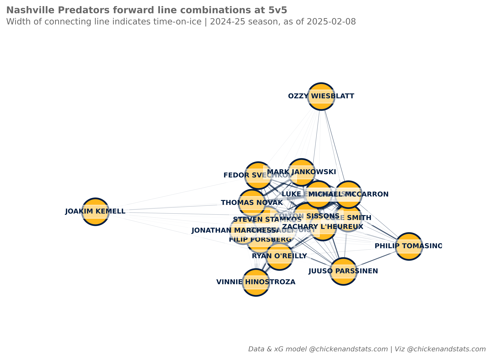

# **Network charts tutorial**

---

## **Intro**

Use the `chickenstats` library to scrape play-by-play data, aggregate statistics, 
and generate network graphs for forward line combinations

Parts of this tutorial are optional and will be clearly marked as such. For help, or any questions,
please don't hesitate to reach out to [chicken@chickenandstats.com](mailto:chicken@chickenandstats.com) or
[@chickenandstats.com](https://bsky.app/profile/chickenandstats.com) on Blue Sky.

---


---

## **Housekeeping**

### Import dependencies

Import the dependencies we'll need for the guide


```python
import datetime as dt
from pathlib import Path

import matplotlib.pyplot as plt
import networkx
import networkx as nx
import numpy as np
import pandas as pd
import seaborn as sns

import chickenstats.utilities  # This imports the chickenstats matplotlib style below
from chickenstats.chicken_nhl import Scraper, Season
from chickenstats.chicken_nhl.info import NHL_COLORS
from chickenstats.chicken_nhl.helpers import charts_directory
```

### Pandas options

Sets different pandas options. This cell is optional


```python
pd.set_option("display.max_columns", None)
pd.set_option("display.max_rows", 100)
```

### Folder structure


```python
charts_directory()
```

### Chickenstats matplotlib style

chickenstats.utilities includes a custom style package - this activates it. This cell is also optional


```python
plt.style.use("chickenstats")
```

---

## **Scrape data**

### Schedule, standings, and team names

Scrape the schedule and standings using the `Season` object. Then, create some name dictionaries for convenience later


```python
season = Season(2024)
```


```python
schedule = season.schedule(disable_progress_bar=True)  # Progress bar renders poorly in ipynb to md conversions
```


```python
standings = season.standings  # Standings as a dataframe for the team name dictionaries
```


```python
team_names = standings.sort_values(by="team_name").team_name.str.upper().tolist()
team_codes = standings.sort_values(by="team_name").team.str.upper().tolist()
team_names_dict = dict(zip(team_codes, team_names, strict=False))  # These are helpful for later
```

### Game IDs

Select the team and games to plot. The default are all of the most recent season's games 
for the Nashville Predators :). Feel free to change for your chosen team code 


```python
team = "NSH"
```


```python
conditions = np.logical_and(
    np.logical_or(schedule.home_team == team, schedule.away_team == team), schedule.game_state == "OFF"
)

game_ids = schedule.loc[conditions].game_id.tolist()
latest_date = schedule.loc[conditions].game_date.max()
```

### Play-by-play

Scrape the play-by-play data for the chosen game ID. First instantiate the `Scraper` object,
then call the play_by_play attribute


```python
scraper = Scraper(game_ids, disable_progress_bar=True)
```


```python
pbp = scraper.play_by_play.copy(deep=True)
```

### Stats

Aggregate individual statistics after scraping the play-by-play data


```python
scraper.prep_stats(level="season", teammates=True, disable_progress_bar=True)
```


```python
stats = scraper.stats.copy(deep=True)
```

---

## **Plotting network data**

### Helper functions

Create and draw the network graphs in a convenient plotting function


```python
def create_network_graph(data: pd.DataFrame, team: str, strengths: list, toi_min: float) -> nx.Graph:
    """Creates a network for a given team and strength state, with time-on-ice as the weight.

    Parameters:
        data (pd.DataFrame):
            Pandas dataframe of individual statistics, aggregated from play-by-play
            data scraped with chickenstats package
        team (str):
            Three-letter team code which determines the coloring used for the chart
        strengths (list):
            List of strength states to aggregate for data
    """
    conds = np.logical_and.reduce(
        [
            data.team == team,
            data.strength_state.isin(strengths),
            data.toi >= toi_min,
            data.position.isin(["C", "L", "R", "L/R", "L/C", "R/L", "R/C", "C/L", "C/R"]),
        ]
    )

    df = data.loc[conds].reset_index(drop=True)

    players = df.player.sort_values().unique().tolist()

    concat_list = [df.player.copy(deep=True)]

    for player in players:
        conds = [
            df.player == player,
            np.logical_and(
                df.player != player, np.logical_or(df.forwards.str.contains(player), df.defense.str.contains(player))
            ),
        ]

        values = [np.nan, df.toi]

        player_series = pd.Series(np.select(conds, values, 0), name=player)

        concat_list.append(player_series)

    df = pd.concat(concat_list, axis=1).groupby("player", as_index=False).sum()

    df = df.set_index("player", drop=True)

    df = (df - df.min().min()) / (df.max().max() - df.min().min()) * 75

    df = df.reset_index()

    df = df.melt(
        id_vars=["player"], value_vars=[x for x in df.columns if x != "player"], var_name="target", value_name="weight"
    ).rename(columns={"player": "source"})

    network_graph = nx.from_pandas_edgelist(df, edge_attr=True)

    return network_graph
```


```python
# Helper function to draw any graph
def draw_graph(g: nx.Graph, team: str, edge_options: dict, edge_labels: dict | None = None) -> plt.Figure:
    """Draws the graph G with the specified node and edge options.

    Parameters:
        g (networkx.Graph):
            The graph to be drawn.
        team (str):
            Team code for colors.
        edge_options (dict):
            Options for drawing edges.
        edge_labels (dict, optional):
            Labels for the edges. Defaults to None.
    """
    fig, ax = plt.subplots(dpi=650, figsize=(8, 5))

    # Global color properties
    node_options = {
        "node_color": NHL_COLORS[team]["GOAL"],
        "node_size": 1000,
        "edgecolors": NHL_COLORS[team]["SHOT"],
        "linewidths": 2,
    }

    # Define the layout of the graph
    pos = nx.spring_layout(g, iterations=10, seed=20000)

    # Draw the nodes with the specified options
    nx.draw_networkx_nodes(g, pos, **node_options)

    # Draw the node labels with specified font properties
    nx.draw_networkx_labels(
        g,
        pos,
        font_size=8,
        font_color=NHL_COLORS[team]["SHOT"],
        font_weight="bold",
        bbox={"alpha": 0.5, "color": "white"},
    )

    # Draw the edges with the specified options
    nx.draw_networkx_edges(g, pos, **edge_options)

    # Draw edge labels if they are provided
    if edge_labels:
        nx.draw_networkx_edge_labels(
            g,
            pos,
            edge_labels=edge_labels,
            connectionstyle="arc3, rad=0.3",
            font_size=12,
            font_color=NHL_COLORS[team]["MISS"],
            bbox={"alpha": 0.5, "color": "white"},
        )

    sns.despine(left=True, bottom=True)

    return fig
```


```python
def plot_network(stats: pd.DataFrame, team: str, strengths: list, toi_min: float, edge_labels=None):
    """This function plots and saves the actual matplotlib figures.

    Parameters:
        stats (pd.DataFrame):
            Pandas dataframe of individual statistics, aggregated from play-by-play
            data scraped with chickenstats package
        team (str):
            Three-letter team code which determines the coloring used for the chart
        strengths (list):
            List of strength states to plot and pass to the network graph function
        edge_labels (dict, optional):
            Labels for the edges
    """
    g = create_network_graph(data=stats, team=team, strengths=strengths, toi_min=toi_min)

    weights = nx.get_edge_attributes(g, "weight")

    edge_options = {
        "edge_color": NHL_COLORS[team]["SHOT"],
        #'width': 2.5,
        "alpha": 0.7,
        "width": [weights[edge] / 10 for edge in g.edges()],
    }

    fig = draw_graph(g=g, edge_options=edge_options, team=team, edge_labels=edge_labels)

    fig_suptitle = f"{team_names_dict[team].title()} forward line combinations at 5v5"
    fig.suptitle(fig_suptitle, x=0.01, y=1.08, fontsize=11, fontweight="bold", horizontalalignment="left")

    subtitle = f"Width of connecting line indicates time-on-ice | 2024-25 season, as of {latest_date}"
    fig.text(s=subtitle, x=0.01, y=1.02, fontsize=10, horizontalalignment="left")

    # Attribution
    attribution = "Data & xG model @chickenandstats.com | Viz @chickenandstats.com"
    fig.text(s=attribution, x=0.99, y=-0.05, fontsize=8, horizontalalignment="right", style="italic")

    # Save figure
    save_path = Path(f"./charts/{team.lower()}_network_graph.png")
    fig.savefig(save_path, transparent=False, bbox_inches="tight")
```

---

## **Plotting the data**

### NSH network chart

Plot the network chart with the cell below


```python
plot_network(stats=stats, team=team, strengths=["5v5"], toi_min=15.0)
```


    

    

