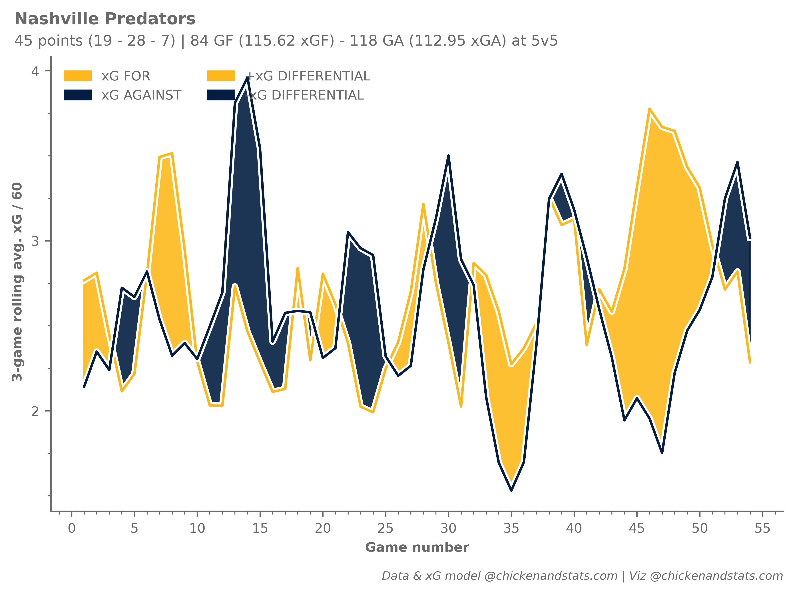
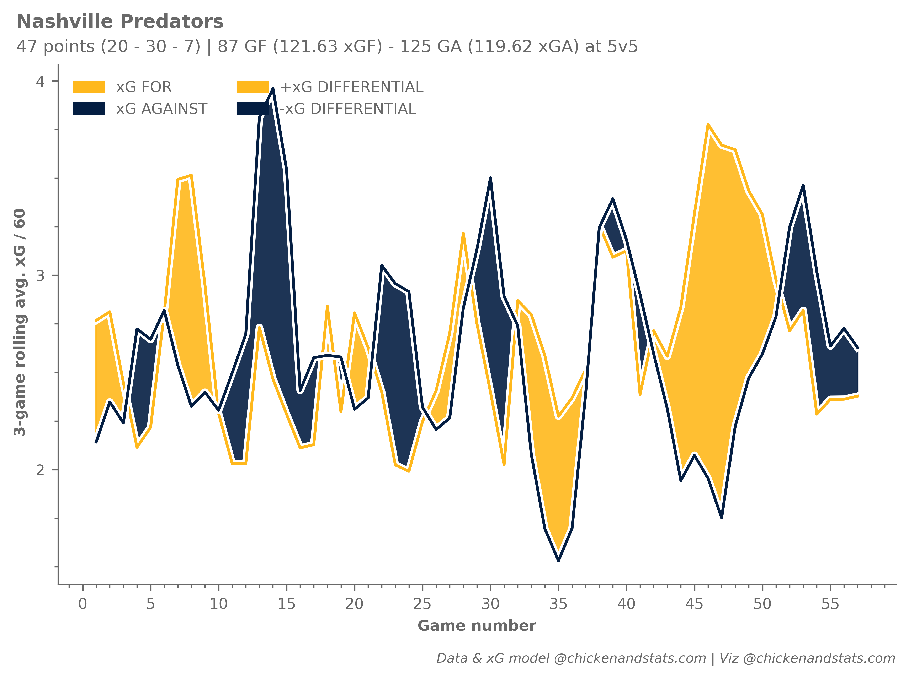

# **Rolling xG tutorial**

---

## **Intro**

Use the `chickenstats` library to scrape play-by-play data and plot rolling average xGF and xGA. 

Parts of this tutorial are optional and will be clearly marked as such. For help, or any questions,
please don't hesitate to reach out to [chicken@chickenandstats.com](mailto:chicken@chickenandstats.com) or
[@chickenandstats.com](https://bsky.app/profile/chickenandstats.com) on Blue Sky.

---


---

## **Housekeeping**

### Import dependencies

Import the dependencies we'll need for the guide


```python
import datetime as dt
from pathlib import Path

import matplotlib.patches as patches
import matplotlib.patheffects as mpe
import matplotlib.pyplot as plt
import matplotlib.ticker as mtick
import matplotlib.ticker as ticker
import numpy as np
import pandas as pd
import seaborn as sns

import chickenstats.utilities
from chickenstats.chicken_nhl import Scraper, Season
from chickenstats.chicken_nhl.info import NHL_COLORS
```

### Pandas options

Sets different pandas options. This cell is optional


```python
pd.set_option("display.max_columns", None)
pd.set_option("display.max_rows", 100)
```

### Chickenstats matplotlib style

chickenstats.utilities includes a custom style package - this activates it. This cell is also optional


```python
plt.style.use("chickenstats")
```

---

## **Scrape data**

### Schedule, standings, and team names

Scrape the schedule and standings using the Season object. Then, create a list of game IDs to scrape


```python
season = Season(2024)
```


```python
schedule = season.schedule(disable_progress_bar=True)
```


```python
standings = season.standings
```


```python
game_ids = schedule.loc[schedule.game_state == "OFF"].game_id.tolist()
```

### Play-by-play

Scrape the play-by-play data for the chosen game ID. First instantiate the `Scraper` object,
then call the play_by_play attribute


```python
scraper = Scraper(game_ids, disable_progress_bar=True)
```


```python
pbp = scraper.play_by_play
```

### Stats

Aggregate statistics 


```python
scraper.prep_stats(level="season", disable_progress_bar=True)
stats = scraper.stats.reset_index(drop=True)
```


```python
scraper.prep_lines(level="season", disable_progress_bar=True)
lines = scraper.lines.reset_index(drop=True)
```


```python
scraper.prep_team_stats(level="game", disable_progress_bar=True)
team_stats = scraper.team_stats.reset_index(drop=True)
```

### Helper function

Generates the rolling average figures for the specific team


```python
def get_xg_rolling_data(data: pd.DataFrame, season: str, session: str, team: str, strengths: list, window: int = 10):
    """This function returns rolling average xG figures for a specific team.

    Parameters:
        data (pd.DataFrame):
            Pandas dataframe of team stats aggregated from play-by-play data scraped with the chickenstats package
        season (str):
            8-digit season code (start year + end year) as a string
        session (str):
            "R" or "P," determines regular season or playoffs
        team (str):
            Three-digit team code to filter the data
        strengths (list):
            Strength states, e.g., 5v5, 5v4, to include in the grouping, as a list
        window (int):
            Number of games for the rolling average calculation, default is 10

    """
    df = data.copy()

    conds = [df.season == season, df.session == session, df.team == team]

    game_num = df[np.logical_and.reduce(conds)].game_id.unique()

    num_map = {x: idx + 1 for idx, x in enumerate(game_num)}

    conds = [df.season == season, df.session == session, df.team == team, df.strength_state.isin(strengths)]
    df = df[np.logical_and.reduce(conds)].copy()

    df["game_num"] = df.game_id.map(num_map)

    for_list = ["cf_p60", "ff_p60", "hdff_p60", "sf_p60", "hdsf_p60", "gf_p60", "hdgf_p60", "xgf_p60"]
    against_list = ["ca_p60", "fa_p60", "hdfa_p60", "sa_p60", "hdsa_p60", "ga_p60", "hdga_p60", "xga_p60"]

    stats_dict = dict(zip(for_list, against_list, strict=False))

    for f, a in stats_dict.items():
        df[f"rolling_{f}"] = df[f].rolling(window=window, min_periods=0).mean()

        df[f"rolling_{a}"] = df[a].rolling(window=window, min_periods=0).mean()

        df[f"rolling_{f}_diff"] = df[f"rolling_{f}"] - df[f"rolling_{a}"]

    return df
```

---

## **Plotting data**

### Whole NHL

Plot each individual NHL team as its own subplot


```python
# Filter conditions
year = "20242025"
strengths = ["5v5"]
session = "R"
```


```python
# Setting overall figures
fig, axes = plt.subplots(nrows=8, ncols=4, dpi=650, figsize=(12, 18))

fig.tight_layout(pad=1.5)

axes = axes.reshape(-1)

# Getting the teams and standings data to iterate through
teams = standings.team.unique().tolist()
team_names = dict(zip(standings.team, standings.team_name, strict=False))

# Iterating through the standings data
for idx, row in standings.iterrows():
    # Setting the team
    team = row.team

    # Setting the axis
    ax = axes[idx]

    # Setting uniform y limit

    ax.set_ylim(0.75, 7.0)
    ax.set_xlim(0, standings.games_played.max() + 2)

    # Getting df for plotting

    df = get_xg_rolling_data(team_stats, year, session, team, strengths, window=3)

    # Getting the Y data to plot

    Y_for = df.rolling_xgf_p60.copy().reset_index(drop=True)
    Y_ag = df.rolling_xga_p60.copy().reset_index(drop=True)

    # Getting the X data to plot

    X = pd.Series(range(1, max(df.game_num) + 1))

    # Setting colors

    colors = NHL_COLORS[team]

    for_c = colors["GOAL"]

    ag_c = colors["SHOT"]

    # Setting path effects for xGF line

    pe_ec = ag_c if for_c == "#FFFFFF" else "white"

    pe_for = [
        mpe.Stroke(linewidth=3.25, foreground=for_c),
        mpe.Stroke(foreground=pe_ec, alpha=1, linewidth=4),
        mpe.Normal(),
    ]

    # Plotting xGF

    sns.lineplot(x=X, y=Y_for, color=for_c, ax=ax, zorder=3, path_effects=pe_for)

    # Setting path effects for xGA line

    pe_ec = for_c if ag_c == "#FFFFFF" else "white"

    pe_ag = [
        mpe.Stroke(linewidth=3.25, foreground=ag_c),
        mpe.Stroke(foreground=pe_ec, alpha=1, linewidth=4),
        mpe.Normal(),
    ]

    # Plotting xGA line

    sns.lineplot(x=X, y=Y_ag, color=ag_c, ax=ax, zorder=3, path_effects=pe_ag)

    # Changing colors if for color is white

    if for_c == "#FFFFFF":
        # Filling between lines

        ax.fill_between(
            X,
            Y_ag,
            Y_for,
            where=Y_for > Y_ag,
            interpolate=True,
            alpha=0.9,
            zorder=2,
            facecolor=for_c,
            edgecolor=ag_c,
            hatch="/////",
            lw=1,
        )

        # Setting path effect for legend

        pe_for = [
            mpe.Stroke(linewidth=3.25, foreground=for_c),
            mpe.Stroke(foreground=ag_c, alpha=1, linewidth=4),
            mpe.Normal(),
        ]

        # Setting the legend figures

        xgf_fill = patches.Patch(facecolor=for_c, edgecolor=ag_c, hatch="/////", label="+xG DIFFERENTIAL")

        xgf_l = patches.Patch(facecolor=for_c, label="xG FOR", edgecolor=ag_c)

    else:
        # Fill between the lines

        ax.fill_between(X, Y_ag, Y_for, where=Y_for > Y_ag, interpolate=True, alpha=0.9, zorder=2, color=for_c)

        # Setting the legend figures

        xgf_fill = patches.Patch(facecolor=for_c, edgecolor=for_c, label="+xG DIFFERENTIAL")

        xgf_l = patches.Patch(facecolor=for_c, label="xG FOR", edgecolor=for_c)

    if ag_c == "#FFFFFF":
        # Fill between the lines

        ax.fill_between(
            X,
            Y_ag,
            Y_for,
            where=Y_ag >= Y_for,
            interpolate=True,
            alpha=0.9,
            zorder=2,
            edgecolor=for_c,
            facecolor=ag_c,
            hatch="////",
            lw=1,
        )

        # Setting the legend figures

        xga_fill = patches.Patch(facecolor=ag_c, edgecolor=for_c, hatch="/////", label="-xG DIFFERENTIAL")

        xga_l = patches.Patch(facecolor=ag_c, label="xG AGAINST", edgecolor=for_c)

    else:
        # Fill between the lines

        ax.fill_between(X, Y_ag, Y_for, where=Y_ag >= Y_for, interpolate=True, alpha=0.9, zorder=2, color=ag_c)

        # Setting the legend figures

        xga_fill = patches.Patch(facecolor=ag_c, edgecolor=ag_c, label="-xG DIFFERENTIAL")

        xga_l = patches.Patch(facecolor=ag_c, label="xG AGAINST", edgecolor=ag_c)

    # Setting y-axis major locator

    ax.yaxis.set_major_locator(mtick.MultipleLocator(1))

    # Summary stats

    stats = df

    gf = stats.gf.sum()

    xgf = stats.xgf.sum()

    ga = stats.ga.sum()

    xga = stats.xga.sum()

    # Subtitle text

    textstr = f"{gf} GF - {ga} GA | {round(xgf, 2)} xGF - {round(xga, 2)} xGA"

    props = dict(boxstyle="round", facecolor="white", alpha=0.9, lw=0.8, ec="white")

    ax.text(0.5, 0.99, textstr, transform=ax.transAxes, fontsize=7, ha="center", va="center", bbox=props)

    # Legend elements

    legend_elements = [xgf_l, xga_l, xgf_fill, xga_fill]

    ax.legend(
        handles=legend_elements, loc="upper center", bbox_to_anchor=(0.5, 0.96), fontsize=5, ncol=2, borderpad=0.55
    )

    # Setting x and y axes labels
    x_labels = [28, 29, 30, 31]

    if idx in x_labels:
        ax.axes.set_xlabel("Game number", fontsize=8)
    else:
        ax.axes.set_xlabel("")

    y_labels = [0, 4, 8, 12, 16, 20, 24, 28]

    if idx in y_labels:
        ax.axes.set_ylabel(" 3-game rolling avg. xG / 60", fontsize=8)
    else:
        ax.axes.set_ylabel("")

    # Setting tick params font size
    ax.tick_params(axis="both", which="major", labelsize=8)

    # Setting the ax title
    ax_title = f"{row.team_name} | {row.points} points | {row.wins} - {row.losses} - {row.ot_losses}"
    ax.set_title(ax_title, fontsize=8, x=-0.085, y=1.03, horizontalalignment="left")

# Figure suptitle and subtitle
fig_suptitle = "3-game rolling average 5v5 chances created vs. allowed (per 60 minutes)"
fig.suptitle(fig_suptitle, x=0.01, y=1.029, fontsize=11, fontweight="bold", horizontalalignment="left")

todays_date = dt.datetime.now().strftime("%Y-%m-%d")
subtitle = f"5v5 team xGF / 60 and xGA / 60 | 2024-25 season, as of {todays_date}"
fig.text(s=subtitle, x=0.01, y=1.0115, fontsize=10, horizontalalignment="left")

# Attribution
attribution = "Data & xG model @chickenandstats.com | Viz @chickenandstats.com"
fig.text(s=attribution, x=0.99, y=-0.01, fontsize=8, horizontalalignment="right", style="italic")

save_path = Path("./charts/nhl_rolling_xg.png")
fig.savefig(save_path, transparent=False, bbox_inches="tight")
```


    

    


### Individual team

Plot light and dark mode for an individual team


```python
# Filter conditions
team = "NSH"
year = "20242025"
strengths = ["5v5"]
session = "R"
```

#### Light mode


```python
# Getting the teams and standings data to iterate through
teams = standings.team.unique().tolist()
team_names = dict(zip(standings.team, standings.team_name, strict=False))

with plt.style.context("chickenstats"):
    fig, ax = plt.subplots(dpi=650, figsize=(8, 5))

    # Getting df for plotting

    df = get_xg_rolling_data(team_stats, year, session, team, strengths, window=3)

    # Getting the Y data to plot

    Y_for = df.rolling_xgf_p60.copy().reset_index(drop=True)
    Y_ag = df.rolling_xga_p60.copy().reset_index(drop=True)

    # Getting the X data to plot

    X = pd.Series(range(1, max(df.game_num) + 1))

    # Setting colors

    colors = NHL_COLORS[team]

    for_c = colors["GOAL"]

    ag_c = colors["SHOT"]

    # Setting path effects for xGF line

    pe_ec = ag_c if for_c == "#FFFFFF" else "white"

    pe_for = [
        mpe.Stroke(linewidth=3.25, foreground=for_c),
        mpe.Stroke(foreground=pe_ec, alpha=1, linewidth=4),
        mpe.Normal(),
    ]

    # Plotting xGF

    sns.lineplot(x=X, y=Y_for, color=for_c, ax=ax, zorder=3, path_effects=pe_for)

    # Setting path effects for xGA line

    pe_ec = for_c if ag_c == "#FFFFFF" else "white"

    pe_ag = [
        mpe.Stroke(linewidth=3.25, foreground=ag_c),
        mpe.Stroke(foreground=pe_ec, alpha=1, linewidth=4),
        mpe.Normal(),
    ]

    # Plotting xGA line

    sns.lineplot(x=X, y=Y_ag, color=ag_c, ax=ax, zorder=3, path_effects=pe_ag)

    # Changing colors if for color is white

    if for_c == "#FFFFFF":
        # Filling between lines

        ax.fill_between(
            X,
            Y_ag,
            Y_for,
            where=Y_for > Y_ag,
            interpolate=True,
            alpha=0.9,
            zorder=2,
            facecolor=for_c,
            edgecolor=ag_c,
            hatch="/////",
            lw=1,
        )

        # Setting path effect for legend

        pe_for = [
            mpe.Stroke(linewidth=3.25, foreground=for_c),
            mpe.Stroke(foreground=ag_c, alpha=1, linewidth=4),
            mpe.Normal(),
        ]

        # Setting the legend figures

        xgf_fill = patches.Patch(facecolor=for_c, edgecolor=ag_c, hatch="/////", label="+xG DIFFERENTIAL")

        xgf_l = patches.Patch(facecolor=for_c, label="xG FOR", edgecolor=for_c)

    else:
        # Fill between the lines

        ax.fill_between(X, Y_ag, Y_for, where=Y_for > Y_ag, interpolate=True, alpha=0.9, zorder=2, color=for_c)

        # Setting the legend figures

        xgf_fill = patches.Patch(facecolor=for_c, edgecolor=for_c, label="+xG DIFFERENTIAL")

        xgf_l = patches.Patch(facecolor=for_c, label="xG FOR", edgecolor=for_c)

    if ag_c == "#FFFFFF":
        # Fill between the lines

        ax.fill_between(
            X,
            Y_ag,
            Y_for,
            where=Y_ag >= Y_for,
            interpolate=True,
            alpha=0.9,
            zorder=2,
            edgecolor=for_c,
            facecolor=ag_c,
            hatch="////",
            lw=1,
        )

        # Setting the legend figures

        xga_fill = patches.Patch(facecolor=ag_c, edgecolor=for_c, hatch="/////", label="-xG DIFFERENTIAL")

        xga_l = patches.Patch(facecolor=ag_c, label="xG AGAINST", edgecolor=ag_c)

    else:
        # Fill between the lines

        ax.fill_between(X, Y_ag, Y_for, where=Y_ag >= Y_for, interpolate=True, alpha=0.9, zorder=2, color=ag_c)

        # Setting the legend figures

        xga_fill = patches.Patch(facecolor=ag_c, edgecolor=ag_c, label="-xG DIFFERENTIAL")

        xga_l = patches.Patch(facecolor=ag_c, label="xG AGAINST", edgecolor=ag_c)

    # Setting y-axis major locator

    ax.yaxis.set_major_locator(mtick.MultipleLocator(1))

    # Summary stats

    stats = df

    gf = stats.gf.sum()

    xgf = stats.xgf.sum()

    ga = stats.ga.sum()

    xga = stats.xga.sum()

    # Legend elements

    legend_elements = [xgf_l, xga_l, xgf_fill, xga_fill]

    ax.legend(
        handles=legend_elements, loc="upper left", fontsize=8, ncol=2, borderpad=0.55, framealpha=0, edgecolor="white"
    )

    ax.axes.set_xlabel("Game number", fontsize=8)
    ax.axes.set_ylabel(" 3-game rolling avg. xG / 60", fontsize=8)

    ax.xaxis.set_major_locator(ticker.MultipleLocator(5))
    ax.xaxis.set_minor_locator(ticker.MultipleLocator(1))

    ax.yaxis.set_major_locator(ticker.MultipleLocator(1))
    ax.yaxis.set_minor_locator(ticker.MultipleLocator(0.25))

    # Setting tick params font size
    ax.tick_params(axis="both", which="major", labelsize=8)

    standings_team = standings.loc[standings.team == team].iloc[0]

    ax_title = f"{standings_team.team_name}"

    # Setting the ax title
    ax_title = f"{ax_title}"
    ax.set_title(ax_title, fontsize=10, x=-0.05, y=1.05, horizontalalignment="left")

    subtitle_standings = (
        f"{standings_team.points} points ({standings_team.wins} - {standings_team.losses} - {standings_team.ot_losses})"
    )
    subtitle_goals = f"{gf} GF ({round(xgf, 2)} xGF) - {ga} GA ({round(xga, 2)} xGA)"
    ax_subtitle = f"{subtitle_standings} | {subtitle_goals} at 5v5"

    ax.text(s=ax_subtitle, fontsize=9, x=-0.05, y=1.025, horizontalalignment="left", transform=ax.transAxes)

    attribution = "Data & xG model @chickenandstats.com | Viz @chickenandstats.com"
    ax.text(
        s=attribution, fontsize=7, x=1, y=-0.15, horizontalalignment="right", transform=ax.transAxes, fontstyle="italic"
    )

    save_path = Path(f"./charts/{team.lower()}_rolling_xg.png")
    fig.savefig(save_path, transparent=False, bbox_inches="tight")
```


    

    


#### Dark mode


```python
team = "NSH"
year = "20242025"
strengths = ["5v5"]
session = "R"

# Getting the teams and standings data to iterate through
teams = standings.team.unique().tolist()
team_names = dict(zip(standings.team, standings.team_name, strict=False))

with plt.style.context("chickenstats_dark"):
    fig, ax = plt.subplots(dpi=650, figsize=(8, 5))

    # Getting df for plotting

    df = get_xg_rolling_data(team_stats, year, session, team, strengths, window=3)

    # Getting the Y data to plot

    Y_for = df.rolling_xgf_p60.copy().reset_index(drop=True)
    Y_ag = df.rolling_xga_p60.copy().reset_index(drop=True)

    # Getting the X data to plot

    X = pd.Series(range(1, max(df.game_num) + 1))

    # Setting colors

    colors = NHL_COLORS[team]

    for_c = colors["GOAL"]

    ag_c = colors["SHOT"]

    # Setting path effects for xGF line

    pe_ec = ag_c if for_c == "#FFFFFF" else "white"

    pe_for = [
        mpe.Stroke(linewidth=3.25, foreground=for_c),
        mpe.Stroke(foreground=pe_ec, alpha=1, linewidth=4),
        mpe.Normal(),
    ]

    # Plotting xGF

    sns.lineplot(x=X, y=Y_for, color=for_c, ax=ax, zorder=3, path_effects=pe_for)

    # Setting path effects for xGA line

    pe_ec = for_c if ag_c == "#FFFFFF" else "white"

    pe_ag = [
        mpe.Stroke(linewidth=3.25, foreground=ag_c),
        mpe.Stroke(foreground=pe_ec, alpha=1, linewidth=4),
        mpe.Normal(),
    ]

    # Plotting xGA line

    sns.lineplot(x=X, y=Y_ag, color=ag_c, ax=ax, zorder=3, path_effects=pe_ag)

    # Changing colors if for color is white

    if for_c == "#FFFFFF":
        # Filling between lines

        ax.fill_between(
            X,
            Y_ag,
            Y_for,
            where=Y_for > Y_ag,
            interpolate=True,
            alpha=0.9,
            zorder=2,
            facecolor=for_c,
            edgecolor=ag_c,
            hatch="/////",
            lw=1,
        )

        # Setting path effect for legend

        pe_for = [
            mpe.Stroke(linewidth=3.25, foreground=for_c),
            mpe.Stroke(foreground=ag_c, alpha=1, linewidth=4),
            mpe.Normal(),
        ]

        # Setting the legend figures

        xgf_fill = patches.Patch(facecolor=for_c, edgecolor="white", hatch="/////", label="+xG DIFFERENTIAL")

        xgf_l = patches.Patch(facecolor=for_c, label="xG FOR", edgecolor="white")

    else:
        # Fill between the lines

        ax.fill_between(X, Y_ag, Y_for, where=Y_for > Y_ag, interpolate=True, alpha=0.9, zorder=2, color=for_c)

        # Setting the legend figures

        xgf_fill = patches.Patch(facecolor=for_c, edgecolor="white", label="+xG DIFFERENTIAL")

        xgf_l = patches.Patch(facecolor=for_c, label="xG FOR", edgecolor="white")

    if ag_c == "#FFFFFF":
        # Fill between the lines

        ax.fill_between(
            X,
            Y_ag,
            Y_for,
            where=Y_ag >= Y_for,
            interpolate=True,
            alpha=0.9,
            zorder=2,
            edgecolor=for_c,
            facecolor=ag_c,
            hatch="////",
            lw=1,
        )

        # Setting the legend figures

        xga_fill = patches.Patch(facecolor=ag_c, edgecolor="white", hatch="/////", label="-xG DIFFERENTIAL")

        xga_l = patches.Patch(facecolor=ag_c, label="xG AGAINST", edgecolor="white")

    else:
        # Fill between the lines

        ax.fill_between(X, Y_ag, Y_for, where=Y_ag >= Y_for, interpolate=True, alpha=0.9, zorder=2, color=ag_c)

        # Setting the legend figures

        xga_fill = patches.Patch(facecolor=ag_c, edgecolor="white", label="-xG DIFFERENTIAL")

        xga_l = patches.Patch(facecolor=ag_c, label="xG AGAINST", edgecolor="white")

    # Setting y-axis major locator

    ax.yaxis.set_major_locator(mtick.MultipleLocator(1))

    # Summary stats

    stats = df

    gf = stats.gf.sum()

    xgf = stats.xgf.sum()

    ga = stats.ga.sum()

    xga = stats.xga.sum()

    # Legend elements

    legend_elements = [xgf_l, xga_l, xgf_fill, xga_fill]

    ax.legend(
        handles=legend_elements, loc="upper left", fontsize=8, ncol=2, borderpad=0.55, framealpha=0, edgecolor="white"
    )

    ax.axes.set_xlabel("Game number", fontsize=8)
    ax.axes.set_ylabel(" 3-game rolling avg. xG / 60", fontsize=8)

    ax.xaxis.set_major_locator(ticker.MultipleLocator(5))
    ax.xaxis.set_minor_locator(ticker.MultipleLocator(1))

    ax.yaxis.set_major_locator(ticker.MultipleLocator(1))
    ax.yaxis.set_minor_locator(ticker.MultipleLocator(0.25))

    # Setting tick params font size
    ax.tick_params(axis="both", which="major", labelsize=8)

    standings_team = standings.loc[standings.team == team].iloc[0]

    ax_title = f"{standings_team.team_name}"

    # Setting the ax title
    ax_title = f"{ax_title}"
    ax.set_title(ax_title, fontsize=10, x=-0.05, y=1.05, horizontalalignment="left")

    subtitle_standings = (
        f"{standings_team.points} points ({standings_team.wins} - {standings_team.losses} - {standings_team.ot_losses})"
    )
    subtitle_goals = f"{gf} GF ({round(xgf, 2)} xGF) - {ga} GA ({round(xga, 2)} xGA)"
    ax_subtitle = f"{subtitle_standings} | {subtitle_goals} at 5v5"

    ax.text(s=ax_subtitle, fontsize=9, x=-0.05, y=1.025, horizontalalignment="left", transform=ax.transAxes)

    attribution = "Data & xG model @chickenandstats.com | Viz @chickenandstats.com"
    ax.text(
        s=attribution, fontsize=7, x=1, y=-0.15, horizontalalignment="right", transform=ax.transAxes, fontstyle="italic"
    )

    save_path = Path(f"./charts/{team.lower()}_rolling_xg_dark.png")
    fig.savefig(save_path, transparent=False, bbox_inches="tight")
```


    

    

