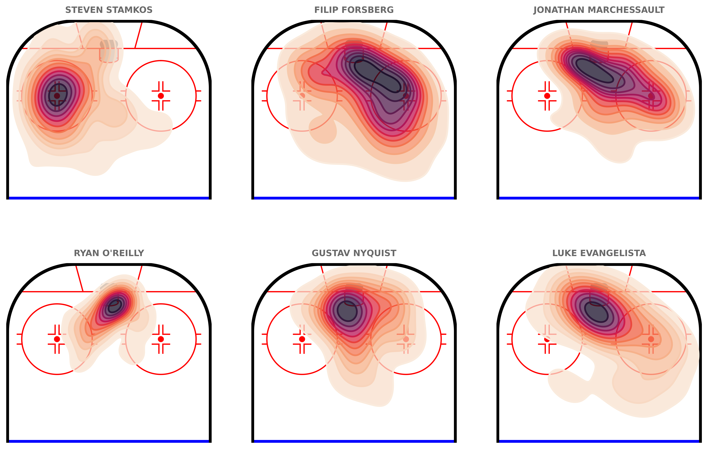

# **Tutorial for plotting data using the hockey-rink library**

---

## **Intro**

Use the `chickenstats` library to scrape play-by-play data and plot shot events using the hockey-rink library.

Parts of this tutorial are optional and will be clearly marked as such. For help, or any questions,
please don't hesitate to reach out to [chicken@chickenandstats.com](mailto:chicken@chickenandstats.com) or
[@chickenandstats.com](https://bsky.app/profile/chickenandstats.com) on Blue Sky.

---


---

## **Housekeeping**

### Import dependencies

Import the dependencies we'll need for the guide


```python
from pathlib import Path

import matplotlib.pyplot as plt
import numpy as np
import pandas as pd
import seaborn as sns
from hockey_rink import NHLRink

import chickenstats.utilities
from chickenstats.chicken_nhl import Scraper, Season
from chickenstats.chicken_nhl.helpers import norm_coords
from chickenstats.chicken_nhl.info import NHL_COLORS
from chickenstats.chicken_nhl.helpers import charts_directory
```

### Pandas options

Sets different pandas options. This cell is optional


```python
pd.set_option("display.max_columns", None)
pd.set_option("display.max_rows", 100)
```

### Folder structure


```python
charts_directory()
```

### Chickenstats matplotlib style

chickenstats.utilities includes a custom style package - this activates it. This cell is also optional


```python
plt.style.use("chickenstats")
```

---

## **Scrape data**

### Schedule and game IDs

Scrape the schedule and standings using the `Season` object. Then, create a list of game IDs to scrape


```python
season = Season(2024)
```


```python
schedule = season.schedule(disable_progress_bar=True)
```


```python
standings = season.standings.copy(deep=True)
```


```python
game_ids = schedule.loc[schedule.game_state == "OFF"].game_id.tolist()
```

### Play-by-play

Scrape the play-by-play data for the list of game IDs. First instantiate the `Scraper` object,
then call the play_by_play attribute


```python
scraper = Scraper(game_ids, disable_progress_bar=True)
```


```python
pbp = scraper.play_by_play
```

    Python(34841,0x2072dc800) malloc: Failed to allocate segment from range group - out of space


### Stats

Aggregate data using the `Scraper` object's built-in methods


```python
scraper.prep_stats(level="season", disable_progress_bar=True)
stats = scraper.stats.reset_index(drop=True)
```


```python
scraper.prep_lines(level="season", disable_progress_bar=True)
lines = scraper.lines.reset_index(drop=True)
```


```python
scraper.prep_team_stats(level="season", disable_progress_bar=True)
team_stats = scraper.team_stats.reset_index(drop=True)
```

---

## **Scatter plots**

### Drawing the rink 

Drawing the rink with the NHLRink class from the hockey-rink library


```python
rink = NHLRink(rotation=90)
```

### Filter conditions

Set the team, strength state, minimum TOI, and maximum number of lines to plot,
then filter the data


```python
team = "NSH"
strength_state = "5v5"
toi_min = 12
max_lines = 3

conds = np.logical_and.reduce([lines.team == team, lines.strength_state == strength_state, lines.toi >= toi_min])

plot_lines = lines.loc[conds].sort_values(by="toi", ascending=False).head(max_lines).reset_index(drop=True)
```

### Top-N forward line combos

Plot the top-N forward line combinations at the chosen strength state, from the prior cell


```python
# Setting overall figures
fig, axes = plt.subplots(nrows=2, ncols=max_lines, dpi=650, figsize=(16, 8))

fig.tight_layout(pad=1.5)

axes = axes.reshape(-1)

for row, line in plot_lines.iterrows():
    ax = axes[row]

    ax_zone = "dzone" if row > 5 else "ozone"

    rink.draw(ax=ax, display_range=ax_zone)

    shot_events = ["MISS", "SHOT", "GOAL"]

    plot_conds = np.logical_and.reduce(
        [
            pbp.forwards == line.forwards,
            pbp.forwards_api_id == line.forwards_api_id,
            pbp.strength_state == strength_state,
            pbp.event.isin(shot_events),
        ]
    )

    plot_data = pbp.loc[plot_conds].reset_index(drop=True)

    plot_data = norm_coords(data=plot_data, norm_column="event_team", norm_value=line.team)

    size_multiplier = 500

    plot_data["pred_goal_size"] = plot_data.pred_goal * size_multiplier

    for shot_event in shot_events:
        conds = np.logical_and(plot_data.forwards_api_id == line.forwards_api_id, plot_data.event == shot_event)

        plot_data2 = plot_data.loc[conds]

        if plot_data2.empty:
            continue

        colors = NHL_COLORS[plot_data2.iloc[0].event_team]

        facecolor = colors[shot_event]

        if shot_event == "MISS" or shot_event == "SHOT":
            edgecolor = "#FFFFFF"

        elif shot_event == "GOAL":
            edgecolor = colors["SHOT"] if facecolor == "#FFFFFF" else "#FFFFFF"

        rink.plot_fn(
            sns.scatterplot,
            data=plot_data2,
            x="norm_coords_x",
            y="norm_coords_y",
            color=facecolor,
            edgecolor=edgecolor,
            lw=0.75,
            s=plot_data2.pred_goal_size,
            # sizes=(0, size_multiplier),
            size_norm=(0, size_multiplier),
            zorder=100,
            alpha=0.75,
            ax=ax,
        )

    ax.set_title(f"{line.forwards}", x=0.5, y=1.01, ha="center", fontweight="bold", fontsize=10)


for row, line in plot_lines.iterrows():
    row = row + max_lines

    ax = axes[row]

    ax_zone = "dzone" if row > max_lines - 1 else "ozone"

    rink.draw(ax=ax, display_range=ax_zone)

    shot_events = ["MISS", "SHOT", "GOAL"]

    plot_conds = np.logical_and.reduce(
        [
            pbp.opp_forwards == line.forwards,
            pbp.opp_forwards_api_id == line.forwards_api_id,
            pbp.strength_state == strength_state,
            pbp.event.isin(shot_events),
        ]
    )

    plot_data = pbp.loc[plot_conds].reset_index(drop=True)

    plot_data = norm_coords(data=plot_data, norm_column="event_team", norm_value=line.team)

    size_multiplier = 500

    plot_data["pred_goal_size"] = plot_data.pred_goal * size_multiplier

    for shot_event in shot_events:
        conds = np.logical_and(plot_data.opp_forwards_api_id == line.forwards_api_id, plot_data.event == shot_event)

        plot_data2 = plot_data.loc[conds]

        if plot_data2.empty:
            continue

        colors = NHL_COLORS[plot_data2.iloc[0].opp_team]

        facecolor = colors[shot_event]

        if shot_event == "MISS" or shot_event == "SHOT":
            edgecolor = "#FFFFFF"

        elif shot_event == "GOAL":
            edgecolor = colors["SHOT"] if facecolor == "#FFFFFF" else "#FFFFFF"

        rink.plot_fn(
            sns.scatterplot,
            data=plot_data2,
            x="norm_coords_x",
            y="norm_coords_y",
            color=facecolor,
            edgecolor=edgecolor,
            lw=0.75,
            s=plot_data2.pred_goal_size,
            # sizes=(0, size_multiplier),
            size_norm=(0, size_multiplier),
            zorder=100,
            alpha=0.75,
            ax=ax,
        )


fig_title = "Nashville forward lines aren't converting 5v5 scoring chances"

fig.suptitle(fig_title, x=0.5, y=1.1, fontweight="bold", fontsize=14)

subtitle = f"NSH top-{max_lines} forward line combinations by 5v5 TOI | 5v5 unblocked shot attempts for & against, sized for xG"
fig.text(s=subtitle, x=0.5, y=1.05, fontsize=12, ha="center")

attribution = "Data & xG model @chickenandstats | Viz @chickenandstats"
fig.text(s=attribution, x=0.95, y=-0.02, fontsize=12, ha="right", style="italic")

savepath = Path(f"./charts/{team.lower()}_forwards_rink_maps.png")
fig.savefig(savepath, transparent=False, bbox_inches="tight")
```


    

    


---

## **Contour plots**

### Drawing the rink 

Drawing the rink with the NHLRink class from the hockey-rink library


```python
rink = NHLRink(rotation=90)
```

### Filter conditions

Set the team, strength state, minimum TOI, and maximum number of players to plot,
then filter the data


```python
team = "NSH"
strength_states = ["5v4", "5v3", "4v3"]
positions = ["L", "C", "R", "L/R", "C/R", "R/L", "R/C"]
toi_min = 5
max_players = 6
group_columns = ["player", "api_id", "team"]  # "strength_state"]


conds = np.logical_and.reduce(
    [
        stats.team == team,
        stats.strength_state.isin(strength_states),
        stats.position.isin(positions),
        stats.toi >= toi_min,
    ]
)

plot_stats = (
    stats.loc[conds]
    .groupby(group_columns, as_index=False)
    .agg({"ixg": "sum", "g": "sum", "toi": "sum"})
    .sort_values(by="toi", ascending=False)
    .head(max_players)
    .reset_index(drop=True)
)
```

### Top-N forward shooters

Plot the top-N forwards' xG using the hockey-rink library and seaborn's kdeplot


```python
cmap = "rocket_r"
weights = "pred_goal"

fig, axes = plt.subplots(nrows=2, ncols=int(max_players / 2), dpi=650, figsize=(12, 8))

fig.tight_layout(pad=1.5)

axes = axes.reshape(-1)

for row, player in plot_stats.iterrows():
    ax = axes[row]

    rink.draw(ax=ax, display_range="ozone")

    shot_events = ["MISS", "SHOT", "GOAL"]

    plot_conds = np.logical_and.reduce(
        [
            pbp.player_1 == player.player,
            pbp.player_1_api_id == player.api_id,
            pbp.strength_state.isin(strength_states),
            pbp.event.isin(shot_events),
        ]
    )

    plot_data = pbp.loc[plot_conds].reset_index(drop=True)

    plot_data = norm_coords(data=plot_data, norm_column="player_1_api_id", norm_value=player.api_id)

    rink.plot_fn(
        sns.kdeplot,
        data=plot_data,
        x="norm_coords_x",
        y="norm_coords_y",
        cmap=cmap,
        fill=True,
        levels=12,
        weights=plot_data[weights],
        zorder=100,
        alpha=0.75,
        ax=ax,
        legend=True,
    )

    rink.plot_fn(
        sns.kdeplot,
        data=plot_data,
        x="norm_coords_x",
        y="norm_coords_y",
        cmap=cmap,
        fill=False,
        levels=12,
        linewidths=2,
        weights=plot_data[weights],
        zorder=110,
        alpha=1,
        ax=ax,
    )

    ax.set_title(f"{player.player}", x=0.5, y=1.01, ha="center", fontweight="bold", fontsize=10)


save_path = Path(f"./charts/{team}_top_{max_players}_pp.png")

fig.savefig(save_path, transparent=False, bbox_inches="tight")
```


    

    

