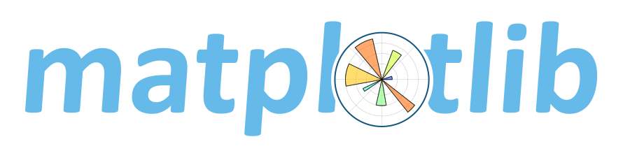
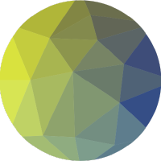

---
hide:
  - navigation

icon: material/notebook

---

# :material-notebook: **Introduction**

Welcome to the technical documentation & reference materials for **[chickenstats](https://github.com/chickenandstats/chickenstats)**,
an open-source Python package for scraping & analyzing sports data.


With just a few lines of code:

* **Scrape & manipulate** data from various NHL endpoints, leveraging
[:material-hockey-sticks: chicken_nhl](reference/chicken_nhl/scrape.md), which includes
a **proprietary xG model** for shot quality metrics
* **Augment play-by-play data** & **generate custom aggregations** from raw csv files downloaded from
[Evolving-Hockey](https://evolving-hockey.com) *(subscription required)* with
[:material-hockey-puck: evolving_hockey](reference/evolving_hockey/stats.md)

Here you can find detailed guides & explanations for most features. The package is under active development - download
the latest version (1.8.0) for the most up-to-date features & be sure to consult the correct documentation
:fontawesome-solid-face-smile-beam:.

## :material-download: **Installation**

`chickenstats` can be installed via PyPi:

```py
pip install chickenstats
```

You can ensure the installation was successful by checking that you have the latest version (1.8.0):

```py
pip show chickenstats
```

??? info "Help" 
    If you need help with any aspect of `chickenstats`, from installation to usage, please don't hesitate to reach out.
    You can find me on :simple-twitter: Twitter at **[@chickenandstats](https://twitter.com/chickenandstats)**
    or :material-email: email me at **[chicken@chickenandstats.com](mailto:chicken@chickenandstats.com)**.

    For more information on known issues or the longer-term development roadmap, see
    [:fontawesome-solid-user-group: Contribute](contribute/contribute.md)

## :material-navigation: **Navigation**

??? tip 
    Navigate the site using the header, side-bar, or search tool.
    Mobile users can tap **:material-menu:** (upper-left) to bring up the menu, then
    **:material-table-of-contents:** to see a linked table of contents for the current page,
    or **:material-arrow-left:** to navigate the menu back towards the home page. 

<div class="grid cards" markdown>

-   :material-download-box:{ .lg .middle } __Usage & installation__

    ---

    Download & install `chickenstats` with `pip` to get up
    & running in just a few minutes.

    [:octicons-arrow-right-24: Getting Started](guide/usage/getting_started.md)

-   :material-school:{ .lg .middle } __Tutorials & examples__

    ---

    Discover the package using hands-on tutorials
    & examples from the User Guide.

    [:octicons-arrow-right-24: User Guide](guide/guide.md)

-   :material-bookshelf:{ .lg .middle } __Reference materials__

    ---

    Consult the Reference section for in-depth explanations 
    & debugging assistance.

    [:octicons-arrow-right-24: Reference](reference/reference.md)

-   :material-google-analytics:{ .lg .middle } __xG model__

    ---

    Learn about the open-source expected goals (xG) model included with `chickenstats`.

    [:octicons-arrow-right-24: xG model](xg_model/xg_model.md)

-   :material-typewriter:{ .lg .middle } __Blog__

    ---

    Read the latest analyses leveraging the library, as well as about the newest features & releases

    [:octicons-arrow-right-24: Blog](blog/index.md)

-   :fontawesome-solid-user-group:{ .lg .middle } __Contribute__

    ---

    Read about known issues, future development roadmap, and/or how to contribute. 

    [:octicons-arrow-right-24: Contribute](contribute/contribute.md)

</div>

## :material-help: **Help**

If you need help with any aspect of `chickenstats`, from installation to usage, please don't hesitate to reach out!
You can find me on :simple-twitter: Twitter at **[@chickenandstats](https://twitter.com/chickenandstats)** or :material-email: 
email me at **[chicken@chickenandstats.com](mailto:chicken@chickenandstats.com)**.

Please report any bugs or issues via the `chickenstats` **[issues](https://github.com/chickenandstats/chickenstats/issues)** page, where you can also post feature requests.
Before doing so, please check the [roadmap](./contribute/roadmap.md), there might already be plans to include your request.

## :material-heart: **Acknowledgements**

`chickenstats` wouldn't be possible without the support & efforts of countless others. I am obviously
extremely grateful, even if there are too many of you to thank individually. However, this chicken will do his best.

First & foremost is my wife - the lovely Mrs. Chicken has been patient, understanding, & supportive throughout the countless
hours of development, sometimes to her detriment.

Sincere apologies to the friends & family that have put up with me since my entry into Python, programming, & data
analysis in January 2021. Thank you for being excited for me & with me throughout all of this, especially when you've
had to fake it...

Thank you to the hockey analytics community on (the artist formerly known as) Twitter. You're producing
& reacting to cutting-edge statistical analyses, while providing a supportive, welcoming environment for newcomers.
Thank y'all for everything that you do. This is by no means exhaustive, but there are a few people worth
calling out specifically:

* Josh & Luke Younggren ([@EvolvingWild](https://twitter.com/EvolvingWild))
* Bryan Bastin ([@BryanBastin](https://twitter.com/BryanBastin))
* Max Tixador ([@woumaxx](https://twitter.com/woumaxx))
* Micah Blake McCurdy ([@IneffectiveMath](https://twitter.com/IneffectiveMath))
* Prashanth Iyer ([@iyer_prashanth](https://twitter.com/iyer_prashanth))
* The Bucketless ([@the_bucketless](https://twitter.com/the_bucketless))
* Shayna Goldman ([@hayyyshayyy](https://twitter.com/hayyyshayyy))
* Dom Luszczyszyn ([@domluszczyszyn](https://twitter.com/domluszczyszyn))

I'm also grateful to the thriving community of Python educators & open-source contributors on Twitter. Thank y'all
for your knowledge & practical advice. Matt Harrison ([@__mharrison__](https://twitter.com/__mharrison__))
deserves a special mention for his books on Pandas and XGBoost, both of which are available at his online
[store](https://store.metasnake.com). Again, not exhaustive, but others worth thanking individually:

* Will McGugan ([@willmcgugan](https://twitter.com/willmcgugan))
* Rodrigo Girão Serrão ([@mathsppblog](https://twitter.com/mathsppblog))
* Mike Driscoll ([@driscollis](https://twitter.com/driscollis))
* Trey Hunner ([@treyhunner](https://twitter.com/treyhunner))
* Pawel Jastrzebski ([@pawjast](https://twitter.com/pawjast))

Finally, this library depends on a host of other open-source packages. `chickenstats` is possible because of the efforts
of thousands of individuals, represented below:

<div class="grid cards" markdown>

-   **[Pandas](https://pandas.pydata.org)**

    ---

    [](https://pandas.pydata.org)

-   **[scikit-learn](https://scikit-learn.org/stable/)**

    ---

    [](https://scikit-learn.org/stable/)

-   **[matplotlib](https://matplotlib.org)**

    ---

    [](https://matplotlib.org)

-   **[Rich](https://github.com/Textualize/rich)**

    ---

    [](https://github.com/Textualize/rich)

-   **[Pydantic](https://github.com/pydantic/pydantic)**

    ---

    [](https://github.com/pydantic/pydantic)

-   **[Pandera](https://pandera.readthedocs.io/en/stable/)**

    ---

    [](https://pandera.readthedocs.io/en/stable/)

-   **[XGBoost](https://xgboost.readthedocs.io/en/stable/)**

    ---

    [](https://xgboost.readthedocs.io/en/stable/)

-   **[Mkdocs](https://www.mkdocs.org)**

    ---

    [](https://www.mkdocs.org)

-   **[Material for MkDocs](https://squidfunk.github.io/mkdocs-material/)**

    ---

    [](https://squidfunk.github.io/mkdocs-material/)

-   **[mlflow](https://mlflow.org/docs/latest/index.html)**

    ---

    [](https://mlflow.org/docs/latest/index.html)

-   **[Optuna](https://optuna.readthedocs.io/en/stable/)**

    ---

    [](https://optuna.readthedocs.io/en/stable/)

-   **[Black](https://github.com/psf/black)**

    ---

    [](https://github.com/psf/black)

-   **[Ruff](https://github.com/astral-sh/ruff)**

    ---

    [](https://github.com/astral-sh/ruff)

-   **[Jupyter](https://jupyter.org)**

    ---

    [](https://jupyter.org)

-   **[Pytest](https://docs.pytest.org/en/8.2.x/)**

    ---

    [](https://docs.pytest.org/en/8.2.x/)

-   **[Tox](https://tox.wiki/en/4.15.0/)**

    ---

    [](https://tox.wiki/en/4.15.0/)

-   **[Caddy](https://caddyserver.com)**

    ---

    [](https://caddyserver.com)

-   **[Yellowbrick](https://www.scikit-yb.org/en/latest/)**

    ---

    [](https://www.scikit-yb.org/en/latest/)

-   **[Shap](https://shap.readthedocs.io/en/latest/)**

    ---

    [](https://shap.readthedocs.io/en/latest/)

-   **[Seaborn](https://seaborn.pydata.org)**

    ---

    [](https://seaborn.pydata.org)

-   **[hockey-rink](https://github.com/the-bucketless/hockey_rink)**

    ---

    [](https://github.com/the-bucketless/hockey_rink)

</div>