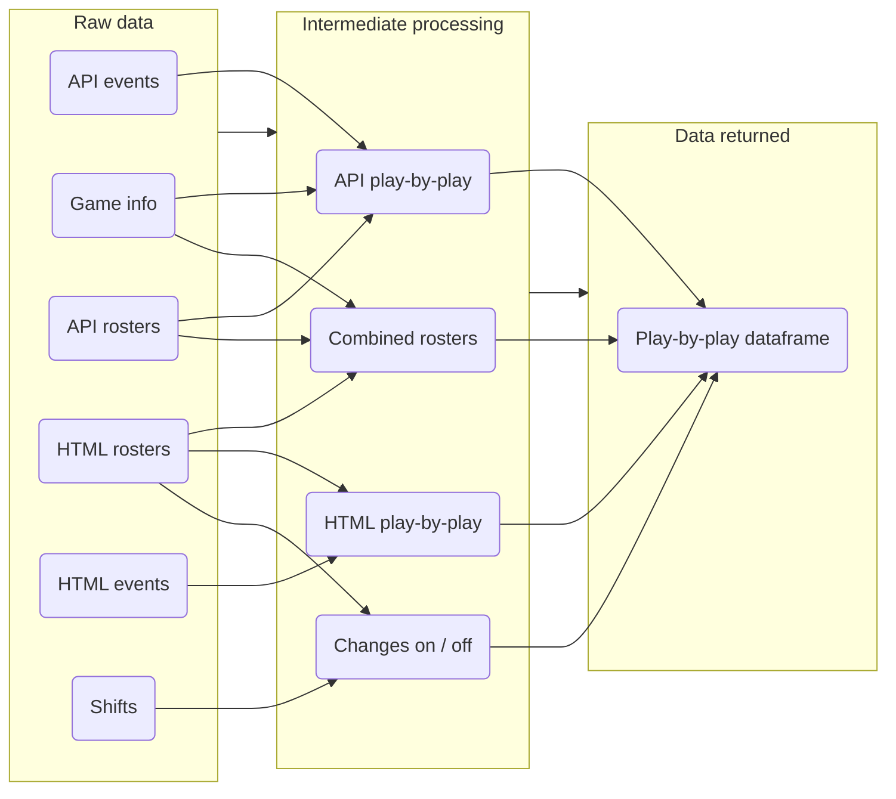

---

icon: material/notebook

---

# :material-notebook: **Introduction**

Welcome to the technical documentation & reference materials for **[chickenstats](https://github.com/chickenandstats/chickenstats)**,
a package for scraping & analyzing NHL data. This iss version 1.8

## :material-navigation: **Navigation**

??? tip 
    Navigate the site using the header, side-bar, or search tool.
    Mobile users can tap the :material-menu: (upper-left) to bring up the menu.

-   :material-download-box:{ .lg .middle } __Usage & installation__

    ---

    Download & install `chickenstats` with `pip` to get up
    & running in just a few minutes.

    [:octicons-arrow-right-24: Getting Started](home/getting_started.md)

-   :material-school:{ .lg .middle } __Tutorials & examples__

    ---

    Discover the package using hands-on tutorials
    & examples from the User Guide.

    [:octicons-arrow-right-24: User Guide](guide/guide.md)

-   :material-bookshelf:{ .lg .middle } __Reference materials__

    ---

    Consult the Reference section for in-depth explanations 
    & debugging assistance.

    [:octicons-arrow-right-24: Reference](reference/reference.md)

-   :material-google-analytics:{ .lg .middle } __xG model__

    ---

    Learn about the open-source expected goals (xG) model included with `chickenstats`.

    [:octicons-arrow-right-24: xG model](xg_model/xg_model.md)

-   :material-help:{ .lg .middle } __Help__

    ---

    What to do and how to contact me if you need help with `chickenstats`.

    [:octicons-arrow-right-24: Help](home/help.md)

-   :fontawesome-solid-user-group:{ .lg .middle } __Contribute__

    ---

    Read about known issues, future development roadmap, and/or how to contribute. 

    [:octicons-arrow-right-24: Contribute](contribute/contribute.md)

## :material-information: **About**

`chickenstats` is an open-source Python package developed
to facilitate public hockey research & analytics. The goal is to improve 
understanding of the sport through public access to accurate data,
promoting creativity, collaboration, & reproducibility.

The functions from `chicken_nhl` scrape data from official NHL sources(1)
to construct a play-by-play dataframe with 170+ potential fields(2) for each event.(3)
Below is a visual representation of the `scrape_pbp()` function, depicting data sources & 
processing stages. The module includes functions to to scrape the schedule & current standings.(4) 
Additional information can be found in the **[Reference](reference/reference.md)** section of the documentation.
{ .annotate } 

1.  Sources include (non-exhaustive): :material-numeric-1-circle: HTML shifts, :material-numeric-2-circle: events, &
    :material-numeric-3-circle: rosters, as well as :material-numeric-4-circle: events,
    :material-numeric-5-circle: rosters, & :material-numeric-6-circle: game information
    from the NHL's API endpoints.
2.  Fields include (non-exhaustive) primary player idenfitication & information
    (e.g., position, age, handedness, size, & weight), various game state characteristics
    (e.g., strength-state, score-state, score differential),
    Cartesian event coordinates, shot type (e.g., wrist, slap, deflection), distance & angle from net,
    & on-ice teammate & opponent identification & information.
3.  Supported events include: :material-numeric-1-circle: goals (including assists),
    :material-numeric-2-circle: shots on net, :material-numeric-3-circle: missed shots,
    :material-numeric-4-circle: blocked shots, :material-numeric-5-circle: faceoffs,
    :material-numeric-6-circle: penalties & delayed penalties, :material-numeric-7-circle:
    giveaways, & :material-numeric-8-circle: takeaways.
4.  All functions are available to users, including play-by-play inputs (e.g., `scrape_changes()`,
    `scrape_rosters()`, `scrape_api_events()`)

??? info "Data are supported from 2010-11 to present"
    With some exceptions for individual games, the `scrape_pbp()`
    function will return data for games occurring since the start of
    the 2010-2011 season. However, the `scrape_schedule()` & `scrape_standings()`
    functions will return data extending to the NHL's founding in 1917.

## :material-heart: **Acknowledgements**

`chickenstats` would not be possible without the efforts of countless other individuals.
