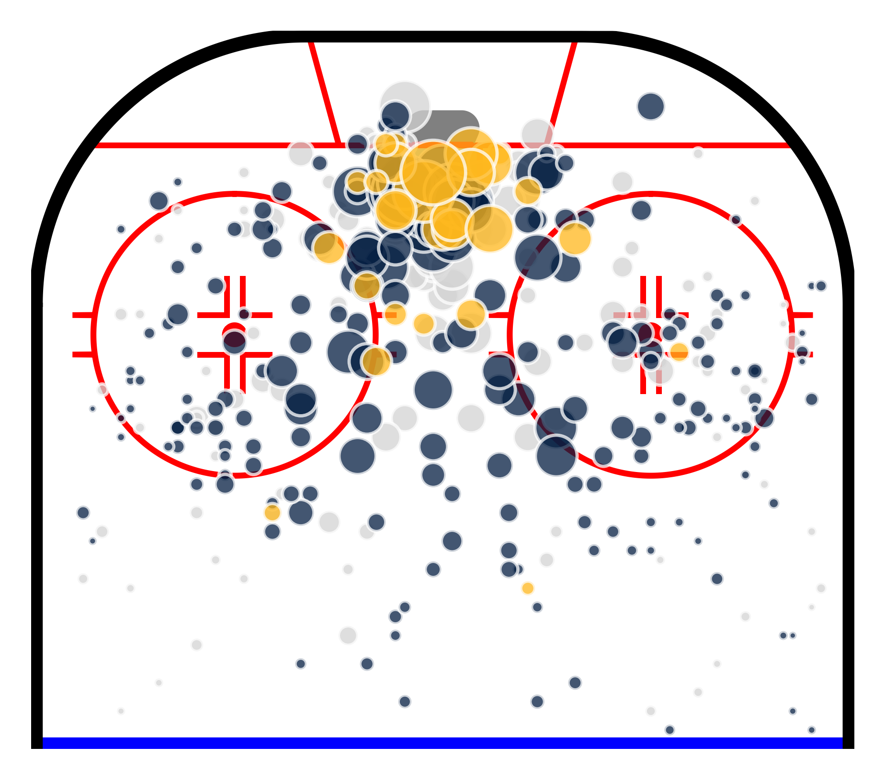

---
hide:
  - navigation

glightbox-manual: true

icon: material/google-analytics
description: "Expected Goals model included with chickenstats"
---

# :material-google-analytics: **xG Model**

{ .on-glb width=600 align=right }

`chickenstats.chicken_nhl` includes an Expected Goals (xG) model, which is
based off of the [prior work](https://evolving-hockey.com/blog/a-new-expected-goals-model-for-predicting-goals-in-the-nhl/)
of Josh & Luke Younggren of [Evolving-Hockey](http://www.evolving-hockey.com).

The model is an XGBoost classifier, with 38 fields, including distance from net, time since last event, shot angle,
number of players on ice, and whether the shot event comes from a high danger scoring area.

It's available out-of-the-box with `chickenstats.chicken_nhl.Scraper` and `chickenstats.chicken_nhl.Game`. xG values
are accessed with the pred_goal column in the play-by-play data, or the ixg, xgf, and xga columns
in the individual, on-ice, line, and team stats data.

```python

from chickenstats.chicken_nhl import Scraper

game_id = 2023020001

scraper = Scraper(game_id)

play_by_play = scraper.play_by_play

play_by_play.pred_goal

scraper.stats.ixg

```

## :material-chart-bar: **Model metrics**

Stuff


